<div class="titlepage">

**CS336 第1讲：课程总览与分词**

从“为什么从零构建”到 Byte-Pair Encoding


<div class="tcolorbox">

**原课程：**Stanford CS336 Language Modeling from Scratch, Spring 2026\
**讲次：**Lecture 1: Overview, Tokenization\
**主讲：**Percy Liang 等课程团队\
**视频频道：**Stanford Online\
**原视频：**[youtube.com/watch?v=JuoVZkPBiKk](https://www.youtube.com/watch?v=JuoVZkPBiKk)\
**阅读方式：**本笔记按教材逻辑重组课程内容，可脱离视频独立学习。

</div>

</div>

# 先建立全局地图：这门课究竟要解决什么

## 读者需要的前置知识

这份笔记假定读者知道 Python 的基本语法，见过向量、矩阵、概率分布与梯度下降，但不要求已经训练过大语言模型。若你只知道“向聊天机器人输入一句话，它会输出回答”，也可以继续阅读：本讲首先解释语言模型工程的整条链路，再把第一块可动手实现的组件——分词器——拆开讲清楚。

学习本讲时应同时保留三种视角。第一种是**数学视角**：模型究竟在给什么对象分配概率；第二种是**系统视角**：算力、显存和通信为什么决定算法形态；第三种是**实验视角**：在无法反复训练巨型模型时，怎样用小规模实验获得可外推的结论。只盯着网络结构会遗漏数据和系统，只盯着最终榜单又会遗漏可复现的机制。

<div class="knowledgebox">

三个常见名词 **预训练**是在大规模通用语料上学习下一词元预测；**后训练**是在较小但更有针对性的监督、偏好或强化学习数据上塑造行为；**推理**是固定参数后，让模型根据提示逐步生成新词元。三者共享模型，却有不同的计算模式和工程瓶颈。

</div>

## 核心问题不是“最大模型”，而是“固定资源下最好的模型”

课程把语言模型构建表述为一个资源约束优化问题：给定数据、计算核心、显存容量、显存带宽、机器间通信带宽以及工程时间，怎样得到目标评测上表现最好的模型？这个表述很重要，因为现实中几乎没有“资源无限”的情况。即使拥有更多 GPU，也会受到数据质量、训练稳定性、网络拓扑和推理成本的约束。

可以把目标粗略写成：
```math
\theta^*=\arg\min_{\theta,\,r}\;\mathcal{L}_{\mathrm{target}}(\theta;r)
\quad\text{s.t.}\quad
C(r)\le C_{\max},\ M(r)\le M_{\max},\ D(r)\le D_{\max}.
```
其中：

- $`\theta`$：模型参数；

- $`r`$：完整训练配方，包括分词、架构、优化器、批量大小和数据混合；

- $`\mathcal{L}_{\mathrm{target}}`$：目标任务上的损失或其代理指标；

- $`C,M,D`$：配方消耗的计算量、内存及数据量；

- $`C_{\max},M_{\max},D_{\max}`$：实际可用的资源上限。

这不是要求学生真的求解一个封闭形式的优化问题，而是提供决策准则：任何“新技巧”都要问，它提高了效果，还是只把成本转移到了别处？它在小规模有效，能否在大规模保持收益？它增加训练成本，却可能显著降低长期推理成本吗？

<div class="importantbox">

本讲的总纲 语言模型从零构建不是把若干流行模块机械拼在一起，而是在**表达能力、训练稳定性、计算效率、数据质量和可预测性**之间做可验证的权衡。

</div>

## 本章小结

本章给出了后续内容的坐标系：模型只是系统的一部分，真正的问题是固定资源下的全栈优化。读者需要同时追踪概率对象、数据流和硬件代价。后续每个组件都将回到同一问题：它如何改变质量与成本的交换关系？

# 为什么要“从零构建”

## 抽象层不断升高，也会遮住可研究空间

过去的研究者常常自己实现并训练模型；随后，工作流变成下载预训练模型并微调；如今，大量任务只需调用闭源 API 或编写提示。抽象层升高极大提高了生产力，但语言模型 API 是“有泄漏的抽象”：当模型失败时，用户通常看不到分词、数据、优化和推理系统中的具体原因，也无法改变底层设计。

<figure data-latex-placement="H">
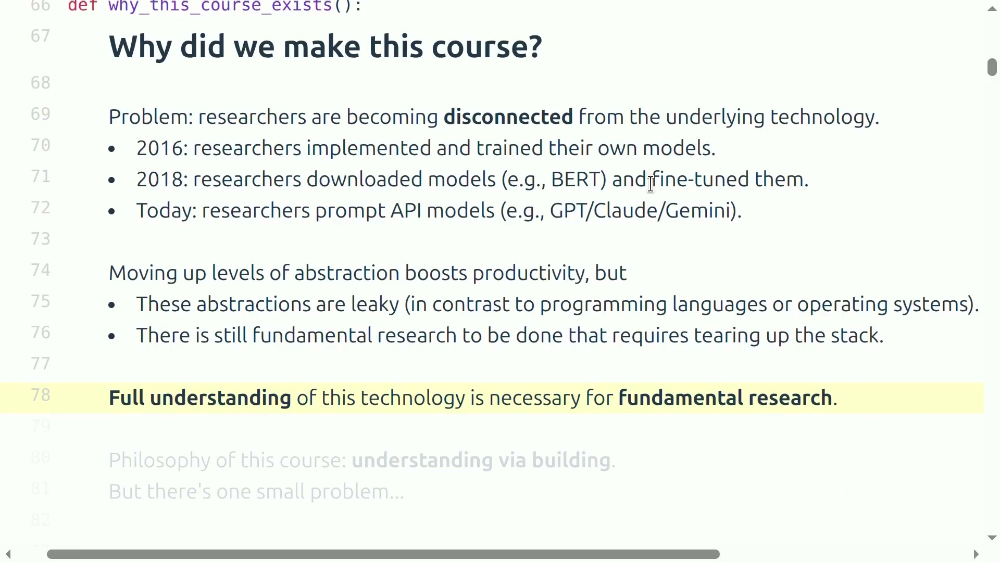
<figcaption>课程强调：基础研究需要理解底层技术，因为只在 API 层工作会主动缩小可探索的设计空间。</figcaption>
</figure>

“从零”并不意味着重新制造 GPU、矩阵乘法库和编译器，而是选择最具教育价值的边界：亲手实现分词器、Transformer 核心、优化器、训练循环、若干 GPU 内核、并行策略、缩放实验、数据处理与对齐算法。这样既能触达机制，又能在一个学期内完成。

## 小模型实验为什么既必要又危险

前沿模型的训练成本和数据配方通常不可获得，因此教学只能训练小模型。但“小模型是大模型的缩小版”不是永真命题。随着规模变化，计算分配会改变：较大模型中 MLP 所占 FLOPs 比例可能更高，某个优化在小模型的注意力模块上很显著，到大模型整体上却几乎不可见。某些任务还表现出阈值式提升，小规模阶段观察不到的能力会在更高训练计算量后突然显现。

<figure data-latex-placement="H">
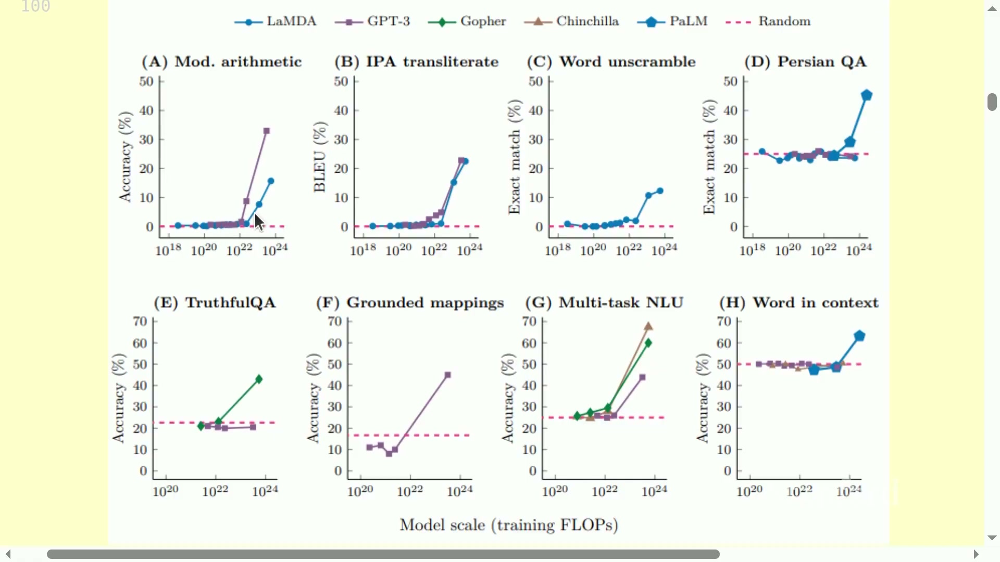
<figcaption>多项任务随训练计算量增加呈现非线性跃迁；小尺度结果可能无法揭示高尺度行为。</figcaption>
</figure>

因此，小实验的正确用途是测试机制、排除错误、估计趋势、比较候选配方，而不是直接宣称“前沿尺度必然同样有效”。需要判断哪类知识更可迁移：计算图和算法机制通常较稳健；缩放趋势需要系统实验；特定超参数或经验技巧最容易随尺度改变。

## “苦涩的教训”不等于算法不重要

课程特别纠正一种流行误解。“规模重要”不意味着只要堆算力、算法无关。更准确的说法是：**能够有效利用更大资源的算法**会胜出。假设最终能力受资源和算法效率共同影响，可用一个教学性近似表示：
```math
\mathrm{Capability}\approx \mathrm{Resources}\times \mathrm{Algorithmic\ Efficiency}.
```
其中：

- $`\mathrm{Capability}`$：模型在目标任务上的综合能力；

- $`\mathrm{Resources}`$：训练数据、计算量和硬件投入；

- $`\mathrm{Algorithmic\ Efficiency}`$：每单位资源转化为有效学习进展的比例。

这个式子不是严格物理定律，而是提醒：在巨额训练中，即使 5% 的效率改进也可能节省巨大成本；同时，一个不能并行、内存开销失控或无法稳定训练的聪明算法，很难真正扩大规模。

<figure data-latex-placement="H">
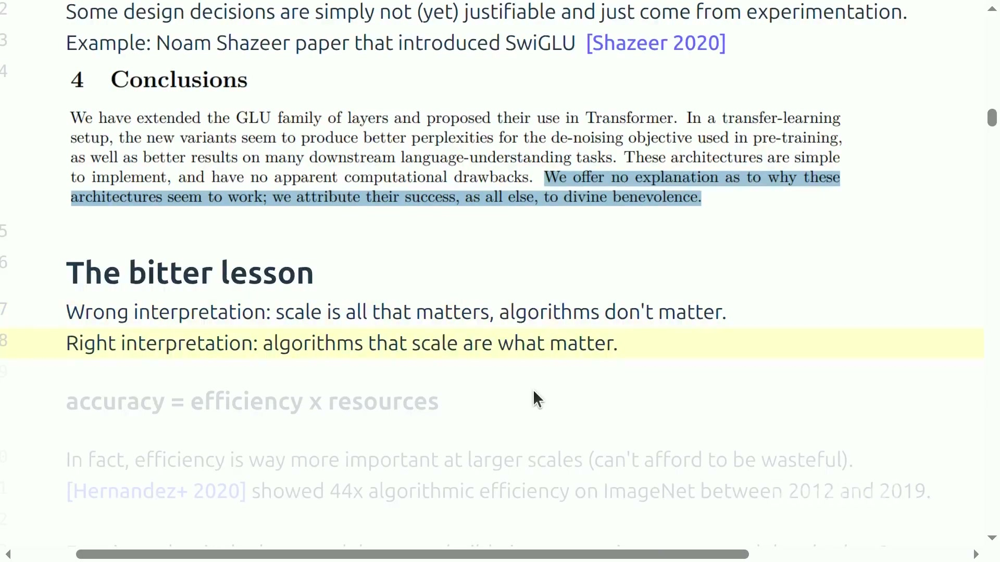
<figcaption>正确理解“苦涩的教训”：关键是能随资源扩展的算法，而不是放弃算法设计。</figcaption>
</figure>

<div class="warningbox">

误区：把小模型排行榜当成前沿模型证明 一个方法在参数少、上下文短、数据干净的实验中获胜，只能证明它在该条件下有效。要外推，至少还要检查计算构成、内存瓶颈、优化稳定性和数据分布是否随规模改变。

</div>

## 本章小结

从零构建的价值在于重新获得底层设计权。小规模实验是必要的学习工具，但必须区分机制验证与尺度外推。规模与算法不是对立项：真正重要的是稳定、可扩展且高效的算法。

# 语言模型的历史脉络与课程全栈

## 从统计语言模型到基础模型

语言模型并非近年才出现。早期 $`n`$-gram 模型通过有限上下文估计词序列概率，被用于语音识别和机器翻译。神经网络路线随后引入 LSTM、前馈神经语言模型、序列到序列建模、注意力、Transformer、Adam、专家混合和模型并行。真正改变工作范式的不是单一组件，而是这些算法与更大数据、更强硬件和更成熟系统的叠加。

<figure data-latex-placement="H">
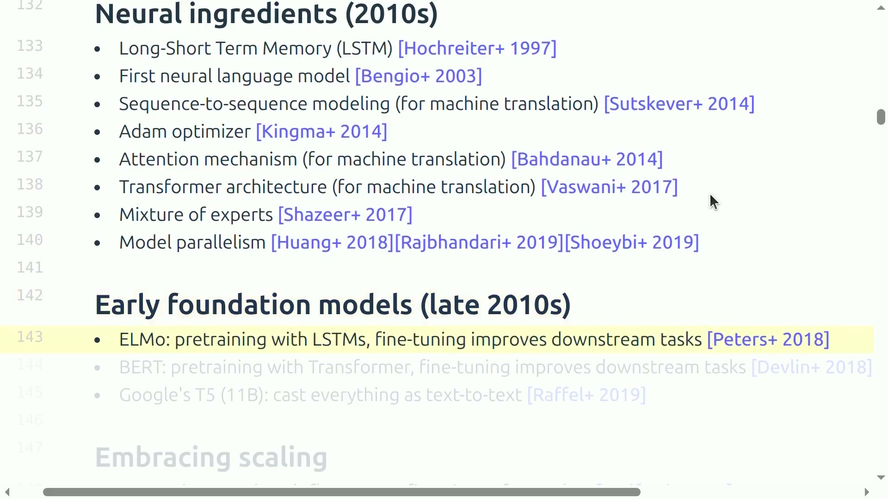
<figcaption>现代语言模型的若干关键“神经组件”：序列建模、注意力、Transformer、优化器、专家混合与并行系统共同演化。</figcaption>
</figure>

后续又经历三次使用方式转变：首先是 ELMo、BERT 等“预训练后微调”；接着是 GPT-3 式“提示输入、响应输出”；再后来是对话模型和能够调用工具、执行长流程的智能体。使用界面越来越简单，底层系统却越来越复杂。

## 开放生态为何重要

闭源前沿模型通常不披露完整架构、训练计算、数据构造和训练细节。开放权重模型让研究者能检查和部署模型；更完整的开放项目还会提供论文、代码、数据与训练日志，使外部研究者能够理解因果链条，而不仅是下载一个参数文件。

<figure data-latex-placement="H">
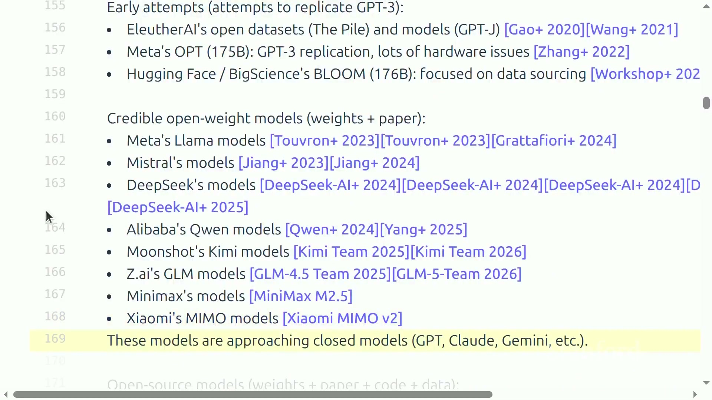
<figcaption>开放模型生态从早期复现尝试发展到可信的开放权重系列，并逐渐接近闭源模型能力。</figcaption>
</figure>

开放也有层次。只有权重可以做推理和微调，却未必能复现训练；有代码而无数据混合，仍无法解释能力来源；公开失败运行、超参数和评测污染检查，才更接近可验证科学。读论文时应把“open weights”“open source”“open data”和“可复现”分开理解。

## 五个课程模块如何首尾相接

课程的五个模块可以看成一条生产流水线：

1.  **基础：**分词、模型架构、损失、优化器与训练循环；

2.  **系统：**资源核算、GPU 内核、多卡并行与推理服务；

3.  **缩放规律：**用小实验构造可预测的大规模训练配方；

4.  **数据：**评测定义目标，数据收集、转换、过滤、去重和混合塑造能力；

5.  **对齐：**使用偏好、验证器、语言模型裁判或环境反馈进一步塑造行为。

这五部分并非独立插件。分词决定序列长度，序列长度影响注意力成本和数据吞吐；架构影响每步 FLOPs 和显存；系统效率决定在预算内能看多少词元；缩放规律决定模型大小与训练数据量；评测和数据决定“更好”究竟指什么；后训练又依赖高吞吐推理产生轨迹。

<div class="importantbox">

全栈因果链 原始数据 $`\rightarrow`$ 分词 $`\rightarrow`$ 模型与损失 $`\rightarrow`$ 优化器训练 $`\rightarrow`$ 系统加速与扩展 $`\rightarrow`$ 评测 $`\rightarrow`$ 数据和配方迭代 $`\rightarrow`$ 后训练与部署。任何一环改变，其他环的最优选择都可能变化。

</div>

## 本章小结

现代语言模型来自算法、数据和系统的共同演化。开放生态提供观察真实系统的窗口。CS336 用五个模块覆盖完整构建链路；理解它们之间的因果连接，比记住一张组件清单更重要。

# 语言模型的数学对象与训练计算

## 自回归分解：把长序列概率拆成下一词元预测

设分词后序列为 $`x_1,x_2,\ldots,x_T`$。自回归语言模型把整段序列的联合概率分解为：
```math
p_\theta(x_{1:T})=\prod_{t=1}^{T}p_\theta(x_t\mid x_{<t}).
```
其中：

- $`x_t`$：第 $`t`$ 个词元的整数编号；

- $`x_{<t}`$：位置 $`t`$ 之前的所有词元；

- $`T`$：序列长度；

- $`p_\theta`$：由参数 $`\theta`$ 定义的条件概率分布；

- 连乘号表示整段文本概率由每一步条件概率相乘得到。

训练通常最小化平均负对数似然：
```math
\mathcal{L}(\theta)=-\frac{1}{T}\sum_{t=1}^{T}\log p_\theta(x_t\mid x_{<t}).
```
其中 $`\log`$ 把概率乘积转为和；负号使“真实词元概率越高”对应“损失越小”；除以 $`T`$ 便于比较不同长度批次。困惑度常定义为 $`\mathrm{PPL}=\exp(\mathcal{L})`$，可以直观理解为模型每一步面对的有效候选数，但它高度依赖分词器和数据集，不能跨不同设置随意比较。

## 训练 FLOPs 的粗略估算

对稠密 Transformer，课程给出常用数量级估计：
```math
C\approx 6ND.
```
其中：

- $`C`$：训练总浮点运算次数；

- $`N`$：模型参数量；

- $`D`$：训练中处理的词元总数；

- 系数 6：前向计算、反向激活梯度和参数梯度的粗略合计。

例如，$`N=70\times10^9`$、$`D=10^{12}`$ 时，$`C\approx4.2\times10^{23}`$ FLOPs。它不会精确包含注意力、词表层、稀疏专家和重计算等细节，却足以做第一轮预算检查。若有效算力为 $`F`$ FLOP/s，理想时间为 $`C/F`$；真实时间还要除以硬件利用率，并加入通信、检查点和故障恢复开销。

<div class="warningbox">

误区：参数量就是全部成本 同样参数量的模型可能有不同序列长度、激活内存、专家激活比例和数据量。训练成本更接近参数量与词元量的乘积；推理成本还受批量、上下文、KV cache 和生成长度影响。

</div>

## 本章小结

语言模型在词元序列上定义概率，下一词元损失把序列学习变成可并行训练目标。$`6ND`$ 提供训练成本的首要尺度，但工程决策还需要分析显存、带宽和通信。

# 系统视角：为什么数据移动常比算术更贵

## 计算单元与显存彼此分离

GPU 的高带宽显存保存参数和激活，计算核心执行矩阵运算。执行一次操作通常要把数据从显存读到更靠近计算单元的缓存或寄存器，完成计算后再写回。峰值 FLOP/s 很高并不保证程序很快；若每做少量算术就搬运大量数据，计算核心会等待内存。

<figure data-latex-placement="H">
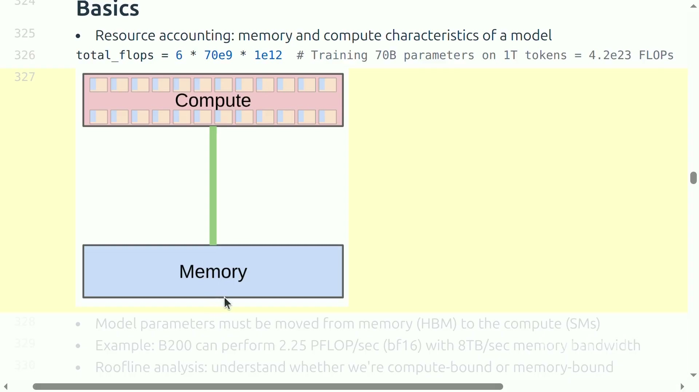
<figcaption>硬件的核心事实：数据存放位置与计算位置分离，带宽可能成为瓶颈。</figcaption>
</figure>

算术强度定义为：
```math
I=\frac{\text{FLOPs}}{\text{Bytes moved}}.
```
其中：

- $`I`$：每搬运一个字节完成的浮点运算数；

- FLOPs：某算子执行的算术量；

- Bytes moved：显存与计算层次之间移动的数据量。

Roofline 分析比较 $`I`$ 与硬件的计算/带宽比：低算术强度通常受带宽限制，高算术强度才可能接近峰值计算性能。

## 内核融合：少搬一次往往比少算一点更重要

假设先做 $`A(x)`$ 再做 $`B(\cdot)`$。朴素实现可能读取 $`x`$、计算 $`A`$、写中间结果，再读取中间结果、计算 $`B`$、写最终结果。融合内核在片上保存中间量，一次读取后连续完成两步，只写一次结果。

<figure data-latex-placement="H">
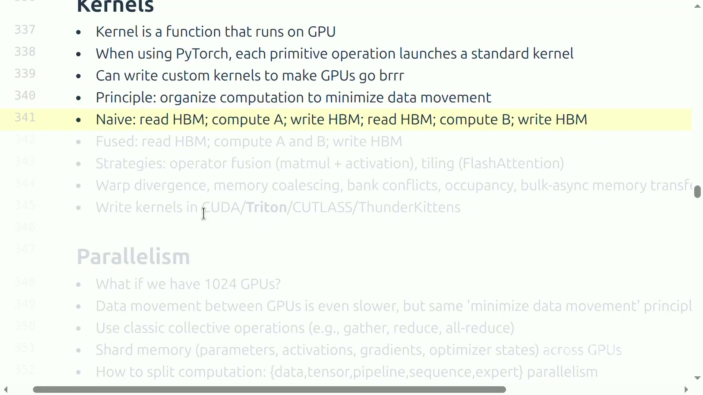
<figcaption>内核优化的基本原则：组织计算以减少数据搬运；融合把两次往返压缩为一次。</figcaption>
</figure>

这解释了为什么相同数学公式的两段代码会有巨大速度差。高层框架的每个原语可能对应一次内核启动；拆得太碎会增加启动和内存流量。FlashAttention 的分块思想也是在不物化完整注意力矩阵的情况下复用片上数据。优化前必须先基准测试，确认瓶颈来自内存、计算还是调度。

## 多 GPU 与推理的不同瓶颈

扩展到多 GPU 后，数据移动跨越更慢的互联。数据并行、张量并行、流水线并行、序列并行和专家并行，本质上是在决定参数、激活、梯度和优化器状态放在哪，以及何时执行 gather、reduce、all-reduce 或点对点通信。

推理分为预填充和解码。预填充能并行处理提示中的许多词元，常有较高算术强度；解码每轮只生成一个新词元，却要读取大量参数和 KV cache，容易受内存带宽限制。

<figure data-latex-placement="H">
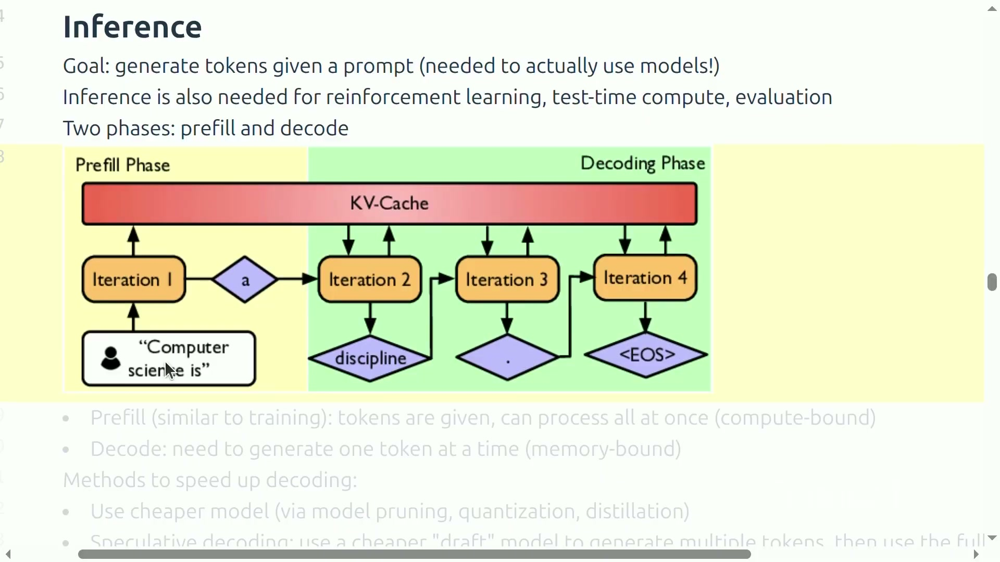
<figcaption>自回归推理的两阶段：预填充建立 KV cache，解码逐词元读取缓存并生成。</figcaption>
</figure>

<div class="knowledgebox">

为什么推理优化影响训练研究 强化学习需要模型产生大量轨迹，评测、合成数据和测试时计算也依赖推理。因此推理吞吐不只是部署问题，它会直接决定能够收集多少训练信号。

</div>

## 本章小结

系统性能由计算和数据移动共同决定。单卡优化强调提升数据复用与融合，多卡优化强调通信编排，推理解码强调带宽和缓存管理。只有先定位瓶颈，优化才有科学意义。

# 从小实验走向大训练：缩放、评测与数据

## 缩放配方，而不是孤立的一个模型

当一次目标训练昂贵到只能运行一次时，不能在目标尺度上暴力调参。正确对象是“缩放配方”：它把计算预算映射到模型大小、训练词元数、学习率、批量和架构形状。研究者在较小尺度运行一组实验，拟合损失随计算量变化的趋势，再外推目标尺度。

<figure data-latex-placement="H">
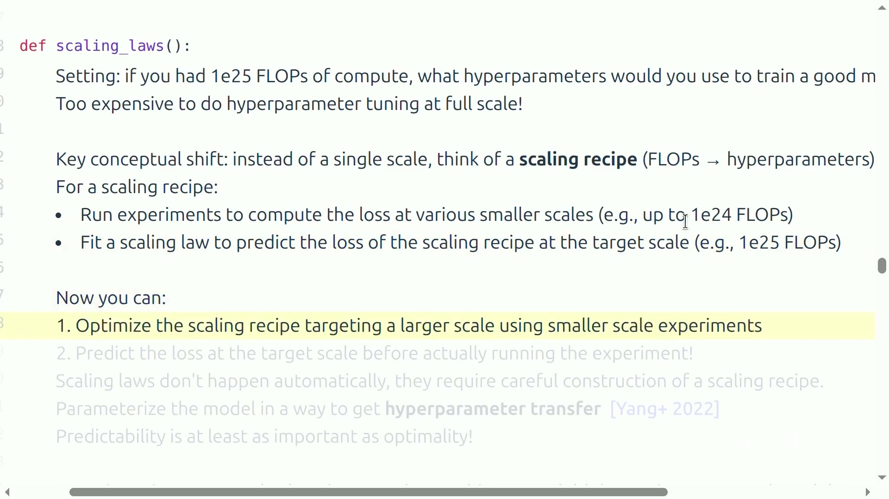
<figcaption>缩放研究的概念转换：学习从 FLOPs 预算到超参数的配方，再用小规模实验预测大尺度结果。</figcaption>
</figure>

一个简化损失模型是：
```math
L(N,D)=L_\infty+A N^{-\alpha}+B D^{-\beta}.
```
其中：

- $`L(N,D)`$：给定参数量和训练词元数时的验证损失；

- $`L_\infty`$：数据分布的不可约损失近似；

- $`A,B`$：与架构和数据有关的系数；

- $`\alpha,\beta`$：经验拟合的缩放指数；

- $`N,D`$：参数量与训练词元数。

在 $`C\approx6ND`$ 约束下，增大模型会减少可处理词元，增加词元又要求缩小模型。等 FLOPs 曲线上的最低点给出计算最优分配。课程引用的粗略经验是 $`D\approx20N`$，例如 70B 参数对应约 1.4T 词元，但真实最优值会随数据、架构和推理目标变化。

<figure data-latex-placement="H">
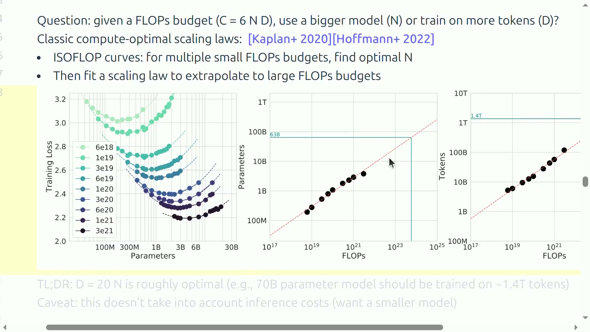
<figcaption>等计算量实验寻找不同预算下的最优模型大小，再拟合参数量和词元量随 FLOPs 的趋势。</figcaption>
</figure>

<div class="warningbox">

缩放规律不是自然定律 平滑曲线需要训练稳定、数据一致、超参数可迁移。若小模型与大模型采用彼此无关的学习率和批量，外推将失去依据。可预测性往往与局部最优同样重要。

</div>

## 内部评测与外部评测服务不同目的

内部指标用于模型开发，强调低噪声、跨尺度平滑和相对排序，例如固定留出集上的损失或困惑度。外部评测用于判断真实用户价值，强调生态有效性、任务覆盖和鲁棒性。两者不能简单合并：一个指标非常适合挑选训练配方，不代表普通人能解释其绝对数值；一个真实复杂基准有业务意义，却可能噪声太大，不适合每个训练检查点都运行。

评测还要防数据污染。如果测试题已进入预训练语料，分数可能反映记忆而不是泛化。可靠流程应记录数据时间边界、去重策略、题目变体和模型可访问工具。通用模型也不应只用平均分：平均值会掩盖某种语言、长上下文、代码或安全维度的退化。

## 数据不是自然出现的“数据集”

真实数据来自网页、书籍、论文、代码仓库、对话或工具轨迹，原始形态可能是 HTML、PDF 和目录树。它们必须经历抽取、规范化、质量过滤、去重、分类、混合和合规检查。数据选择等价于行为选择：若希望模型擅长多语言、代码或长任务，就必须提供相应分布和反馈。

<figure data-latex-placement="H">
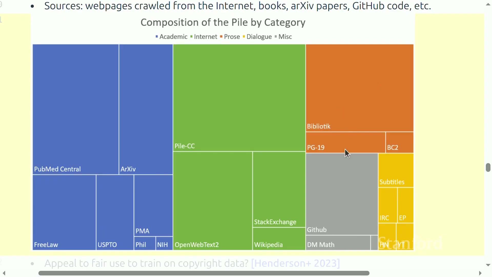
<figcaption>语言模型语料由多种来源构成；来源比例、许可与清洗规则都会塑造模型。</figcaption>
</figure>

数据生命周期可分为预训练、训练末段的高质量或长上下文数据，以及对话、偏好和工具轨迹等后训练数据。合成数据不是自动优质：它可能放大教师模型偏差，也可能通过验证器和过滤显著提高针对性。每一步都应保存来源、处理版本和丢弃原因。

## 对齐：当生成正确答案比判断好坏更难

基础模型通过完全监督的下一词元目标学习。进一步塑造行为时，常见模板是：模型生成多个响应，人工、规则验证器或语言模型裁判给出评分，再更新模型以偏好更好的响应。DPO 直接利用偏好对，PPO、GRPO 等强化学习方法则优化奖励。难点包括奖励投机、训练不稳定、裁判偏差以及推理工作器与训练工作器不同步导致的离策略问题。

## 本章小结

大训练依赖可外推的缩放配方，而非在目标尺度盲目调参。评测先定义“好模型”，数据再提供学习信号，对齐进一步塑造输出。缩放、评测和数据共同决定一次昂贵运行是否值得。

# 分词：模型看到文本之前发生了什么

## 字符串、字节和词元是三种不同对象

人看到的是字符串，计算机存储的是经过编码的字节，语言模型处理的是词元编号。分词器提供两个方向：编码把字符串映射为整数序列，解码把整数序列恢复成字节并最终恢复字符串。

<figure data-latex-placement="H">
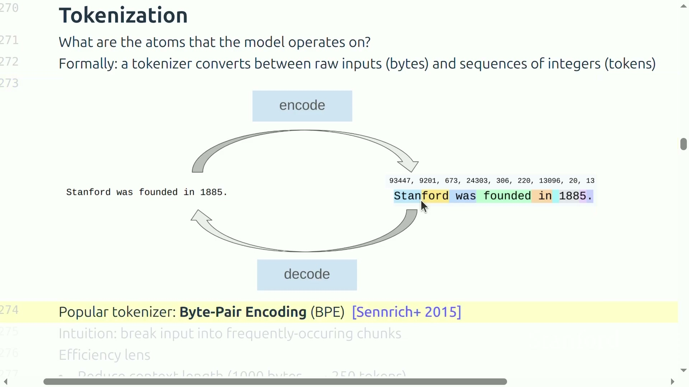
<figcaption>分词器位于原始字节与模型词元之间，编码和解码必须形成可逆通路。</figcaption>
</figure>

形式化地，设字符串集合为 $`\mathcal{S}`$、词表为 $`V`$：
```math
\operatorname{encode}:\mathcal{S}\rightarrow V^*,\qquad
\operatorname{decode}:V^*\rightarrow\mathcal{S}.
```
其中：

- $`\mathcal{S}`$：所有可表示字符串；

- $`V`$：有限词元集合；

- $`V^*`$：任意有限长度的词元序列；

- encode/decode：编码和解码函数。

正确性的最低要求是对合法字符串满足：
```math
\operatorname{decode}(\operatorname{encode}(s))=s.
```
其中 $`s`$ 是任意输入字符串。若往返失败，训练数据已在进入模型前被改变，后续损失再低也无法修复。

<figure data-latex-placement="H">
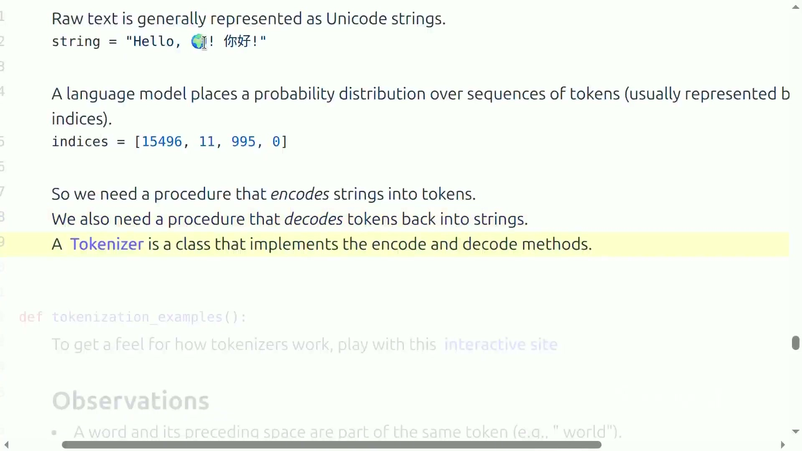
<figcaption>原始 Unicode 字符串先被编码为整数编号，分词器还必须准确解码回原字符串。</figcaption>
</figure>

## 压缩率为何直接影响计算

课程把压缩率定义为每个词元平均承载的字节数：
```math
R=\frac{B(s)}{|\operatorname{encode}(s)|}.
```
其中：

- $`R`$：bytes per token，越大表示同一文本需要的词元越少；

- $`B(s)`$：字符串采用 UTF-8 编码后的字节数；

- $`|\operatorname{encode}(s)|`$：编码后的词元数量。

假设一段文本有 20 字节、编码为 8 个词元，则 $`R=2.5`$。若注意力计算随序列长度 $`T`$ 近似为 $`O(T^2)`$，减少词元数可能显著降低注意力成本。但扩大词表也会增大嵌入和输出层，稀有词元更新更少。因此压缩率不能无限追求。

## 真实分词器为何看起来“不自然”

常见分词器会把前导空格与后面的词合并，所以句首的“hello”和句中的“ hello”可能是两个完全不同的编号。数字有时按一位、有时按几位切分；不同语言的每字符词元数也可能差异明显。这些行为不是语言学真理，而是训练语料频率、预分词规则和词表预算的产物。

<figure data-latex-placement="H">
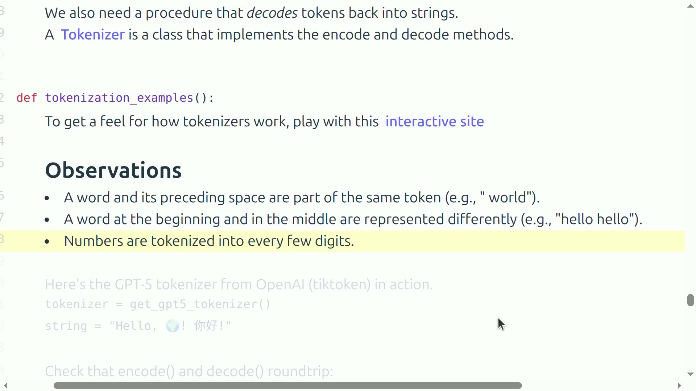
<figcaption>现代分词器的边界由统计和规则共同决定：前导空格、词位置和数字切分都会改变结果。</figcaption>
</figure>

<div class="warningbox">

误区：词元就是“单词” 词元只是模型词表中的离散符号，可能是一个字节、字符、子词、带空格片段或特殊控制标记。不要把词元边界直接当作语义边界，更不要假设不同模型的词元数可直接比较。

</div>

## 本章小结

分词器把人类字符串变成模型可处理的有限整数词表。可逆性保证信息不丢失，压缩率影响序列长度和计算成本，词表大小影响参数与稀疏性。好的方案必须同时权衡这些目标。

# 为什么字符、字节和整词方案都不理想

## Unicode 字符方案：直观但词表过大

Unicode 为字符分配码点。直接把每个码点当词元很直观，也容易往返；然而 Unicode 字符数非常大，很多字符极罕见。若词表要覆盖所有码点，嵌入和输出矩阵巨大且大量行几乎得不到训练。

<figure data-latex-placement="H">
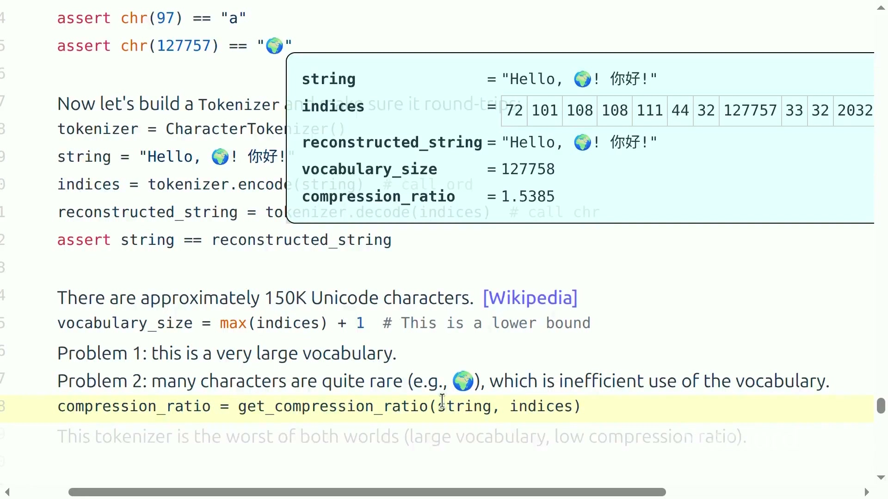
<figcaption>字符级分词能往返，却同时面对巨大词表和较低压缩率；罕见字符会浪费词表容量。</figcaption>
</figure>

更细的陷阱是“人眼中的一个字符”未必是一个码点。重音可能由基础字符加组合符号构成，emoji 可能包含多个码点和连接符。若在错误层次切分，字符串规范化和等价性会变得复杂。

## 字节方案：覆盖完美但序列太长

UTF-8 把所有 Unicode 字符串表示为 0 到 255 的字节，因此 256 个基础符号即可覆盖任意文本，不需要未知词元。代价是每个字节一个词元，压缩率固定接近 1；中文和 emoji 往往需要多个字节，序列更长。对二次复杂度注意力而言，这会显著增加计算。

## 整词方案：语义直观但开放词表失控

按空格或正则表达式切成单词，词元通常更接近人类语义，压缩率也高。但自然语言、代码、拼写变体、网址和新名字使词表近乎无界。测试时遇到训练中没见过的词，只能映射到同一个 UNK，从而丢失拼写信息，并干扰困惑度计算。

<div class="center">

| 方案 | 主要优点           | 主要缺点             | 典型失败             |
|:-----|:-------------------|:---------------------|:---------------------|
| 字符 | 直观、可解释       | 词表大、组合字符复杂 | 稀有字符行几乎不训练 |
| 字节 | 固定 256、完全覆盖 | 序列长、计算贵       | 非 ASCII 文本膨胀    |
| 整词 | 语义强、序列短     | 开放词表、未知词     | 新词被压成 UNK       |

</div>

理想方案应保留字节级兜底，使任何输入可表示；同时把高频相邻片段合并，缩短常见文本；稀有片段继续拆小，不制造未知词。这正是 BPE 的设计空间。

## 本章小结

字符级方案浪费词表，字节级方案浪费序列长度，整词方案无法处理开放世界。BPE 通过“字节兜底 + 数据驱动合并”取得工程折中。

# Byte-Pair Encoding：从字节学习可变长度词元

## 训练阶段的核心循环

BPE 最早用于数据压缩，后来进入神经机器翻译和 GPT 系列。训练开始时，每个字节都是一个词元，初始词表包含 256 个字节。随后重复：统计所有相邻词元对，选择出现次数最多的一对，创建代表该二元组的新词元，并用新词元替换语料中的相应位置。执行 $`K`$ 次后，词表大小约为 $`256+K`$。

伪代码如下：

```
def train_bpe(raw_bytes, num_merges):
    tokens = list(raw_bytes)
    merges = []
    vocab = {i: bytes([i]) for i in range(256)}
    for step in range(num_merges):
        counts = count_adjacent_pairs(tokens)
        pair = deterministic_argmax(counts)
        new_id = 256 + step
        tokens = merge_all(tokens, pair, new_id)
        vocab[new_id] = vocab[pair[0]] + vocab[pair[1]]
        merges.append((pair, new_id))
    return vocab, merges
```

<figure data-latex-placement="H">
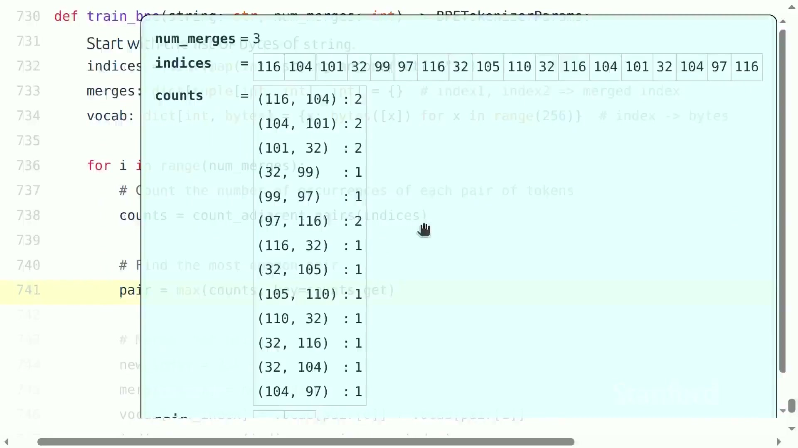
<figcaption>玩具语料中先统计相邻编号对；高频对会被选为下一次合并对象。</figcaption>
</figure>

## worked example：the cat in the hat

把字符串编码为 UTF-8 字节。字母 extttt 和 exttth 的编号分别为 116 与 104。在语料中，二元组 $`(116,104)`$ 多次出现，因此第一次合并创建新编号 256，令它代表字节串 extttth。替换后，原来的两个位置缩为一个位置。

下一轮重新统计。若 $`(256,101)`$ 最常见，其中 101 对应 exttte，就创建 257 表示 extttthe。继续合并时，序列逐渐缩短，词表逐渐增大：
```math
|x^{(k+1)}|=|x^{(k)}|-m_k,
\qquad |V^{(k+1)}|=|V^{(k)}|+1.
```
其中：

- $`x^{(k)}`$：第 $`k`$ 次合并后的训练词元序列；

- $`m_k`$：第 $`k`$ 轮被替换的非重叠高频对数量；

- $`V^{(k)}`$：第 $`k`$ 轮词表；

- 第一式表示每替换一个二元组，序列长度减少一；第二式表示每轮新增一个词元。

<figure data-latex-placement="H">
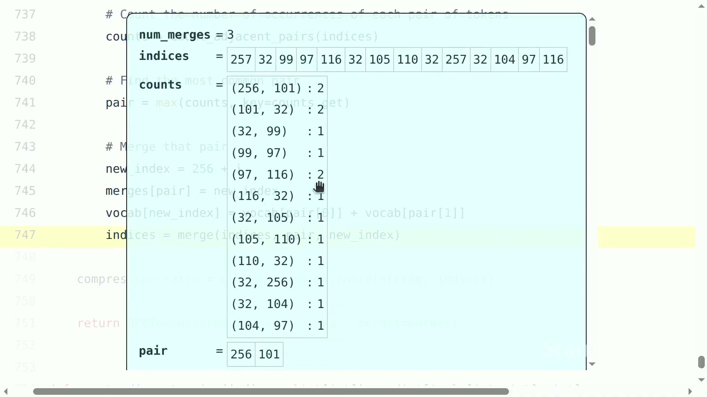
<figcaption>合并若干轮后，编号 256、257 已代表更长字节片段；序列缩短而词表增长。</figcaption>
</figure>

需要明确重叠规则。例如序列 extttaaa 中相邻对 extttaa 在位置 $`(1,2)`$ 与 $`(2,3)`$ 重叠，不能在同一轮同时替换两次。工程实现通常从左到右选择不重叠出现。并列最高频对必须采用确定性规则，否则不同机器可能训练出不同词表。

## 新文本编码与解码

训练得到有顺序的合并规则。编码新文本时，先转为字节编号，再按训练规则或等价优先级应用可行合并。解码更简单：查词表把每个词元展开为字节串，拼接后用 UTF-8 解码。

<figure data-latex-placement="H">
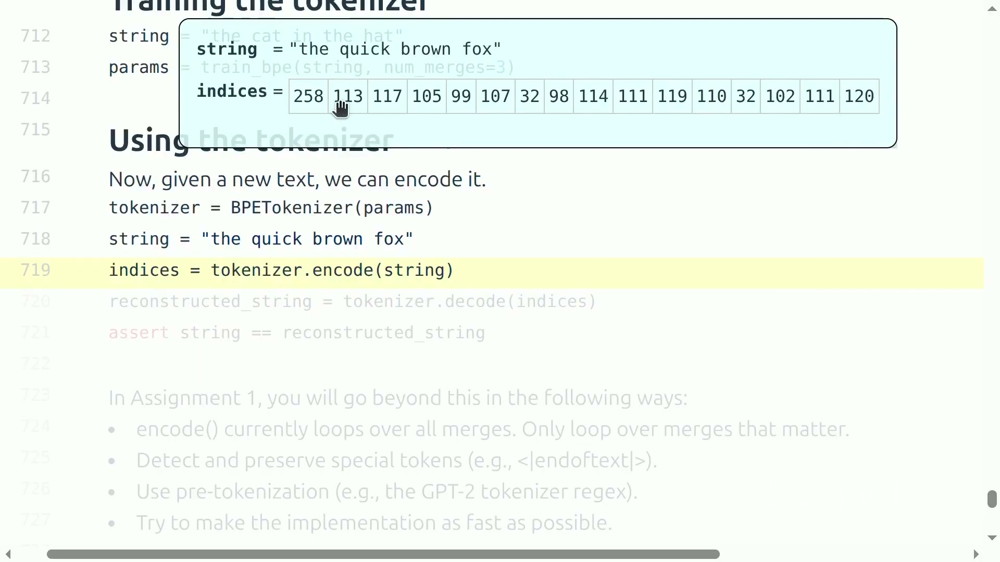
<figcaption>训练完成后，用同一组词表与合并规则编码新句子，并通过解码检查往返一致。</figcaption>
</figure>

若直接遍历全部合并规则，而文本只涉及其中很少一部分，编码会很慢。更高效方法维护当前相邻对及其优先级，用堆或链表只更新受一次合并影响的邻域。训练阶段同样可通过增量计数避免每轮扫描整个语料。

## 为什么 BPE 有效，但不是完美理论

BPE 是数据驱动启发式：常见片段获得更长词元，罕见片段退回较小单元，因此同时提供覆盖和压缩。它并不显式理解语义，也不保证形态学正确；语料偏差会反映到词表中，多语言之间可能出现不同压缩率。扩大词表会缩短序列，却增大嵌入与输出层，并使低频词元更新稀疏。

<div class="importantbox">

BPE 的本质 BPE 不是“寻找真正的单词”，而是在有限词表预算下，用训练数据中的局部频率学习一套可逆、可覆盖、可压缩的可变长度编码。

</div>

## 本章小结

BPE 从 256 个字节开始，反复合并最常见相邻对。训练生成词表与有序合并规则，编码应用规则，解码展开字节。它解决了未知词与序列过长之间的矛盾，但仍需处理重叠、并列、效率和多语言公平性。

# 实现一个可用于训练的分词器

## 接口与不变量

一个可靠实现至少需要：

1.  `train(corpus)`：从语料学习词表和合并规则；

2.  `encode(text)`：把字符串编码为整数序列；

3.  `decode(ids)`：把整数序列还原为字符串；

4.  特殊词元支持，例如文档结束、填充或控制标记；

5.  可序列化的词表、合并顺序和规范化配置。

最关键不变量是 round trip。测试不应只包含英文句子，还要覆盖中文、组合字符、emoji、换行、空字符串、无效 UTF-8 的处理策略和特殊词元边界。若训练与推理的预处理规则不同，即使词表文件相同也会产生不兼容编号。

```
tests = [
    "hello", " hello", "你好，世界", "line1\nline2", "",
]
for text in tests:
    ids = tokenizer.encode(text)
    assert all(isinstance(i, int) for i in ids)
    assert tokenizer.decode(ids) == text
```

## 预分词与特殊词元

现代 BPE 往往先用正则把文本切成较小块，再在块内应用合并。预分词可以防止词元跨越某些边界，减少编码搜索范围，但规则本身会塑造词表。例如是否把前导空格留在词块中，会决定“word”和“ word”是否共享词元。

特殊词元不应被普通字节合并意外拆开。常见策略是在编码前先识别被允许的特殊字符串，把它们作为原子插入，再对其余片段做普通编码。必须明确未知特殊标记是报错、按普通文本处理，还是映射到某个保留编号。

## 从正确基线到性能优化

工程优化应遵循基线、修改、验证、基准四步：先写一个慢但明显正确的版本，保存固定语料和期望合并；再替换相邻对计数或优先队列结构；用完全相同输入验证词表、合并规则、编码和解码一致；最后分别测训练吞吐与编码吞吐。

一个常见训练优化是建立“二元组到出现位置”的倒排索引。合并一对后，只更新其左右邻居的计数，而不是重新扫描全语料。编码时可维护双向链表表示当前词元序列，用最小堆选取合并优先级，删除过期堆项。对大语料还要流式处理，避免一次把全部文本加载到内存。

<div class="warningbox">

容易遗漏的工程边界 不要只在 ASCII 上测试；不要依赖字典迭代顺序解决并列；不要混淆 Unicode 码点和 UTF-8 字节；不要在训练与编码阶段使用不同规范化；不要把特殊词元当普通文本；不要只报告总耗时而忽略语料大小和机器配置。

</div>

## worked checklist：提交前如何验证

1.  **正确性：**所有测试字符串满足往返；随机字节输入按已声明策略处理；

2.  **确定性：**同一语料、同一配置多次训练得到相同词表与合并顺序；

3.  **覆盖性：**任何合法 UTF-8 输入都能退回基础字节表示；

4.  **压缩：**在独立验证集上计算 bytes/token，并按语言或领域分组；

5.  **性能：**报告训练 MB/s、编码 MB/s、峰值内存和词表大小；

6.  **兼容性：**序列化后重新加载，编码结果完全一致；

7.  **集成：**模型嵌入词表大小、特殊编号和数据管线配置一致。

## 本章小结

教材算法只是起点，可训练系统还需要明确接口、不变量、特殊词元、预分词、确定性和性能。任何优化都要以正确基线为参照，不能用更快但不同的词表替代一致性验证。

# 总结与延伸

## 把整讲压缩成一条逻辑链

本讲从研究方法出发：只会调用模型会缩小底层研究空间，因此要通过构建获得理解。前沿训练不可直接复刻，于是需要在小尺度验证机制，同时通过系统分析和缩放配方谨慎外推。课程全栈由基础、系统、缩放、数据和对齐组成，所有模块都围绕固定资源下的质量最大化。

分词是这条链的第一道接口。原始文本是 Unicode 字符串，存储层是字节，模型层是有限整数词表。字符、字节和整词方案分别在词表、序列长度与开放覆盖上失败；BPE 以字节兜底，通过高频二元组合并学习可变长度词元，在覆盖和压缩之间建立实用折中。

## 普通读者应真正带走的十点

1.  语言模型工程的目标是固定资源下的最好系统，而不是单纯最大参数量；

2.  小模型能验证机制，却不能自动代表前沿尺度；

3.  好算法必须能稳定使用更多数据和硬件；

4.  模型、系统、缩放、数据、评测与对齐互相制约；

5.  自回归模型在词元序列上学习条件概率；

6.  峰值算力之外，显存带宽与通信经常决定速度；

7.  缩放规律依赖精心构造、可迁移的训练配方；

8.  评测定义目标，数据决定模型获得何种能力；

9.  分词必须可逆，压缩率会改变模型的有效上下文和计算成本；

10. BPE 是频率驱动的工程启发式，不是语言学真理。

## 进一步思考

课程结尾提出一个比“是否取消分词器”更一般的问题：无论未来模型是否直接从字节学习，它仍需要在长序列中形成高层块，并对不同片段分配不同计算量。文本、视频和 DNA 都包含大量低层单元；若每个单元承担同等计算，成本可能不可接受。未来方法可能把离散预处理变成端到端可学习的动态分块，但仍需满足覆盖、可逆或信息保存、效率、稳定性和硬件友好性。

可以继续完成三个小实验。第一，用同一段中英文和代码比较字符、字节与现成 BPE 的压缩率。第二，在玩具语料上实现慢速 BPE，再用增量计数加速并验证结果一致。第三，固定模型上下文为 1024 词元，测不同分词器实际能容纳多少原始字节，观察“模型上下文长度”为什么不能脱离分词器解释。

<div class="importantbox">

最终结论 从零构建的真正收获不是重复制造现有模型，而是学会把每个抽象重新连接到数据、计算和证据。分词器虽小，却完整展示了这套方法：先定义对象与不变量，再比较设计权衡，实现正确基线，最后在保持语义一致的前提下优化性能。

</div>

## 本章小结

本讲完成了全课程路线图，并深入到第一个可实现组件。掌握这些内容后，读者已能解释语言模型为何需要分词、BPE 如何训练和使用、怎样验证实现，以及这些选择如何影响后续模型和系统。
