<div class="titlepage">

**Stanford CS336 第2讲**

**PyTorch、张量与训练资源核算**

从数据类型和 einsum 到 FLOPs、屋顶线与显存优化


<div class="tcolorbox">

**课程：**Stanford CS336 Language Modeling from Scratch，Spring 2026\
**讲次：**Lecture 2: PyTorch (einops)\
**频道：**Stanford Online\
**时长：**1小时17分25秒\
**原视频：**<https://www.youtube.com/watch?v=kuYAsz7zspQ>

</div>

</div>

# 为什么要从资源核算学习 PyTorch

## 本讲真正要解决的问题

很多初学者把 PyTorch 理解成“写神经网络的 Python 库”：会创建张量、调用线性层、执行 `loss.backward()`，似乎就已经掌握了它。CS336 的出发点更接近工程现场：大模型训练受有限的计算量、显存容量、内存带宽和训练时间约束。代码能运行只是最低要求；我们还必须解释它为什么慢、为什么溢出、为什么装不下，以及改变批量大小或精度后成本怎样变化。

本讲建立一套贯穿后续课程的资源语言。所有参数、梯度、激活、优化器状态和数据最终都以张量保存；张量的形状与数据类型决定存储成本；张量运算的索引结构决定浮点运算量；数据搬运量与计算量共同决定硬件瓶颈；自动微分和优化器又在前向计算之外增加新的计算与存储。只要能逐层算清这些项目，就可以在真正启动昂贵实验前做数量级判断。

<figure data-latex-placement="H">
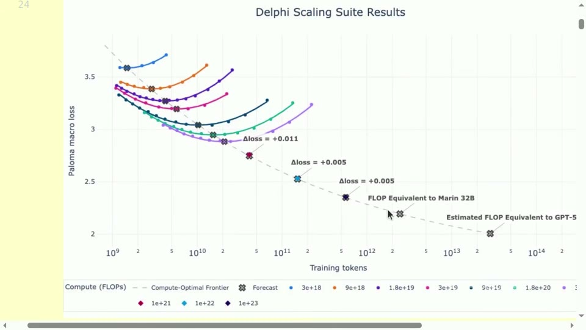
<figcaption>缩放实验的计算最优前沿。小规模实验不仅给出趋势，也为昂贵训练提供可检验的成本与损失预测。</figcaption>
</figure>

<div class="importantbox">

资源核算的核心问题 给定模型、数据和硬件，我们希望回答三个问题：需要完成多少计算；需要保存和搬运多少字节；这些工作在目标硬件上大约需要多长时间。后续所有优化，本质上都是减少其中一种成本，或让硬件更充分地处理已有成本。

</div>

## 两个数量级估算

先看训练时间。对以稠密矩阵乘法为主、上下文长度不过分极端的 Transformer，训练计算量常用下式做一阶估算：
```math
C_{\mathrm{train}}\approx 6NT.
```
**符号说明：**$`C_{\mathrm{train}}`$ 是训练需要的浮点运算次数；$`N`$ 是模型参数量；$`T`$ 是训练 token 数；系数 $`6`$ 来自前向约 $`2NT`$，反向约 $`4NT`$。

若有 $`G`$ 块加速卡，每块卡理论峰值为 $`P_{\mathrm{peak}}`$ FLOP/s，模型 FLOPs 利用率为 $`u`$，则训练时间为
```math
t\approx \frac{6NT}{G\,u\,P_{\mathrm{peak}}}.
```
**符号说明：**$`t`$ 是秒数；$`G`$ 是设备数；$`u\in(0,1]`$ 把理论峰值折算成实际吞吐；$`P_{\mathrm{peak}}`$ 必须与所用精度和稠密性口径一致。

<figure data-latex-placement="H">
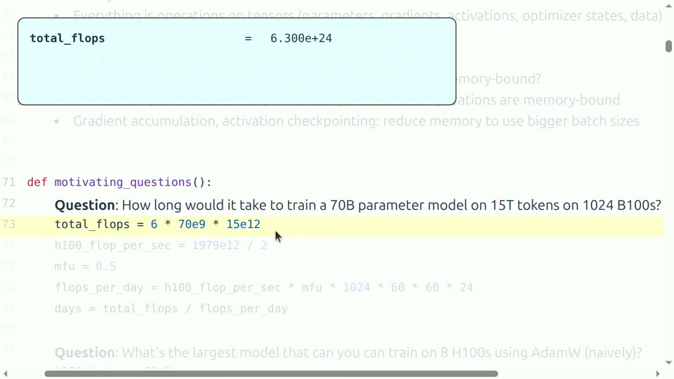
<figcaption>训练时间估算的起点：先由参数量和 token 数得到总计算量，再除以集群的实际有效吞吐。</figcaption>
</figure>

以 700 亿参数、15 万亿 token、1024 块卡和 $`u=0.5`$ 为例，总计算量是 $`6.3\times10^{24}`$ FLOPs。课程演示给出的数量级约为 143 天。这个数字不是工期承诺，因为通信、检查点保存、故障、数据加载和集群排队都可能延长墙钟时间；它的价值在于迅速判断计划究竟是几天、几个月还是几年。

第二个问题是“模型是否装得下”。若参数与梯度使用 bf16，各占 2 字节；AdamW 的两个 fp32 动量状态各占 4 字节，那么仅模型状态就约需
```math
M_{\mathrm{state}}\approx (2+2+4+4)N=12N\ \text{bytes}.
```
**符号说明：**$`M_{\mathrm{state}}`$ 是模型状态内存；四项依次代表参数、梯度、一阶矩、二阶矩；$`N`$ 是参数量。这里尚未包括激活、临时缓冲、分布式通信区和框架开销。

<figure data-latex-placement="H">
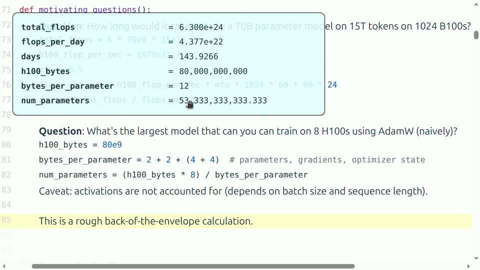
<figcaption>每参数 12 字节的朴素 AdamW 估算，以及“不计激活”的关键限制。</figcaption>
</figure>

<div class="warningbox">

不能把粗略公式当成容量保证 “显存总量除以每参数字节数”只给出上界。真实训练还要保留中间激活、CUDA 内核工作区、通信缓冲和内存碎片；多卡训练时，不同并行策略是否分片参数、梯度和优化器状态，也会彻底改变每卡负担。

</div>

## 前置知识清单

读者只需熟悉 Python 基础、矩阵乘法和链式法则。请先接受三个约定：一，shape 是张量每个轴的长度；二，batch 轴表示相互独立的样本，通常不会被求和；三，FLOP 表示一次浮点加法或乘法，而 FLOP/s 表示每秒能完成多少次，两者分别是“工作量”和“速度”。

## 本章小结

PyTorch 学习不能停留在 API。首先用 $`6NT`$ 和逐项字节核算获得数量级，再讨论实际硬件效率。粗估应明确口径和遗漏项，它是决策工具，不是无条件保证。

# 张量、形状与内存：一切训练状态的共同语言

## 从标量到高阶张量

张量可以看成带有若干轴的规则数值数组。标量 shape 为 `()`，向量为 `(d,)`，矩阵为 `(m,n)`，而语言模型常见激活为 `(batch, sequence, hidden)`。轴名本身不存进普通 PyTorch 张量，但人在推理时必须知道每个轴代表什么；大量深度学习错误并非数值错误，而是两个长度相同却语义不同的轴被意外对齐。

张量的存储量最基本的公式是
```math
M(X)=\operatorname{numel}(X)\times \operatorname{element\_size}(X).
```
**符号说明：**$`M(X)`$ 是张量占用的字节数；$`\operatorname{numel}(X)`$ 是所有轴长度的乘积；$`\operatorname{element\_size}(X)`$ 是每个元素的字节数。

例如 shape 为 $`(4,8)`$ 的 fp32 张量共有 32 个元素，每元素 4 字节，因此占 128 字节。若某前馈层权重 shape 为 $`(4\times12288,12288)`$，仅一张 fp32 权重矩阵就约 2.3 GB。由此可见，大模型显存并不是被“神经网络对象”抽象占用，而是被一块块具体数组占用。

<figure data-latex-placement="H">
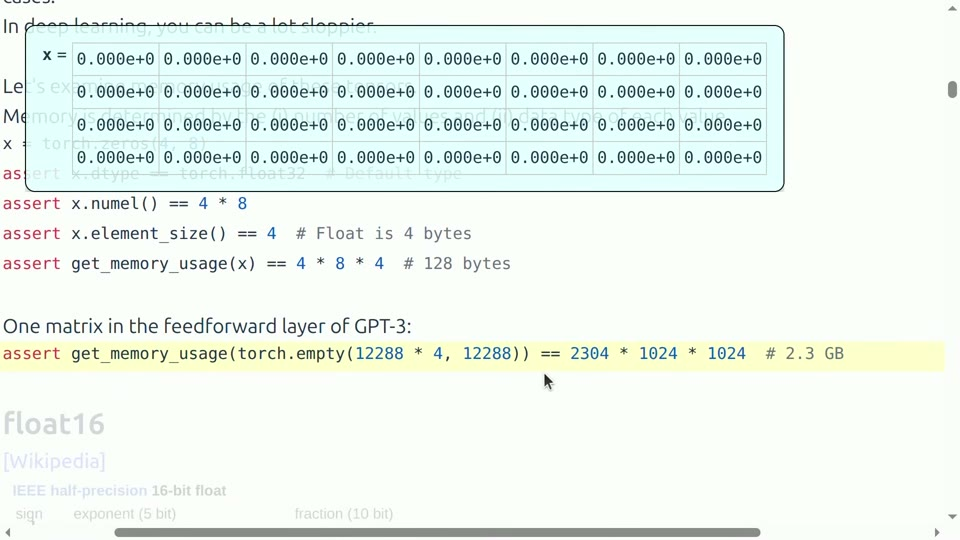
<figcaption>由元素数量和每元素字节数得到张量内存；同一公式可从小矩阵扩展到 GPT 级权重。</figcaption>
</figure>

```
import torch

x = torch.zeros(4, 8, dtype=torch.float32)
assert x.shape == (4, 8)
assert x.numel() == 32
assert x.element_size() == 4
assert x.numel() * x.element_size() == 128
```

这段代码的目的不是展示语法，而是养成“看到张量就核算”的习惯。调试显存时，应把参数、梯度、激活和优化器状态分别统计，而不是只查看模型文件大小。

## 浮点数为什么需要符号位、指数和尾数

一个实数范围无限且连续，有限位宽只能近似表示它。IEEE 风格浮点数把位分成符号位、指数位和尾数位，可近似写成
```math
x=(-1)^s\,(1+m)\,2^e.
```
**符号说明：**$`s`$ 是符号位；$`m`$ 是由尾数位编码的有效数字；$`e`$ 是经过偏置还原的指数。特殊编码还用于零、无穷和 NaN。

指数位决定动态范围，即能表示多大或多小；尾数位决定相邻可表示数之间的间隔，即精度。减少位宽必然在范围、精度或特殊值能力之间做选择。

<figure data-latex-placement="H">
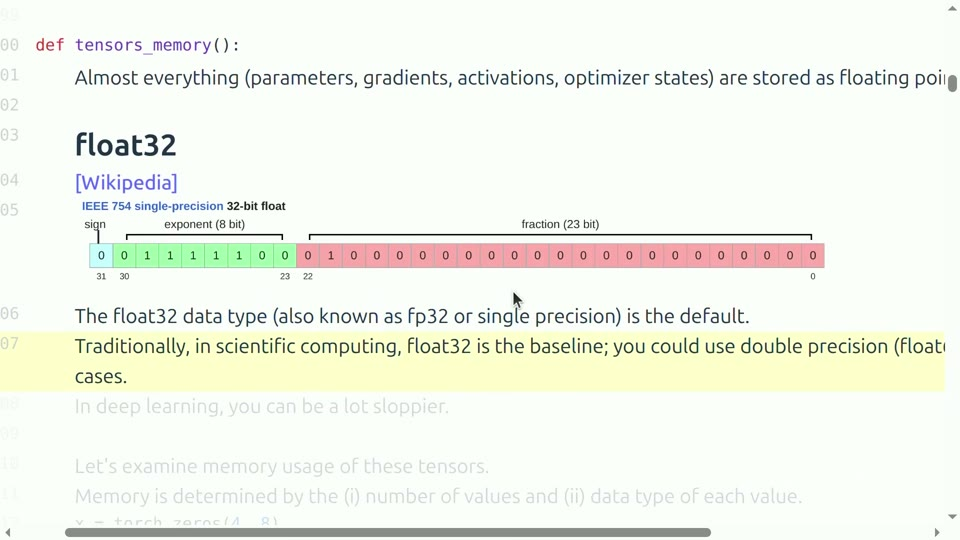
<figcaption>fp32 的典型位布局：1 位符号、8 位指数和 23 位尾数。指数负责范围，尾数负责精细程度。</figcaption>
</figure>

## fp32、fp16、bf16 与 fp8 的取舍

fp32 每元素 4 字节，长期是通用科学计算基线。fp16 每元素 2 字节，尾数比 bf16 更长，但指数位少，因此小数可能下溢、大数可能上溢。bf16 同样每元素 2 字节，却保留与 fp32 相同宽度的指数，将更多位让给动态范围；它的单次表示更粗，却通常更适合训练中跨度很大的数值。fp8 进一步降低存储和搬运成本，常用 E4M3、E5M2 等格式分别偏向精度或范围，但必须配合缩放、分块统计和更谨慎的累加精度。

<figure data-latex-placement="H">
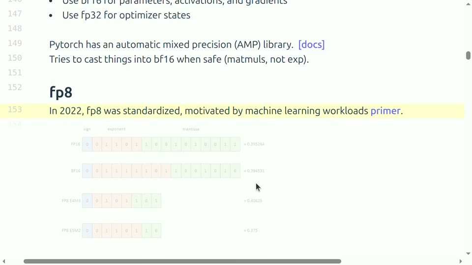
<figcaption>低精度格式的位分配并不唯一。不同指数与尾数比例，对应不同动态范围和有效精度。</figcaption>
</figure>

<div class="knowledgebox">

为什么低精度常常更快 低精度同时带来三种收益：张量占用更少显存；同样带宽每秒能搬运更多元素；现代 Tensor Core 对低精度矩阵乘法提供更高峰值吞吐。收益是否实现，仍取决于内核是否支持该格式以及运算是否被计算限制。

</div>

## 混合精度不是“全模型改 dtype”

混合精度训练让不同运算使用不同精度。常见做法是参数、激活和梯度采用 bf16，关键归约或优化器状态保留 fp32；矩阵乘法输入较低精度，内部乘加可能以更高精度累积。PyTorch 的自动混合精度上下文会按算子安全规则转换，但它不能替代对数值范围的理解。

```
optimizer.zero_grad(set_to_none=True)
with torch.autocast(device_type="cuda", dtype=torch.bfloat16):
    prediction = model(batch)
    loss = loss_fn(prediction, target)
loss.backward()
optimizer.step()
```

bf16 通常不需要 fp16 那样频繁的 loss scaling，但仍要监控 NaN、Inf 和异常梯度。对 softmax、归一化、累加和优化器状态，使用更高精度往往是稳定训练的必要成本。

<div class="warningbox">

精度与动态范围不是一回事 bf16 的动态范围接近 fp32，并不表示它也有 fp32 的细粒度精度。相反，fp16 尾数更多，也不表示它在训练中总更稳定；其指数范围较小可能造成上溢或下溢。选择格式时必须分别问“能否装下数值范围”和“舍入误差是否可接受”。

</div>

## 本章小结

张量内存等于元素数乘每元素字节数。浮点格式用指数换范围、用尾数换精度；混合精度按运算需求分配精度，而不是机械地把所有张量改成同一种 dtype。

# 设备与执行：张量放在哪里同样重要

## CPU、GPU 与数据搬运

PyTorch 默认在 CPU 创建张量。要使用 GPU，参数、输入和新建的辅助张量必须位于兼容设备。设备不一致会直接报错；更隐蔽的问题是循环中频繁调用 `.cpu()`、`.cuda()` 或读取标量，造成同步和总线传输，使本应高速的内核被等待时间淹没。

```
device = torch.device("cuda" if torch.cuda.is_available() else "cpu")
model = MyModel().to(device)
x = torch.randn(32, 128, 768, device=device, dtype=torch.bfloat16)
y = model(x)
```

CUDA 通常异步执行：Python 发出内核后可能立刻返回。因此直接在两行代码前后读取 CPU 时钟，测到的可能只是提交任务的时间。正确计时需要预热并同步：

```
for _ in range(10):
    y = model(x)
torch.cuda.synchronize()
start = time.perf_counter()
for _ in range(100):
    y = model(x)
torch.cuda.synchronize()
elapsed = time.perf_counter() - start
```

## 视图、连续性与隐式复制

`view`、`reshape`、`transpose` 等操作看似只改形状，但是否复制数据取决于 stride 与连续性。转置通常返回共享底层存储的视图；某些后续算子要求连续布局，会触发 `contiguous()` 复制。资源核算不能只看 API 名称，还要判断是否读写了新内存。

广播也类似。逻辑上把 $`(B,1,D)`$ 与 $`(1,S,D)`$ 扩展到 $`(B,S,D)`$，并不一定真的复制两份大张量；但若随后调用会物化结果的算子，输出仍需占用 $`BSD`$ 个元素。理解“逻辑形状”和“实际存储”之别，可以避免把轻量视图误判为巨大复制，也能避免忽略最终输出成本。

<div class="warningbox">

常见性能误区 GPU 利用率低并不自动说明矩阵乘法慢。原因可能是输入仍在 CPU、频繁同步、小张量内核启动开销、布局转换、数据加载不足或 Python 循环。应先建立可复现计时，再用 profiler 区分计算、搬运与空闲。

</div>

## 本章小结

张量的设备与布局决定它如何被执行。GPU 计时要处理异步性；形状变换可能是零复制视图，也可能触发昂贵物化。可靠分析必须观察真实数据流。

# 用 einsum 和 einops 表达张量语义

## 为什么位置索引不够清楚

普通矩阵乘法写作 `x @ y` 很简洁，但在高阶张量中，`-1`、`-2` 很快失去语义。注意力计算同时含 batch、查询序列、键序列、头和隐藏维，靠记住“倒数第二轴”非常容易转错。课程推荐以命名维度思考：明确每个输入拥有哪些轴、哪些轴被归约、输出保留哪些轴。

Einstein 求和记号的规则很简单：输入中出现但输出未出现的索引会被求和；输出索引的顺序决定结果轴顺序。矩阵乘法
```math
Z_{ij}=\sum_k X_{ik}Y_{kj}
```
可写为 `einsum(x, y, "i k, k j -> i j")`。 **符号说明：**$`i`$ 是第一矩阵的行或查询轴；$`j`$ 是第二矩阵的列或键轴；$`k`$ 是共同隐藏轴并被求和；$`Z`$ 是输出。

<figure data-latex-placement="H">
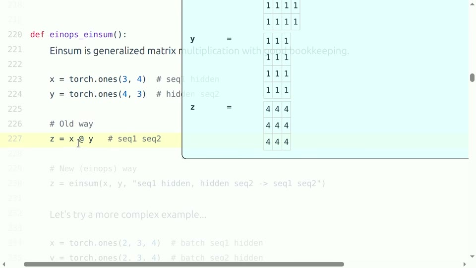
<figcaption>普通矩阵乘法的 einsum 视角：共同的 hidden 维被归约，两个序列维保留在输出中。</figcaption>
</figure>

## 批量注意力相似度的完整例子

设查询和键的形状均为 $`(B,S,H)`$，希望对每个 batch 计算所有查询与键的点积，输出形状为 $`(B,S_q,S_k)`$：
```math
A_{bqk}=\sum_h Q_{bqh}K_{bkh}.
```
**符号说明：**$`b`$ 是批量索引；$`q`$ 是查询位置；$`k`$ 是键位置；$`h`$ 是隐藏维；$`A_{bqk}`$ 是位置 $`q`$ 与位置 $`k`$ 的相似度。

```
from einops import einsum

q = torch.ones(2, 3, 4)  # batch, query, hidden
k = torch.ones(2, 5, 4)  # batch, key, hidden
scores = einsum(q, k, "batch query hidden, batch key hidden -> batch query key")
assert scores.shape == (2, 3, 5)
```

输出未写 hidden，所以沿 hidden 求和；batch 同时出现在输入和输出，因此不同样本不会混合。与 `q @ k.transpose(-2,-1)` 相比，einsum 多写了几个单词，却把形状契约直接嵌入代码。

<figure data-latex-placement="H">
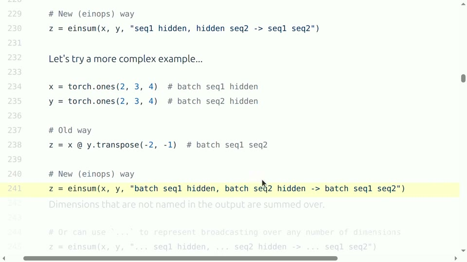
<figcaption>批量高阶张量的写法。命名轴同时说明广播、归约和输出布局，减少 transpose 次序错误。</figcaption>
</figure>

## 省略号、广播与维度重排

省略号可以代表任意个批量维，例如 `"... q h, ... k h -> ... q k"`。它适合编写能接受额外头维或分组维的通用函数，但会隐藏部分语义；在教学代码和关键模型代码中，显式命名通常更容易审查。

einops 还提供 `rearrange`、`reduce` 和 `repeat`。`rearrange` 负责重排、合并或拆分轴；`reduce` 明确按轴求和、均值或最大值；`repeat` 显式重复数据。典型多头变换可写成：

```
from einops import rearrange

x = torch.randn(batch, seq, heads * head_dim)
x = rearrange(x, "b s (h d) -> b h s d", h=heads)
```

括号表示合并或拆分关系。若总隐藏维不能被头数整除，操作会立即失败，这比后续得到错误但形状合法的结果更安全。

<div class="importantbox">

把形状当作接口契约 每个张量进入函数前都应能用一句话说清轴语义；每个归约轴都应有数学理由；每个输出轴都应能对应下游需求。einsum/einops 的价值不是缩短代码，而是让这些条件可见、可检查。

</div>

## 本章小结

einsum 用索引名表达“保留哪些轴、沿哪些轴求和”，einops 用模式表达重排和分解。它们把隐藏在 transpose 和 reshape 中的语义显式化，特别适合注意力和高阶批量运算。

# FLOPs 核算：从一个矩阵乘法到整次训练

## FLOP 与 FLOP/s 必须分开

FLOP 是一次浮点运算，常把一次乘法和一次加法各计 1 FLOP。FLOP/s 是吞吐率。模型“训练用了 $`10^{23}`$ FLOPs”描述工作总量；GPU“峰值 1000 TFLOP/s”描述理想速度。把二者混淆，就像把路程和车速当成同一单位。

对于 $`X\in\mathbb{R}^{B\times D}`$ 与 $`W\in\mathbb{R}^{D\times K}`$，输出 $`Y=XW`$ 有 $`BK`$ 个元素。每个元素是长度 $`D`$ 的点积，约做 $`D`$ 次乘法和 $`D`$ 次加法，因此
```math
C_{\mathrm{matmul}}\approx 2BDK.
```
**符号说明：**$`B`$ 是数据点或 token 数；$`D`$ 是输入维；$`K`$ 是输出维；系数 2 表示乘和加。严格计数可写 $`BK(2D-1)`$，大维度时差异可忽略。

元素级激活、加法或缩放只对每个输出元素做常数次操作，通常是 $`O(BK)`$；大矩阵乘法是 $`O(BDK)`$。在隐藏维很大时，矩阵乘法主导模型计算量，因此参数量能够成为训练 FLOPs 的有用代理。

<figure data-latex-placement="H">
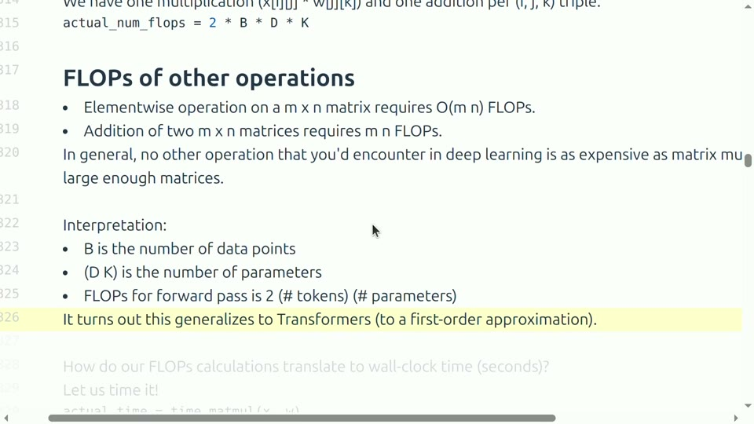
<figcaption>矩阵乘法与元素级算子的数量级差异，以及前向计算约为 <math display="inline" xmlns="http://www.w3.org/1998/Math/MathML"><semantics><mrow><mn>2</mn><mo>×</mo></mrow><annotation encoding="application/x-tex">2\times</annotation></semantics></math> 数据点数 <math display="inline" xmlns="http://www.w3.org/1998/Math/MathML"><semantics><mi>×</mi><annotation encoding="application/x-tex">\times</annotation></semantics></math> 参数量的解释。</figcaption>
</figure>

## worked example：线性层计算量

取 $`B=1024`$、$`D=4096`$、$`K=11008`$。一次前向矩阵乘法约需
```math
2\times1024\times4096\times11008\approx 9.23\times10^{10}\ \text{FLOPs}.
```
**符号说明：**$`B`$ 可理解为一个批次中的 token 总数；$`D`$ 和 $`K`$ 是线性层两端宽度。结果约为 92.3 GFLOPs。

如果设备对该精度的实际吞吐是 $`500`$ TFLOP/s，仅计算部分理想时间约为 $`0.184`$ 毫秒；真实时间还包括读取输入与权重、写回输出、内核调度及其他算子。

```
def matmul_flops(batch, in_dim, out_dim):
    return 2 * batch * in_dim * out_dim

print(matmul_flops(1024, 4096, 11008))
```

## 从参数量推导 $`6NT`$

若一层参数矩阵共有 $`N_\ell`$ 个参数，每个 token 的前向传播约需 $`2N_\ell`$ FLOPs。对所有层求和，前向约为 $`2NT`$。反向传播要计算输入梯度和参数梯度，两者各是同数量级矩阵乘法，所以反向约为前向的两倍，即 $`4NT`$；合计 $`6NT`$。

这个近似有边界。注意力在上下文长度很大时含 $`S^2`$ 项，可能不能被参数量完全概括；嵌入查表、softmax、归一化和稀疏路由的口径也不同；参数共享或稀疏激活会改变“每 token 访问全部参数”的假设。使用公式时，应说明它是一阶、稠密、以矩阵乘法为主的估算。

## 实际吞吐与 MFU

设备规格表给出峰值 $`P_{\mathrm{peak}}`$，实测每秒处理 token 数为 $`r`$，若每 token 的模型计算量约为 $`c`$，实际 FLOP/s 是 $`rc`$，模型 FLOPs 利用率定义为
```math
\mathrm{MFU}=\frac{P_{\mathrm{actual}}}{P_{\mathrm{peak}}}
=\frac{r\,c}{P_{\mathrm{peak}}}.
```
**符号说明：**$`P_{\mathrm{actual}}`$ 是按逻辑模型 FLOPs 计算的实际吞吐；$`P_{\mathrm{peak}}`$ 是对应精度与稠密口径的硬件峰值；$`r`$ 是 token/s；$`c`$ 是 FLOPs/token。

MFU 约 0.5 在现代大模型训练中常被视为不错的工程水平，但它不是跨模型绝对排名。融合算子、稀疏性、重计算以及 FLOPs 口径都会影响结果。低 MFU 也不必然是内核“算得慢”，可能是内存或通信让计算单元等待。

<div class="warningbox">

规格表口径要一致 同一 GPU 会列出 fp32、TF32、bf16、fp8，以及“带稀疏”和“不带稀疏”的不同峰值。分子按 bf16 稠密计算，分母却使用 fp8 稀疏峰值，会人为把 MFU 压低。比较前必须对齐精度、稠密性和运算定义。

</div>

## 本章小结

矩阵乘法 $`B\times D`$ 乘 $`D\times K`$ 约需 $`2BDK`$ FLOPs；稠密训练由此得到 $`6NT`$ 一阶公式。实际效率用 MFU 描述，但必须对齐硬件规格与模型计算口径。

# 算得多不一定慢：算术强度与屋顶线

## 计算时间与搬运时间的竞争

一段程序至少面临两种下界。完成 $`C`$ 次计算，在峰值算力 $`P`$ 下需要 $`C/P`$ 秒；搬运 $`Q`$ 字节，在带宽 $`W`$ 下需要 $`Q/W`$ 秒。若计算和搬运能够较好重叠，总时间近似由更慢者决定：
```math
t\gtrsim \max\left(\frac{C}{P},\frac{Q}{W}\right).
```
**符号说明：**$`C`$ 是 FLOPs；$`P`$ 是 FLOP/s；$`Q`$ 是必须经过目标存储层的数据字节数；$`W`$ 是 byte/s；$`t`$ 是运行时间下界。

算法算术强度定义为
```math
I=\frac{C}{Q}\quad(\text{FLOPs/byte}),
```
硬件临界强度为
```math
I_{\mathrm{crit}}=\frac{P}{W}.
```
**符号说明：**$`I`$ 表示每搬运一个字节完成多少工作；$`I_{\mathrm{crit}}`$ 表示要喂饱计算单元所需的工作密度。若 $`I<I_{\mathrm{crit}}`$，通常受带宽限制；若 $`I>I_{\mathrm{crit}}`$，通常受计算限制。

<figure data-latex-placement="H">
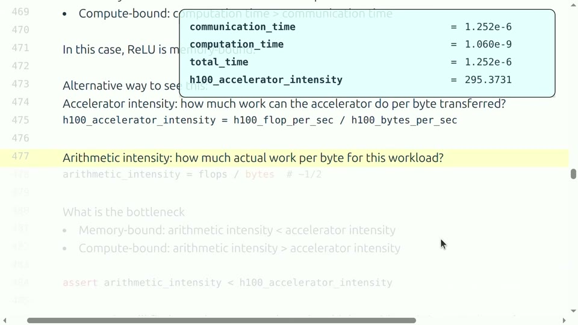
<figcaption>将算法强度与加速器临界强度比较，即可判断更可能受带宽还是计算限制。</figcaption>
</figure>

## 三个 worked examples

第一，bf16 元素级 ReLU。读入一个 2 字节元素，写回一个 2 字节元素，大约做 1 次比较，强度约 $`1/4=0.25`$ FLOPs/byte，远低于现代 GPU 的临界强度，因此通常 memory-bound。把 ReLU 的 FLOPs 再优化一半几乎无济于事；更有效的是与相邻算子融合，减少中间张量的读写。

第二，长度 $`n`$ 的矩阵向量乘。权重矩阵有 $`n^2`$ 个元素，约做 $`2n^2`$ FLOPs，也至少读取约 $`2n^2`$ 字节的 bf16 权重，强度只有常数量级。单 token 自回归推理常接近这种形态，因此容易受带宽限制。

第三，两个 $`n\times n`$ bf16 矩阵相乘。读取两输入并写一输出约 $`6n^2`$ 字节，计算约 $`2n^3`$ FLOPs：
```math
I_{\mathrm{matmul}}\approx\frac{2n^3}{6n^2}=\frac{n}{3}.
```
**符号说明：**$`n`$ 是矩阵边长；分子是矩阵乘法计算量；分母包含读入 $`X`$、读入 $`W`$ 和写出 $`Y`$。当 $`n`$ 足够大，强度随 $`n`$ 线性上升。

<figure data-latex-placement="H">
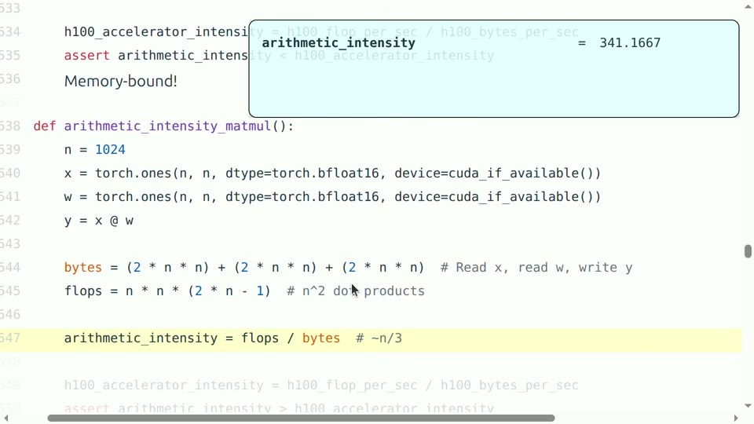
<figcaption>大矩阵乘法的算术强度约随 <math display="inline" xmlns="http://www.w3.org/1998/Math/MathML"><semantics><mrow><mi>n</mi><mi>/</mi><mn>3</mn></mrow><annotation encoding="application/x-tex">n/3</annotation></semantics></math> 增长，尺寸足够大时能够越过硬件临界点。</figcaption>
</figure>

这也解释训练与单 token 推理的差异：训练可以把许多 token 组成大矩阵，复用已经搬进芯片的数据；自回归推理每步只有少量 token，更像矩阵向量乘，权重读入成本难以被足够多计算摊薄。

## 屋顶线图如何阅读

屋顶线图横轴是算术强度，纵轴是可实现 FLOP/s。左侧斜线由带宽决定，性能随强度线性增长；右侧水平线由峰值算力决定，强度再高也不能越过计算上限。两线交点就是 $`I_{\mathrm{crit}}`$。提升带宽会抬高左侧斜线，提升算力会抬高水平屋顶。

<figure data-latex-placement="H">
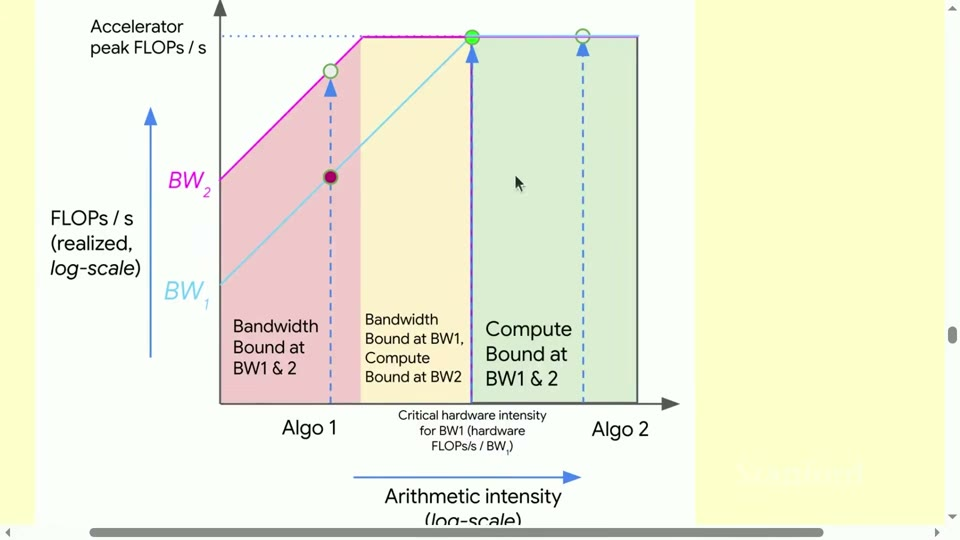
<figcaption>屋顶线模型把算法与硬件放在同一张图中：低强度位于带宽斜坡，高强度进入计算平台。</figcaption>
</figure>

读图时不要把“memory-bound”理解成显存容量不够。capacity 指能否装下，bandwidth 指每秒能搬多少；一个模型完全能装下，也可能因反复读取权重而极慢。反之，计算受限的矩阵乘法仍可能占用大量显存。

<div class="importantbox">

优化方向由瓶颈决定 带宽限制时，应减少内存往返、融合算子、提高批量复用或改进布局；计算限制时，应使用更快矩阵内核、较低精度、并行化或减少 FLOPs。若没有先判断瓶颈，优化很可能作用在不决定总时间的部分。

</div>

## 本章小结

总时间由计算和搬运中较慢的一方控制。算术强度 $`C/Q`$ 与硬件临界强度 $`P/W`$ 的比较给出瓶颈诊断；屋顶线把这一判断可视化，并直接指向不同优化策略。

# 自动微分：为什么反向传播约是前向的两倍

## 计算图与梯度保存

PyTorch autograd 在前向过程中记录计算图，并保存反向需要的部分输入或输出。调用 `loss.backward()` 后，叶子参数的 `.grad` 被累加，而不是自动覆盖为零。这一行为允许梯度累积，也意味着常规训练步必须在合适时机清空梯度。

考虑两层线性网络：$`H_1=XW_1`$，$`H_2=H_1W_2`$。对第二层，前向是一次矩阵乘法。反向必须计算两项：传回上一层的输入梯度，以及用于更新参数的权重梯度：
```math
\frac{\partial L}{\partial H_1}=\frac{\partial L}{\partial H_2}W_2^\top,
\qquad
\frac{\partial L}{\partial W_2}=H_1^\top\frac{\partial L}{\partial H_2}.
```
**符号说明：**$`L`$ 是标量损失；$`H_1,H_2`$ 是相邻层激活；$`W_2`$ 是第二层权重；两个式子各对应一次与前向同数量级的矩阵乘法。

## 用 einsum 检查反向公式

若 $`H_1`$ 形状为 $`(B,D_{in})`$、$`W_2`$ 为 $`(D_{in},D_{out})`$、$`\partial L/\partial H_2`$ 为 $`(B,D_{out})`$，则可以直接按轴名书写：

```
h1_grad = einsum(
    h2.grad, w2,
    "batch out, in out -> batch in"
)
w2_grad = einsum(
    h2.grad, h1,
    "batch out, batch in -> in out"
)
assert torch.allclose(h1.grad, h1_grad)
assert torch.allclose(w2.grad, w2_grad)
```

第一式沿 out 归约，保留 batch 与 in；第二式沿 batch 归约，保留 in 与 out。einsum 使“哪个轴被求和”一目了然，也让链式法则和代码形状相互校验。

<figure data-latex-placement="H">
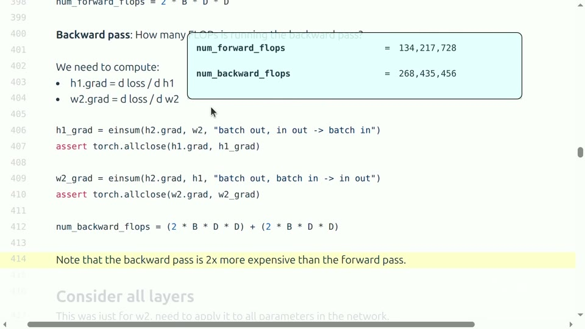
<figcaption>一层反向需要输入梯度和参数梯度两次主要矩阵乘法，因此约为该层前向的两倍。</figcaption>
</figure>

## 从单层推广到模型

每个主要权重矩阵前向一次，反向两次，于是训练中前向、输入梯度、参数梯度的计算比例约为 $`1:1:1`$。前向约 $`2NT`$，反向约 $`4NT`$，总计 $`6NT`$。激活函数和归一化虽也参与反向，但在宽矩阵主导的模型中通常是较低阶项。

<figure data-latex-placement="H">
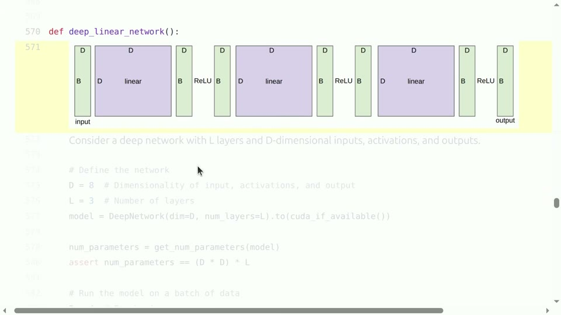
<figcaption>用于资源推导的深层线性网络：每层为 <math display="inline" xmlns="http://www.w3.org/1998/Math/MathML"><semantics><mrow><mi>D</mi><mo>×</mo><mi>D</mi></mrow><annotation encoding="application/x-tex">D\times D</annotation></semantics></math> 线性变换和逐元素激活。</figcaption>
</figure>

<div class="warningbox">

反向“两倍”是成本模型，不是定律 不同算子反向复杂度不同；注意力、稀疏路由、参数共享和自定义内核会改变比例。激活重计算还会额外再做部分前向。正确做法是先用两倍规则估算，再对主导算子逐项修正。

</div>

## 本章小结

反向传播为每层计算输入梯度和参数梯度，主要线性层因此需要两次与前向相近的矩阵乘法。einsum 可以把链式法则的轴关系直接变成可执行检查。

# 训练状态与优化器：显存究竟被谁占用

## 参数、梯度、激活和优化器状态

一次训练至少涉及四类存储。参数决定模型函数；梯度与参数同形；激活依赖 batch、序列长度、隐藏维和层数；优化器状态依赖算法。对 $`L`$ 层、宽度 $`D`$ 的简化网络，参数量约 $`LD^2`$，每层激活约 $`BD`$，全部保存则约 $`BLD`$ 个元素。

Adam 为每个参数维护一阶矩 $`m`$ 和二阶矩 $`v`$，常以 fp32 保存，共 8 字节/参数。若参数与梯度是 bf16，各 2 字节，则模型状态约 12 字节/参数。实际系统还可能维护 fp32 主参数副本；采用 ZeRO/FSDP 分片后，每卡只保存其中一部分。任何“每参数多少字节”的结论都必须写清精度和并行策略。

## AdaGrad 例子理解 state

AdaGrad 累积历史平方梯度：
```math
g^{(2)}_t=g^{(2)}_{t-1}+g_t\odot g_t,
\qquad
\theta_{t+1}=\theta_t-\eta\frac{g_t}{\sqrt{g^{(2)}_t}+\epsilon}.
```
**符号说明：**$`g_t`$ 是当前梯度；$`g^{(2)}_t`$ 是逐元素平方和状态；$`\theta_t`$ 是参数；$`\eta`$ 是学习率；$`\epsilon`$ 防止除零；$`\odot`$ 表示逐元素乘法。

<figure data-latex-placement="H">
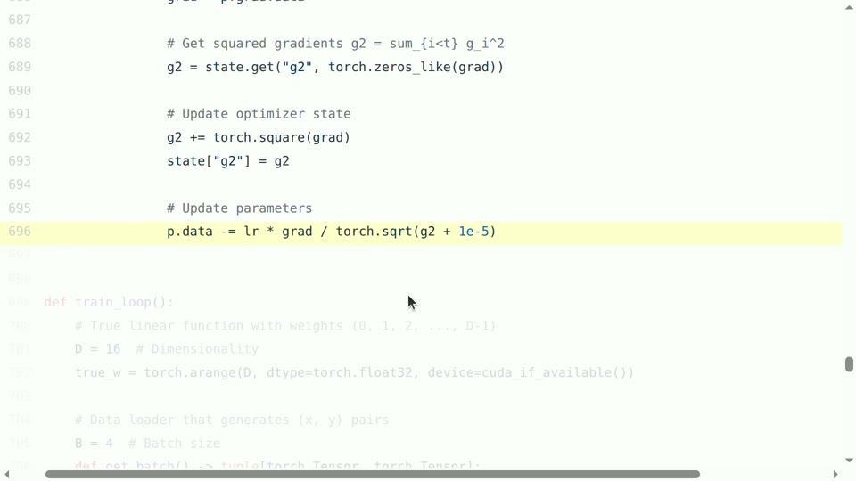
<figcaption>优化器 state 不是抽象概念：它是与参数同形、跨训练步保留并持续更新的张量。</figcaption>
</figure>

```
g2 = state.get("g2", torch.zeros_like(grad, dtype=torch.float32))
g2.add_(grad.float().square())
state["g2"] = g2
parameter.addcdiv_(grad, g2.sqrt().add_(1e-5), value=-lr)
```

state 必须跨步保留，因此不能像普通临时张量一样在步骤结束后释放。Adam 比 AdaGrad 多一份一阶矩，显存更高；优化器更新本身多为元素级操作，计算量相对矩阵乘法小，却可能因读写大量状态而受带宽限制。

## 显存预算表

| **类别** | 典型规模 | 主要影响因素 |
|:---|:---|:---|
| **参数** | $`N`$ | 参数精度、是否保留主副本、是否分片 |
| **梯度** | $`N`$ | 梯度精度、是否分片、是否延迟释放 |
| **优化器状态** | $`N`$ 的一至数倍 | SGD、AdaGrad、Adam 及状态精度 |
| **激活** | 约 $`BLSH`$ | micro-batch、序列长度、层数、隐藏维、重计算策略 |
| **临时与通信缓冲** | 依实现变化 | 内核、并行方式、bucket 大小、碎片 |

常见训练状态的主要缩放关系

## 本章小结

训练显存由多类张量共同构成。参数量只能预测模型状态，不能预测全部峰值；激活随批量和序列变化，优化器状态随算法和精度变化，分布式分片又改变每卡成本。

# 两种实用显存技术：梯度累积与激活检查点

## 梯度累积：把大 batch 拆成 micro-batch

假设目标有效 batch 为 $`B`$，单卡只能容纳 micro-batch $`b`$，则累积步数为 $`K=B/b`$。每个 micro-batch 做前向与反向，但不清空梯度；累积 $`K`$ 次后再更新参数。若损失默认对 micro-batch 求均值，应除以 $`K`$，使总梯度与一次处理完整 batch 的平均梯度一致：
```math
\nabla_\theta L_B=\frac{1}{K}\sum_{k=1}^{K}\nabla_\theta L_{b,k}.
```
**符号说明：**$`L_B`$ 是有效大批量的平均损失；$`K`$ 是累积步数；$`L_{b,k}`$ 是第 $`k`$ 个 micro-batch 损失；$`\theta`$ 是模型参数。

```
optimizer.zero_grad(set_to_none=True)
for micro_step, (x, y) in enumerate(loader, start=1):
    with torch.autocast("cuda", dtype=torch.bfloat16):
        loss = loss_fn(model(x), y) / accumulation_steps
    loss.backward()
    if micro_step % accumulation_steps == 0:
        optimizer.step()
        optimizer.zero_grad(set_to_none=True)
```

<figure data-latex-placement="H">
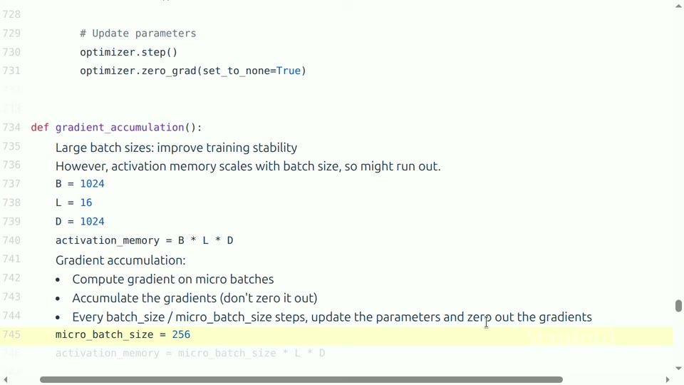
<figcaption>梯度累积用多个 micro-batch 构成目标 batch，参数只在完成规定次数后更新。</figcaption>
</figure>

梯度累积主要降低激活峰值，不会减少总前向和反向计算；小 micro-batch 还可能降低矩阵乘法效率。BatchNorm、随机性、学习率调度和按“步”触发的日志也可能使它与真实大 batch 不完全等价。语言模型多使用 LayerNorm，等价性通常更好，但仍应验证损失缩放与更新频率。

## 激活检查点：用重计算换存储

常规反向需要前向激活，因此默认保存每层中间结果。检查点技术只保留若干边界，反向到达某段时，从最近边界重新执行前向恢复所需激活。它降低显存，却增加计算，正是典型的时间—空间交换。

若深度为 $`L`$，保存全部层时激活存储为 $`O(L)`$、额外重计算近乎零；只存输入时存储可达 $`O(1)`$，但朴素逐层回算可能产生 $`O(L^2)`$ 工作；每隔约 $`\sqrt L`$ 层设置检查点，可以在简化模型下让检查点数量和最长重计算段都约为 $`O(\sqrt L)`$。

<figure data-latex-placement="H">
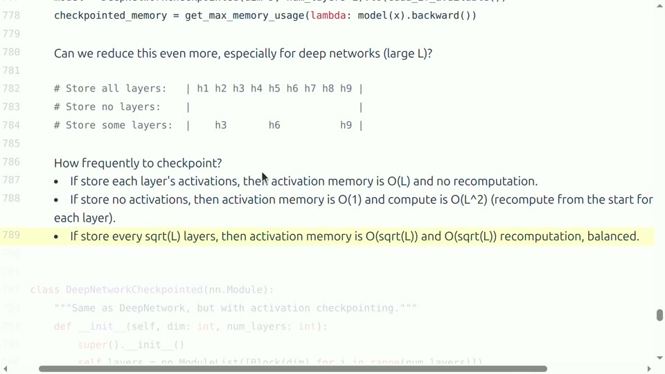
<figcaption>检查点间隔的直觉：全存储省计算，全丢弃省内存，约每 <math display="inline" xmlns="http://www.w3.org/1998/Math/MathML"><semantics><msqrt><mi>L</mi></msqrt><annotation encoding="application/x-tex">\sqrt L</annotation></semantics></math> 层保存一次可取得平衡。</figcaption>
</figure>

```
from torch.utils.checkpoint import checkpoint

def forward(self, x):
    for block in self.blocks:
        x = checkpoint(block, x, use_reentrant=False)
    return x
```

检查点区域若含 dropout 或其他随机操作，需要正确保存和恢复随机状态；有副作用、依赖全局可变状态的函数不适合直接重算。重计算增加的前向 FLOPs 会降低按逻辑模型 FLOPs 计算的 MFU 解读一致性，因此报告性能时应说明是否启用。

<div class="importantbox">

两种技术解决的不是同一问题 梯度累积缩小同时驻留的样本数，保留完整网络深度；激活检查点减少单个 micro-batch 在深度方向保存的中间状态。两者可以叠加，但都会影响吞吐，必须在同一训练目标上验证数值等价和墙钟收益。

</div>

## 本章小结

梯度累积用多次小批量反向模拟大批量更新，激活检查点用额外前向重计算换取激活显存。它们都不是免费优化，应同时检查数值语义、峰值显存和实际吞吐。

# 把核算方法落到真实项目

## 从纸面预算到可验证实验

一个可靠流程可以分为五步。第一，列出所有核心张量及 shape、dtype、device。第二，用形状公式计算理论参数、激活和 FLOPs。第三，用小规模输入运行，检查输出形状、梯度和内存峰值。第四，经过预热和同步测量墙钟时间。第五，用 profiler 找到主导内核、数据搬运与空闲，再决定优化方向。

```
torch.cuda.reset_peak_memory_stats()
torch.cuda.synchronize()
start = time.perf_counter()

loss = train_step(batch)

torch.cuda.synchronize()
elapsed = time.perf_counter() - start
peak = torch.cuda.max_memory_allocated()
tokens_per_second = num_tokens / elapsed
print(elapsed, peak, tokens_per_second)
```

理论值和实测值不一致并非坏事，而是诊断入口。若显存高于理论模型状态，检查激活、临时区、内存碎片和缓存；若运行时间高于 $`C/P`$ 很多，检查算术强度、通信、内核大小和数据管道；若结果随 dtype 改变，检查溢出、下溢和归约误差。

## 常见错误清单

1.  只报参数量，不报 dtype、激活和优化器状态。

2.  把 FLOPs 总量与 FLOP/s 吞吐混为一谈。

3.  用错误精度或稀疏口径的峰值计算 MFU。

4.  对异步 GPU 代码直接用 CPU 时钟计时。

5.  看到低 MFU 就盲目减少 FLOPs，却不检查带宽和通信。

6.  在 einsum 中误把 batch 或 head 轴当作归约轴。

7.  梯度累积时忘记除以累积步数，或错误地每个 micro-batch 清零。

8.  启用检查点后只看峰值显存，不比较吞吐和总训练时间。

## 本章小结

资源核算必须形成“公式—小实验—实测—profile—修正”的闭环。公式提供预期，工具提供证据，两者不一致时应追踪缺失项，而不是随意调整结论。

# 总结与延伸

## 把全讲压缩成一条因果链

语言模型训练的一切状态都落在张量上。张量形状决定元素数，dtype 决定每元素字节数，于是得到存储和搬运量；索引关系决定乘加次数，于是得到 FLOPs；FLOPs 与字节之比形成算术强度，再与硬件算力—带宽比比较，判断计算限制或带宽限制；自动微分为每个主要权重增加两次梯度矩阵乘法，导出训练约 $`6NT`$；优化器状态和激活构成额外显存；梯度累积与检查点则分别沿 batch 和深度维度交换时间与空间。

<div class="importantbox">

读完本讲应能独立回答 给出一段 PyTorch 模型代码，你应能标注主要张量的轴语义，估算各类状态字节数，计算主矩阵乘法 FLOPs，解释 FLOP 与 FLOP/s，按 MFU 估算训练时间，用算术强度判断瓶颈，并说明梯度累积或检查点会改变哪一项成本。

</div>

## 可操作的练习

第一，任选一个两层 MLP，手算每个张量的 shape、参数量、前向 FLOPs 和 AdamW 状态内存，再用 PyTorch 验证。第二，把普通 transpose/matmul 改写成 einsum，并为每个索引写出含义。第三，固定模型与有效 batch，比较不同 micro-batch 和检查点配置的峰值显存、token/s 与最终梯度。第四，对一个元素级函数和一个大矩阵乘法分别测量吞吐，结合屋顶线解释为何优化结果不同。

## 进一步延伸

本讲给出的模型仍是单设备、稠密矩阵为主的一阶视角。继续学习时，可以把同一套方法推广到数据并行通信量、张量并行的集合通信、流水线并行的气泡、FlashAttention 的 IO 复杂度、ZeRO/FSDP 的状态分片，以及推理中的 KV cache。新概念看似繁多，但都仍可拆回“算多少、存多少、搬多少、并行时等多久”。

## 本章小结

真正掌握 PyTorch，不是记住更多函数，而是能从张量语义出发推导计算、内存和时间，并用测量验证推导。资源意识使代码从“能运行”升级为“可解释、可扩展、可优化”。
