<div class="titlepage">

**Stanford CS336 第 3 讲：语言模型架构**

从 Transformer 基线到现代高效设计

独立教材版中文图文课程笔记

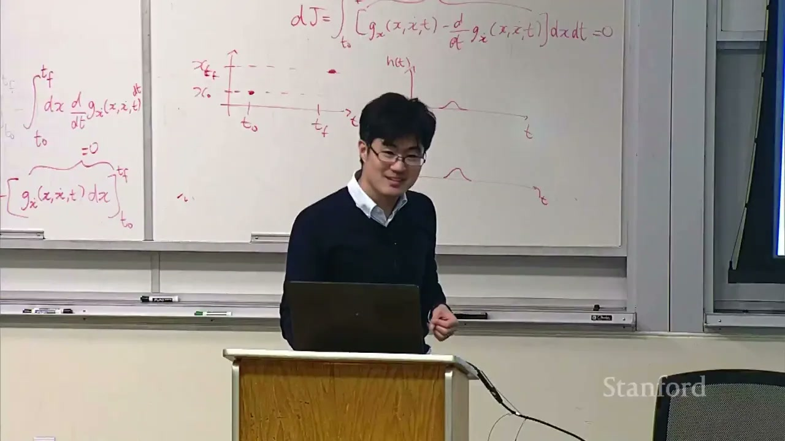

<div class="tcolorbox">

**课程**：Stanford CS336 Language Modeling from Scratch，Spring 2026

**讲次**：Lecture 3 – Architectures

**频道**：Stanford Online**讲师**：Tatsunori Hashimoto

**时长**：1:29:14**视频**：[`youtube.com/watch?v=lVynu4bo1rY`](https://www.youtube.com/watch?v=lVynu4bo1rY)

</div>

</div>

# 阅读地图：架构设计究竟在决定什么

## 问题不是“Transformer 要不要用”，而是“每个部件怎样取舍”

现代语言模型大多仍由若干重复的 Transformer 块组成。真正让模型之间产生差异的，往往是看似细小的部件选择：归一化放在残差支路之前还是之后，是否使用 RMSNorm，前馈网络用 ReLU、GeLU 还是 SwiGLU，位置关系如何编码，查询头与键值头是否一一对应，局部注意力和全局注意力如何交替，以及深度、宽度、头数和前馈维度如何匹配。

这些选择同时影响四件事。第一是**优化稳定性**：梯度能否穿过几十甚至上百层，训练是否频繁出现尖峰。第二是**表达能力**：模型能否有效混合 token 间信息与通道内信息。第三是**系统效率**：同样的理论 FLOPs 是否真的能在 GPU 上快速执行，显存访问和通信是否成为瓶颈。第四是**推理成本**：长序列下 KV cache 有多大，每生成一个 token 需要搬运多少数据。

<div class="importantbox">

本讲的核心视角 架构没有一个脱离训练规模、硬件和任务的绝对最优答案。合理的方法是先理解各部件解决的具体问题，再用小规模实验排除不稳定或明显低效的选项，最后在目标训练规模上验证。行业中的“默认配置”是强起点，但不是免检结论。

</div>

<figure data-latex-placement="H">
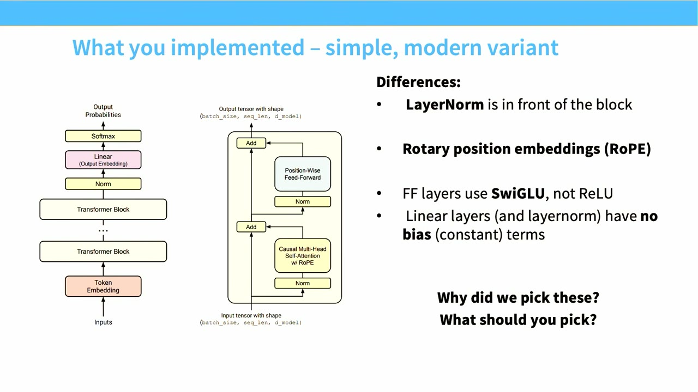
<figcaption>一类常见的现代解码器基线：预归一化、RoPE、SwiGLU、去偏置线性层，以及堆叠的因果自注意力块。</figcaption>
</figure>

## 前置知识：张量形状与两个混合方向

设批量大小为 $`B`$，序列长度为 $`T`$，模型隐藏维度为 $`d`$。每层输入可写成 $`X\in\mathbb{R}^{B\times T\times d}`$。自注意力主要沿**序列维**混合信息，让当前位置读取前文；前馈网络主要沿**通道维**变换信息，对每个位置独立应用相同的非线性映射。残差连接则让信息沿深度方向保留一条近似恒等的主干。

一个典型预归一化块可以写成
```math
H=X+\operatorname{Attn}(\operatorname{Norm}(X)),\qquad
Y=H+\operatorname{FFN}(\operatorname{Norm}(H)).
```
其中：

- $`X`$ 是进入该层的隐藏状态；

- $`H`$ 是完成注意力更新后的中间状态；

- $`Y`$ 是该层最终输出；

- $`\operatorname{Norm}`$ 是 LayerNorm 或 RMSNorm；

- $`\operatorname{Attn}`$ 在 token 之间路由信息；

- $`\operatorname{FFN}`$ 在每个 token 内进行通道变换。

## 本章小结

阅读后续内容时始终问三个问题：这个部件修改了哪条信息路径，它缓解了哪种训练或推理瓶颈，它的收益是否可能被数据规模和系统实现改变。

# 架构研究的方法：从“模型名单”回到可比较的部件

## 为什么发布模型很多，核心方案却高度集中

模型新闻看起来日新月异，但大量公开模型共享相近的 LLaMA 式骨架。差别常集中在少数离散开关与连续超参数上。课程用大量模型的公开配置表说明：将营销名称抹去后，归一化、激活、位置编码和注意力变体呈现明显的收敛趋势。

<figure data-latex-placement="H">

<figcaption>模型发布数量巨大，但分析架构时应把品牌名拆成可比较的部件选择与连续超参数。</figcaption>
</figure>

可比较研究至少需要控制参数量、训练 token 数、计算预算、优化器、学习率计划、数据混合和评估协议。如果只比较两篇论文最终模型，就无法知道差异来自架构还是训练配方。例如，一个模型采用 SwiGLU 并取得更低困惑度，不代表改进必然来自门控激活；它也可能用了更多数据、更好的分词器或更长训练。

<div class="warningbox">

相关性不是消融实验 “成功模型普遍采用某设计”只能说明它是可靠默认值，不能单独证明它在所有预算上最优。公开模型表适合发现候选趋势；因果判断仍需要受控消融、多个随机种子和等计算比较。

</div>

## 一套实用的选择顺序

先固定一套能稳定训练的现代基线，再逐类调整：先处理残差和归一化，因为它们决定能否训练；再处理激活与前馈宽度，因为它们占据大量参数和计算；随后处理位置编码和注意力头组织，因为它们决定上下文能力和推理内存；最后在硬件上搜索深宽比、头维度和局部/全局混合。每次只改变一小组耦合参数，并同时记录质量、训练吞吐、显存峰值和推理延迟。

## 本章小结

架构比较应以部件为单位、以受控预算为前提。模型配置表给出先验，实验才给出适用于当前任务的答案。

# 残差流与归一化位置：让深层网络可训练

## 残差连接为什么重要

假设某个子层为 $`F`$，残差更新写成 $`x_{l+1}=x_l+F(x_l)`$。当 $`F`$ 在训练早期很小，网络接近恒等映射，信息与梯度可以跨层传播。若每层都强制重写整个表示，深层网络更容易出现梯度消失、爆炸或早期层信息被破坏。

从微分角度看，残差层雅可比为
```math
\frac{\partial x_{l+1}}{\partial x_l}=I+\frac{\partial F(x_l)}{\partial x_l}.
```
其中：

- $`x_l`$ 是第 $`l`$ 层输入；

- $`I`$ 是恒等矩阵，代表不经子层也能传递的路径；

- $`F`$ 是注意力或前馈子层；

- 雅可比决定反向传播时梯度如何被缩放和旋转。

恒等项并不保证绝对稳定，却显著减少梯度完全依赖复杂子层乘积的风险。

## Post-Norm 与 Pre-Norm 的结构差异

Post-Norm 将归一化放在残差相加之后：$`y=\operatorname{Norm}(x+F(x))`$。Pre-Norm 则先归一化再进入子层：$`y=x+F(\operatorname{Norm}(x))`$。前者会让残差主干也穿过归一化，后者保留一条未经变换的恒等路径，因此现代大语言模型多数采用 Pre-Norm。

<figure data-latex-placement="H">
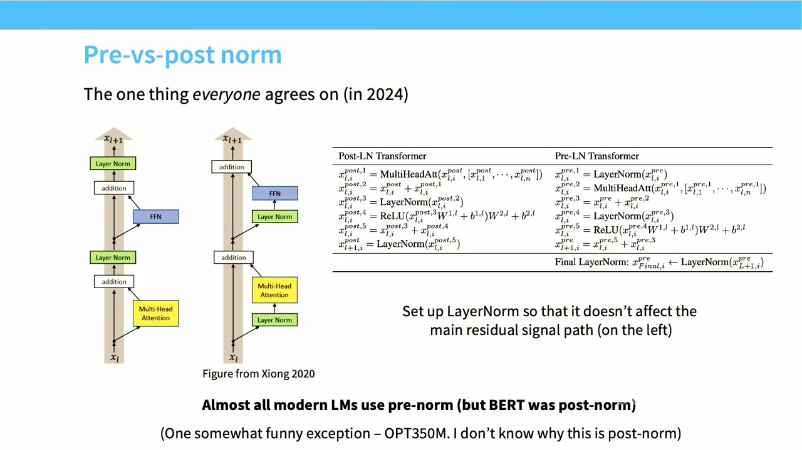
<figcaption>Post-Norm 与 Pre-Norm 的信息路径对比；现代深层语言模型通常优先保护主残差流。</figcaption>
</figure>

直觉上，Pre-Norm 像一条宽阔主路：每个子层只向主路写入增量。Post-Norm 则在每个路口都让全部流量通过一次重新标定。后者有时可以获得更“整理过”的层输出，但随着深度增加，更容易对优化器、初始化和学习率预热敏感。

## 双归一化和非残差 Post-Norm

新的模型并非简单回到传统 Post-Norm，而可能在子层输入处保留 Pre-Norm，同时在子层输出写回残差之前增加额外归一化。关键是不要把归一化直接塞进主残差通道；额外归一化只作用于支路增量，可以限制写回主路的幅度。

这解释了“某模型用了 post norm”为什么必须看计算图，而不能只看术语。相同名称可能代表完全不同的信息路径。实现时应明确标注归一化位于子层输入、子层输出还是残差和之后。

## Worked example：两层网络中的梯度路径

考虑两层 Pre-Norm：$`x_1=x_0+F_0(N(x_0))`$，$`x_2=x_1+F_1(N(x_1))`$。即使两个 $`F`$ 的局部梯度暂时很小，损失对 $`x_0`$ 的梯度仍包含从 $`x_2\rightarrow x_1\rightarrow x_0`$ 的恒等路径。若换成连续 Post-Norm，这条路径会乘上两个归一化雅可比，训练行为更依赖激活分布。这个例子没有证明 Pre-Norm 永远更优，却说明它为何更容易作为大规模训练的安全默认值。

## 本章小结

残差流是深层 Transformer 的信息高速公路。归一化设计的第一原则是保护主路，再约束支路写入；判断方案时必须看真实计算图，而不是只看名称。

# LayerNorm、RMSNorm 与“FLOPs 不等于时间”

## LayerNorm 做了什么

对单个 token 的通道向量 $`x\in\mathbb{R}^{d}`$，LayerNorm 先减均值、再除以标准差，最后做可学习仿射变换：
```math
\operatorname{LN}(x)=\gamma\odot\frac{x-\mu}{\sqrt{\sigma^2+\epsilon}}+\beta.
```
其中：

- $`\mu=d^{-1}\sum_i x_i`$ 是通道均值；

- $`\sigma^2=d^{-1}\sum_i(x_i-\mu)^2`$ 是通道方差；

- $`\epsilon`$ 是防止除零的小常数；

- $`\gamma`$ 和 $`\beta`$ 是逐通道缩放与偏置；

- $`\odot`$ 表示逐元素乘法。

它同时消除整体偏移并控制尺度，能减轻不同层激活范围漂移。

## RMSNorm 为什么更简单

RMSNorm 不减均值，也通常不使用偏置：
```math
\operatorname{RMSNorm}(x)=\gamma\odot\frac{x}{\sqrt{d^{-1}\sum_i x_i^2+\epsilon}}.
```
其中 $`d`$ 是隐藏维度，$`x_i`$ 是第 $`i`$ 个通道，分母是向量的均方根尺度，$`\gamma`$ 是可学习缩放。它保留了“控制长度”的主要作用，同时省去均值计算和偏置参数。

<figure data-latex-placement="H">
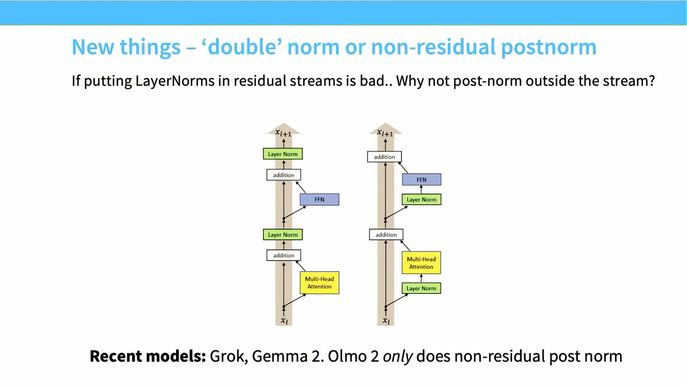
<figcaption>LayerNorm 同时中心化与缩放；RMSNorm 只按均方根缩放，是现代语言模型常见选择。</figcaption>
</figure>

## 为什么 0.17% 的 FLOPs 仍可能占据明显运行时间

矩阵乘法具有高算术强度：每次从显存读入的数据可以参与许多乘加。归一化需要读完整向量、做归约、再写回，却只有少量算术，因此常受内存带宽和 kernel 启动开销限制。理论 FLOPs 极少，不代表墙钟时间可以忽略。

<figure data-latex-placement="H">
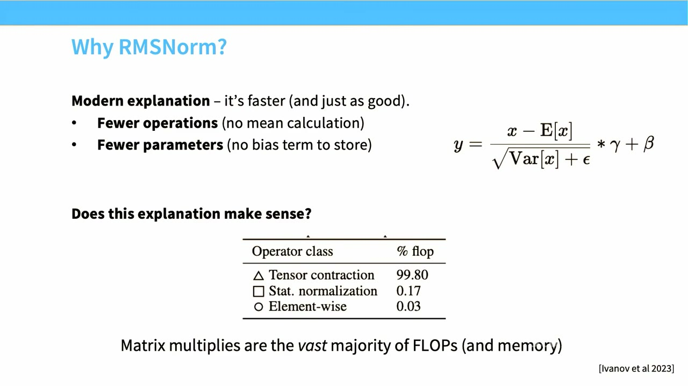
<figcaption>归一化的理论运算量很小，但数据搬运比例高，因而运行时间占比可能远高于 FLOPs 占比。</figcaption>
</figure>

例如，对 $`B\times T\times d`$ 张量，RMSNorm 至少要读取输入、计算平方和、读取缩放参数并写出结果。若前后算子没有融合，这些全量读写会反复穿越显存。RMSNorm 的优势因此不只在少几次加法，而在更容易形成精简 kernel，并减少需要搬运的参数与中间量。

<div class="knowledgebox">

Roofline 直觉 算术强度等于运算次数除以内存访问字节数。矩阵乘法通常计算受限；归一化、激活和逐元素加法常带宽受限。优化语言模型时，不能只把各算子的 FLOPs 相加，还要看是否融合、是否产生中间张量、是否触发跨设备通信。

</div>

## 去掉偏置项的同一逻辑

现代前馈线性层常写成 $`\operatorname{FFN}(x)=\phi(xW_1)W_2`$，省去 $`b_1,b_2`$。偏置参数占总参数很小，但会增加独立读写和广播；在归一化已经提供可学习缩放、且模型表达能力充足时，偏置通常不是最划算的复杂度。这里的结论是工程经验而非数学定理，迁移到小模型或非 Transformer 任务时仍应验证。

## 本章小结

RMSNorm 以更少状态保留了稳定尺度的核心作用。它提醒我们：系统性能由计算、内存、融合和通信共同决定，FLOPs 只是其中一项。

# 前馈网络与门控激活：每个 token 内部怎样“思考”

## ReLU、GeLU 与平滑门

标准两层前馈网络为
```math
\operatorname{FFN}(x)=\phi(xW_1)W_2.
```
其中 $`x\in\mathbb{R}^{d}`$ 是单个 token 表示，$`W_1\in\mathbb{R}^{d\times d_{ff}}`$ 将其扩展，$`\phi`$ 是非线性激活，$`W_2\in\mathbb{R}^{d_{ff}\times d}`$ 投影回残差维度。ReLU 使用 $`\max(0,z)`$，负半轴梯度为零；GeLU 近似 $`z\Phi(z)`$，根据输入大小平滑地保留或抑制信息。

<figure data-latex-placement="H">
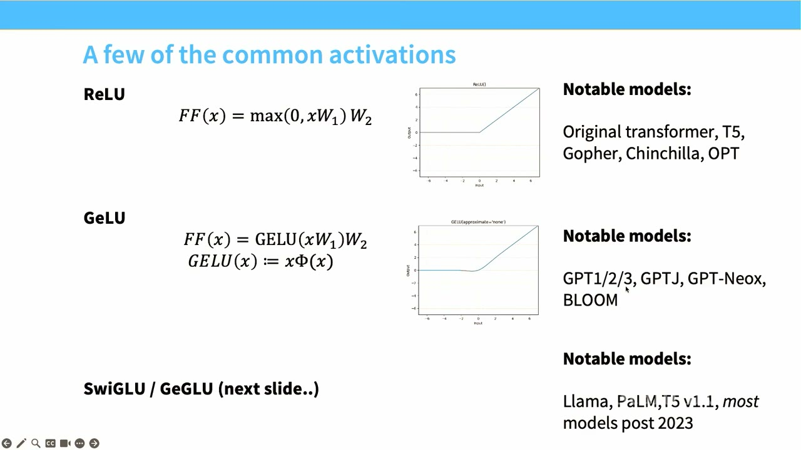
<figcaption>ReLU 与 GeLU 的函数形状和常见使用谱系；平滑激活允许负值区域保留少量梯度。</figcaption>
</figure>

激活函数并不是孤立选择。改变激活会改变输出方差、有效稀疏性和最合适的初始化，还可能要求重新调整学习率。小规模实验中看似微弱的差异，在更大训练预算下可能累积；反过来，若数据和优化器差异更大，激活差异也可能被淹没。

## GLU 的核心：一条内容支路乘上一条门控支路

门控前馈网络使用两个并行投影：
```math
\operatorname{GLU}_{\phi}(x)=\bigl(\phi(xW_g)\odot xW_v\bigr)W_o.
```
其中：

- $`W_g`$ 产生门控信号；

- $`W_v`$ 产生待传递的内容；

- $`\phi`$ 可取 ReLU、GeLU 或 SiLU；

- $`\odot`$ 是逐元素相乘，让门控制内容；

- $`W_o`$ 将中间维度投回模型维度。

当 $`\phi`$ 为 SiLU 时常称 SwiGLU，为 GeLU 时称 GeGLU。门控让网络不仅能变换特征，还能根据当前 token 状态动态决定哪些通道通过。

<figure data-latex-placement="H">
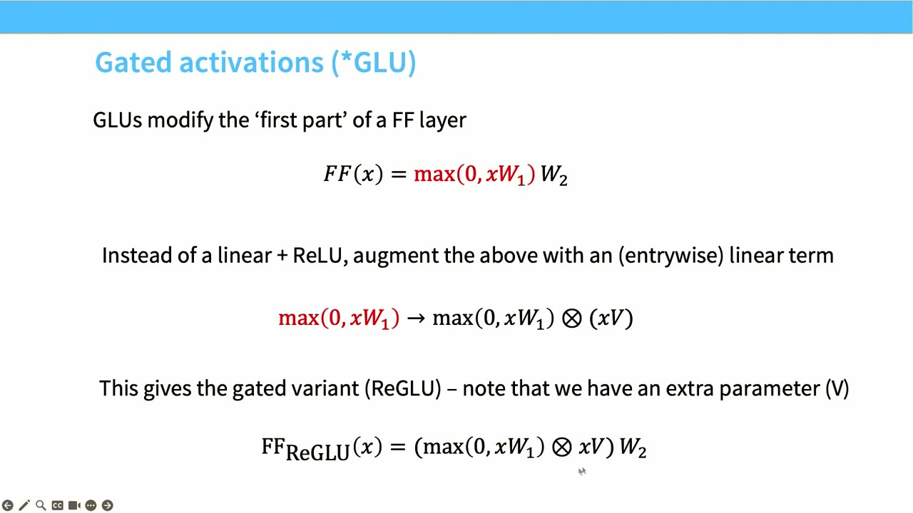
<figcaption>门控线性单元在普通前馈网络上增加一条逐元素门支路，使特征传递具有输入依赖性。</figcaption>
</figure>

## 为什么门控网络的中间维度常缩小

普通 FFN 有两张主要矩阵，参数量近似 $`2dd_{ff}`$；门控 FFN 有三张，参数量近似 $`3dd_{ff}^{(g)}`$。若要与普通 FFN 的参数和计算接近，应令
```math
3d d_{ff}^{(g)}\approx 2d(4d),\qquad d_{ff}^{(g)}\approx\frac{8}{3}d.
```
其中 $`d`$ 是模型维度，$`4d`$ 是传统 FFN 的常见扩展，$`d_{ff}^{(g)}`$ 是门控 FFN 宽度。于是现代模型常取约 $`2.67d`$，而不是直接把门控结构也设成 $`4d`$。

<figure data-latex-placement="H">
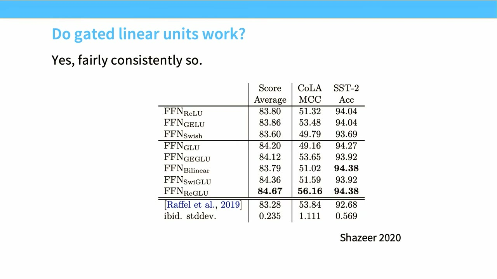
<figcaption>受控实验中多种 GLU 变体通常优于对应的非门控激活，但差距应结合随机波动和预算理解。</figcaption>
</figure>

<div class="warningbox">

等宽比较会偷偷增加预算 若普通 FFN 与 SwiGLU 都设 $`d_{ff}=4d`$，后者多出一张输入投影，参数和计算显著增加。这样的实验无法区分收益来自门控机制还是更多容量。公平比较应固定参数量、FLOPs 或训练时间，并明确采用哪一种。

</div>

## Worked example：$`d=4096`$ 时如何选宽度

普通 $`4d`$ FFN 取 $`d_{ff}=16384`$，两张矩阵约含 $`2\times4096\times16384\approx1.34`$ 亿参数。等参数的 SwiGLU 取 $`d_{ff}\approx(8/3)\times4096\approx10923`$，工程上常向硬件友好的倍数取整，例如 11008。三张矩阵约含 $`3\times4096\times11008\approx1.35`$ 亿参数。这样比较才接近同预算。

## 本章小结

前馈层承担通道变换，门控激活用输入依赖的乘法提高选择性。采用 SwiGLU 时要同步调整中间宽度，避免把额外参数误当成纯架构收益。

# 串行还是并行：注意力与前馈怎样组合

## 两种计算图

串行块先做注意力更新，再把更新后的表示送入前馈层：
```math
h=x+A(N(x)),\qquad y=h+M(N(h)).
```
并行块让注意力和前馈读取同一个归一化输入：
```math
y=x+A(N(x))+M(N(x)).
```
其中 $`A`$ 是注意力，$`M`$ 是 MLP，$`N`$ 是归一化。并行结构缩短关键路径，可共享归一化，还可能融合部分输入投影；代价是 MLP 在本层看不到注意力刚刚写入的信息，只能到下一层再利用。

<figure data-latex-placement="H">
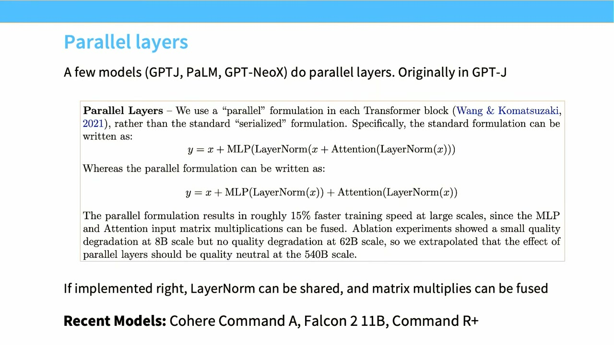
<figcaption>串行与并行 Transformer 块的公式；并行化可缩短依赖链并为算子融合创造机会。</figcaption>
</figure>

## 何时并行结构可能更有价值

当模型足够深时，一层延迟的信息交互未必严重，因为下一层仍可整合；而训练吞吐提升会非常实在。当模型较浅、每层承担更多功能时，串行依赖可能更重要。并行结构还要求系统实现真正同时调度或融合两个分支；只修改数学公式却串行执行，可能得不到预期收益。

## 实现伪代码

下面给出两种结构的最小差别。代码重点不是具体框架语法，而是张量依赖关系。

```
def serial_block(x):
    h = x + attention(norm1(x))
    y = h + mlp(norm2(h))
    return y

def parallel_block(x):
    z = norm(x)
    y = x + attention(z) + mlp(z)
    return y
```

验证时要同时检查数值质量、峰值显存和 kernel 时间线。并行分支若造成更大的临时张量，也可能抵消融合收益。

## 本章小结

串行结构提供更强的层内依赖，并行结构提供更短关键路径。选择取决于深度、实现质量和硬件调度，不能只依据公式中的运算次数。

# 位置表示：从绝对坐标到 RoPE 的相对几何

## 为什么内容向量本身不知道顺序

注意力点积对 token 集合近似置换等变：如果不加入位置信息，“猫追狗”和“狗追猫”可能只看见相同词集合。位置机制必须让模型区分顺序，同时最好能把学到的局部关系迁移到未见过的位置。

<figure data-latex-placement="H">
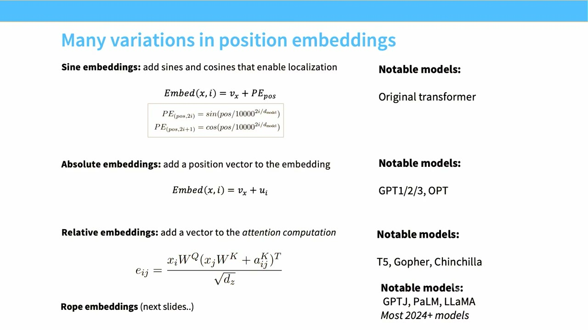
<figcaption>正弦、可学习绝对位置、显式相对位置与 RoPE 的比较；差别在于位置信息进入表示还是进入注意力关系。</figcaption>
</figure>

绝对位置嵌入把 $`p_i`$ 加到 token 表示：$`h_i=e_i+p_i`$。它简单直接，但注意力点积会同时产生内容–内容、内容–位置和位置–位置交叉项，模型需要自己学习哪些项代表相对距离。显式相对偏置则直接在注意力分数中加入只依赖 $`i-j`$ 的项，关系清晰，但可能改变注意力 kernel 接口。

## RoPE 的目标：让点积只显式依赖相对位移

RoPE 希望找到位置变换 $`R_i`$，使
```math
\langle R_i q_i,R_j k_j\rangle=q_i^{\mathsf T}R_{j-i}k_j.
```
其中：

- $`q_i`$ 是位置 $`i`$ 的查询向量；

- $`k_j`$ 是位置 $`j`$ 的键向量；

- $`R_i`$ 是由位置决定的旋转矩阵；

- $`R_{j-i}`$ 表明点积中的位置效应只依赖相对距离；

- $`\langle\cdot,\cdot\rangle`$ 是内积。

<figure data-latex-placement="H">
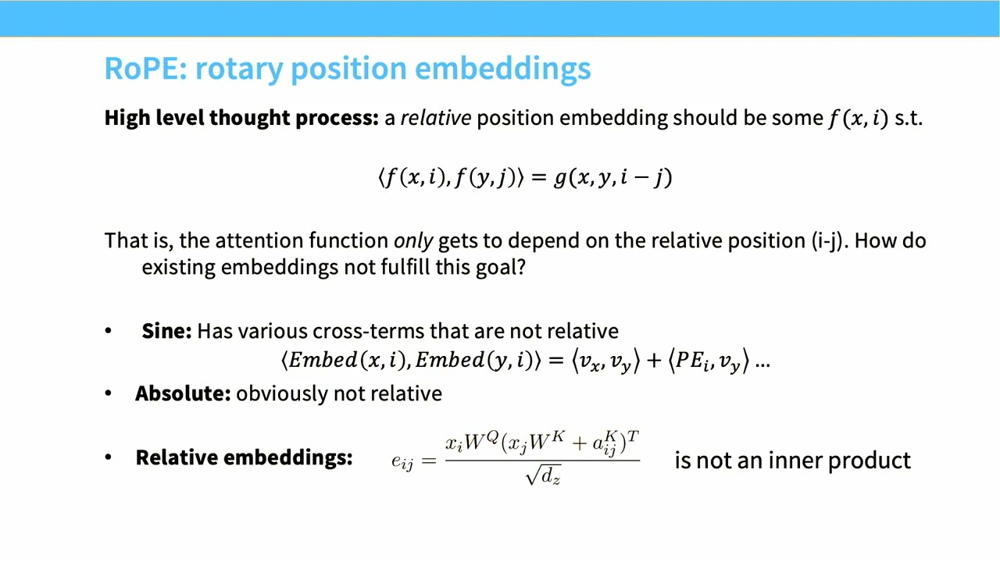
<figcaption>RoPE 的高层目标：让注意力相似度通过内积自然依赖 <math display="inline" xmlns="http://www.w3.org/1998/Math/MathML"><semantics><mrow><mi>i</mi><mo>−</mo><mi>j</mi></mrow><annotation encoding="application/x-tex">i-j</annotation></semantics></math>，而非依赖两个绝对位置。</figcaption>
</figure>

## 二维旋转怎样扩展到高维

将通道两两配对，对第 $`m`$ 个位置使用角度 $`m\theta`$：
```math
R(m\theta)=\begin{bmatrix}\cos(m\theta)&-\sin(m\theta)\\
\sin(m\theta)&\cos(m\theta)\end{bmatrix}.
```
其中 $`m`$ 是 token 位置，$`\theta`$ 是该通道对的角频率。高维向量被拆成许多二维平面，不同通道对使用不同频率：高频编码短距离变化，低频承载更长尺度关系。旋转只作用于 $`Q`$ 和 $`K`$，通常不作用于 $`V`$，因为位置要影响“读取谁”，而不必直接旋转“读到的内容”。

<figure data-latex-placement="H">
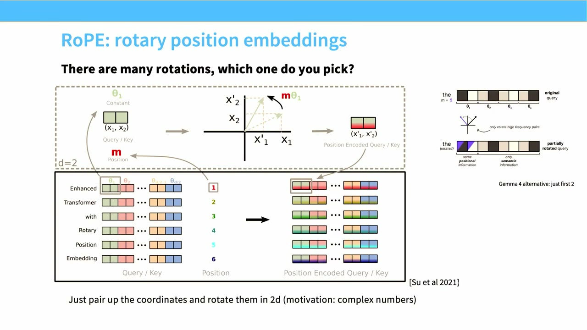
<figcaption>RoPE 把查询和键的通道两两配对，在多个频率的二维平面中随位置旋转。</figcaption>
</figure>

## Worked example：相对距离为何自动出现

二维中有 $`q'=R(i\theta)q`$、$`k'=R(j\theta)k`$。因为旋转矩阵正交，
```math
{q'}^{\mathsf T}k=q^{\mathsf T}R(i\theta)^{\mathsf T}R(j\theta)k
=q^{\mathsf T}R((j-i)\theta)k.
```
其中 $`R(i\theta)^{\mathsf T}=R(-i\theta)`$，两个旋转相乘时角度相加，于是绝对位置 $`i,j`$ 被压缩为相对位移 $`j-i`$。这就是 RoPE 比“直接加一个位置向量”更贴合注意力关系的原因。

<div class="warningbox">

长上下文外推不是自动保证 训练只覆盖有限位置范围时，超长上下文会进入未充分学习的角度组合。改变 RoPE 基频、缩放位置或只旋转部分通道都可能改善外推，也可能伤害短上下文质量。必须在目标长度分布上验证，而不能只看训练长度内困惑度。

</div>

## 本章小结

位置机制决定注意力如何理解距离。RoPE 用旋转保持内积结构，并把相对位移自然写入查询–键相似度，是现代解码器的稳健默认选择。

# 超参数几何：前馈宽度、头维度、深度与宽度

## 前馈扩展倍数不是神秘常数

普通 FFN 常取 $`d_{ff}\approx4d`$，门控 FFN 在等预算下常取 $`d_{ff}\approx(8/3)d`$。这些是大量成功模型聚集出的默认值，不是理论唯一解。课程展示的实验曲线表明，前馈比例在一个相当宽的区间内损失接近最优，极端过窄或过宽才明显变差。

<figure data-latex-placement="H">
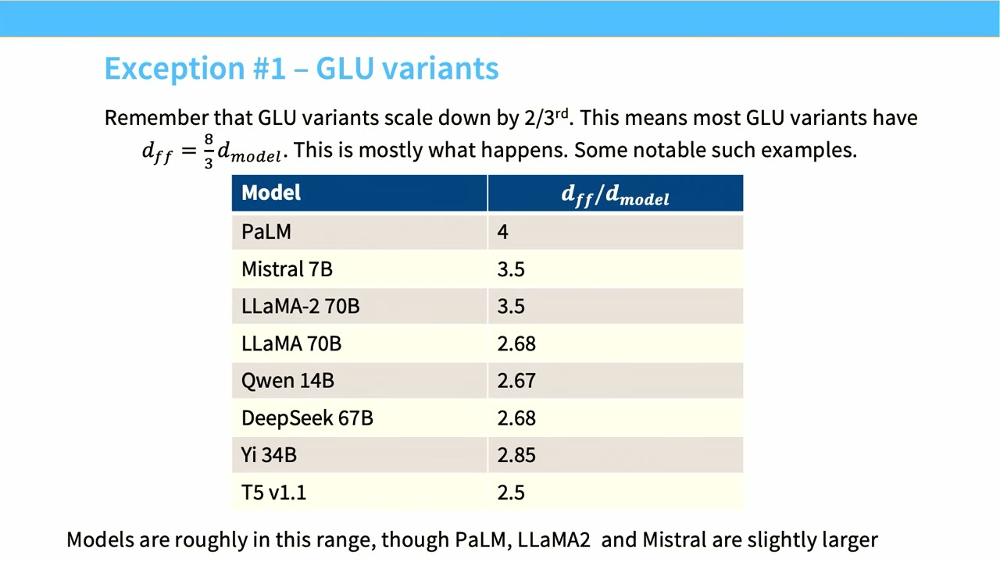
<figcaption>门控 FFN 因多一张投影矩阵，常把中间宽度缩到约 <math display="inline" xmlns="http://www.w3.org/1998/Math/MathML"><semantics><mrow><mn>8</mn><mi>/</mi><mn>3</mn></mrow><annotation encoding="application/x-tex">8/3</annotation></semantics></math> 倍模型维度以保持预算接近。</figcaption>
</figure>

<figure data-latex-placement="H">
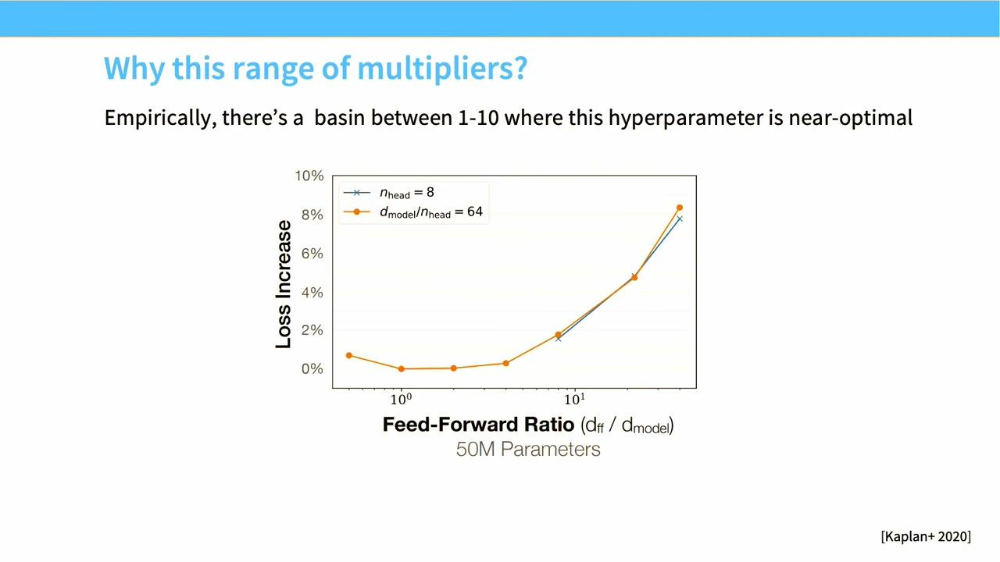
<figcaption>前馈扩展倍数存在较宽的近最优盆地，默认值可靠但并非精确到小数点的定律。</figcaption>
</figure>

这意味着搜索策略不应在 2.6 与 2.7 之间耗费大量试验，而应先检查更影响系统的因素：维度是否满足张量核对齐，张量并行切分后每卡尺寸是否均匀，激活峰值是否超显存，以及 FFN 是否成为流水线瓶颈。

## 头数与头维度

标准多头注意力满足 $`h\,d_h=d`$，其中 $`h`$ 是查询头数，$`d_h`$ 是每头维度。头数增加会把表示拆成更多子空间；头维度增加则让每个头有更丰富的相似度几何。经验上许多模型使用约 64 或 128 的头维度，但实际选择还受并行切分、FlashAttention kernel 和 KV cache 布局影响。

注意“$`h`$ 必须整除 $`d`$”是常见实现约束，不是注意力数学的唯一形式。可以使用不等宽头、额外投影或潜变量压缩，只是通用 kernel 往往假设规则形状。工程上优先选择库能高效处理的形状，再在此范围内做质量搜索。

## 深宽比与参数预算

忽略嵌入和常数，单层稠密 Transformer 参数量可粗略写成
```math
P_{layer}\approx 4d^2+c_{ff}d^2,
\qquad P\approx L(4+c_{ff})d^2.
```
其中：

- $`L`$ 是层数；

- $`4d^2`$ 近似来自 $`Q,K,V,O`$ 四个注意力投影；

- $`c_{ff}d^2`$ 表示前馈部分，普通 $`4d`$ FFN 的 $`c_{ff}\approx8`$；

- $`P`$ 是不含词嵌入的总参数近似。

固定参数量时，增加深度必须降低宽度。更深模型串行依赖更多、训练延迟更高，却能进行更多次逐层变换；更宽模型单层矩阵更大、并行度高，但激活和通信规模也会改变。

<figure data-latex-placement="H">
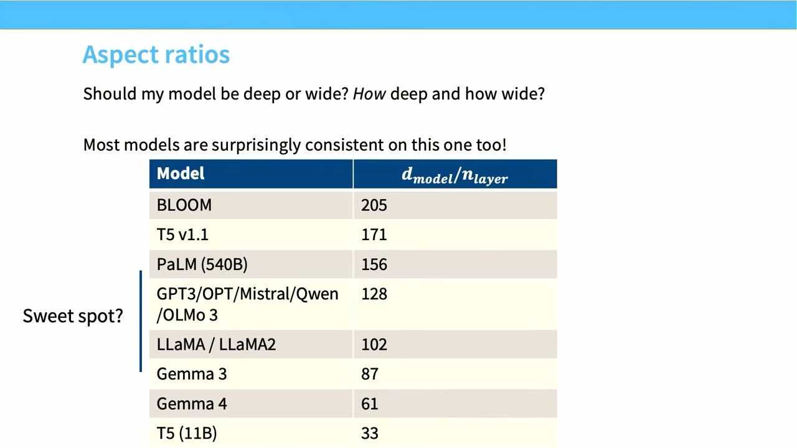
<figcaption>公开模型的 <math display="inline" xmlns="http://www.w3.org/1998/Math/MathML"><semantics><mrow><mi>d</mi><mi>/</mi><mi>L</mi></mrow><annotation encoding="application/x-tex">d/L</annotation></semantics></math> 多集中在一个宽区间，体现了深度与宽度之间常见但并不唯一的平衡。</figcaption>
</figure>

<figure data-latex-placement="H">
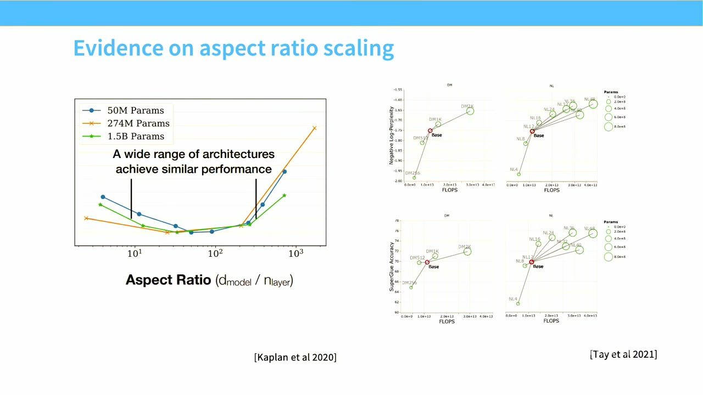
<figcaption>多项实验显示较宽的深宽比范围可获得相近质量，系统约束常成为最终决定因素。</figcaption>
</figure>

## Worked example：固定约 10 亿块内参数

若简化为每层 $`12d^2`$ 参数，目标 $`P\approx10^9`$。取 $`L=24`$ 时，$`d\approx\sqrt{10^9/(288)}\approx1863`$；取 $`L=48`$ 时，$`d\approx1318`$。实际会对齐到 128 的倍数，并重新计算嵌入、归一化和门控矩阵。两者参数接近，但前者矩阵更宽、层数更少，后者串行深度更大。最终应在目标集群上比较每步时间和验证损失，而不是只比较参数数目。

## 本章小结

前馈倍数、头维度和深宽比通常都有宽阔可行区。先选择稳定且硬件友好的默认值，再围绕目标规模做小范围搜索，比追逐单一论文数字更可靠。

# 正则化与权重衰减：大模型训练中的含义变化

## 为什么 Dropout 逐渐减少

经典小数据监督学习用 Dropout 抑制过拟合；大语言模型面对海量且不断变化的 token，常处于欠拟合或计算受限区域，因此很多现代预训练配方把 Dropout 设为零。去掉它还能简化 kernel、提高确定性，并减少训练与推理路径差异。

但“现代模型不用 Dropout”不能推广为任何任务都不需要。小数据微调、领域数据重复、参数高于数据量很多时，过拟合仍可能出现。应根据训练–验证差距、数据重复率和下游鲁棒性决定，而不是根据模型大小机械选择。

## 权重衰减不只是传统的泛化惩罚

AdamW 把权重衰减从自适应梯度更新中解耦：
```math
\theta_{t+1}=(1-\eta_t\lambda)\theta_t-\eta_t\widehat{m}_t/(\sqrt{\widehat{v}_t}+\epsilon).
```
其中：

- $`\theta_t`$ 是当前参数；

- $`\eta_t`$ 是学习率；

- $`\lambda`$ 是权重衰减系数；

- $`\widehat m_t,\widehat v_t`$ 是 Adam 的偏差校正一阶与二阶矩；

- $`\epsilon`$ 防止数值除零。

第一项每步按 $`\eta_t\lambda`$ 缩小参数，因此权重衰减与学习率计划强耦合。学习率余弦下降时，后期衰减也随之减弱；改变学习率而保持 $`\lambda`$ 不变，并不保持相同的累计正则强度。

<figure data-latex-placement="H">
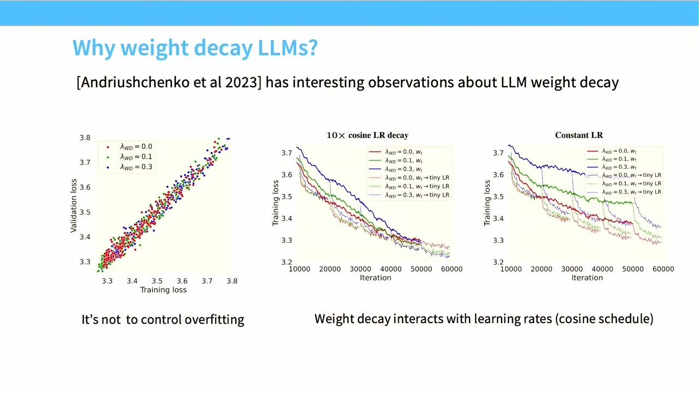
<figcaption>语言模型中的权重衰减会与学习率计划和优化动态交互，其作用不能简单等同于控制传统过拟合。</figcaption>
</figure>

## 哪些参数应衰减

常见做法是不对归一化缩放和偏置做权重衰减，只衰减大矩阵。理由是标量尺度参数的几何角色不同，强制其靠近零可能直接破坏归一化功能。词嵌入是否衰减则取决于实现和实验。最重要的是把参数分组写进可检查配置，并在断点恢复后验证分组没有变化。

```
decay, no_decay = [], []
for name, p in model.named_parameters():
    if p.ndim >= 2 and "norm" not in name:
        decay.append(p)
    else:
        no_decay.append(p)
optimizer = AdamW([
    {"params": decay, "weight_decay": 0.1},
    {"params": no_decay, "weight_decay": 0.0},
], lr=lr)
```

## 本章小结

大规模预训练中的正则化更多体现为优化轨迹控制。Dropout、权重衰减和学习率计划要联合理解，并用目标数据规模验证。

# 注意力稳定性：Softmax、QK-Norm 与输出层

## Softmax 为什么是数值敏感点

注意力分数为 $`S=QK^{\mathsf T}/\sqrt{d_h}`$，再计算 $`\operatorname{softmax}(S)`$。若 $`Q`$ 或 $`K`$ 范数持续增大，分数差距会变大，Softmax 变得极尖：一个位置接近 1，其余接近 0。这样不仅梯度集中，还可能在低精度下出现溢出、下溢或训练尖峰。

稳定实现会先减去每行最大值：
```math
\operatorname{softmax}(s)_i=\frac{\exp(s_i-m)}{\sum_j\exp(s_j-m)},\qquad m=\max_j s_j.
```
其中 $`s_i`$ 是某个查询对第 $`i`$ 个键的分数，$`m`$ 是该行最大值。减去同一常数不改变概率，却避免直接计算巨大指数。FlashAttention 等高效 kernel 也必须在分块过程中维护等价的在线最大值与归一化和。

## QK-Norm 的作用

QK-Norm 在点积前分别归一化查询和键：
```math
\widetilde Q=\operatorname{Norm}(Q),\qquad
\widetilde K=\operatorname{Norm}(K),\qquad
S=\widetilde Q\widetilde K^{\mathsf T}/\sqrt{d_h}.
```
其中 $`\widetilde Q,\widetilde K`$ 是尺度受控后的查询和键。它限制分数主要反映方向相似性，减少靠增大向量范数制造极端注意力的机会。

<figure data-latex-placement="H">
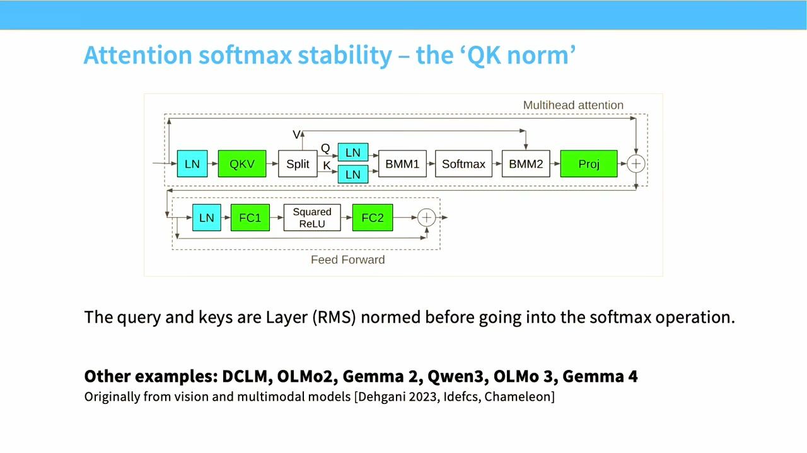
<figcaption>QK-Norm 在 Softmax 前约束查询和键的尺度，是近年来常见的注意力稳定化手段。</figcaption>
</figure>

QK-Norm 也有代价：增加归一化和内存访问，可能改变模型通过向量长度表达置信度的方式。是否值得取决于训练规模、低精度格式和已有稳定性措施。若基线从未出现注意力 logit 爆炸，加入它未必带来可见质量收益；若大规模训练频繁尖峰，它可能显著降低失败概率。

## 输出 Softmax 同样需要稳定

语言模型最后对词表 logits 做 Softmax。实践中应使用融合的 cross-entropy，而不是显式构造概率后再取对数。若权重共享使输出嵌入范数增长，logits 也会变尖。监控最大 logit、logit 范数、熵和非有限值，比只看总损失更早发现问题。

<div class="warningbox">

不要用梯度裁剪掩盖根因 梯度裁剪能限制单步爆炸，但若根因是注意力 logits、错误 mask、精度溢出或不合理初始化，裁剪只会把故障推迟。应同时记录各层激活范数、Q/K 范数、注意力熵和梯度范数，定位第一个异常层。

</div>

## 本章小结

Softmax 对尺度高度敏感。稳定减最大值是数值底线，QK-Norm 是架构层面的额外保险；是否采用应由目标规模上的稳定性证据决定。

# MHA、GQA 与 MQA：用多少键值头才划算

## 推理真正昂贵的部分：KV cache 搬运

自回归生成时，每一步只产生一个新查询，却要读取此前所有 token 的键和值。若层数为 $`L`$、上下文长度为 $`T`$、KV 头数为 $`h_{kv}`$、每头维度为 $`d_h`$、每元素字节数为 $`b_e`$，单样本 KV cache 近似为
```math
M_{KV}=2LT h_{kv}d_h b_e.
```
其中因子 2 对应键和值。查询头数不直接出现在缓存公式中，所以减少 KV 头而保留多个查询头，可以大幅降低显存与带宽。

## 三种头组织

多头注意力 MHA 让每个查询头拥有独立 K/V 头，表达最灵活；多查询注意力 MQA 让所有查询头共享一组 K/V，缓存最小；分组查询注意力 GQA 介于两者之间，每组查询头共享一组 K/V。设查询头数 $`h_q=32`$：MHA 可取 $`h_{kv}=32`$，GQA 可取 8，MQA 取 1。

<figure data-latex-placement="H">
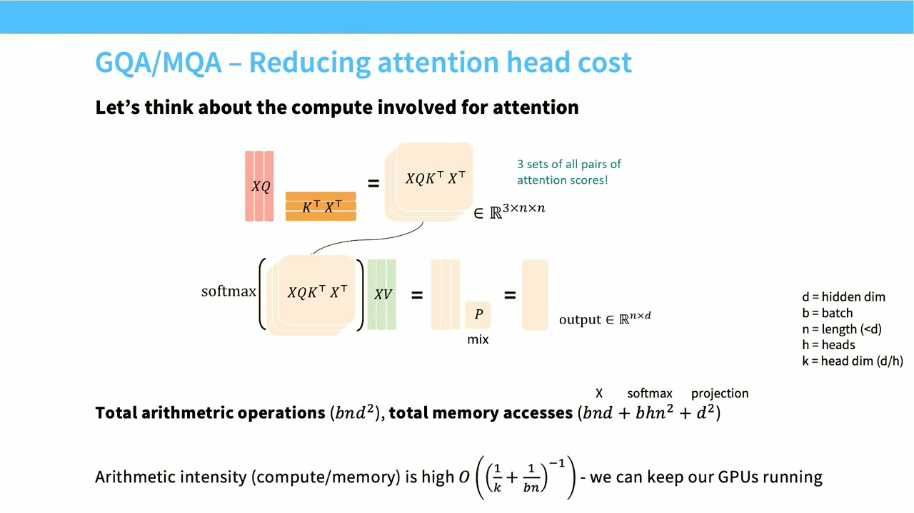
<figcaption>注意力训练计算与内存访问的分解；推理阶段减少 K/V 头主要降低缓存读取，而非取消查询头。</figcaption>
</figure>

<figure data-latex-placement="H">
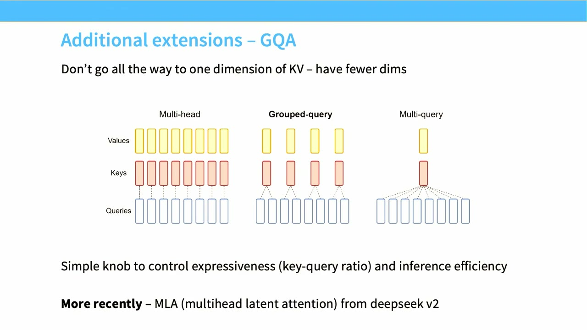
<figcaption>MHA、GQA 与 MQA 的共享关系：GQA 用可调的查询/KV 比率平衡表达能力和推理效率。</figcaption>
</figure>

## Worked example：缓存节省多少

设 $`L=32`$，$`T=8192`$，$`d_h=128`$，使用 BF16 即 $`b_e=2`$。MHA 取 $`h_{kv}=32`$ 时，缓存约为
```math
2\times32\times8192\times32\times128\times2\approx 4\ \text{GiB}.
```
GQA 取 $`h_{kv}=8`$ 时约为 1 GiB，MQA 约为 128 MiB。这里尚未计算批量、分页碎片和运行时元数据。对长上下文和大批量服务，差异会直接决定一张 GPU 能承载多少并发请求。

## 实现要点

GQA 不是简单删除头。计算注意力前，可逻辑上把每个 KV 头广播给一组查询头，但不要真的复制缓存。高效 kernel 应接受 $`h_q\neq h_{kv}`$ 的布局。训练检查包括张量形状、因果 mask、RoPE 在 Q/K 上的广播方式，以及张量并行切分后每卡 KV 头是否为整数。

## 本章小结

GQA 用少量表达自由换取显著 KV cache 节省，是现代推理友好模型的强默认值。选择 KV 头数时应以目标上下文和并发量计算缓存，而不是只看参数量。

# 局部、稀疏与交错注意力：长上下文不必每层全连接

## 全注意力的代价

长度为 $`T`$ 的全注意力需要构造或隐式处理 $`T\times T`$ 关系，计算复杂度随 $`T^2`$ 增长。滑动窗口注意力让每个 token 只读取最近 $`w`$ 个位置，复杂度约为 $`O(Tw)`$。当 $`w\ll T`$ 时，长上下文训练和推理大幅便宜。

局部注意力的问题是信息传播速度。若每层窗口宽度为 $`w`$，远距离 token 需要经过多层接力才能相互影响。纯局部网络可能在长程检索和跨段一致性上受损。

## 交错全局层与局部层

一个实用折中是大多数层使用滑动窗口，每隔若干层插入一次全注意力。局部层高效处理邻近依赖，全局层负责跨段路由。若每 4 层有 1 层全注意力，理论关系计算量约从每层 $`T^2`$ 降到 $`\frac14T^2+\frac34Tw`$，同时任意位置能周期性直接通信。

<figure data-latex-placement="H">
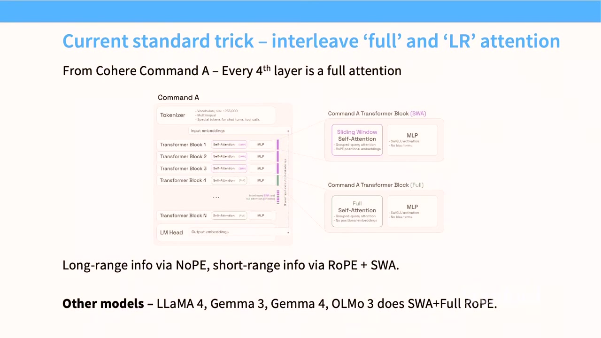
<figcaption>交错滑动窗口与全注意力：多数层处理局部信息，周期性全局层恢复长程通信。</figcaption>
</figure>

某些方案还让局部层使用 RoPE，而全局层采用 NoPE 或不同位置策略。原因是局部窗口内相对位置明确，RoPE 很合适；全局层则希望减少长距离旋转外推的限制。不过这会产生更复杂的层间分工，必须确认训练数据确实包含需要全局检索的样本。

## 稀疏模式的工程边界

理论上稀疏不等于实际更快。若 GPU kernel 不能利用规则结构，索引开销和不连续内存访问会吞噬节省。滑动窗口、块稀疏等规则模式更容易高效实现；任意稀疏图虽然 FLOPs 少，却可能运行更慢。评估必须报告真实 token/s、端到端延迟和显存，而非只报告复杂度。

## 本章小结

局部注意力通过限制读取范围降低长上下文成本，周期性全局层补回远程通信。最终收益取决于稀疏模式是否被硬件 kernel 真正利用。

# 从零实现一套可靠基线

## 推荐的最小现代配置

对教学或中小规模预训练，可从以下组合开始：解码器式因果 Transformer；Pre-RMSNorm；无偏置线性层；SwiGLU，门控中间维度约 $`8d/3`$ 并向硬件友好倍数取整；RoPE；标准 MHA 或在面向推理时使用 GQA；串行注意力与 MLP；Dropout 依据数据重复和过拟合风险决定。

这个基线的价值不是声称最优，而是每个部件都有成熟实现、已知稳定性和广泛对照。先让训练损失、梯度和吞吐符合预期，再尝试双归一化、并行层、QK-Norm、局部注意力等变化。

## 核心伪代码

```
def block(x, cache=None):
    z = rmsnorm(x)
    q = q_proj(z).view(B, T, n_q_heads, head_dim)
    k = k_proj(z).view(B, T, n_kv_heads, head_dim)
    v = v_proj(z).view(B, T, n_kv_heads, head_dim)
    q, k = apply_rope(q, k, positions)
    a = causal_attention(q, k, v, cache=cache)
    x = x + o_proj(a)

    z = rmsnorm(x)
    gate = silu(gate_proj(z))
    value = up_proj(z)
    x = x + down_proj(gate * value)
    return x
```

实现中最易出错的是维度与广播：RoPE 配对维度必须一致；GQA 的查询头分组必须映射到正确 KV 头；因果 mask 在缓存模式下的绝对位置要正确；门控与内容投影宽度必须相同。

## 测试清单

第一层是单元测试：张量形状、有限值、因果性、缓存与无缓存结果一致。第二层是数值对照：用极小模型与可信实现比较前向、损失和梯度。第三层是过拟合测试：让模型在一个小批量上把损失降到很低，确认数据、mask 和优化器能工作。第四层是缩放测试：逐步增加序列、批量和层数，观察吞吐、显存、梯度范数和注意力熵。

<div class="importantbox">

先正确，再稳定，再快 任何加速修改都应遵循：建立基线结果和性能；只改一个局部；验证输出与梯度；运行短训练确认学习曲线；最后在目标形状上测吞吐和显存。一次同时换归一化、激活、注意力 kernel 和优化器，会让回归无法定位。

</div>

## 本章小结

可靠基线应优先选择成熟、稳定、可对照的部件。测试从形状与因果性开始，逐步扩展到学习曲线和系统性能。

# 架构决策的实验框架

## 明确目标函数

训练研究可能最关心固定 FLOPs 下验证损失；部署研究可能最关心固定延迟下吞吐；端侧模型可能受峰值内存与能耗限制。不同目标会产生不同最优架构。应把质量和成本写成联合目标，例如在验证损失不恶化超过阈值的前提下最小化每 token 延迟，而不是笼统追求“更好”。

## 建立三类对照

等参数对照回答“相同存储容量下谁更好”；等 FLOPs 对照回答“相同理论计算下谁更好”；等墙钟对照回答“相同真实训练时间下谁更好”。门控激活、稀疏注意力和归一化优化尤其容易让三种结论不同。最完整的报告应至少给出两种预算视角。

## 监控能解释失败的指标

除训练/验证损失外，记录各层激活 RMS、Q/K 范数、注意力熵、残差与支路范数比、梯度全局范数、更新/参数范数比、非有限值计数、每类 kernel 时间和显存带宽。出现训练尖峰时，这些信号能判断是 Softmax 尺度、残差写入、优化器状态还是数据异常。

## 一个小型消融计划

假设基线是 Pre-RMSNorm + SwiGLU + RoPE + MHA。第一轮只比较 LayerNorm/RMSNorm，并保持其他配置不变；第二轮在等参数条件下比较 GeLU/SwiGLU；第三轮比较 MHA 与不同 $`h_{kv}`$ 的 GQA，并加入推理缓存测量；第四轮只在出现注意力尖峰时测试 QK-Norm；第五轮在目标长上下文上比较全注意力与交错窗口。每轮至少复现基线，避免机器或数据版本变化被误判为架构收益。

<div class="warningbox">

小模型排序可能翻转 某些设计的优势只在深层、低精度、长上下文或高并发下出现。小模型适合排除明显错误并缩小搜索空间，不能自动替代目标规模验证。课程中的经验趋势应被当作先验，而不是最终认证。

</div>

## 本章小结

架构实验必须同时约束预算、版本和随机性，并采集能够解释机制的中间指标。只有质量与系统指标共同成立，改进才具备实际价值。

# 常见误区与边界条件

## 误区一：最新部件一定更好

新设计常针对特定规模或硬件提出。QK-Norm 主要缓解大规模稳定性，GQA 主要降低推理缓存，局部注意力主要服务长序列。如果训练很小、上下文很短、只做离线评估，复杂度可能大于收益。

## 误区二：参数相同就代表公平

参数相同的模型可能 FLOPs、激活内存和并行效率完全不同。反过来，FLOPs 相同也可能因数据搬运差异导致墙钟时间不同。公平性必须与研究问题一致，并明确报告比较口径。

## 误区三：论文公式就是高效实现

并行层、稀疏注意力和 GQA 都需要匹配的 kernel。若框架内部产生复制、转置或无法融合的中间张量，理论优势会消失。用 profiler 检查真实 kernel 和内存流量，是架构研究的一部分。

## 误区四：训练稳定就说明质量最好

Pre-Norm 和强归一化可以让训练更稳，但过强约束也可能限制信号幅度。稳定性是必要条件，不是最终质量保证。需要在相同预算上比较验证损失和下游能力。

## 误区五：一个平均基准足够

架构改变可能影响长程检索、短文本建模、代码、数学或推理速度中的某一项。平均分会掩盖退化。应选择能映射到设计目标的分项评估，并报告置信区间。

## 本章小结

架构收益总有适用条件。把“解决什么问题、增加什么成本、在哪个规模验证”写清楚，才能避免把局部经验误当普遍定律。

# 总结与延伸

## 把整讲压缩成一条因果链

现代语言模型架构的主线可以概括为：用残差流保存跨层信息，用 Pre-Norm 或非残差归一化保证深层优化；用 RMSNorm 和去偏置减少状态与数据搬运；用 SwiGLU 提高通道选择性，并按等预算缩小中间宽度；用 RoPE 把相对位置写入查询–键内积；用 GQA 减少推理 KV cache；用局部与全局注意力交错控制长上下文成本；最后让深宽比和各种维度匹配真实硬件。

## 一张实践决策表

<div class="center">

| 目标           | 优先候选                    | 必须验证的代价                 |
|:---------------|:----------------------------|:-------------------------------|
| 深层训练稳定   | Pre-RMSNorm，必要时 QK-Norm | 是否限制表达；额外归一化时间   |
| 通道表达能力   | SwiGLU / GeGLU              | 等参数宽度；激活显存与 kernel  |
| 相对位置建模   | RoPE                        | 超长外推；频率与旋转通道比例   |
| 降低推理内存   | GQA，极端场景 MQA           | 质量损失；KV 头并行切分        |
| 降低长序列成本 | 滑动窗口与周期性全注意力    | 长程检索；稀疏 kernel 实际速度 |
| 提高训练吞吐   | 并行注意力/MLP、算子融合    | 层内依赖损失；临时张量峰值     |

</div>

## 给初学者的最终建议

如果只记住一个配置，可以从 Pre-RMSNorm、SwiGLU、RoPE、无偏置、串行块和标准 MHA 开始。先完成正确性测试并让小模型稳定过拟合一个批次；再根据部署需要把 MHA 换成 GQA，根据稳定性证据加入 QK-Norm，根据上下文长度引入滑动窗口。不要在训练尚未可信时同时追求所有新技巧。

如果只记住一种研究方法，就记住“基线–窄改动–数值验证–短训练回归–目标形状基准”。架构设计不是收集流行名词，而是管理信息路径、优化动力学和硬件成本之间的权衡。

## 可继续思考的问题

第一，归一化是否能进一步与残差缩放、初始化和优化器联合设计，从而在更深网络中减少训练尖峰？第二，RoPE 与局部/全局混合怎样共同决定超长上下文外推？第三，GQA 之后，潜变量注意力能否继续压缩 KV cache 而不损害召回？第四，架构搜索能否把真实 kernel 时间、通信和能耗直接纳入目标，而不再用 FLOPs 代替系统成本？这些问题连接了后续关于注意力替代、并行训练和推理系统的课程。

## 本章小结

一套好架构不只是验证损失低，也应训练稳定、实现清晰、硬件高效并能在目标上下文与部署负载上工作。理解机制之后，默认值才是可迁移的起点，而不是不可质疑的答案。
