<div class="titlepage">

**CS336 第4讲：注意力替代方案与混合专家**


<div class="tcolorbox">

**原课程：**Stanford CS336 Language Modeling from Scratch, Spring 2026\
**讲次：**Lecture 4: Attention Alternatives\
**主讲：**Stanford CS336 课程团队\
**原视频：**[`youtube.com/watch?v=cKSwj_qZ8Jg`](https://www.youtube.com/watch?v=cKSwj_qZ8Jg)\
**阅读方式：**本笔记将课程讲解重组为可独立阅读的教材，图示用于解释机制、比较和工程取舍。

</div>

</div>

# 先回答一个问题：为什么还要寻找注意力的替代方案

标准因果自注意力对长度为 $`L`$ 的序列需要构造 $`L\times L`$ 的依赖关系。对第 $`t`$ 个位置，查询向量 $`q_t`$ 要和所有历史键 $`k_1,\ldots,k_t`$ 做点积，再把值向量加权求和。将隐藏维度记为 $`d`$，粗略计算量为 $`\mathcal O(L^2d)`$，显存中的注意力矩阵也随 $`L^2`$ 增长。短上下文时，这种全连接关系换来了很强的内容寻址能力；长上下文或逐 token 解码时，二次项和 KV 缓存却会成为主导成本。

<figure data-latex-placement="H">
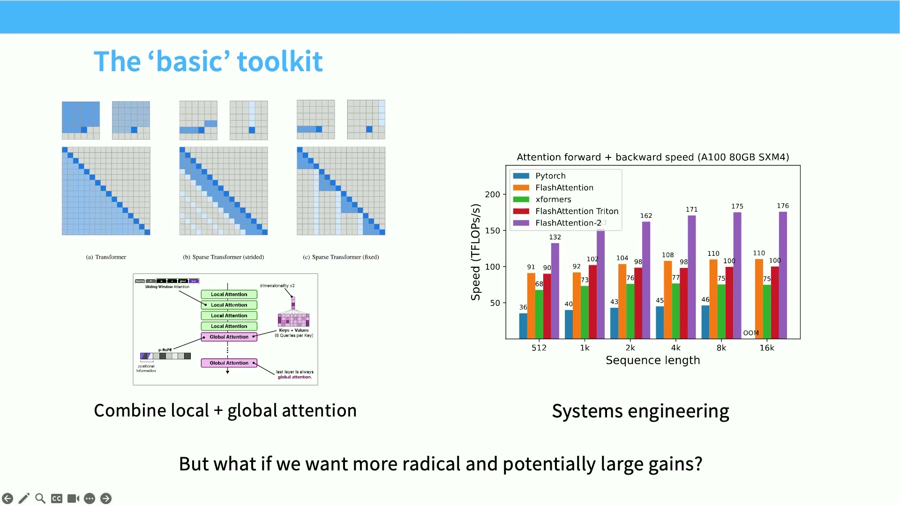
<figcaption>基础工具图示：局部与全局注意力、系统工程和线性注意力共同构成替代方案的出发点。</figcaption>
</figure>

课程的关键不是宣布“注意力已经过时”，而是把问题拆成三个可验证的假设：第一，任务是否真的需要每个查询访问全部历史；第二，历史信息能否压缩为固定大小的状态；第三，牺牲部分精确寻址后，吞吐和长上下文收益是否值得。替代方案的评价必须同时看质量、训练并行性、解码吞吐、内存占用和实现复杂度。

<div class="knowledgebox">

本讲的路线图 先从核分解得到线性注意力，再把它改写成递推状态，接着讨论 Mamba-2 与 gated delta net 等混合结构；随后转向稀疏注意力和 DeepSeek Sparse Attention；最后用 MoE 说明“每个 token 只激活一部分参数”如何把稀疏性扩展到模型宽度，并讨论路由、负载均衡、并行、稳定性和微调。

</div>

## 本章小结

注意力替代方案不是单一新层，而是围绕“全历史访问是否必要”进行的设计空间探索。后续所有公式都应回到同一判断：减少计算的同时，保留了什么信息，丢掉了什么能力，以及系统代价落在了哪里。

# 从 softmax 注意力到线性注意力

## 核化的想法

标准注意力可写作
```math
\begin{equation}
\operatorname{Attn}(Q,K,V)=\operatorname{softmax}\!\left(\frac{QK^\top}{\sqrt d}\right)V,
\end{equation}
```
其中 $`Q\in\mathbb R^{L\times d}`$ 是查询矩阵，$`K\in\mathbb R^{L\times d}`$ 是键矩阵，$`V\in\mathbb R^{L\times d_v}`$ 是值矩阵，$`d`$ 是键的维度。二次复杂度来自 $`QK^\top`$：它显式产生所有查询和历史键之间的配对分数。

线性注意力先寻找一个特征映射 $`\phi(\cdot)`$，使相似度近似为 $`\phi(q)^\top\phi(k)`$。忽略归一化项时，第 $`t`$ 个位置可以写成
```math
\begin{equation}
y_t=\phi(q_t)^\top\sum_{i\le t}\phi(k_i)v_i^\top.
\end{equation}
```
令状态矩阵 $`S_t=\sum_{i\le t}\phi(k_i)v_i^\top`$，则
```math
\begin{equation}
S_t=S_{t-1}+\phi(k_t)v_t^\top,\qquad y_t=\phi(q_t)^\top S_t.
\end{equation}
```
关键交换了求和顺序：先累积键和值形成固定大小的状态，再用查询读取状态。若特征维度 $`r`$ 固定，序列计算量约为 $`\mathcal O(Lrd_v)`$，对 $`L`$ 呈线性增长。

<figure data-latex-placement="H">
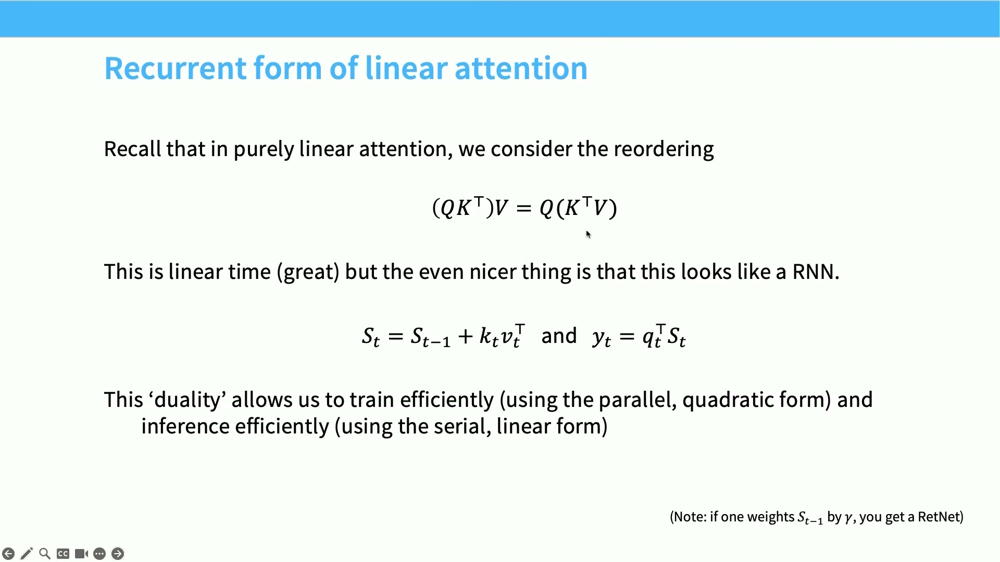
<figcaption>递推形式的线性注意力：用一个状态矩阵保存历史键值的累积，而不是显式保存全部两两分数。</figcaption>
</figure>

## 归一化并非可有可无

真实实现常加入分母，避免不同历史长度导致输出幅值不断变大：
```math
\begin{equation}
y_t=\frac{\phi(q_t)^\top S_t}{\phi(q_t)^\top z_t+\varepsilon},\qquad z_t=z_{t-1}+\phi(k_t).
\end{equation}
```
$`z_t`$ 是键特征的累计向量，$`\varepsilon`$ 是数值稳定项。分母使输出更接近加权平均，但也引入了状态额外的更新和可能的数值问题。选择 $`\phi`$ 时要考虑是否为正、近似误差和硬件友好性；“线性”只描述序列长度复杂度，不保证质量自动等价。

<div class="importantbox">

一个小例子 假设 $`\phi(k_i),v_i`$ 都是一维标量，前三个位置的键特征和值分别为 $`(1,2),(2,1),(1,3)`$。则 $`S_1=2`$，$`S_2=4`$，$`S_3=7`$。第 3 个查询只需计算 $`\phi(q_3)S_3`$，无需重新访问前三个键的两两分数。这解释了线性解码为何能把历史访问压缩成常数大小的递推状态。

</div>

## 本章小结

线性注意力的核心是核特征与结合律：把“先算所有分数再加权”改成“先聚合历史，再查询状态”。收益是线性长度复杂度和小状态；代价是核近似、归一化和精确内容寻址能力的改变。

# 递推视角：线性注意力为什么像 RNN

<figure data-latex-placement="H">
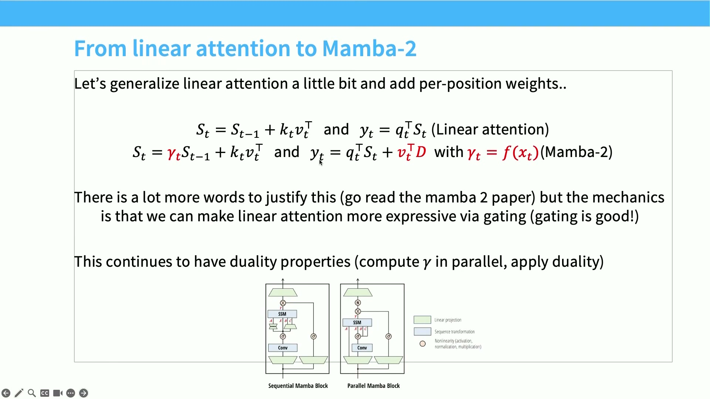
<figcaption>线性注意力的递推形式显式呈现了 RNN 式状态：状态随 token 更新，查询从状态中读取信息。</figcaption>
</figure>

把 $`S_t`$ 看成循环状态，就得到
```math
\begin{equation}
S_t=S_{t-1}+\phi(k_t)v_t^\top,\qquad y_t=\phi(q_t)^\top S_t.
\end{equation}
```
训练时仍可把所有时间步并行化：使用前缀扫描（prefix scan）或分块算法批量计算状态；推理时则天然是一条单步更新路径。这里出现一个重要的系统折衷：训练希望并行处理整段序列，解码希望每一步只维护一个小状态。一个好的实现要让两种模式共享数值语义。

## 状态容量与遗忘

状态矩阵大小由 $`r\times d_v`$ 决定，与 $`L`$ 无关，但这也意味着所有历史必须挤进有限容量。对话中很早出现的事实可能被后续更新覆盖，尤其当键特征相似、状态没有门控或任务需要精确复制长文本时。可以引入衰减门 $`\gamma_t`$：
```math
\begin{equation}
S_t=\gamma_tS_{t-1}+\phi(k_t)v_t^\top,\qquad 0\le\gamma_t\le1.
\end{equation}
```
当 $`\gamma_t`$ 较小，系统快速遗忘、状态稳定；当 $`\gamma_t`$ 接近 1，长期信息保留更多但旧内容之间会发生干扰。门控应由输入决定，而不能假设一个常数对所有语料都合适。

<div class="warningbox">

不要把“线性复杂度”误解为“无限记忆” 复杂度不随长度增长，表示每一步维护的状态大小固定；它并不表示状态能无损保存无限历史。评测长上下文时应加入检索、复制、跨段推理和干扰实验，而不只是看平均困惑度。

</div>

## 本章小结

递推形式把算法和系统连接起来：训练阶段需要可并行扫描，解码阶段需要小而稳定的状态。有限状态带来速度，也带来记忆容量和遗忘边界；这正是后续门控与差分更新要解决的问题。

# 从线性注意力到 Mamba-2

<figure data-latex-placement="H">

<figcaption>从线性注意力到 Mamba-2：保留状态递推，同时加入位置相关权重，使每一步更新更有选择性。</figcaption>
</figure>

Mamba-2 可以用状态空间模型（SSM）的离散形式理解。连续时间模型通常写成
```math
\begin{equation}
\frac{d h(t)}{dt}=Ah(t)+Bx(t),\qquad y(t)=Ch(t)+Dx(t),
\end{equation}
```
其中 $`h(t)`$ 是隐藏状态，$`x(t)`$ 是输入，$`A`$ 控制状态自身的演化，$`B`$ 把输入写入状态，$`C`$ 从状态读出，$`D`$ 是直通项。离散化后得到
```math
\begin{equation}
h_t=\bar A_t h_{t-1}+\bar B_t x_t,\qquad y_t=C_t h_t+D_tx_t.
\end{equation}
```
与简单线性注意力相比，$`\bar A_t,\bar B_t,C_t`$ 可以随位置或内容变化，因此模型能够学习“保留什么、写入什么、何时读取”。

## 为什么 Mamba-2 适合硬件

递推可以转成选择性扫描：把一段序列切成块，每个块计算局部变换，再组合块的起始状态和转移算子。这样既保留了循环语义，又避免 Python 层逐 token 循环。训练时，扫描内核可以利用 GPU 的并行度；解码时只需把最后状态传给下一步。

<figure data-latex-placement="H">
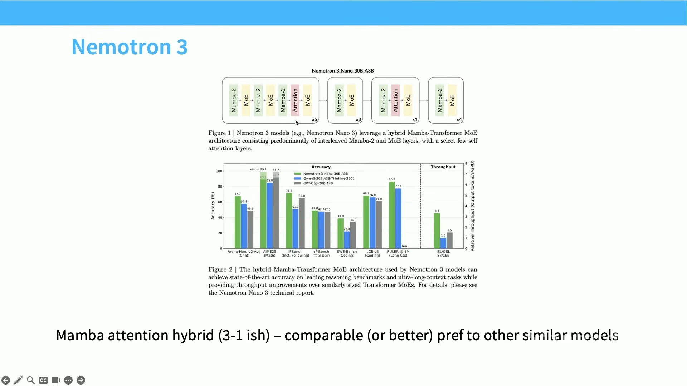
<figcaption>Nemotron-3 的混合结构示例：Mamba-2 层与注意力层交替，使线性状态更新与精确内容寻址互补。</figcaption>
</figure>

课程强调混合而非替代：Mamba-2 在长序列吞吐和内存方面有优势，但某些需要精确检索的任务仍依赖注意力。Nemotron-3 等模型把两者按层或按块组合；设计问题变成“多少层使用哪种模块、如何保持表示接口一致、怎样公平比较计算量”。

<div class="knowledgebox">

读图方法 看到“混合架构”图时先看三件事：一是每种层的输入输出维度是否一致；二是注意力层是否只占少数但承担检索功能；三是实验是否报告了相同激活参数、训练 token、上下文长度和推理硬件。只看最终准确率无法判断收益来自结构还是预算变化。

</div>

## 本章小结

Mamba-2 把选择性状态空间递推做成可并行扫描的硬件友好算子。它不是简单删除注意力，而是用门控状态承担大部分顺序建模，再保留少量注意力层弥补精确寻址。

# Gated Delta Net：让状态主动纠错

<figure data-latex-placement="H">
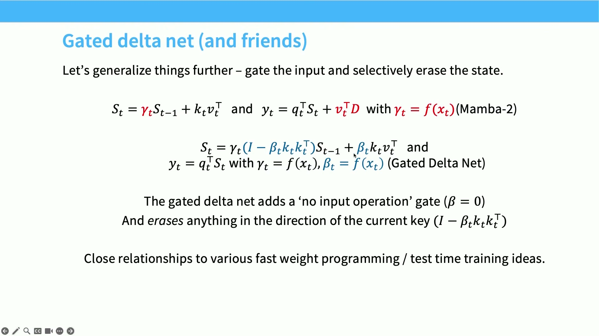
<figcaption>Gated delta net：输入可以写入状态，同时通过差分项选择性擦除旧状态。</figcaption>
</figure>

线性注意力的加法更新会把新信息不断叠加到状态。Gated delta net 在此基础上加入“预测误差驱动”的差分更新。一个抽象写法是
```math
\begin{align}
\tilde v_t&=v_t-W_t^\top S_{t-1},\\
S_t&=\gamma_tS_{t-1}+\beta_t\,\phi(k_t)\tilde v_t^\top,\\
y_t&=\phi(q_t)^\top S_t.
\end{align}
```
其中 $`W_t^\top S_{t-1}`$ 表示状态对当前键的已有预测，$`\tilde v_t`$ 是需要补上的误差；$`\beta_t`$ 控制写入强度，$`\gamma_t`$ 控制旧状态保留。若旧状态已经能解释当前值，误差小，更新自然变弱；若预测错了，则差分项会纠正相关方向。

## 与 Mamba-2 的关系

Mamba-2 更像对状态进行受控的线性转移；gated delta net 还显式比较“状态已经知道什么”和“当前 token 要表达什么”。因此它具有快速写入、选择性擦除和更强的在线记忆味道。两者都可以用扫描实现，区别在于更新算子是否包含内容相关的误差修正。

## 一个数值直觉

设某个键方向上的旧状态预测为 $`0.8`$，真实值为 $`1.0`$，则误差为 $`0.2`$；若 $`\beta_t=0.5`$，只写入一半误差。下一次遇到同一方向时，预测更接近真实值。相反，如果完全采用 $`S_t=S_{t-1}+kv^\top`$，旧错误不会被显式扣除，可能长期污染状态。

<div class="warningbox">

实现边界 差分更新需要稳定地计算状态读出、误差和门控。混合精度下，状态累积最好使用更高精度或分块重标定；否则长序列中微小误差会积累，最终表现为状态爆炸、消失或输出分布漂移。

</div>

## 本章小结

gated delta net 将“记忆”变成“预测—比较—纠正”的在线过程。它比纯累加更有选择性，但需要额外的读出和数值稳定设计；其价值应通过长程记忆、干扰和解码吞吐实验共同检验。

# Qwen 混合架构与经验比较

<figure data-latex-placement="H">
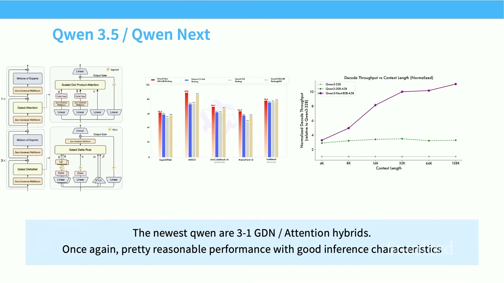
<figcaption>Qwen 3.5/Qwen Next 的结构与吞吐比较：随着上下文变长，线性状态层的解码优势更加明显。</figcaption>
</figure>

混合模型常将线性状态模块用于大多数层，把注意力放在较少的层中。这样做有三个直接效果：第一，decode 时不必为每个线性层保存同规模 KV；第二，长上下文的历史处理更多转化为固定状态读写；第三，注意力层仍可提供精确的跨位置交互。

<figure data-latex-placement="H">
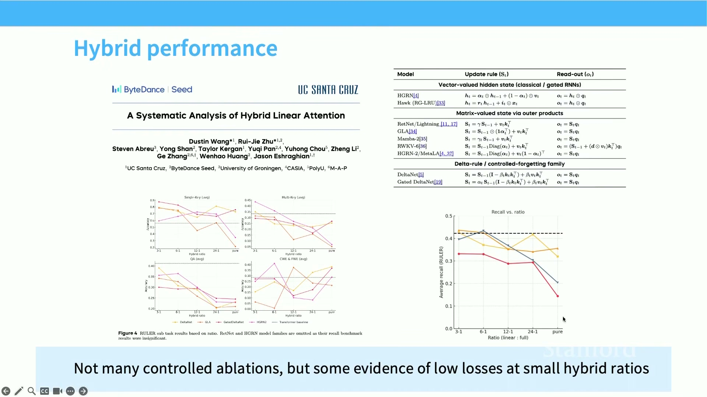
<figcaption>混合模型的实验结果：不同线性层比例会改变损失、吞吐与长上下文表现，必须结合控制变量解读。</figcaption>
</figure>

图中的趋势不能简单概括为“线性层越多越好”。当注意力比例过低，模型可能失去复制和精确检索能力；当注意力比例过高，系统又回到 KV 和二次注意力的瓶颈。合理的比较应固定训练 token、激活参数、总 FLOPs、上下文长度和并行策略，并分别报告 prefill、decode、峰值显存和质量。

<div class="importantbox">

可复现实验表 建议每个方案至少记录：线性层占比、注意力层间隔、状态大小、训练/推理 FLOPs、每 token 显存读写、长上下文检索准确率、标准困惑度、首 token 延迟和持续 token 吞吐。只有这些列同时出现，读者才知道速度收益是否以能力退化换来。

</div>

## 本章小结

Qwen 等混合架构说明替代注意力可以进入主流模型，但工程结论依赖比例和任务。线性模块最适合降低长上下文和解码成本，注意力模块负责高精度内容交互；两者的组合需要用完整预算和多指标评估。

# 稀疏注意力：不看全部 token

<figure data-latex-placement="H">
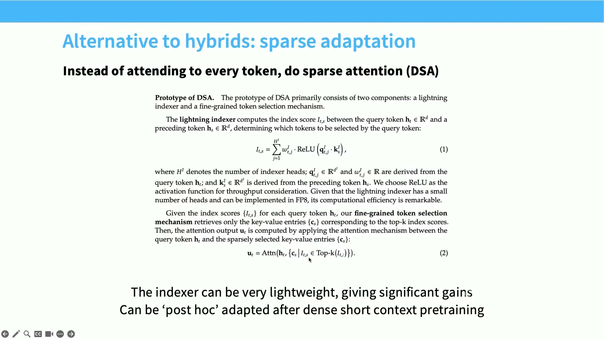
<figcaption>稀疏适配的核心：不访问全部历史 token，而是由轻量索引器选择少量位置。</figcaption>
</figure>

线性状态压缩了历史，另一条路线是保留原始 token，但只让查询访问其中一部分。设索引器为 $`g(q_t,k_i)`$，先选出索引集合 $`I_t`$，再在集合内做注意力：
```math
\begin{equation}
I_t=\operatorname{TopK}_{i\le t}\bigl(g(q_t,k_i)\bigr),\qquad
y_t=\operatorname{Attn}\bigl(q_t,K_{I_t},V_{I_t}\bigr).
\end{equation}
```
若 $`K\ll L`$，主注意力成本由 $`L^2`$ 降为约 $`LK`$，但索引器本身仍需高效，否则筛选成本会吞掉收益。

## DSA 的两阶段计算

DeepSeek Sparse Attention（DSA）一类方法把计算拆为轻量 indexing 与精确 attention。索引器可以使用较小的投影、低维键或低成本卷积，产生每个查询对历史位置的分数；然后只对 Top-$`K`$ 位置读取完整 KV 并执行原始注意力。这样保留了内容寻址能力，同时减少了大矩阵操作和 KV 读流量。

<div class="knowledgebox">

为什么可以“后置适配” 若索引器主要学习如何从已有隐藏表示中挑选位置，而不改变主干表示的全部语义，就可能先用密集短上下文预训练，再在较小成本下训练索引器和稀疏掩码。这种 post-hoc 适配不能保证所有任务无损：它依赖索引器能可靠找回关键位置，也依赖训练和推理时的上下文分布一致。

</div>

## 稀疏性与质量的旋钮

$`K`$ 是最直观的质量—速度旋钮。$`K`$ 太小会漏掉支持答案的关键 token；$`K`$ 太大则接近密集注意力。更稳健的系统可让 $`K`$ 随查询难度、上下文长度或预算动态变化，但动态预算会增加批处理和负载均衡难度。评测时应画出 $`K`$ 与检索准确率、困惑度、吞吐、显存之间的曲线，而不是只报告一个点。

## 本章小结

稀疏注意力保留显式 token 访问，却把全连接访问改为“先索引、后精算”。它的瓶颈从二次矩阵变成索引器质量、Top-$`K`$ 选择和不规则内存访问；成功的关键是让索引器足够便宜且不漏掉关键证据。

# DSA 结果如何解读

<figure data-latex-placement="H">
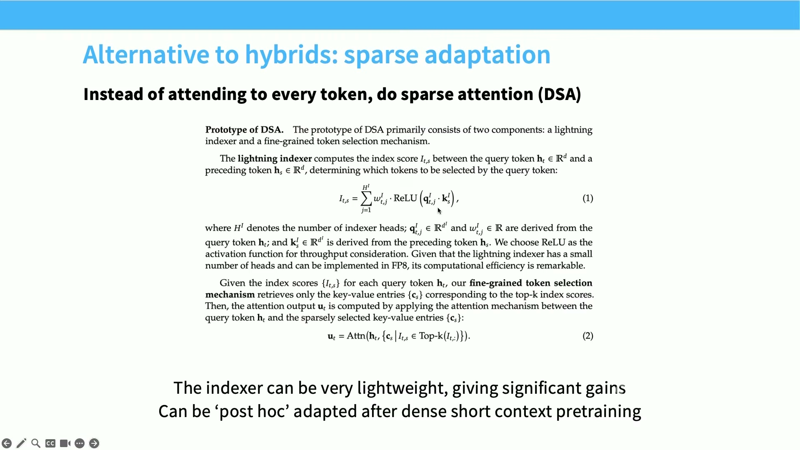
<figcaption>DSA 机制与长上下文成本的示意：索引器决定哪些历史位置进入精确注意力。</figcaption>
</figure>

DSA 的收益通常在长上下文 decode 中最明显，因为每个新 token 不必扫描全部历史 KV。若上下文长度为 $`L`$、选取 $`K`$ 个位置，理想读流量从 $`O(L)`$ 降到 $`O(K)`$；实际还要加上索引器读取、Top-$`K`$ 排序和内存访问不连续的开销。因此端到端加速低于理论比例是正常现象。

<figure data-latex-placement="H">
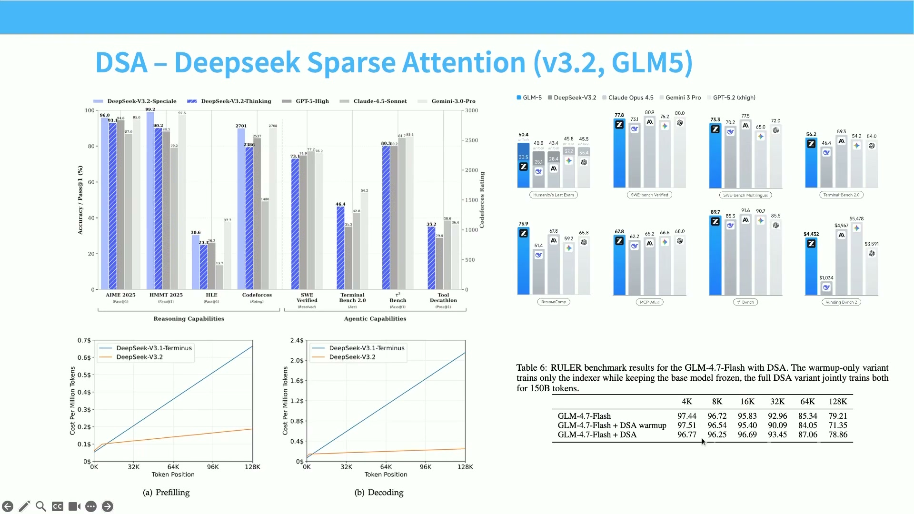
<figcaption>DSA 的任务和长上下文结果：稀疏注意力在多个基准上保持较好的质量，并降低随上下文增长的成本。</figcaption>
</figure>

阅读这类图表要先核对基线：是否使用同一模型和参数、是否同一上下文长度、是否把索引器开销计入、是否只测单请求以及是否使用相同 batch。长上下文曲线中，密集注意力成本常随长度快速上升，而稀疏版本更平缓；但在短上下文和高批量场景，固定索引器开销可能让收益变小。

<div class="warningbox">

不要只看平均吞吐 稀疏访问会造成不同请求选取不同数量或不同位置，GPU 负载可能不均衡。必须同时报告 P50/P95 延迟、显存峰值、索引命中率、漏检率和不同 batch 形状下的结果；否则平均值会掩盖尾部请求。

</div>

## 本章小结

DSA 展示了“少看 token”如何获得长上下文收益，但理论复杂度并不等于实际加速。判断稀疏机制时，应把索引器、排序、内存访问和质量风险全部纳入端到端测量。

# MoE：把稀疏性扩展到模型宽度

<figure data-latex-placement="H">
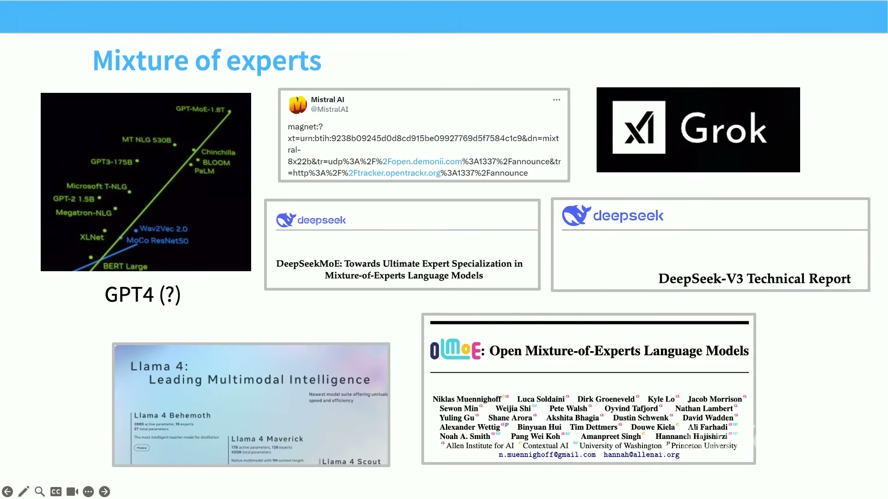
<figcaption>MoE 的基本结构：共享路由器，根据 token 选择少量专家；典型应用是替换 MLP，也可扩展到注意力头。</figcaption>
</figure>

混合专家（Mixture of Experts, MoE）包含 $`N`$ 个专家网络和一个路由器。对 token 表示 $`x_t`$，路由器给出分数 $`s_{t,i}`$，只选其中 $`K`$ 个专家：
```math
\begin{equation}
I_t=\operatorname{TopK}_{i\in\{1,\ldots,N\}}(s_{t,i}),\qquad
y_t=\sum_{i\in I_t}g_{t,i}E_i(x_t).
\end{equation}
```
$`E_i`$ 是第 $`i`$ 个专家，$`g_{t,i}`$ 是归一化门控权重。总参数量约随 $`N`$ 增长，但每个 token 的激活参数只与 $`K`$ 有关；这就是“参数更多、单 token FLOPs 近似不变”的稀疏扩展。

<figure data-latex-placement="H">
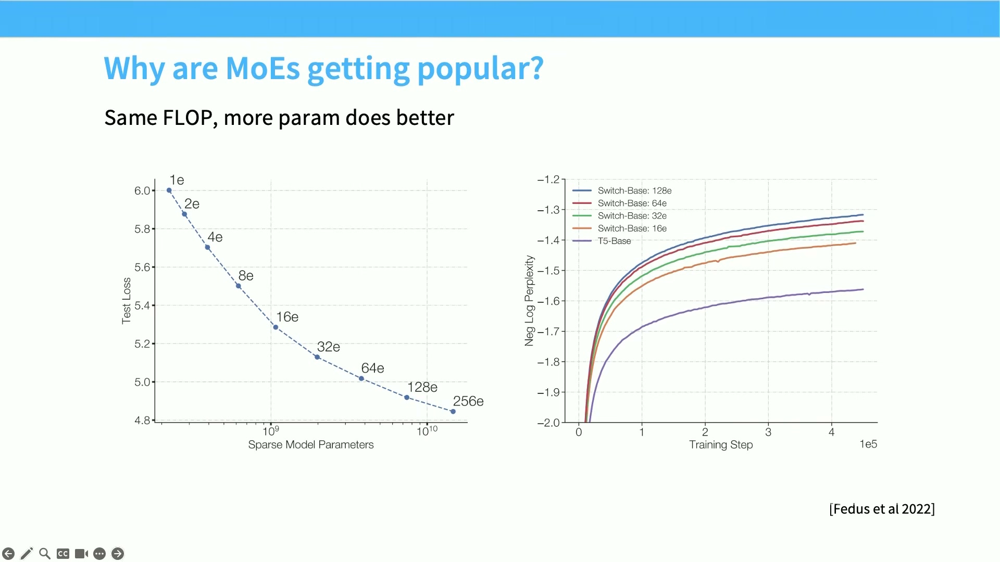
<figcaption>MoE 的缩放直觉：在相近激活计算下，更多专家可以提供更大的总容量和更好的损失曲线。</figcaption>
</figure>

与简单增大稠密 MLP 相比，MoE 把容量分散到不同专家，允许不同 token 子分布学习不同变换。路由器的选择也是一种隐式聚类：代码、数学、自然语言或不同语法模式可能被送到不同专家。但专家并不自动对应人类可解释的主题，只有在分析激活和干预后才能讨论其功能。

## 为什么 MoE 近年流行

MoE 的吸引力来自三方面。第一，在相同激活 FLOPs 下增加总参数，通常能改善表示容量；第二，服务阶段只执行少量专家，理论上能降低每 token 计算；第三，专家可以分布在多台机器上，通过 Expert Parallel 扩展模型。代价也同样明确：路由导致 all-to-all 通信，专家负载可能极不均衡，训练目标带有额外系统动力学。

<figure data-latex-placement="H">
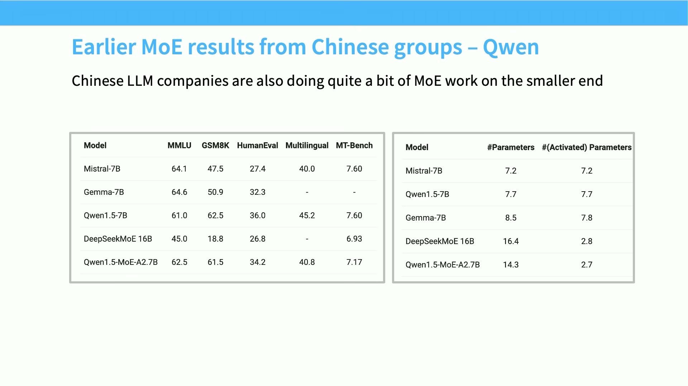
<figcaption>开放模型中的 MoE 结果与案例：MoE 已成为大型开放模型的重要扩展路径，但不同模型的激活参数和路由配方并不相同。</figcaption>
</figure>

## 本章小结

MoE 的本质是条件计算：每个 token 只激活一小部分专家，却让模型拥有更大的总容量。它把计算节省换成路由、通信和训练稳定问题；比较模型时必须区分总参数、激活参数、专家数和每 token FLOPs。

# 路由器：从分数矩阵到 Top-K

<figure data-latex-placement="H">
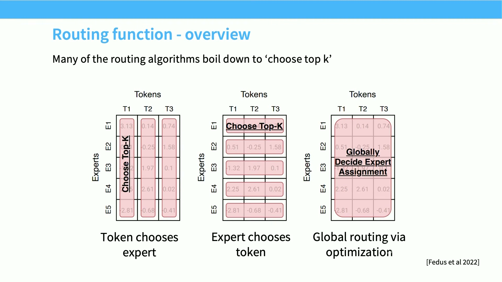
<figcaption>路由算法概览：token 选专家、专家选 token，以及全局优化三类思路各有通信与优化代价。</figcaption>
</figure>

最常见的路由器是一个线性层加 softmax：
```math
\begin{equation}
s_{t,i}=u_t^\top e_i,\qquad p_{t,i}=\operatorname{Softmax}_i(s_{t,i}),
\end{equation}
```
其中 $`u_t=W_rx_t`$ 是 token 的路由表示，$`e_i`$ 是第 $`i`$ 个专家的向量。随后选取概率最大的 $`K`$ 个专家，并对选中概率重新归一化。课程强调，路由器本身通常很朴素；困难来自离散 Top-$`K`$、容量限制和跨设备数据搬运。

<figure data-latex-placement="H">
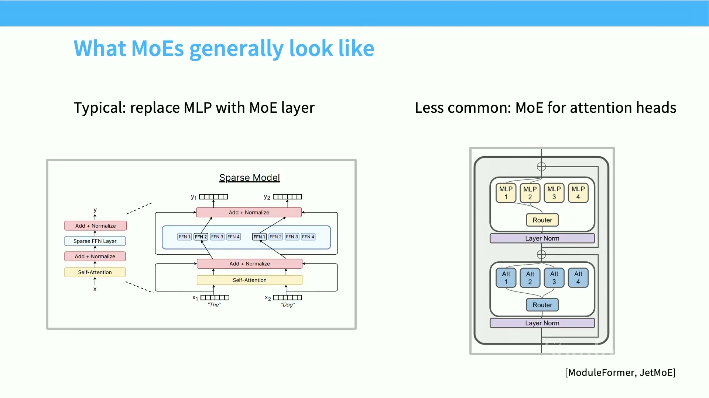
<figcaption>典型 MoE 模块与路由路径：路由器、专家 MLP 和跨设备 token 交换共同决定实际执行。</figcaption>
</figure>

假设一批有 $`T`$ 个 token、$`N`$ 个专家、每 token 选 $`K`$ 个专家，理想平均负载为 $`TK/N`$。实践中某些专家会收到远多于平均的 token，另一些专家几乎空闲。系统通常给每个专家设置 capacity，超出的 token 被丢弃、转发到次选专家或使用残差路径。capacity 太小损失信息，太大则浪费显存并降低并行效率。

<div class="importantbox">

路由伪代码

    def moe_layer(x, experts, router, k):
        scores = router(x)                 # [tokens, experts]
        probs, ids = scores.topk(k, dim=-1)
        probs = probs / probs.sum(-1, keepdim=True)
        y = zeros_like(x)
        for slot in range(k):
            chosen = ids[:, slot]
            y += dispatch_and_apply(x, chosen, experts) * probs[:, slot, None]
        return y

伪代码中的循环只是帮助理解；生产实现会把 token 按专家分桶、进行 all-to-all、批量执行专家 GEMM，再把结果还原到原 token 顺序。

</div>

## 路由策略的三种范式

Token-choice 让每个 token 选择专家，最易实现但可能造成专家拥塞；expert-choice 让每个专家选择 token，负载更易控制但一个 token 可能无人选择；全局匹配或线性分配直接优化整体分配，理论上更优但通信和求解成本更高。强化学习路由可以学习策略，但引入奖励稀疏、探索和训练稳定性问题。工程上常用的 Top-K 是质量、复杂度与硬件效率之间的折中。

## 本章小结

路由器不是“算出分数”就结束了。真正的 MoE 层还要处理 Top-K 离散选择、容量、分桶、all-to-all、专家计算和结果合并。不同路由范式的差别，本质上是把负载均衡和决策复杂度放在哪一层。

# DeepSeek 风格 MoE：共享专家与细粒度专家

<figure data-latex-placement="H">
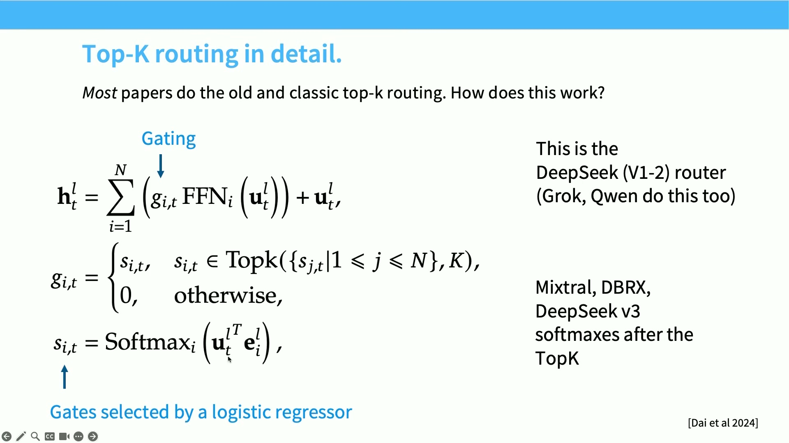
<figcaption>DeepSeek MoE 的结构思路：共享专家处理所有 token，路由专家处理 token 特有的部分，并可使用更细粒度的专家。</figcaption>
</figure>

一种重要变体是把专家分为 shared experts 与 routed experts。共享专家对每个 token 都执行，学习通用变换；路由专家只处理被选中的 token，学习更专门的残差。抽象写成
```math
\begin{equation}
y_t=E_{\mathrm{shared}}(x_t)+\sum_{i\in I_t}g_{t,i}E_i(x_t).
\end{equation}
```
共享路径减少了路由专家必须重复学习通用能力的压力，也让每个 token 始终得到一条稳定的基础计算路径。

## 细粒度专家

将一个大专家拆成多个较小专家，可以在固定激活 FLOPs 下获得更细的组合。若原来有 $`N`$ 个专家、每个专家宽度为 $`d_e`$，现在拆为 $`mN`$ 个宽度约 $`d_e/m`$ 的专家，再适当提高 Top-K，可以让 token 组合更多局部能力。拆分并非免费：专家数增多会放大路由表、通信元数据和小矩阵乘法开销。

## 为什么这种变体有用

共享专家提供稳定的通用变换，细粒度路由专家提供条件容量，两者使“总参数多、激活参数少”更容易实现。课程用 DeepSeek 相关结构说明，MoE 研究不仅是增加专家数量，也包括重新设计专家粒度、共享路径和路由偏置。比较时必须记录“每 token 激活了哪些模块”，不能只引用总参数。

<div class="knowledgebox">

阅读结构图的顺序 先沿着一个 token 的路径看它是否经过共享专家；再数 routed experts 的 Top-K；最后看专家位于同一设备还是跨设备。这样可以分别判断质量容量、激活计算和通信成本。

</div>

## 本章小结

共享专家和细粒度专家把 MoE 的条件计算做得更灵活：所有 token 得到稳定基础路径，少量路由专家提供专门化。收益必须与更多通信、元数据和小 GEMM 的系统成本一起评估。

# MoE 训练：稀疏前向只是开始

<figure data-latex-placement="H">
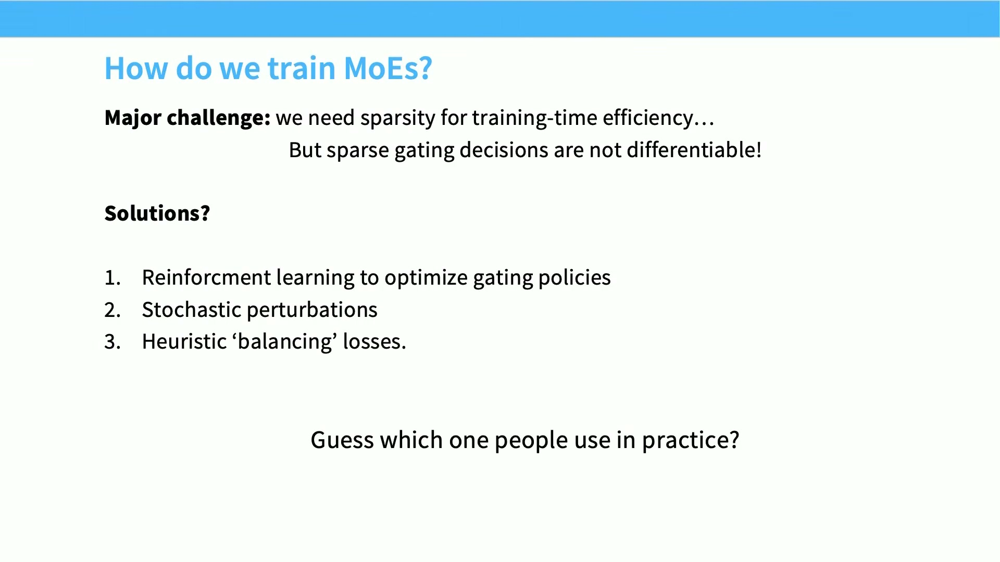
<figcaption>训练 MoE 的核心挑战：稀疏门控节省计算，却引入路由策略、随机扰动和启发式负载均衡。</figcaption>
</figure>

训练阶段主要难题是：Top-K 选择不可微或梯度信号不平滑；少数专家可能早期获得更多 token，形成富者越富；专家之间的负载不均又会导致 GPU 利用率和通信效率下降。课程给出三类解决方案：强化学习优化路由策略、随机扰动使选择更鲁棒、辅助负载均衡损失把专家使用拉回可控范围。

## 路由梯度与系统反馈

路由概率影响两个目标：模型损失希望选出有用专家，系统吞吐希望各专家均匀工作。这两个目标不总是一致。某专家可能确实更适合某类 token，强行均衡会降低质量；完全放任又会使一部分设备拥塞。因此辅助损失权重不能机械设为很大，应通过质量、容量丢弃率、通信时间和专家熵的联合曲线选择。

## 随机近似

<figure data-latex-placement="H">
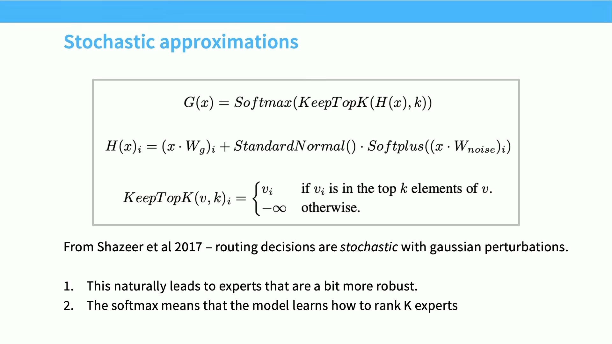
<figcaption>随机近似路由：在 logits 上加入随机扰动，再选择 Top-K，使路由器得到更平滑的排序学习信号。</figcaption>
</figure>

设路由 logits 为 $`z_t`$，加入噪声 $`\epsilon_t`$ 后选择
```math
\begin{equation}
\tilde z_t=z_t+\epsilon_t,\qquad I_t=\operatorname{TopK}(\tilde z_t).
\end{equation}
```
训练过程中，随机性让边界附近的专家有机会获得 token，减少早期锁死。噪声太大则路由不稳定，专家难以形成专长；推理时通常关闭噪声或使用确定性规则。因此要分别验证训练曲线和推理行为。

## 本章小结

MoE 的训练是一个带系统约束的离散决策问题。随机扰动、强化学习和辅助损失都在改善路由学习，但它们改变了优化动力学；必须观察专家利用率、丢 token、梯度和质量，而不只看总 loss。

# 启发式负载均衡损失

<figure data-latex-placement="H">
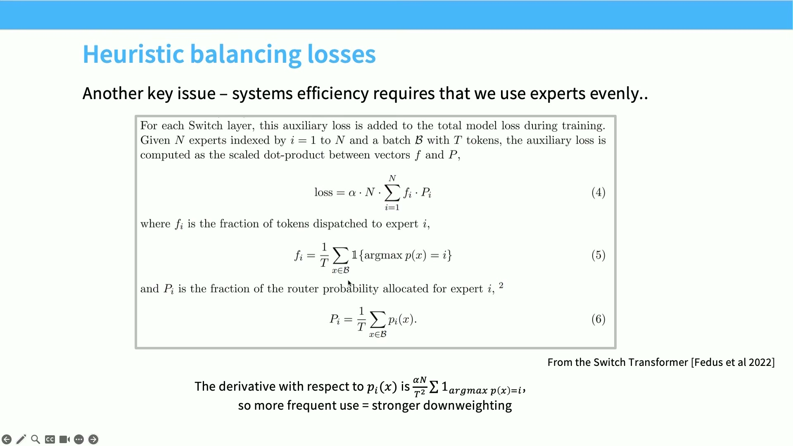
<figcaption>启发式均衡损失：通过惩罚专家重要性和实际 token 频率的不匹配，避免少数专家过载。</figcaption>
</figure>

一种常见均衡目标使用两个统计量：专家被选中的频率 $`f_i`$，以及路由概率的重要性 $`P_i`$。抽象形式为
```math
\begin{equation}
\mathcal L_{\mathrm{bal}}=\alpha N\sum_{i=1}^N f_iP_i,
\end{equation}
```
其中 $`N`$ 是专家数，$`\alpha`$ 是辅助损失权重。均匀路由时 $`f_i\approx1/N`$、$`P_i\approx1/N`$，目标保持在较低且稳定的范围；某个专家同时拥有高频率和高概率时，惩罚上升。

需要注意，具体论文的归一化和统计窗口可能不同，上式用于解释机制。实现时应明确 $`f_i`$ 是按 batch、序列还是滑动窗口统计，$`P_i`$ 是否使用 softmax 概率，以及 Top-K 截断前后采用哪一个量。

<div class="warningbox">

辅助损失不是越大越好 如果 $`\alpha`$ 过大，路由器会为了均匀而牺牲有用的专家分工；过小则无法抑制拥塞。应画出主任务损失、均衡损失、每专家 token 直方图、capacity 丢弃率和 all-to-all 时间随 $`\alpha`$ 的曲线。

</div>

## 本章小结

负载均衡损失把硬件需求变成可优化信号，但它只是代理目标。好的设置要在专家专长和设备均衡之间取得折中，并且明确统计口径和容量处理方式。

# 专家均衡与设备均衡是两件事

<figure data-latex-placement="H">
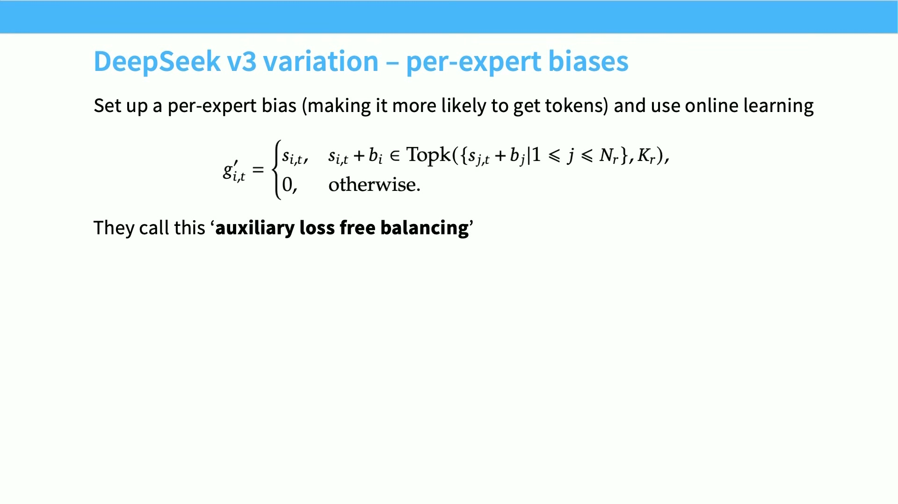
<figcaption>专家均衡之外还要做设备均衡：专家使用均匀不代表跨设备的 token 通信和计算已经均匀。</figcaption>
</figure>

假设 $`N`$ 个专家分布在 $`G`$ 台设备上，每台设备放 $`N/G`$ 个专家。即使全局每个专家收到相同 token 数，也可能出现某一设备上的多个专家同时被选中，导致该设备接收过多 token 和 all-to-all 流量。因此需要同时考虑：
```math
\begin{equation}
\mathcal L=\mathcal L_{\mathrm{task}}+\alpha\mathcal L_{\mathrm{expert}}+\beta\mathcal L_{\mathrm{device}}.
\end{equation}
```
$`\mathcal L_{\mathrm{expert}}`$ 约束专家级频率，$`\mathcal L_{\mathrm{device}}`$ 约束设备级聚合负载。$`\alpha,\beta`$ 需要依据拓扑、专家布局和通信带宽标定。

## 设备放置的工程例子

若 8 台 GPU 各放 4 个专家，某 batch 的 token 恰好集中选择 GPU 0 上的四个专家，则专家级统计可能看起来均匀，但 GPU 0 的显存、专家 GEMM 和接收队列会先达到容量。可以通过设备级偏置、容量预留、token 重排或重新放置专家来缓解。

<figure data-latex-placement="H">
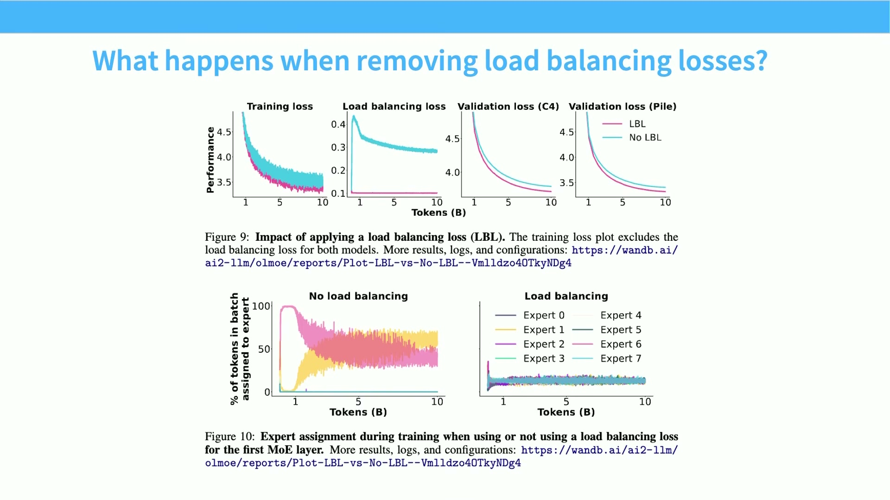
<figcaption>去除均衡损失的消融：训练 loss、验证 loss 与专家激活分布会明显变化，显示系统效率与优化稳定性的耦合。</figcaption>
</figure>

消融实验的正确读法是看多条曲线：去掉均衡后，主损失可能短期下降，也可能因 token 丢弃而恶化；即使质量相近，专家分布和通信尾延迟也可能变差。最终选择应由目标服务场景决定，而不是只看一个验证点。

## 本章小结

专家均衡解决“哪些专家被用”，设备均衡解决“哪些 GPU 在忙”。两者必须分别监控、分别建模，否则全局均匀的统计可能掩盖设备热点。

# Expert Parallel：让稀疏专家跨 GPU 工作

<figure data-latex-placement="H">
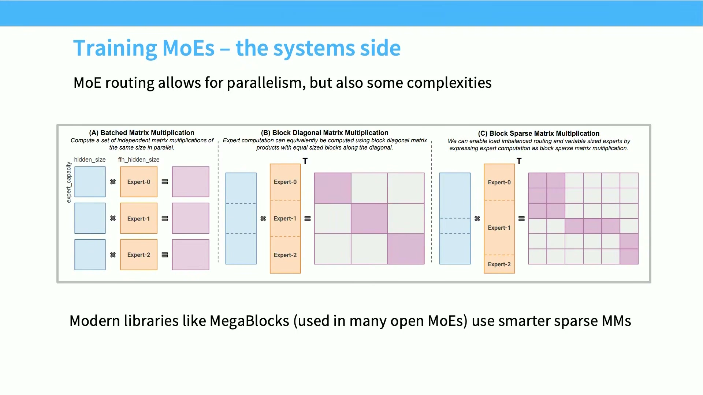
<figcaption>Expert Parallel：token 在设备间发送到对应专家，计算后再返回原设备；现代库还需配合稀疏矩阵乘法。</figcaption>
</figure>

Expert Parallel（EP）把专家分布在不同 GPU。一个 token 的路由流程可概括为：本地路由器计算 Top-K $`\rightarrow`$ 按目标设备分桶 $`\rightarrow`$ all-to-all 发送 token $`\rightarrow`$ 目标设备批量执行专家 $`\rightarrow`$ all-to-all 返回结果 $`\rightarrow`$ 按门控权重合并。若每批 token 数为 $`T`$、隐藏维度为 $`d`$、每元素 $`b`$ 字节，通信量大致与 $`TKdb`$ 成正比，具体还取决于是否跨节点。

## 为什么需要稀疏矩阵乘法

不同专家收到的 token 数不相等，执行矩阵乘法时 batch 维是动态的。现代库会把 token 按专家打包，使用 grouped GEMM 或块稀疏 GEMM，避免为每个专家单独启动小 kernel。否则 GPU 会被大量 kernel 启动和小矩阵低利用率拖慢。

## 并行策略的组合

EP 常与数据并行、张量并行和流水线并行组合。数据并行复制整套专家，扩大 batch；张量并行切分单个专家的矩阵，解决专家过大；流水线并行按层切分网络。组合时要明确每次通信的拓扑和顺序，否则通信会串行化并抵消稀疏计算收益。

<div class="knowledgebox">

系统检查清单 测 EP 不要只测专家 FLOPs。至少记录：all-to-all 带宽、token 分布熵、每设备队列长度、专家 GEMM 实际维度、capacity 丢弃率、通信与计算重叠比例、P95/P99 step 时间，以及节点故障时是否能安全恢复。

</div>

## 本章小结

EP 把 MoE 的条件计算映射到多 GPU，但 token 的动态路由会产生不规则通信和小矩阵。高性能实现依赖分桶、通信重叠、grouped GEMM 和合理的专家放置；算法稀疏不代表系统天然高效。

# MoE 稳定性：路由器的数值动力学

<figure data-latex-placement="H">
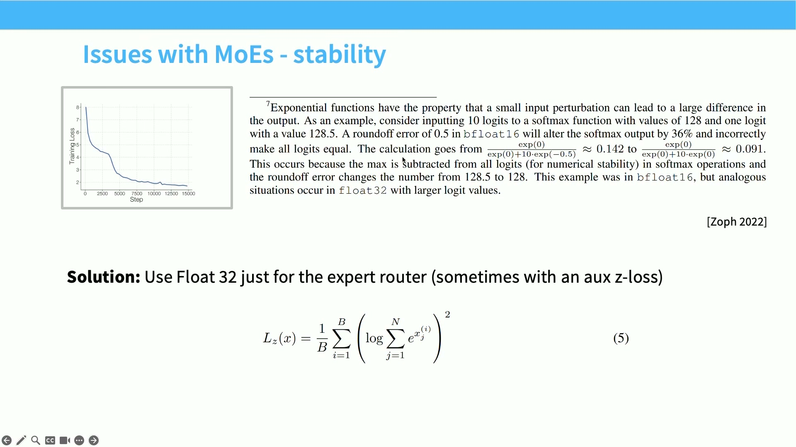
<figcaption>MoE 稳定性问题：路由 softmax 的输入尺度和温度变化可能造成训练曲线尖峰。</figcaption>
</figure>

路由器通常使用 softmax。若 logits $`z`$ 的尺度快速增大，softmax 会变得近似 one-hot，少数专家获得几乎全部概率，梯度变得稀疏且负载失衡；若尺度过小，路由接近均匀，专家难以形成专长。令温度为 $`\tau`$：
```math
\begin{equation}
p_i=\frac{\exp(z_i/\tau)}{\sum_j\exp(z_j/\tau)}.
\end{equation}
```
减小 $`\tau`$ 使分布更尖锐，增大 $`\tau`$ 使分布更平滑。实践中常用 Float32 计算路由器，即便主干采用低精度，以减小 logits 溢出和排序不稳定。

## 可监控的稳定性信号

除了总 loss，还应监控路由 logits 的均值、方差和最大值，专家概率熵，token 丢弃率，专家梯度范数和每步的设备通信时间。若 loss spike 同时伴随 logits 方差突增和专家集中，优先检查路由器精度、归一化、学习率和辅助损失，而不是盲目增大模型。

<div class="warningbox">

稳定性不是只看最终收敛 一次训练最终收敛，不代表在更长序列、更大 batch、不同硬件或恢复训练时同样稳定。需要做断点恢复、混合精度、不同路由温度和不同专家布局的回归测试。

</div>

## 本章小结

MoE 稳定性是数值尺度、离散路由和系统反馈共同作用的结果。Float32 路由、适当归一化、监控 logits 与容量，是比“训练失败后再调学习率”更可解释的工程做法。

# MoE 微调与 Upcycling

<figure data-latex-placement="H">
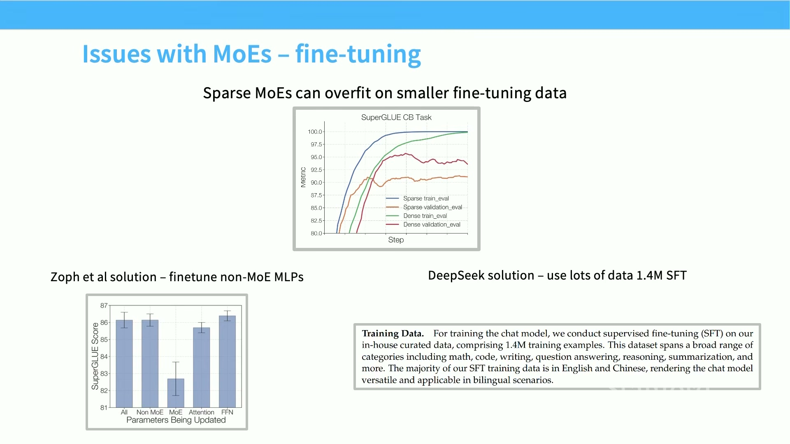
<figcaption>MoE 微调：稀疏专家在较小数据集上可能过拟合或产生专家偏置，注意力和专家参数的更新比例需要重新设计。</figcaption>
</figure>

稀疏模型微调时，每个 token 只更新少数专家，因此某些专家可能长期得不到足够梯度；数据集变小时，专家分工还可能过度专门化。常见策略包括冻结部分专家、只微调路由器、使用共享专家或合并专家输出，也可以把所有专家改成稠密路径完成短阶段适配。

<figure data-latex-placement="H">
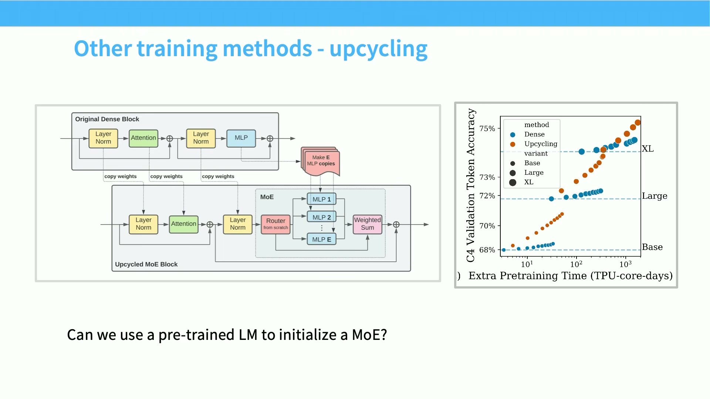
<figcaption>Upcycling：从已训练的稠密语言模型初始化多个专家，再继续训练使它们逐渐分化。</figcaption>
</figure>

Upcycling 的核心是复用已有稠密模型。把原 MLP 复制成多个初始相同的专家，加上路由器后继续预训练；初始时模型功能接近原模型，随着训练，专家在不同 token 子分布上发生分化。它节省了从随机初始化训练整个 MoE 的成本，但复制参数会增加存储，路由器和均衡策略仍需重新学习。

## Upcycling 的简单流程

1.  从稠密 checkpoint 读取每层 MLP 参数；

2.  将 MLP 权重复制到 $`N`$ 个专家，并初始化路由器；

3.  先用较小学习率和温和均衡约束，避免初始能力突然坍塌；

4.  逐步增加专家分工，检查验证损失、路由熵和专家利用率；

5.  在目标数据上微调时，单独评估路由器和专家的梯度覆盖。

<figure data-latex-placement="H">
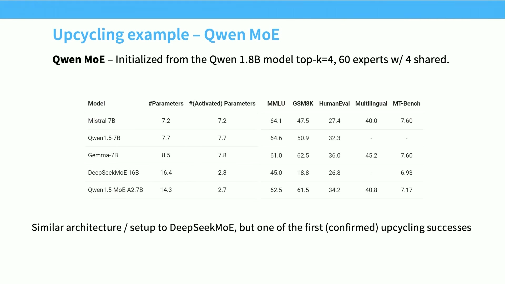
<figcaption>Upcycling 案例：Qwen MoE 等工作表明，从稠密模型出发可以得到具有竞争力的稀疏模型，但效果依赖初始化和继续训练配方。</figcaption>
</figure>

## 本章小结

微调 MoE 的难点不是参数量本身，而是梯度覆盖和路由分布。Upcycling 通过复制稠密能力降低冷启动风险，再用持续训练学习专家分化，是连接已有模型与新 MoE 的实用路径。

# 从单层替代到全栈设计：如何选择方案

把本讲内容放在一张决策表里，可以看到不同方案优化的是不同瓶颈。

<div class="center">

| 方案 | 主要节省 | 主要代价 | 适合先验证的指标 |
|:---|:---|:---|:---|
| 线性注意力/SSM | 长度相关计算、KV 读写 | 有限状态记忆、精确检索能力 | 长上下文检索、decode 吞吐、状态稳定性 |
| 稀疏注意力 | 注意力读流量与二次计算 | 索引器、Top-K 和不规则访存 | 漏检率、P95 延迟、索引开销 |
| MoE | 激活 FLOPs/参数容量比 | 路由、all-to-all、负载不均 | 激活参数、通信、容量丢弃、质量 |
| 混合架构 | 在不同层匹配不同瓶颈 | 结构调参和公平比较更复杂 | 层比例、质量—吞吐曲线 |

</div>

<div class="importantbox">

一套可执行的比较流程 第一步固定数据、词元数、上下文和目标质量；第二步用小模型检查数学正确性和梯度；第三步测单层和单 kernel 的 FLOPs、显存、带宽；第四步测真实 batch 下的端到端 prefill/decode；第五步做长上下文、恢复训练、混合精度和故障场景回归；最后才决定是否扩大规模。

</div>

## 本章小结

没有一种替代方案在所有任务和硬件上都占优。应先定位瓶颈：如果是 KV 和长上下文，考虑 SSM 或稀疏注意力；如果是容量—计算比，考虑 MoE；如果是系统通信，则必须把路由和布局作为模型设计的一部分。

# 综合复习：把四个核心概念连起来

<figure data-latex-placement="H">
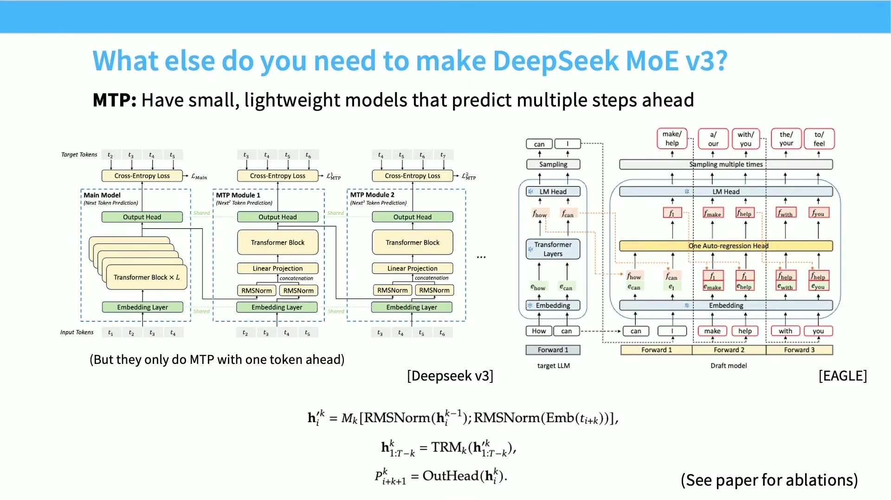
<figcaption>本讲总览：稀疏性可以作用于历史 token、状态更新或专家参数，但每种稀疏都伴随新的系统约束。</figcaption>
</figure>

现在可以用一个统一框架复述本讲：

1.  线性注意力把历史两两交互压缩成固定状态，换取线性长度复杂度；

2.  Mamba-2 与 gated delta net 让状态转移和擦除由内容控制，提升有限记忆的可用性；

3.  稀疏注意力保留 token 级内容寻址，但用轻量索引器把访问集合缩小；

4.  MoE 不压缩历史，而是在模型宽度上只激活部分专家，把总容量与单 token FLOPs 解耦；

5.  混合模型把这些机制与少量标准注意力组合，按任务和系统瓶颈分配预算。

对任何新方法，都可问五个问题：它的稀疏性发生在哪里？省下的是 FLOPs、显存还是通信？被省略的计算是否会损害检索和组合能力？训练和推理是否使用同一数学语义？在真实硬件和 batch 形状下，额外的索引、路由或状态管理是否值得？这五问能把宣传性的“更快”还原为可测量的工程假设。

<div class="summarybox">

带走的结论

- 线性状态更新适合长序列和低延迟解码，但有限状态必须用记忆与干扰实验验证；

- 稀疏注意力的关键不是 Top-K 公式，而是索引器质量与不规则访存的端到端代价；

- MoE 的关键不是总参数，而是激活参数、路由质量、专家/设备均衡和 all-to-all 效率；

- 稳定性、负载和并行布局应在架构设计阶段进入目标函数，而不是上线后再补救；

- 最可信的结论来自控制变量、完整成本和多指标曲线，而不是单一 benchmark 数字。

</div>

# 自测题与实践任务

## 概念题

1.  说明线性注意力把哪一个矩阵运算的顺序改变了，并写出状态递推式。

2.  为什么线性复杂度不意味着无限记忆？设计一个能检测状态干扰的实验。

3.  比较 token-choice、expert-choice 和全局匹配路由的优缺点。

4.  解释专家均衡和设备均衡为何不能用同一个直方图代替。

## 计算题

设序列长度 $`L=8192`$，稀疏注意力每个查询选 $`K=256`$ 个位置，忽略索引器开销。与密集注意力相比，二次配对数量的理想比例约为 $`K/L=1/32`$。若索引器额外扫描 $`L`$ 个低维向量，则端到端收益取决于低维扫描和精确注意力的常数；请解释为什么实际加速不会自动达到 $`32`$ 倍。

## 代码任务

实现一个小型 Top-K MoE：使用 4 个两层 MLP 专家，每个 token 选择 2 个专家；记录每步专家 token 数、容量丢弃率、主损失和均衡损失。随后把均衡损失权重从 $`0`$ 扫到 $`0.1`$，画出质量、负载方差和每步时间曲线。若负载变均匀但质量下降，说明路由器可能被过度约束。

<div class="summarybox">

最终复习路径 先能手算 $`S_t`$ 和 Top-K 路由，再能解释 Mamba/Delta 更新的状态含义；接着用 profiler 分离计算、显存和通信；最后在相同 token 预算下比较密集、线性、稀疏和 MoE 方案。能够完成这条路径，才算真正理解“注意力替代方案”而不只是记住名词。

</div>
