<div class="titlepage">

**CS336 第5讲：GPU、TPU 与深度学习硬件**

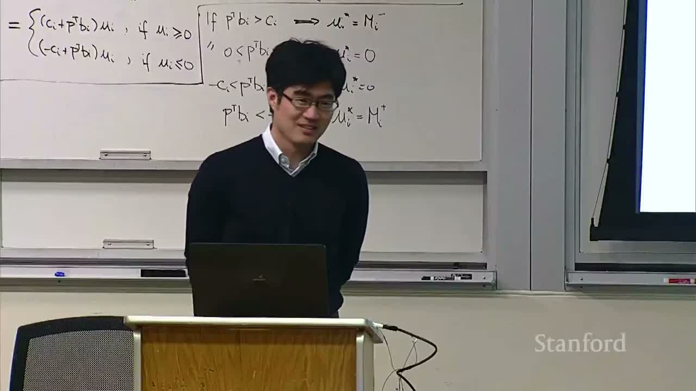

<div class="tcolorbox">

**原课程：**Stanford CS336 Language Modeling from Scratch, Spring 2026\
**讲次：**Lecture 5: GPUs, TPUs\
**主讲：**Stanford CS336 课程团队\
**原视频：**[`youtube.com/watch?v=izZba4UA7iY`](https://www.youtube.com/watch?v=izZba4UA7iY)\
**阅读方式：**本笔记将硬件讲解重组为可计算、可测量、可实现的课程教材。

</div>

</div>

# 全局问题：模型能力增长得比硬件更快

深度学习硬件的第一条背景线索是计算缩放。处理器性能曾经主要依靠提高单核频率和晶体管密度；当功耗、散热和指令级并行遇到瓶颈后，增长转向大量并行核心、专用矩阵单元、低精度格式和更快的内存系统。语言模型恰好把这些方向同时推到极限：矩阵乘法规模巨大、参数和激活反复搬运、训练需要长时间保持高利用率。

<figure data-latex-placement="H">
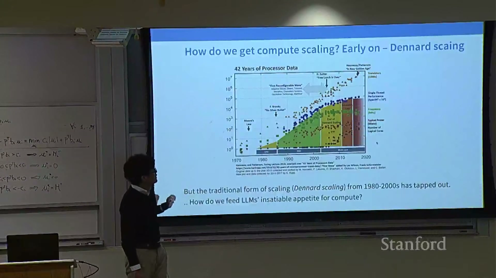
<figcaption>计算能力随硬件世代增长的历史图景：传统单线程缩放趋缓，深度学习依赖并行和专用加速器。</figcaption>
</figure>

如果只记住“GPU 比 CPU 快”，很快会遇到反例。对一个小张量和复杂分支，CPU 可能更快；对大矩阵乘法，GPU 以成千上万线程同时工作；对规则的张量乘法，TPU 的矩阵单元可能利用率更高。硬件比较必须绑定工作负载、数据类型、批量大小、内存访问和软件栈。

<div class="importantbox">

本讲的主线 性能不是芯片铭牌上的一个数字，而是算法把数据组织成硬件喜欢的形状后，实际达到的有效吞吐。后文将不断区分计算峰值、内存带宽、数据移动、控制分歧和算子启动开销。

</div>

## 本章小结

模型规模增长迫使研究者理解硬件。GPU、TPU 与 CPU 的差别不是“快慢排序”，而是并行方式、内存层级、数据类型和编程模型的差别。高性能代码的起点是识别瓶颈，而非盲目追求峰值 FLOPs。

# CPU 与 GPU：少量复杂核心对大量轻量线程

<figure data-latex-placement="H">
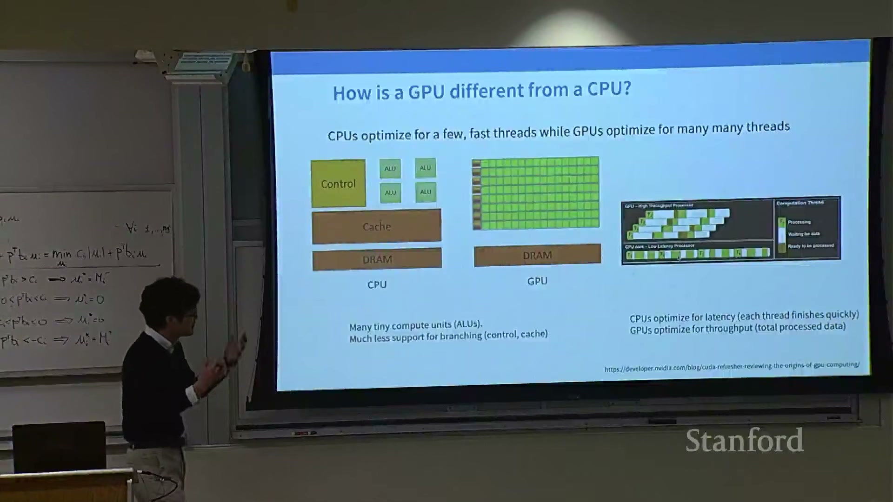
<figcaption>CPU 面向少量高性能线程，GPU 面向大量相似线程；同一算法的数据形状决定哪一种更合适。</figcaption>
</figure>

CPU 的每个核心拥有较大的控制逻辑、缓存和分支预测能力，适合串行代码、复杂控制流和低延迟任务。GPU 把面积更多地用于算术单元和线程调度，假设大量线程执行相同指令，只是处理不同数据。这个模型称为 SIMD/SIMT：单条指令作用于多个数据，线程以 warp 或 wave 的小组一起前进。

## GPU 的优势为何来自“隐藏延迟”

访问显存可能需要数百个时钟周期。GPU 不等待一个线程的内存返回，而是切换到另一个就绪 warp；只要同时驻留的线程足够多，内存延迟就能被其他计算覆盖。由此产生两个要求：一是寄存器和共享内存不能占满，保证足够 occupancy；二是线程访问应规则，让硬件能合并内存请求。

<div class="warningbox">

误区：线程数越多越好 线程数量只是潜在并行度。若每个线程寄存器使用过多、分支严重分歧或访问随机显存，实际可运行的 warp 数和有效带宽都会下降。应使用 profiler 检查 SM 活跃度、内存吞吐、occupancy 和指令发射，而不是只看 launch 的线程总数。

</div>

## 本章小结

CPU 用复杂核心降低单线程延迟，GPU 用线程规模隐藏内存延迟。深度学习矩阵运算适合 GPU，是因为同一操作可在大批元素上重复；不规则控制流和小工作集则未必适合。

# GPU 的执行单元与内存层级

<figure data-latex-placement="H">
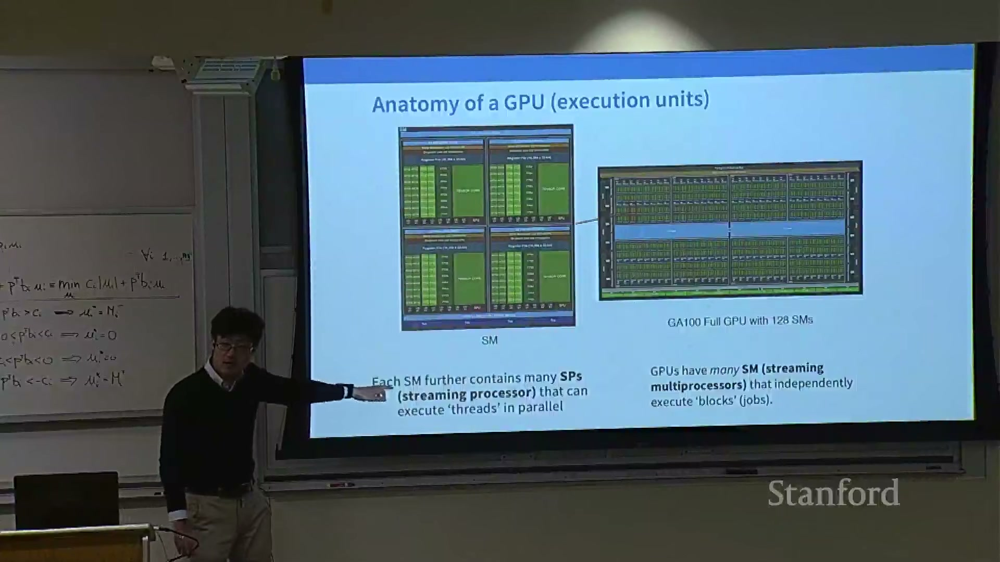
<figcaption>GPU 执行单元：多个 SM、warp 调度器、寄存器和专用矩阵计算单元共同完成一个 kernel。</figcaption>
</figure>

GPU 由若干 Streaming Multiprocessor（SM）组成。每个 SM 包含标量/向量算术单元、加载存储单元、寄存器文件、共享内存和 warp 调度器；较新的 GPU 还包含 Tensor Core。kernel 启动后，线程块被分配到 SM，块内线程共享该 SM 的共享内存并以 warp 为单位执行。

内存离计算单元越近，容量通常越小、延迟越低：寄存器最快但属于线程私有；共享内存由一个线程块共享；L1/L2 cache 负责复用；HBM/GDDR 容量大但延迟和能耗更高。高性能程序会尽量让数据在近端层级复用，减少到 HBM 的往返。

<figure data-latex-placement="H">
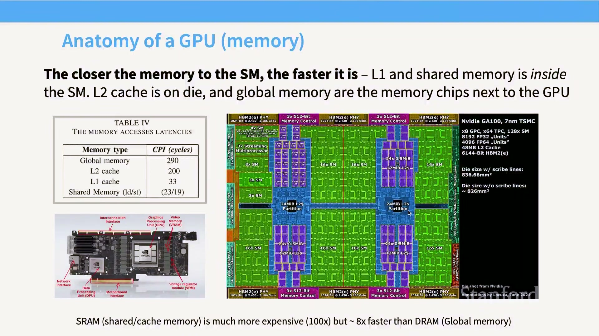
<figcaption>GPU 内存层级：离 SM 越近速度越高、容量越小；算法的 tile 设计决定数据能否留在近端。</figcaption>
</figure>

对矩阵乘法 $`C=AB`$，若每个线程每次只读一个 $`A`$ 元素和一个 $`B`$ 元素，数据会被反复从显存加载；若先把矩阵块搬入共享内存，一个元素可被多个线程复用，显存流量大幅下降。这个“搬运一次、计算多次”的原则将贯穿后文 tiling 和 FlashAttention。

## 一个带宽估算

若 kernel 需要读取 $`B=10^{9}`$ 字节，而有效显存带宽为 $`BW=1.5\times10^{12}`$ 字节/秒，纯带宽下界为
```math
\begin{equation}
T_{\mathrm{mem}}\ge \frac{B}{BW}\approx0.67\ \mathrm{ms}.
\end{equation}
```
若实测时间接近该值，继续优化乘加指令几乎没有意义；应减少字节数、提高复用或改善访问合并。

## 本章小结

GPU 性能取决于整个内存层级。寄存器、共享内存、cache 与 HBM 的容量和带宽不同；tile 和复用把算术强度提高，才能让昂贵的计算单元持续工作。

# 线程块、warp 与控制分歧

<figure data-latex-placement="H">
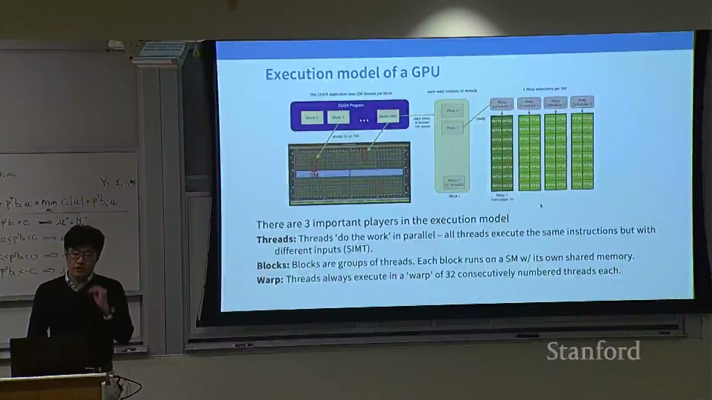
<figcaption>GPU 编程模型：网格由线程块组成，线程块内部以 warp 协同执行并共享片上内存。</figcaption>
</figure>

一个 kernel 通常组织为 grid $`\rightarrow`$ block $`\rightarrow`$ thread。block 是调度和共享内存分配的基本单位；warp 通常包含 32 个线程，硬件以 warp 为单位发射同一指令。线程之间的索引可以映射到矩阵行、列或 tile 坐标。

当同一 warp 内线程走不同分支时，GPU 不能同时执行两条路径，而是分别执行再屏蔽不活跃线程，称为 divergence。若条件在 warp 内一致，分支几乎没有问题；若每个线程随机选择路径，吞吐会近似按活跃比例下降。

<figure data-latex-placement="H">
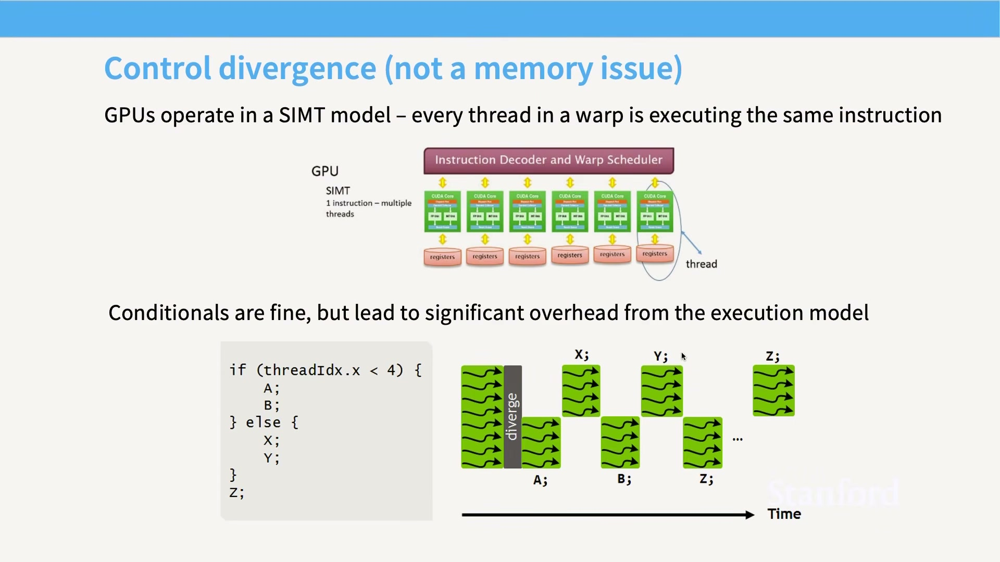
<figcaption>控制分歧示意：warp 内线程分支不一致会串行执行多个路径，导致有效并行度下降。</figcaption>
</figure>

优化分歧的常见方法是让相邻线程处理相似数据、把边界条件移到 kernel 外、用算术选择替代短分支，或重新排序输入使同类工作聚在一起。不要为了消灭所有 if 而牺牲可读性；只有当分歧占据热路径时才值得改写。

```
row = blockIdx.x * blockDim.x + threadIdx.x
col = blockIdx.y * blockDim.y + threadIdx.y
if row < M and col < N:
    C[row, col] = dot(A[row, :], B[:, col])
```

## 本章小结

block 是资源和协作边界，warp 是指令执行边界。线程映射、边界分支和数据排序共同决定有效并行度；GPU 优化不能脱离具体索引和控制流。

# TPU 与专用矩阵加速器

<figure data-latex-placement="H">
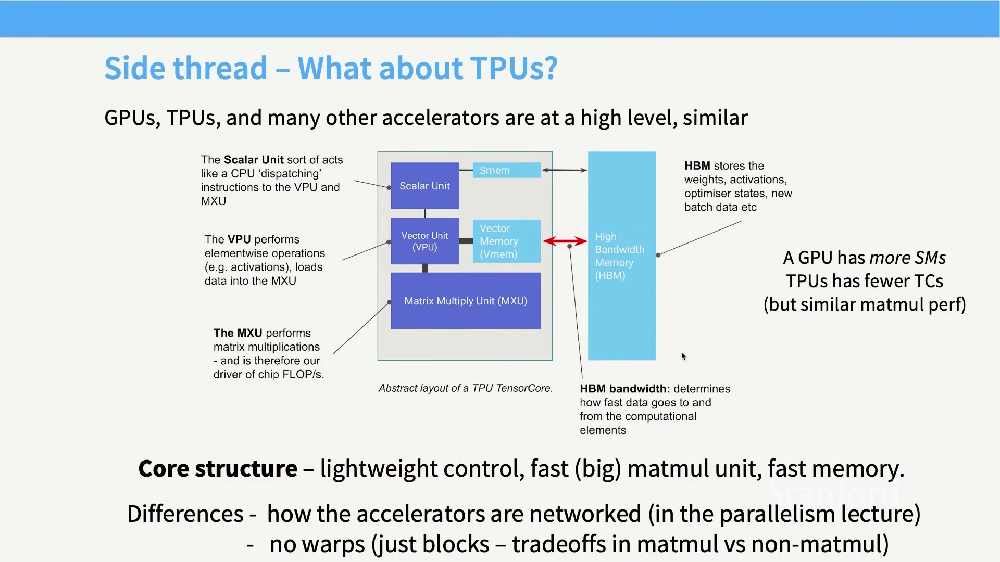
<figcaption>GPU 与 TPU 的抽象对比：GPU 更通用，TPU 以大规模矩阵单元和片上数据流为核心。</figcaption>
</figure>

TPU 等专用加速器把芯片面积集中到矩阵乘法阵列（如 systolic array）、片上缓冲和高带宽互连上。数据沿阵列流动，部分和在局部累积，适合规则的 $`XW`$、卷积和 attention 投影。GPU 则提供更灵活的线程、缓存和 kernel 编程，能覆盖更广的算子。

<div class="knowledgebox">

如何选 GPU 还是 TPU 如果模型由规则大矩阵组成、编译器能静态分析形状、批量稳定且希望获得高矩阵利用率，TPU 可能更合适；如果需要自定义 kernel、动态形状、复杂稀疏路由或成熟的 CUDA 生态，GPU 更灵活。真正的选择还要考虑互连、软件可用性、成本和团队经验。

</div>

专用矩阵单元带来一个警告：矩阵形状和数据类型必须匹配。$`M,N,K`$ 不对齐会产生尾部 tile，部分乘法单元闲置；低精度输入若需要高精度累积，转换和归约也会影响吞吐。优化模型时，应把隐藏维度、头数和 batch 设计成硬件友好的倍数。

## 本章小结

GPU 是可编程并行机器，TPU 是更专门的矩阵数据流机器。两者都要求规则形状、高复用和合适精度；硬件选择应由软件栈和真实工作负载共同决定。

# 计算缩放快于内存缩放：Roofline 模型

<figure data-latex-placement="H">
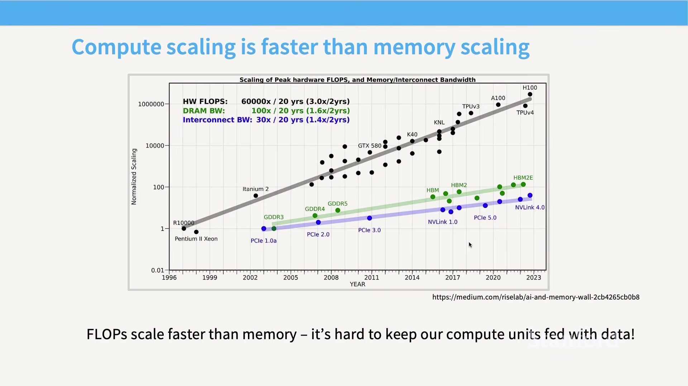
<figcaption>计算峰值增长快于内存带宽增长：未来 kernel 更容易受数据移动限制。</figcaption>
</figure>

Roofline 模型用算术强度连接计算和内存。设一个操作执行 $`F`$ 次 FLOP、搬运 $`B`$ 字节，则算术强度为
```math
\begin{equation}
I=\frac{F}{B}\quad(\mathrm{FLOP/byte}).
\end{equation}
```
若设备峰值计算为 $`P_{\max}`$ FLOP/s、显存带宽为 $`BW_{\max}`$ byte/s，则吞吐上界为
```math
\begin{equation}
P\le\min(P_{\max}, I\cdot BW_{\max}).
\end{equation}
```
当 $`I<P_{\max}/BW_{\max}`$ 时属于 memory-bound；当 $`I`$ 超过交叉点后才可能 compute-bound。

<figure data-latex-placement="H">
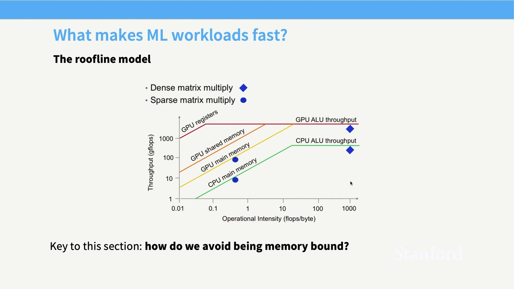
<figcaption>Roofline：低算术强度操作受带宽限制，高算术强度操作受计算峰值限制。</figcaption>
</figure>

矩阵乘法通常有较高复用，容易进入 compute-bound；逐元素激活、归一化和小 batch decode 往往 memory-bound。融合算子、压缩数据、提高 tile 复用和减少中间张量，都会提高 $`I`$ 或降低实际字节流量。

<div class="importantbox">

Roofline 的用法 Roofline 是上界模型，不是性能保证。它忽略 kernel 启动、同步、cache 命中、分支和负载不均。它最有价值的用途是排除错误方向：若操作明显在带宽侧，就不要只优化 FLOPs；若接近计算屋顶，就要优化指令和矩阵单元利用率。

</div>

## 本章小结

算术强度把算法表达式翻译成硬件约束。计算峰值增长快于内存带宽时，数据移动会成为首要成本；Roofline 帮助我们先判断瓶颈，再选择优化手段。

# 低精度：用更少的位搬运更多信息

<figure data-latex-placement="H">
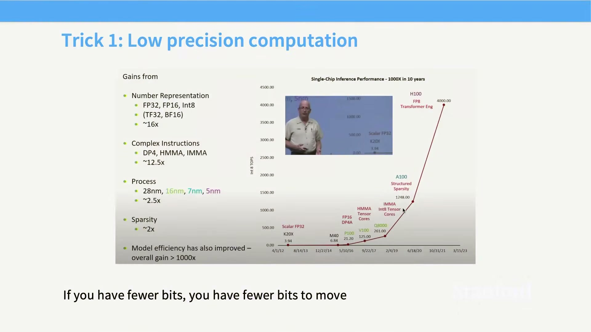
<figcaption>低精度的直觉：相同数量的数占用更少字节，数据移动下降，矩阵单元吞吐上升。</figcaption>
</figure>

FP32 每个数占 32 位，FP16/BF16 只占 16 位，FP8 进一步压到 8 位。低精度同时改善两个方面：同样的显存和带宽能搬运更多元素；Tensor Core 能在一个周期内执行更多低精度乘加。若计算和带宽都按比例提升，理论加速很高。

精度并不只由位数决定。指数位影响动态范围，尾数位影响相对精度；BF16 保留较大的指数范围而尾数更短，通常比 FP16 更不易溢出。FP8 又分不同格式，常需要按张量或按块缩放因子把数值映射到可表示范围。

<figure data-latex-placement="H">
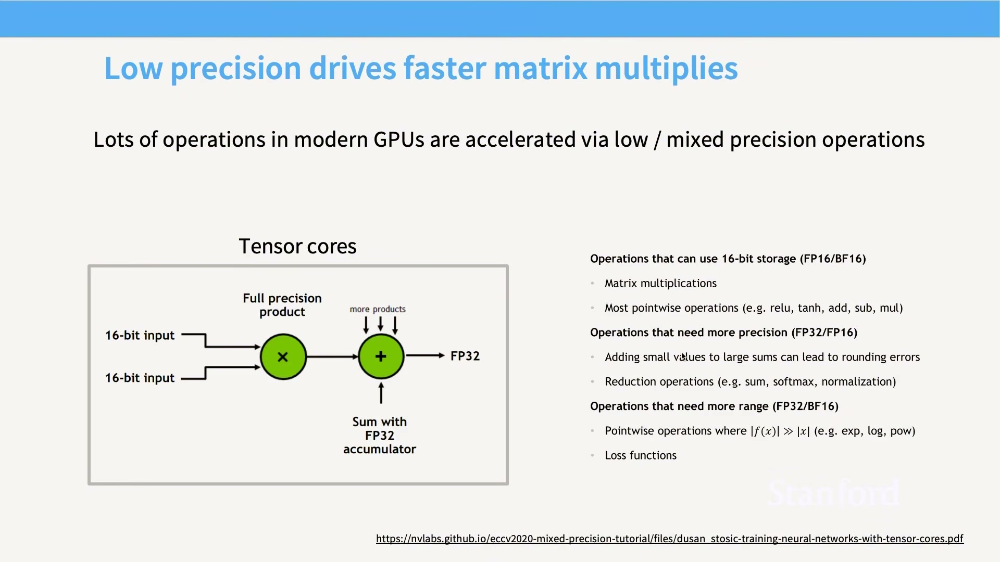
<figcaption>Tensor Core 的低精度乘加：输入可低精度，累积通常采用更高精度以减小误差。</figcaption>
</figure>

混合精度的典型做法是：权重和激活用 BF16/FP16，乘法在 Tensor Core 上完成，累积用 FP32；优化器状态保持 FP32；loss scaling 或动态缩放防止小梯度下溢。不是所有张量都能安全降精度，归一化、softmax、路由 logits 和长序列累积往往需要更谨慎。

## 数值误差的一个模型

若每次加法产生相对误差约 $`u`$，累积 $`n`$ 次的最坏误差可能随 $`nu`$ 增长。实际误差还受抵消、排序和随机性影响；因此应做 fp32 参考与低精度版本的逐层对比，关注 loss、梯度范数、激活最大值和最终任务，而不是只看训练是否不报错。

## 本章小结

低精度是性能和内存优化的重要杠杆，但需要格式、缩放和累积策略配合。混合精度的原则是把低精度用在容错高且收益大的矩阵操作，把高精度留给敏感的归一化、累积和控制信号。

# FP8、MXFP8 与精度—吞吐前沿

<figure data-latex-placement="H">
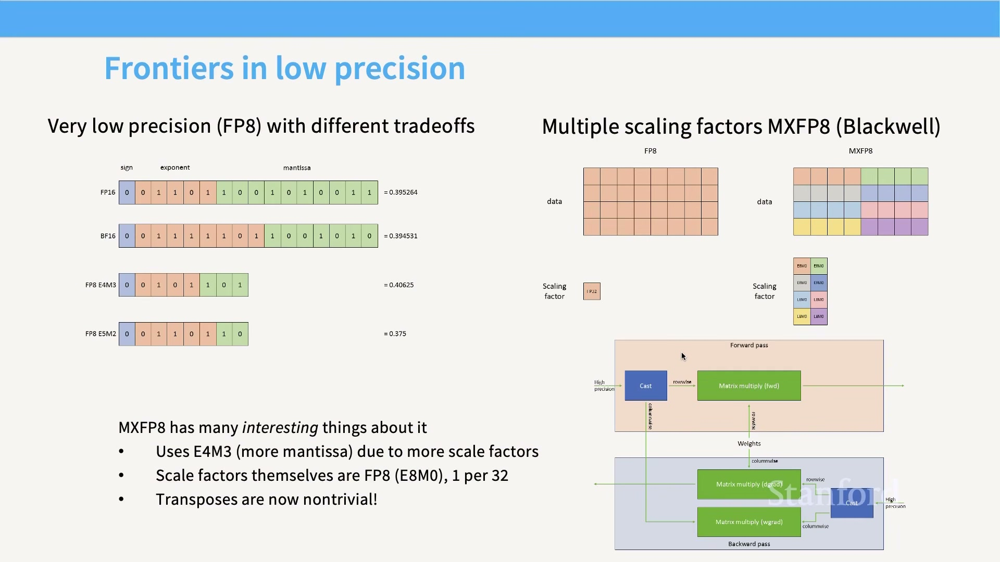
<figcaption>不同低精度格式的取舍：更低位宽提高吞吐和带宽效率，也缩小可表示范围。</figcaption>
</figure>

FP8 通常用 E4M3 或 E5M2 等格式；前者尾数更多、适合权重/激活，后者指数更多、适合梯度动态范围。MXFP8 这类块级格式为每个小块提供缩放因子，让同一块中数值共享尺度，减少极端值对有效精度的影响。

块级缩放的代价是额外元数据、量化/反量化和块边界约束。若块太大，尺度不适合所有元素；若块太小，缩放开销和内存访问增加。选择块大小要同时考虑统计分布与 Tensor Core 支持的 tile。

<figure data-latex-placement="H">
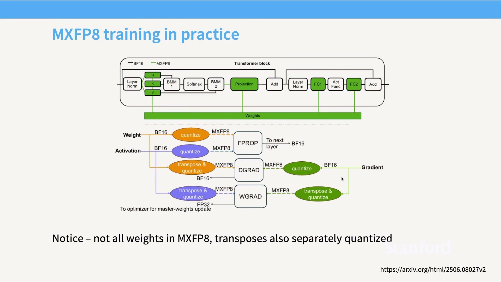
<figcaption>MXFP8 训练实践：权重、激活、梯度和优化器状态可以采用不同精度，转置路径也需要单独量化。</figcaption>
</figure>

低精度训练的验证顺序建议是：先用 FP32 参考跑短实验，再只把矩阵乘法切到 BF16；确认损失和梯度一致后，再切 FP8；最后引入块级缩放、通信压缩和检查点压缩。每一步都保留可回退配置，避免多个误差源同时出现而无法定位。

## 本章小结

精度前沿不是单纯追求最少 bit，而是寻找质量可接受、硬件可执行、缩放可稳定的组合。块级缩放和混合精度把数值分析嵌入系统设计。

# 算子融合与重计算：减少中间数据搬运

<figure data-latex-placement="H">
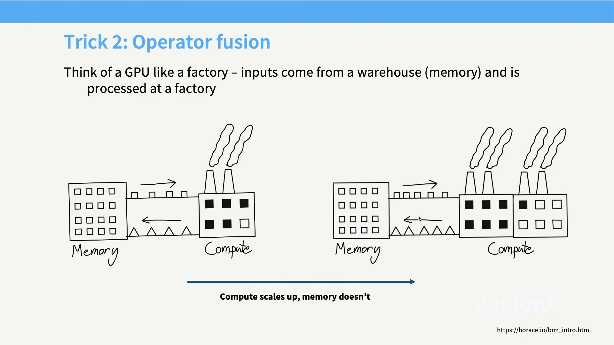
<figcaption>算子融合：把多个连续操作放进一个 kernel，减少中间结果写回显存和再次读取。</figcaption>
</figure>

设两个逐元素操作 $`y=f(x)`$、$`z=g(y)`$。分离实现需要把 $`y`$ 写入并从显存读回；融合实现可在寄存器中直接把 $`g(f(x))`$ 写到输出。融合提升算术强度、减少 kernel 启动和同步，但会增加 kernel 代码复杂度与寄存器压力。

融合并非“越多越好”。若融合后寄存器占用导致 occupancy 下降，或一个操作需要的线程布局与另一个不匹配，收益可能消失。实践中应从热点路径开始，先测分离版本的时间线和字节流量，再设计最小融合单元。

<figure data-latex-placement="H">
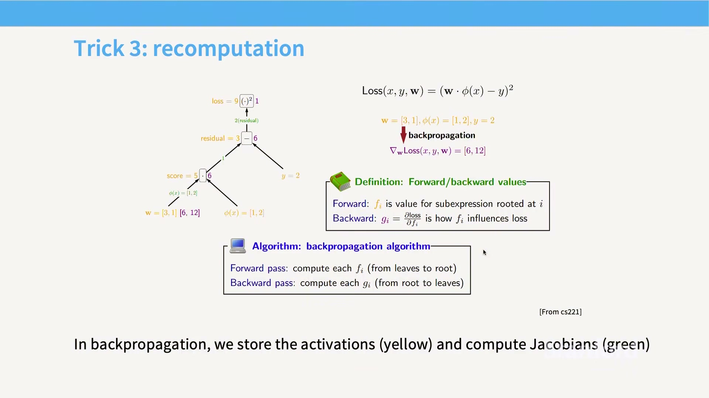
<figcaption>重计算：训练时不保存全部激活，反向传播需要时重新计算，以交换计算时间换显存容量。</figcaption>
</figure>

检查点（activation checkpointing）把网络切成若干段，只保存段边界激活。反向时重新运行段内前向，减少显存但增加 FLOPs。若显存不足以扩大 batch，重计算反而可能提高整体吞吐；若模型已经计算受限，则应谨慎选择检查点间隔。

```math
\begin{equation}
M_{\mathrm{act}}\approx M_{\mathrm{saved}}+M_{\mathrm{recompute\ buffer}},\qquad
C_{\mathrm{total}}\approx C_{\mathrm{forward}}+C_{\mathrm{backward}}+C_{\mathrm{recompute}}.
\end{equation}
```
这组关系提醒我们不能只报告“省了多少显存”，还要报告额外计算、训练时间和 batch 是否改变。

## 本章小结

融合减少数据移动和边界开销，重计算用额外 FLOPs 换显存。两者的共同思想是：显存访问和容量是资源，不能只优化算术表达式。

# 内存合并、对齐与 Tiling

<figure data-latex-placement="H">
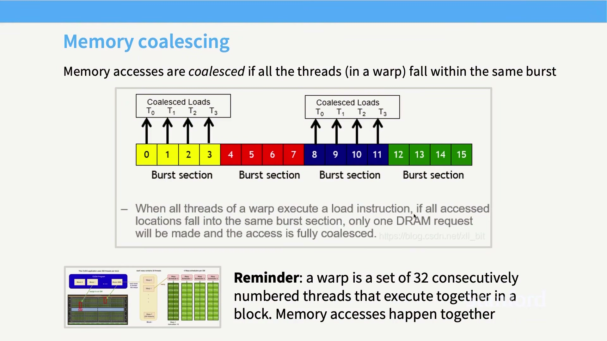
<figcaption>内存合并：同一 warp 的相邻线程访问连续地址，硬件可以合并为少量事务。</figcaption>
</figure>

若线程 $`t`$ 访问地址 $`a_0+t`$，一个 warp 的请求可以合并；若线程访问随机位置，硬件需要发起多次事务，带宽利用率下降。结构化数组、连续张量布局和合适 stride 能让相邻线程访问相邻元素。转置和广播常常破坏这一性质，需要通过 tile 在共享内存中重排。

<figure data-latex-placement="H">
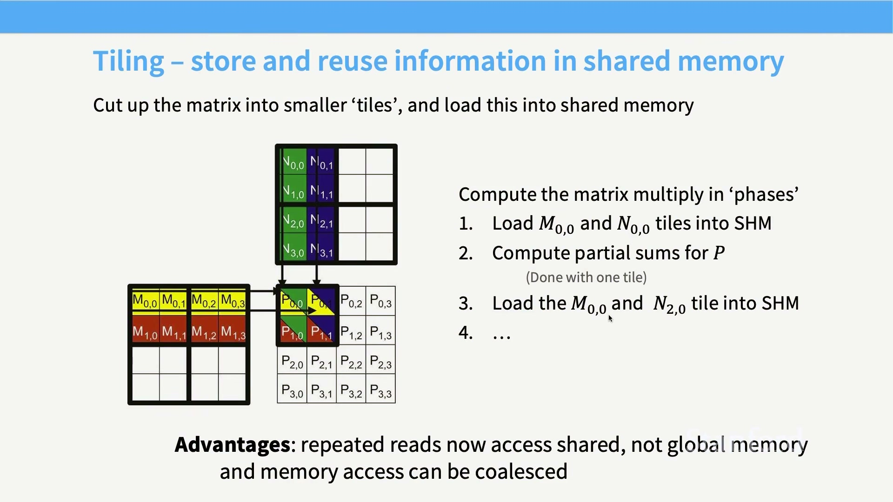
<figcaption>Tiling：按块搬运矩阵，使数据在片上缓存中复用，并把访存对齐到硬件事务。</figcaption>
</figure>

矩阵乘法中，把 $`A`$ 的 tile 和 $`B`$ 的 tile 搬入共享内存后，线程协作完成局部 $`C`$ tile。tile 太小，复用不足；太大，片上存储和寄存器不够；形状还要匹配 Tensor Core。通常要通过 benchmark 扫描 tile、warp 数和 stage 数，而不是凭直觉固定。

<figure data-latex-placement="H">
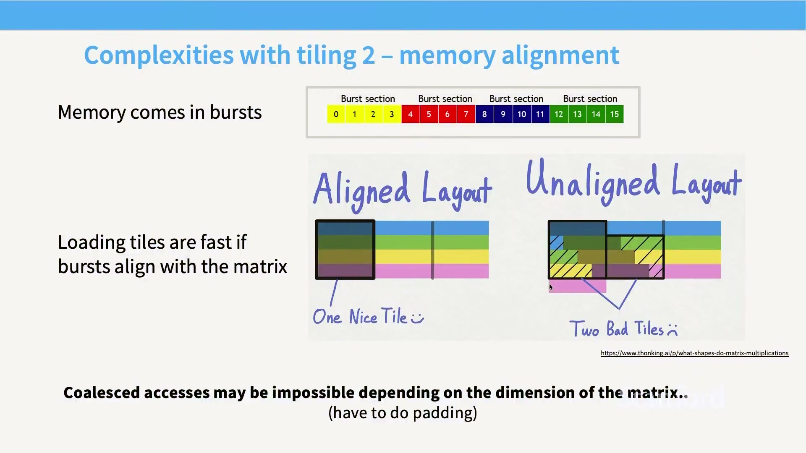
<figcaption>矩阵对齐与尾部 tile：形状不整齐时，需要边界处理，部分硬件单元会闲置。</figcaption>
</figure>

当 $`M,N,K`$ 不是 tile 大小的倍数，最后一块需要 mask。mask 正确性重要，但边界块的低利用率也会拖慢短序列和小 batch。模型架构常把隐藏维、头维和词表维选为 64、128 或更适合硬件的倍数，就是为了减少这种尾部浪费。

## 本章小结

合并访问、对齐和 tiling 是把抽象矩阵映射到真实内存事务的关键。优化器应同时检查地址连续性、tile 复用、片上容量和尾部形状。

# 从矩阵乘法到 FlashAttention

<figure data-latex-placement="H">
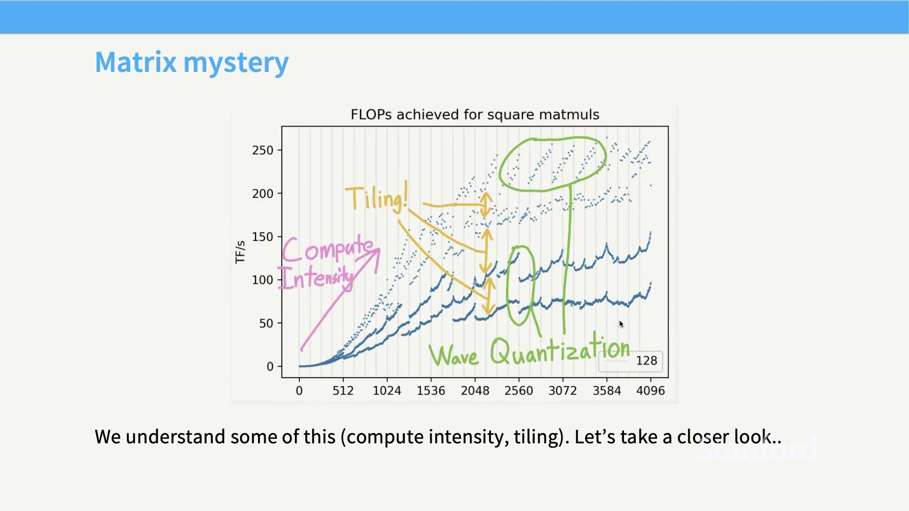
<figcaption>矩阵乘法的性能谜题：同样的 FLOPs，不同布局和 tile 可能产生巨大速度差异。</figcaption>
</figure>

标准注意力包含 $`S=QK^\top`$、$`P=\operatorname{softmax}(S)`$ 和 $`O=PV`$ 三步。朴素实现把 $`S`$、$`P`$ 写入 HBM，再由下一步读回；当序列很长时，中间矩阵的读写比乘加更昂贵。FlashAttention 的思想不是改变数学结果，而是按 tile 计算并在片上完成 softmax 与加权求和，避免物化完整 $`L\times L`$ 矩阵。

<figure data-latex-placement="H">
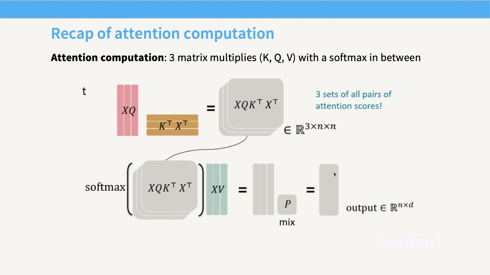
<figcaption>注意力分块：Q、K、V 按 tile 载入片上存储，块间逐步更新输出和归一化统计量。</figcaption>
</figure>

对一个 query tile 和 key tile，在线 softmax 维护当前最大值 $`m`$ 与归一化和 $`\ell`$。若新块的最大值为 $`m'`$，旧统计可重标定：
```math
\begin{align}
m_{\mathrm{new}}&=\max(m,m'),\\
\ell_{\mathrm{new}}&=e^{m-m_{\mathrm{new}}}\ell+
e^{m'-m_{\mathrm{new}}}\ell',\\
O_{\mathrm{new}}&=e^{m-m_{\mathrm{new}}}O+
e^{m'-m_{\mathrm{new}}}O'.
\end{align}
```
这里 $`O`$ 是已累积的加权值和，$`\ell`$ 是归一化因子。通过这组三元状态，可以逐块得到与完整 softmax 等价的结果。

<figure data-latex-placement="H">
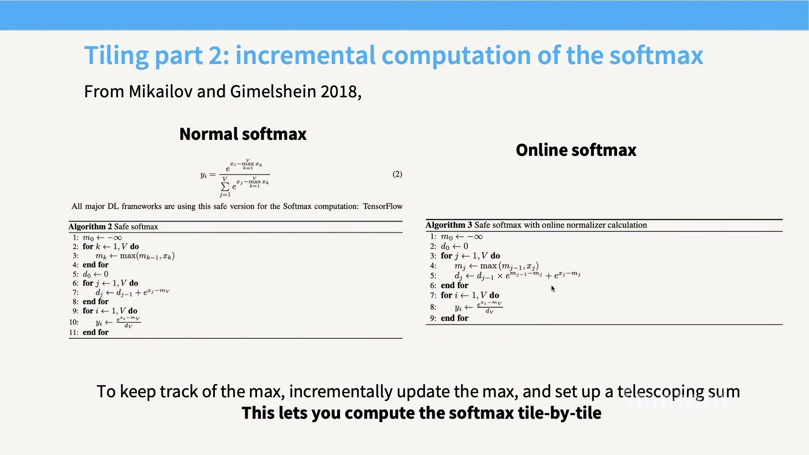
<figcaption>在线 softmax：只保存最大值、归一化和与输出累积量，不需要把所有分数写回显存。</figcaption>
</figure>

FlashAttention 的收益来自 IO-aware 设计：减少 HBM 读写，增加 SRAM/共享内存复用。它仍需处理因果 mask、边界 tile、反向传播和不同头维；因此高性能实现会针对硬件和形状提供多个 kernel 变体。

<figure data-latex-placement="H">
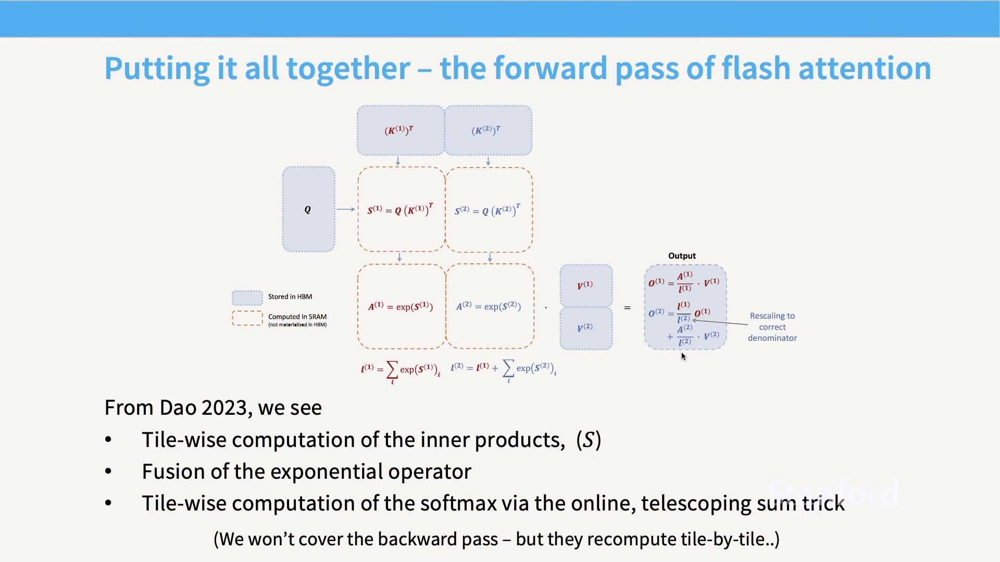
<figcaption>FlashAttention 前向流程：分块乘法、在线 softmax、值加权和融合在一条 IO 高效路径中。</figcaption>
</figure>

<div class="warningbox">

等价数学不等于等价性能 FlashAttention 的关键不是“用了一个更快的 softmax”，而是改变了中间结果的存储路径。若实现把 tile 结果又频繁写回 HBM，或 batch/头维太小导致 SM 空闲，理论 IO 优势就无法兑现。

</div>

## 本章小结

FlashAttention 是本讲所有硬件原则的综合：tiling 提高复用，在线 softmax 避免物化，融合减少启动和中间读写，布局和对齐保证带宽。它改变的是实现路径，数学目标仍是同一个注意力。

# 把一次 Transformer 前向拆成硬件账本

理解硬件的最好方式，是把一次前向传播的每一步都列成账本。设 batch 为 $`B`$、序列长度为 $`L`$、隐藏维度为 $`d`$、词表大小为 $`V`$，一个 Transformer block 通常包含线性投影、注意力、输出投影、归一化和 MLP。QKV 投影的矩阵形状约为 $`(BL,d)(d,3d)`$，MLP 常把维度扩展到 $`4d`$ 再压回 $`d`$。仅从 FLOPs 看，MLP 往往占据很大比例；从内存看，每层权重、激活和 KV 访问又可能是另一种排序。

<div class="center">

| 阶段 | 主要对象 | 常见瓶颈 | 优先检查 |
|:---|:---|:---|:---|
| QKV/MLP GEMM | 大矩阵乘法 | Tensor Core 利用率或形状尾部 | tile、精度、对齐 |
| 注意力分数 | $`QK^\top`$ 与 softmax | HBM 中间读写 | 分块、在线 softmax |
| 归一化/激活 | 逐元素张量 | 带宽与 kernel 启动 | 融合、向量化 |
| decode 单步 | 权重与 KV 读入 | 显存带宽、批量过小 | cache、批处理、量化 |

</div>

例如 $`B=8,L=4096,d=4096`$ 时，单层激活已经包含数亿个元素；若使用 BF16，每个元素 2 字节，仅一份隐藏激活就占用约 $`BLd\times2`$ 字节。训练还要保存反向所需中间量，推理还要为每个历史 token 保留 KV。这个数量级解释了为什么“把一个临时张量写回显存”不是小事，也解释了检查点和 FlashAttention 的系统价值。

## Prefill 与 decode 的硬件形状

Prefill 把一段提示词作为矩阵批量处理，$`B L`$ 较大，GEMM 容易填满 Tensor Core，通常偏计算受限。Decode 每次只追加一个 token，矩阵的 batch 维接近并发请求数，历史 KV 却很长，常偏内存受限。相同模型在两个阶段的最佳 kernel、批处理策略和量化方案可能不同。

因此 benchmark 必须把两者分开：报告首 token 延迟、持续 token 吞吐、不同并发度、不同上下文长度和显存峰值。把 prefill 的高吞吐数字当成 decode 性能，是部署规划中最常见的误判之一。

# 通信、同步与可扩展性

多 GPU 训练和推理不仅是“多几块卡”，还要在卡之间交换激活、梯度或专家 token。一次 collective 通信可以粗略拆成启动延迟 $`\\alpha`$ 和随消息大小增长的传输项：
```math
\begin{equation}
T_{\mathrm{comm}}\approx \alpha+\frac{S}{BW_{\mathrm{link}}},
\end{equation}
```
其中 $`S`$ 是消息字节数，$`BW_{\mathrm{link}}`$ 是有效链路带宽。小消息常被 $`\\alpha`$ 主导，大消息则更接近带宽上界。若通信必须等待计算完成，整体时间近似相加；若可以重叠，才有机会接近两者最大值。

## 为什么同步点会放大尾延迟

一个训练 step 由多个 GPU 协同完成，最快的 GPU 必须等待最慢的 GPU。某卡上的 cache miss、分歧、热降频或专家过载都会成为 straggler。平均 kernel 时间看起来正常，step 时间却会被少数慢卡决定。因此可扩展性评估要记录每卡时间线、通信等待、负载方差和同步屏障，而不只看总 FLOPs。

<div class="knowledgebox">

硬件优化的证据链 先用数学估算给出计算量和字节量；再用 profiler 确认实际 kernel、访存和同步；随后用小形状验证正确性；最后在真实 batch、并发和长上下文下测端到端。只有四层证据一致，才能把一次 microbenchmark 结果外推到模型训练。

</div>

## 本章小结

硬件账本把模型结构翻译为矩阵形状、字节流量和通信消息。Prefill、decode、单 GPU 和多 GPU 的瓶颈不同；性能结论必须带着形状、阶段和同步语义一起报告。

# 一个可操作的硬件调优练习

为了把概念落实到代码，可以从矩阵乘法和注意力各做一次小实验。先固定随机种子、输入形状和设备，运行未优化参考实现，记录输出、平均时间、显存峰值和 profiler 时间线。再每次只改变一个因素：数据类型、tile 大小、融合边界或内存布局。每次改动都用最大绝对误差和相对误差与参考结果比较。

设两个实现输出为 $`y`$ 与 $`y_{\mathrm{ref}}`$，可记录
```math
\begin{equation}
e_{\infty}=\max_j|y_j-y_{\mathrm{ref},j}|,\qquad
e_{\mathrm{rel}}=\frac{\|y-y_{\mathrm{ref}}\|_2}{\|y_{\mathrm{ref}}\|_2+\epsilon}.
\end{equation}
```
$`e_{\infty}`$ 能发现单个异常值，$`e_{\mathrm{rel}}`$ 衡量整体偏差。低精度和不同归约顺序不应要求 bitwise 相同，但必须在任务容忍范围内，并且不能出现 NaN/Inf。

## 从 profiler 读出原因

如果 kernel 的 SM 利用率低、显存吞吐也低，常见原因是工作量太小、启动开销占比大或同步过多；如果显存吞吐接近峰值而计算利用率低，应该减少字节、提高复用或压缩精度；如果 Tensor Core 利用率低但普通 ALU 很忙，检查矩阵维度、数据类型和布局是否触发了专用路径；如果一个 kernel 很快但端到端没有收益，检查前后转换、同步和中间张量写回。

```
for shape in [(128, 128, 128), (1024, 4096, 4096)]:
    x = make_input(shape, dtype=bf16)
    ref = reference(x).float()
    out = optimized(x).float()
    assert isfinite(out).all()
    assert max_abs(out - ref) < tolerance(shape)
    print(shape, benchmark(optimized, x))
```

## 把实验结果写成可复现结论

一条可信的结论应明确“在什么条件下、相对哪个基线、改善了什么、付出了什么”。例如“在 $`L=8192`$、BF16、batch 8 的 decode 形状下，分块实现减少了中间显存并降低平均时间；在短序列 batch 1 上，kernel 启动和索引开销抵消了收益”。这种表述比笼统的“FlashAttention 更快”更能指导下一次工程决策。

<div class="summarybox">

练习的预期产出 一张包含输入形状、精度、正确性误差、时间、显存、带宽、SM/矩阵单元利用率和 P95 延迟的表格；一份说明瓶颈判断依据的 profiler 截图；以及一个能在不同形状上自动回归的脚本。它们共同构成硬件优化的证据，而不是单个漂亮数字。

</div>

# 常见错误：从现象反推硬件原因

第一类错误是把算力峰值直接当成训练速度。峰值只描述理想矩阵乘法；真实模型还要做归一化、激活、通信、数据加载和检查点。如果 GPU 利用率只有一半，先确认是计算未填满、带宽未饱和，还是 kernel 之间有空洞。第二类错误是只在一个形状上调优。一个 tile 在 $`4096\times4096`$ 矩阵上很好，在 $`17\times4096`$ 的 decode 矩阵上可能完全不合适；部署基准必须覆盖短提示、长提示、不同并发和不同生成长度。

第三类错误是把低精度当成无条件替换。权重、激活和梯度的分布不同；同一缩放因子不一定适合它们。量化后如果 loss 突然升高，应先定位是哪一层的动态范围异常，再决定是否提高该层精度、缩小块大小或改变缩放更新频率。第四类错误是忽略布局转换。两个算子各自很快，但中间插入 transpose、contiguous 或 dtype cast，可能在显存中复制完整张量，端到端反而变慢。

<div class="importantbox">

排查顺序 先复现并保存参考输出；再确认设备、精度和形状；然后看时间线中的主导 kernel 与同步；接着检查字节流量、访存合并、tile 尾部和寄存器压力；最后才修改代码。每次只改变一个变量，并保留失败结果，这样才能知道哪一项真正带来收益。

</div>

当模型进入多卡训练，还要把“单卡最快”与“集群最快”区分开。一个更大的 tile 可能提高单卡 GEMM，却增加跨卡同步等待；一个更激进的量化方案可能减少通信字节，却在反量化处产生额外 kernel。硬件工程的最终目标是单位成本下的有效 token 吞吐和可接受质量，而不是某一个局部算子纪录。

## 本章小结

性能异常通常能从时间线和资源计数中找到线索。形状、精度、布局、通信和同步必须一起看；可复现的排查顺序能避免把偶然的局部加速误认为系统改进。

## 用代价模型做一次 sanity check

设某个线性层输入为 $`X\in\mathbb R^{M\times K}`$、权重为 $`W\in\mathbb R^{K\times N}`$。理想矩阵乘法需要约 $`2MKN`$ 次 FLOP，并至少读取 $`MK+KN`$ 个输入元素、写入 $`MN`$ 个输出元素。若输出随后立刻被另一个逐元素算子消费，融合就可以省下 $`MN`$ 次写入和读取；若输出需要被多个分支复用，贸然融合又可能增加重复计算。这个简单账本帮助我们判断融合边界，而不是把所有算子塞进同一个 kernel。

同理，降低位宽会同时改变计算和搬运：FP32 到 BF16 使每个元素字节数减半，但转换、缩放和高精度累积仍有代价。只有在矩阵单元确实支持该格式、输入形状足够大、转换没有成为新瓶颈时，低精度才会转化为端到端收益。把这些条件写进 benchmark 配置，结果才可复查。

对于研究者，硬件知识的终点不是背诵某一代 GPU 的规格，而是能把规格转成可检验的假设：显存带宽变为每 token 可容忍的字节预算，Tensor Core 峰值变为矩阵形状与精度约束，片上容量变为 tile 大小，互连带宽变为并行策略的通信上限。每一个假设都应在目标设备上用小而清晰的实验验证，再决定是否值得改模型。这样写出的性能结论才可以迁移、复查，也不会把偶然的硬件状态误当成算法优势。记录环境、输入和失败案例同样重要。

记录环境、输入和失败案例同样重要；这样下一位读者才能复现实验，并分辨真正的改进与偶然波动。尤其要保存驱动版本、编译选项、随机种子和热身次数，避免把不可重复的环境差异写成硬件规律。

# 性能工程方法：从公式到可重复基准

性能优化必须有基线、修改、验证和基准四步。基线应记录输入形状、数据类型、设备、批量、正确性参考、端到端时间和显存峰值；修改后先逐元素或逐 token 比对输出，再测 microbenchmark，最后测真实训练/推理。

```
def benchmark(fn, x, warmup=20, iters=100):
    for _ in range(warmup):
        y = fn(x)
    synchronize()
    start = cuda_event()
    end = cuda_event()
    start.record()
    for _ in range(iters):
        y = fn(x)
    end.record()
    synchronize()
    return elapsed_ms(start, end) / iters
```

应至少扫描三类形状：大矩阵（看计算峰值）、小 batch decode（看带宽和启动开销）、长上下文 attention（看 IO 和显存）。若优化只在一个形状有效，不应把它宣传为通用加速。还要测 P50/P95 延迟、编译时间、内存碎片和多流并发，避免 microbenchmark 与实际服务脱节。

<div class="summarybox">

本讲总复习

- GPU 通过大量相似线程隐藏延迟，TPU 通过规则矩阵阵列提高专用计算利用率；

- 内存层级决定数据移动成本，寄存器/共享内存复用是性能核心；

- Roofline 用算术强度判断 memory-bound 与 compute-bound；

- 低精度、融合、重计算、合并访问和 tiling 分别从位宽、边界、容量和布局降低成本；

- FlashAttention 将这些原则合为 IO-aware 注意力实现；

- 任何“更快”都必须绑定形状、精度、正确性和端到端基准。

</div>

# 自测题与实践任务

1.  一个 kernel 做 $`10^9`$ FLOP 并搬运 $`2\times10^9`$ 字节。若设备的计算峰值为 $`10^{15}`$ FLOP/s、带宽为 $`10^{12}`$ byte/s，分别求计算和带宽下界，并判断瓶颈。

2.  解释为什么把两个逐元素算子融合可能变慢；列出至少两个需要观察的 profiler 信号。

3.  推导在线 softmax 更新式中为什么要乘以 $`e^{m-m_{\mathrm{new}}}`$。

4.  在同一模型上比较 FP32、BF16 和 FP8：设计一个包含数值误差、训练稳定性、吞吐和显存的实验表。

5.  实现一个朴素 attention 和一个分块 attention，在相同随机输入上逐 token 比较输出误差，并测量不同 $`L`$ 下的显存和时间。

<div class="summarybox">

最终复习路径 先用 Roofline 判断操作类型，再观察内存访问和 tile 形状；只有在确认瓶颈后才选择低精度、融合或重计算。能够解释一个优化减少了哪些字节、增加了哪些 FLOPs、改变了哪些并行边界，并用参考实现验证结果，才算掌握本讲的硬件思维。

</div>
