<div class="titlepage">

**CS336 第6讲：Kernel、Triton 与 XLA**


<div class="tcolorbox">

**原课程：**Stanford CS336 Language Modeling from Scratch, Spring 2026\
**讲次：**Lecture 6: Kernels, Triton, XLA\
**主讲：**Stanford CS336 课程团队\
**原视频：**[`youtube.com/watch?v=xnDHaNUvHBg`](https://www.youtube.com/watch?v=xnDHaNUvHBg)\
**阅读方式：**本笔记把 kernel 优化从硬件模型推导到 CUDA/Triton/XLA 实现。

</div>

</div>

# Kernel 是什么：一段在设备上并行执行的程序

上一讲回答了 GPU 为什么适合矩阵运算，本讲进一步问：一个 Python 的张量表达式怎样变成 GPU 真正执行的指令？答案是 kernel。kernel 是由主机发起、在设备上由大量线程共同执行的函数；每个线程根据自己的索引读取输入、执行局部计算，再写入输出。一个深度学习算子可能调用一个或多个 kernel，kernel 之间的边界会带来启动、同步和中间张量存取成本。

<figure data-latex-placement="H">
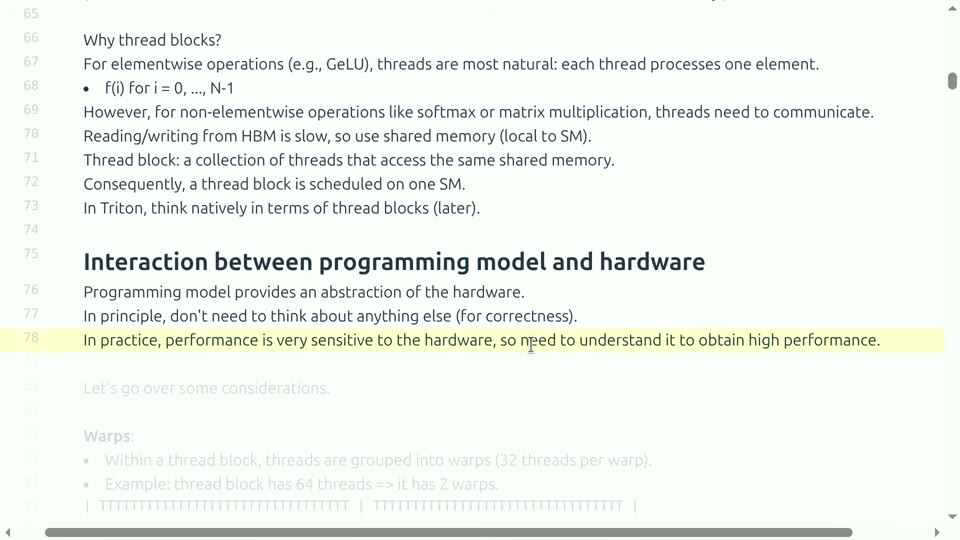
<figcaption>模型、编程系统和硬件相互影响：算子表达式只有经过编译和调度，才会形成实际设备工作。</figcaption>
</figure>

kernel 优化的目标不是把代码写得最短，而是在保持数学语义的前提下减少总时间。总时间可拆成
```math
\begin{equation}
T_{\mathrm{total}}=T_{\mathrm{launch}}+T_{\mathrm{memory}}+T_{\mathrm{compute}}+T_{\mathrm{sync}}.
\end{equation}
```
$`T_{\mathrm{launch}}`$ 是启动开销，$`T_{\mathrm{memory}}`$ 是读写数据时间，$`T_{\mathrm{compute}}`$ 是算术指令时间，$`T_{\mathrm{sync}}`$ 是等待和屏障时间。不同算子主导项不同，因此“优化 kernel”首先是找出主导项。

<figure data-latex-placement="H">
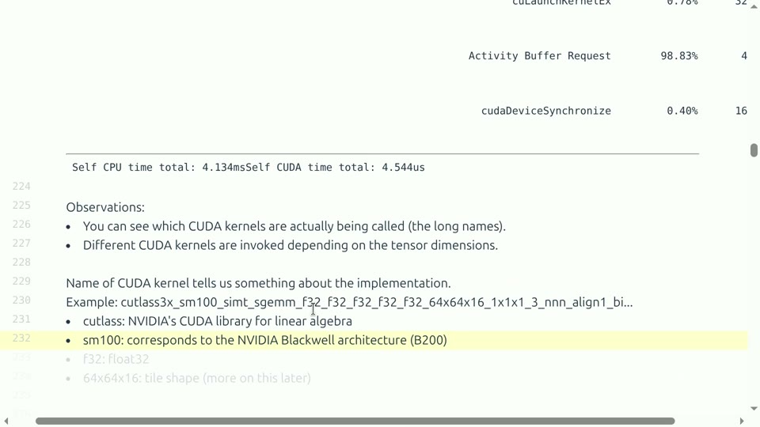
<figcaption>Profiler 中的 kernel 名称和时间线：需要从端到端调用追踪到真正耗时的设备函数。</figcaption>
</figure>

<div class="knowledgebox">

本讲的三层抽象 CUDA 提供接近硬件的线程、共享内存和同步控制；Triton 用块级张量和编程语言抽象降低手写 CUDA 的门槛；XLA/编译器则从计算图出发，自动融合、布局和生成设备代码。抽象越高，开发越快，但可控的硬件细节通常越少。

</div>

## 本章小结

Kernel 是张量表达式到硬件执行之间的桥。性能来自启动、访存、计算和同步的总和；后文将用同一账本比较 CUDA、Triton 和 XLA。

# 从朴素矩阵乘法开始

设 $`C=AB`$，其中 $`A\in\mathbb R^{M\times K}`$、$`B\in\mathbb R^{K\times N}`$。最朴素的 kernel 为每个 $`(i,j)`$ 线程计算一个输出：
```math
\begin{equation}
C_{ij}=\sum_{k=0}^{K-1}A_{ik}B_{kj}.
\end{equation}
```
每个线程要读取一整行 $`A`$ 和一整列 $`B`$；不同线程会重复读取相同元素。数学工作量约 $`2MKN`$ FLOPs，但显存流量可能很大，算术强度未必足够高。

<figure data-latex-placement="H">
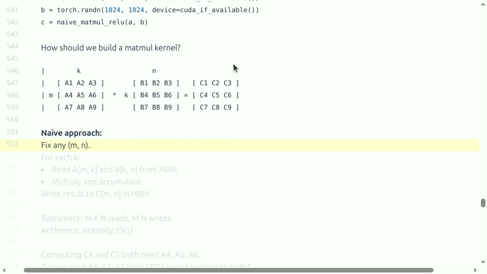
<figcaption>朴素矩阵乘法：每个输出元素独立计算，却反复从全局显存读取相同输入。</figcaption>
</figure>

## 为什么 tile 能提高复用

把输出划分成 $`B_M\times B_N`$ 的 tile，线程块协作把相应的 $`A`$、$`B`$ 子块搬入共享内存。一个 $`A`$ 元素可以被 tile 内多个线程复用，一个 $`B`$ 元素同样如此。每加载一次，完成更多乘加，算术强度因此提高。

<figure data-latex-placement="H">
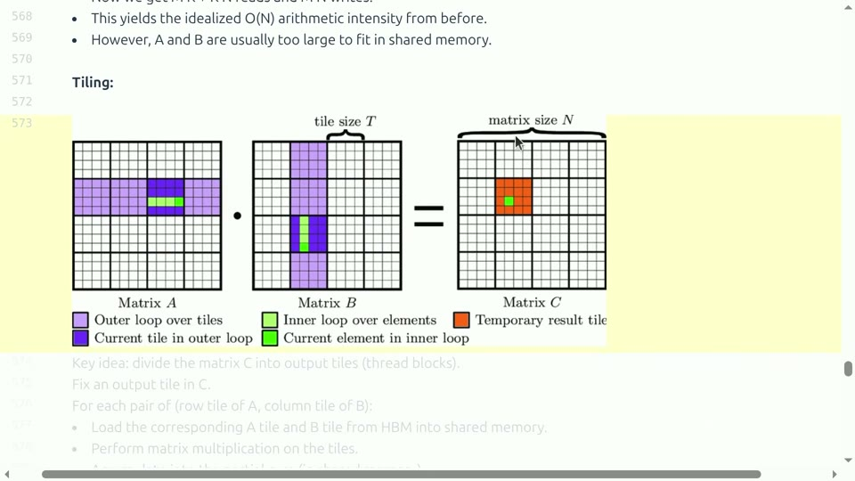
<figcaption>矩阵乘法的 tile：线程块把输入块放入共享内存，再协作计算输出块。</figcaption>
</figure>

<figure data-latex-placement="H">
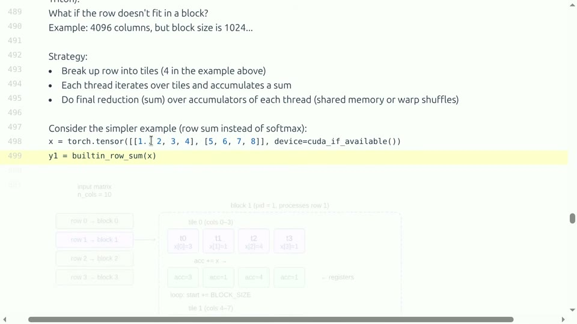
<figcaption>按行或二维块组织 tile：不同策略会改变复用、寄存器压力和访存合并。</figcaption>
</figure>

设每个 tile 计算 $`B_MB_NK`$ 次乘加，输入搬运约为 $`(B_MK+KB_N)`$ 个元素，则复用比例随 tile 增大而提高；但 tile 太大将超出共享内存或寄存器预算。实际 tile 形状要结合矩阵维度、warp 数和 Tensor Core 支持进行基准扫描。

<div class="warningbox">

边界 tile 的正确性 若 $`M,N,K`$ 不是 tile 大小的整数倍，线程可能访问越界。必须用 mask 或显式边界条件保护读写；错误的 mask 会产生静默数值错误，过度保守的 mask 又会让边界路径过慢。

</div>

## 本章小结

朴素实现让每个线程独立算一个结果，tile 实现让线程块共享输入。高性能矩阵乘法的关键是数据复用、对齐、边界处理和资源预算，而不是仅仅增加线程数。

# CUDA 编程模型与共享内存

CUDA 把线程组织为 grid、block 和 thread。block 是可独立调度的单位，block 内线程可以使用共享内存和同步屏障；不同 block 默认不能直接同步。线程索引通常映射到输出的行列或 tile 坐标。

<figure data-latex-placement="H">
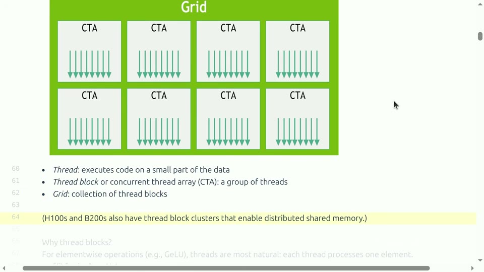
<figcaption>Grid、CTA（线程块）和线程的层级：每个 block 负责一个局部 tile，block 之间可并行执行。</figcaption>
</figure>

共享内存位于片上，延迟低但容量小。将输入 tile 从 global memory 搬到 shared memory 后，需要调用同步屏障，确保所有线程完成加载，再开始计算。屏障太多会降低并行度，屏障太少则会读到尚未写完的数据。

<figure data-latex-placement="H">
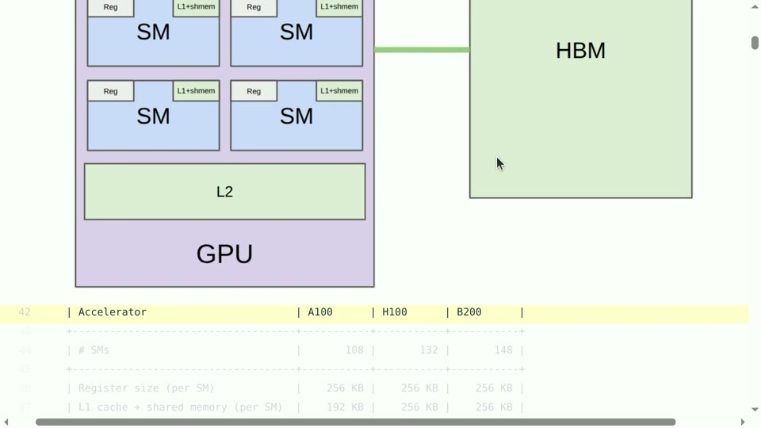
<figcaption>从全局显存到共享内存和寄存器的层级：越靠近计算单元越快，但容量越有限。</figcaption>
</figure>

共享内存按 bank 划分。若一个 warp 的线程同时访问不同 bank，可并行服务；若多个线程访问同一 bank，就发生 bank conflict，访问会被串行化。

<figure data-latex-placement="H">
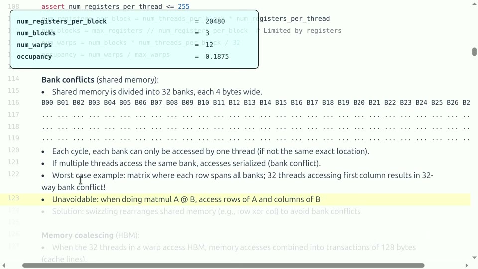
<figcaption>Bank conflict：共享内存地址模式不合适时，多个线程争用同一 bank，吞吐下降。</figcaption>
</figure>

解决方法包括改变 tile 的行列布局、加入 padding、转置后再读取或让线程访问连续 bank。padding 会增加少量空间，换取更规则的访问；是否值得应以 profiler 和基准为准。

## 本章小结

CUDA 的 block 负责资源和协作，shared memory 负责片上复用。同步和 bank 访问模式必须同时正确高效；一个看似合理的 tile 若产生冲突，可能比显存直读更慢。

# Triton：以块为中心的 kernel 语言

Triton 不要求程序员显式管理每个线程，而是描述块级张量运算：加载一个指针块、执行向量或矩阵操作、保存结果。编译器再把块映射到 warp 和线程。这样保留了 tile、mask 和布局等关键控制，同时减少 CUDA 样板代码。

<figure data-latex-placement="H">
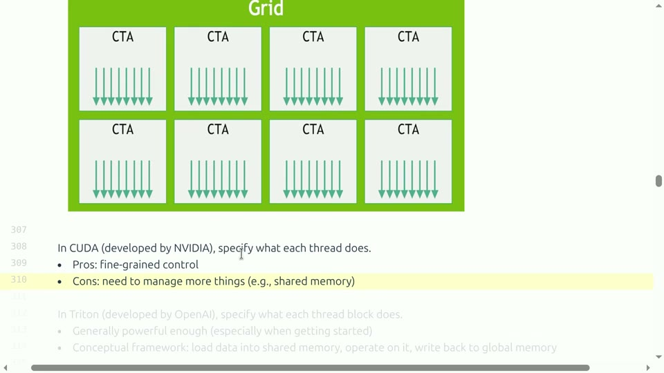
<figcaption>CUDA 与 Triton 的抽象差异：Triton 用块级指针和张量表达访存与计算。</figcaption>
</figure>

一个向量加法的 Triton 结构如下：

```
@triton.jit
def add_kernel(x_ptr, y_ptr, out_ptr, n_elements, BLOCK: tl.constexpr):
    pid = tl.program_id(axis=0)
    offsets = pid * BLOCK + tl.arange(0, BLOCK)
    mask = offsets < n_elements
    x = tl.load(x_ptr + offsets, mask=mask, other=0.0)
    y = tl.load(y_ptr + offsets, mask=mask, other=0.0)
    tl.store(out_ptr + offsets, x + y, mask=mask)
```

$`pid`$ 标识程序实例，$`offsets`$ 给出该块负责的元素，$`mask`$ 保护尾部。BLOCK 不是线程数的简单同义词，它描述一组逻辑元素，编译器会决定实际线程布局。

<figure data-latex-placement="H">
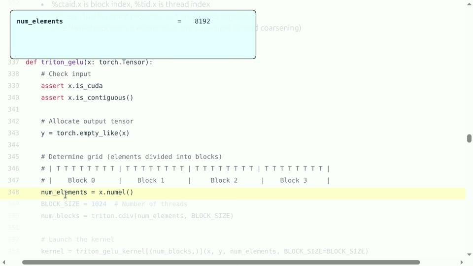
<figcaption>Triton 的 GELU 包装：自定义 kernel 可嵌入 Python 调用，并与参考实现比较。</figcaption>
</figure>

## 从向量算子到矩阵 tile

Triton 的矩阵 kernel 通常让每个 program instance 负责一个 $`C`$ tile，使用 tl.arange 生成行列偏移，循环遍历 $`K`$ 维块并在寄存器中累积。num_warps、num_stages 和 tile 尺寸共同决定资源使用与流水线深度。

<figure data-latex-placement="H">
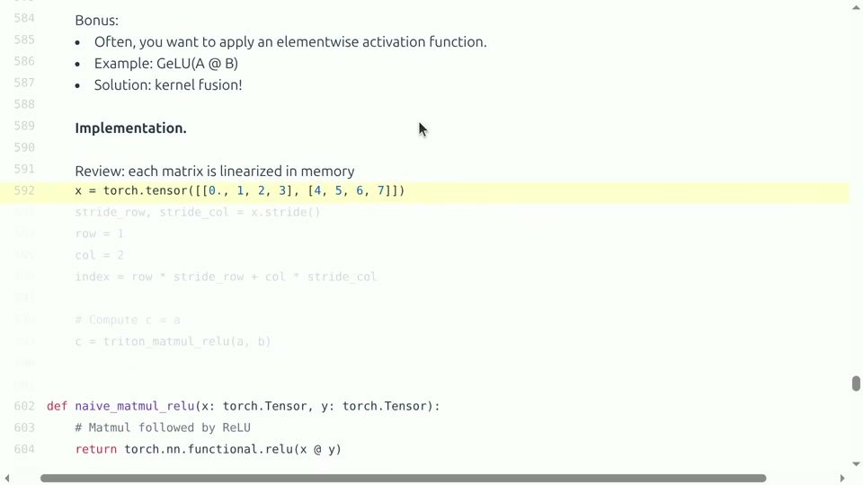
<figcaption>Triton 中把线性层与后续激活融合：中间结果可留在寄存器，减少显存往返。</figcaption>
</figure>

Triton 的优势是可读性和快速迭代；局限是复杂同步、极端布局和某些新硬件特性仍可能需要 CUDA 或手写库。不要把 Triton 当作“自动最快”：仍需检查生成的 kernel、寄存器、occupancy 和形状覆盖。

## 本章小结

Triton 把线程细节提升为块级张量，同时保留 tile、mask、布局和融合控制。它适合研究者快速写出高性能原型，但最终性能仍取决于编译配置和硬件验证。

# GELU：一个小算子为何值得单独优化

GELU 常写为
```math
\begin{equation}
\operatorname{GELU}(x)=x\Phi(x)\approx\frac{x}{2}\left(1+\tanh\left[\sqrt{\frac{2}{\pi}}\left(x+0.044715x^3\right)\right]\right),
\end{equation}
```
其中 $`\Phi`$ 是标准正态分布的累积分布函数。它是逐元素算子，FLOPs 不高，却需要读取输入、计算非线性并写回输出；若单独启动 kernel，启动和中间张量成本可能超过算术。

<figure data-latex-placement="H">
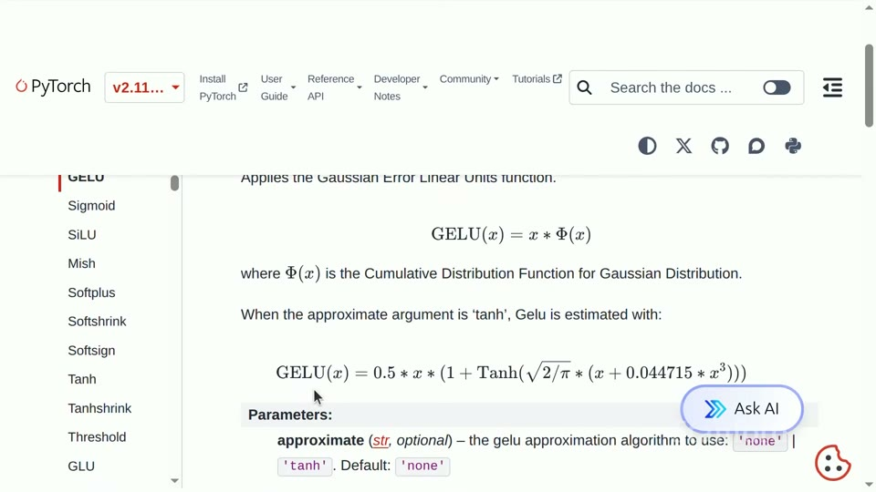
<figcaption>GELU 的精确形式和常用近似：不同实现的数值误差与速度需要同时比较。</figcaption>
</figure>

<figure data-latex-placement="H">
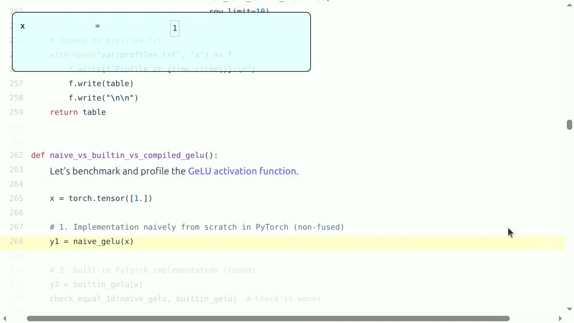
<figcaption>GELU 实现路径：库函数、Triton kernel 与编译融合各有取舍。</figcaption>
</figure>

对逐元素算子，算术强度通常很低。若输入输出各读写一次，每个元素的时间近似由字节数除以带宽决定。融合 GELU 与前一个线性层，可以省去中间写回；但若 fused kernel 寄存器过多，可能降低 occupancy。

<figure data-latex-placement="H">
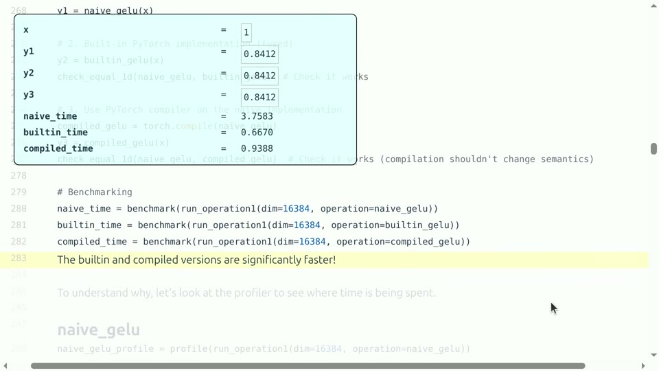
<figcaption>GELU 基准：不同实现的速度差异取决于张量大小、精度和是否融合。</figcaption>
</figure>

## 正确性和近似

快速近似并非所有训练设置都等价。应比较最大绝对误差、相对误差和下游 loss；对低精度输入，先将输入转为 FP32 计算非线性再转回，通常更稳定，但会增加转换成本。最终选择取决于误差容忍度与端到端收益。

## 本章小结

小算子常是 memory-bound 和 launch-bound。GELU 说明融合、近似和精度选择必须一起评估；一个局部更快的函数只有在整个 MLP 路径中减少了真实开销，才算成功。

# 编译器融合与 XLA

XLA 从高层计算图出发，进行算子融合、常量折叠、布局选择和设备代码生成。它能够把一串逐元素操作合并，也能把矩阵乘法与 bias、激活组合，减少中间张量。与手写 kernel 相比，编译器能在更广的图上下文中做全局决策。

<figure data-latex-placement="H">
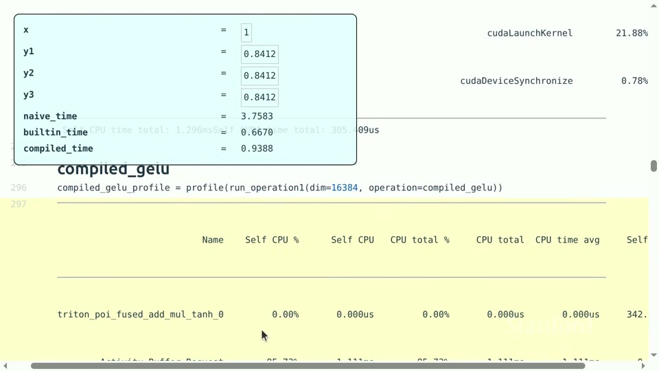
<figcaption>编译器融合后的 GELU：图级优化可消除中间张量和多次 kernel 启动。</figcaption>
</figure>

XLA 的典型流程是：前端生成 HLO/计算图 $`\rightarrow`$ 优化器分析形状和依赖 $`\rightarrow`$ 选择布局与融合策略 $`\rightarrow`$ 生成 GPU/TPU 代码 $`\rightarrow`$ 运行时缓存编译结果。静态形状有利于优化；动态形状会导致重新编译或选择保守路径。

<div class="knowledgebox">

何时优先用 XLA 如果模型计算图稳定、算子组合规律、设备目标明确且希望减少手写 kernel 维护，XLA 值得先尝试。如果存在大量动态路由、稀疏不规则访存、特殊同步或需要精确控制 shared memory，手写 CUDA/Triton 可能更合适。两者也可以混用：用编译器覆盖常见路径，用自定义 kernel 覆盖热点。

</div>

## 融合的代价

融合会增加代码规模、寄存器活跃范围和编译时间。一个融合过大的 kernel 可能降低 occupancy，或因某个分支无法融合而退回多个 kernel。要比较“编译器自动融合”和“手动融合”，必须记录编译时间、缓存命中、生成 kernel 数量、显存峰值和端到端时间。

## 本章小结

XLA 把优化从单个 kernel 提升到计算图。它擅长全局融合和布局选择，但动态形状和不规则稀疏会增加难度；编译器不是黑盒魔法，仍需检查生成代码和实际性能。

# 块波、占用率与流水线

线程块被分批调度到 SM，称为 block waves。若 block 数量不是 SM 数量的良好倍数，最后一波可能只有少数 block，形成尾部空闲。小 batch 或小矩阵尤其容易出现这种利用率问题。

<figure data-latex-placement="H">
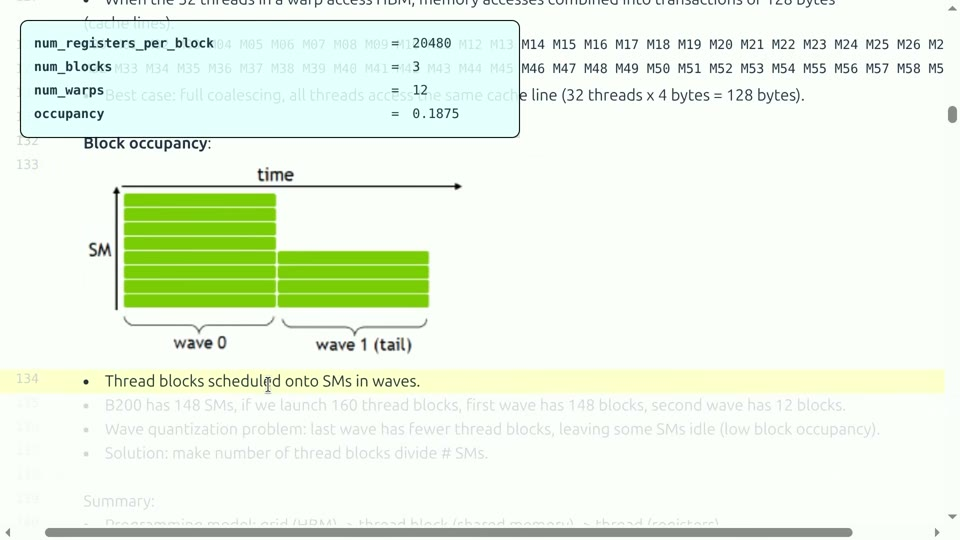
<figcaption>Block waves：线程块分批进入 SM，最后一波不完整时会造成尾部空闲。</figcaption>
</figure>

Occupancy 是一个 SM 上同时驻留的 warp 数相对硬件上限的比例。寄存器使用、共享内存使用和 block 线程数都会限制 occupancy；但高 occupancy 不等于高性能，若 kernel 已经带宽饱和或计算饱和，继续增加驻留 warp 没有收益。

<figure data-latex-placement="H">
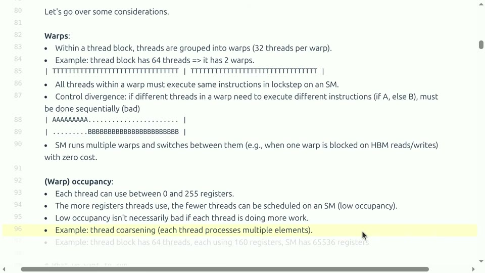
<figcaption>Warp occupancy：资源使用决定一个 SM 能同时容纳多少 warp，进而影响隐藏内存延迟的能力。</figcaption>
</figure>

多 stage 流水线可以在计算当前 tile 时预取下一 tile。stage 太少，计算会等待加载；stage 太多，占用更多共享内存并减少并发 block。最佳值依赖 tile、带宽和算术强度。

## 本章小结

block waves 解释尾部效应，occupancy 解释并发资源，pipeline stages 解释加载与计算重叠。三者要结合 profiler 判断：高 occupancy 只是条件，不是性能目标本身。

# 性能调试：从基线到可解释修改

一个可靠的 kernel 开发循环是：先写清晰参考实现；用随机和边界输入做正确性测试；用 CUDA event 计时并预热；用 profiler 找出主导项；每次只改变一个变量；最后在真实模型形状上回归。

```
def check_kernel(ref, opt, shapes, dtype):
    for shape in shapes:
        x = make_input(shape, dtype=dtype)
        y_ref = ref(x).float()
        y_opt = opt(x).float()
        assert isfinite(y_opt).all()
        err = (y_ref - y_opt).abs().max()
        assert err < tolerance(dtype, shape)
        print(shape, benchmark(opt, x))
```

<figure data-latex-placement="H">
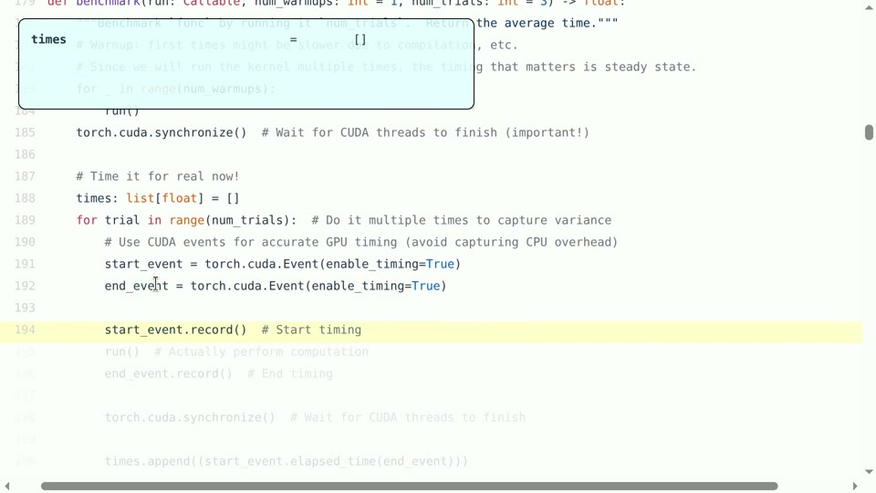
<figcaption>CUDA event 基准：使用设备事件和 warmup，避免主机计时把异步执行误判为 kernel 时间。</figcaption>
</figure>

基准必须固定：GPU 型号和时钟、驱动、编译选项、输入形状、batch、数据类型、warmup 次数、迭代次数和同步点。报告平均值时还应保留标准差或 P95，因为多流、热降频和系统负载会造成波动。

<div class="warningbox">

常见失败模式 一是没有同步就计时，得到接近零的假结果；二是只测大矩阵，忽略实际 decode 的小矩阵；三是优化版本输出略有偏差却未做逐层检查；四是把编译时间、首次缓存 miss 和稳定运行时间混在一起；五是只看单 kernel，不看前后布局转换和端到端路径。

</div>

## 本章小结

kernel 优化必须形成证据链：参考正确性、设备计时、profiler 瓶颈、形状覆盖和端到端回归。没有这些信息，“快了多少”无法解释，也无法复现。

# 算术强度与 IO：为什么小算子也会拖慢模型

上一讲的 Roofline 模型在 kernel 设计中最有用。对一个算子，先计算 $`F`$ 次 FLOP，再统计从 HBM 读取和写回的 $`B`$ 字节，算术强度为 $`I=F/B`$。若设备带宽为 $`BW`$、计算峰值为 $`P`$，运行时间下界是
```math
\begin{equation}
T\ge\max\left(\frac{B}{BW},\frac{F}{P}\right).
\end{equation}
```
逐元素归一化、激活、mask 和小规模 reduction 的 $`F`$ 很小，通常落在带宽侧；大 GEMM 的数据复用高，才可能落到计算侧。

<figure data-latex-placement="H">

<figcaption>同一算子在不同内存层级中的代价不同：把数据留在寄存器或共享内存，能减少昂贵的 HBM 访问。</figcaption>
</figure>

一个模型的端到端时间还包括算子之间的边界。如果线性层输出先写入 HBM，再被独立的 bias、激活和 dropout kernel 读回，实际字节量可能远大于公式中的输入输出。融合的收益可以从减少一次中间张量读写估算，但要检查融合后寄存器数量、occupancy 和并行度。

## kernel 启动和小工作量

每次启动 kernel 都有固定延迟。设单次启动成本为 $`t_0`$、实际设备工作为 $`t_w`$，当 $`t_w`$ 与 $`t_0`$ 同量级时，连续调用很多小 kernel 会把时间花在调度和同步上。把相邻逐元素操作融合，或使用向量化批处理，可以降低边界比例。反之，如果融合使编译时间、寄存器和代码路径急剧增加，就应保留可组合的实现。

<div class="importantbox">

判断顺序 先用 $`F/P`$ 和 $`B/BW`$ 给出两个下界，再从 profiler 确认启动、同步和 cache 是否改变主导项。这样能避免把一个明显带宽受限的激活函数误当成“需要更多数学优化”的问题。

</div>

## 本章小结

IO 和启动边界常常比 FLOPs 更决定小算子速度。融合的价值是减少中间读写和边界，但必须用资源和端到端基准验证，而不是凭图示直觉。

# 矩阵乘法的完整映射

将 $`C=AB`$ 映射到 GPU 时，先给每个 program 分配输出 tile $`(i_0:i_0+B_M,j_0:j_0+B_N)`$，再沿 $`K`$ 维分块。每个块从 global memory 加载 $`A`$ 和 $`B`$ 的子块，在寄存器中维护 $`C`$ 的部分和，循环结束后写回。一个好的映射要满足三点：同一 warp 的地址尽量连续，输入 tile 在线程间高复用，寄存器和共享内存使用不超过驻留限制。

<figure data-latex-placement="H">

<figcaption>输出 tile 与输入 tile 的对应关系：同一块输入被多个输出元素复用。</figcaption>
</figure>

若 $`B_M=B_N=128`$，一个输出 tile 有 $`16384`$ 个元素；每次 $`K`$ 分块只需加载 $`128B_K+B_K128`$ 个输入元素，却完成 $`128\times128\times B_K`$ 次乘加。tile 越大复用越强，但片上空间和寄存器占用也越大。对于边界 tile，mask 只允许有效元素参与，累积寄存器要用零填充无效位置。

<figure data-latex-placement="H">

<figcaption>行式与二维 tile 的比较：不同映射影响访存连续性、复用和尾部效率。</figcaption>
</figure>

## 布局和转置

矩阵在内存中的 row-major 或 column-major 布局决定线程索引如何变成地址。若线程沿连续维访问，事务可合并；若线程沿 stride 很大的维访问，实际读取会被拆成许多事务。共享内存中可先写入一种布局，再以转置布局读出，从而把全局连续访问与计算需要的排列分开。

<figure data-latex-placement="H">

<figcaption>共享内存转置时若地址落在相同 bank，会出现冲突；padding 是常用的修正手段。</figcaption>
</figure>

## 本章小结

矩阵 kernel 的性能是索引、布局、tile、mask 和资源共同决定的。先画清楚一个 tile 的地址，再调 BLOCK、warps 和 stages，通常比盲目改公式更有效。

# Triton 参数与自动调优

Triton kernel 常把 BLOCK_M、BLOCK_N、BLOCK_K、num_warps 和 num_stages 作为编译时参数。不同形状的最优组合通常不同，因此可以为大矩阵、窄矩阵和 decode 形状分别提供配置。自动调优的目标函数应是真实端到端时间或加权成本，而不只是单个大形状的 kernel 时间。

```
configs = [
    {"BM": 128, "BN": 128, "BK": 32, "warps": 8},
    {"BM": 64,  "BN": 128, "BK": 32, "warps": 4},
]
best = min(configs, key=lambda c: benchmark_shape(c, shape))
```

调优时先删掉明显不合法的配置：共享内存超限、BLOCK 不是硬件友好倍数、mask 逻辑不正确或寄存器导致无法驻留。随后在每种配置上热身、重复计时，并保存均值和分位数。不要让自动调优只追求某个随机种子下的偶然最快；应在相邻形状上做回归，检查配置是否稳健。

<figure data-latex-placement="H">

<figcaption>Triton 包装器把自定义 kernel 接入 Python，并可在统一接口下切换参考和优化实现。</figcaption>
</figure>

## 本章小结

Triton 的参数空间需要按形状调优。自动搜索必须带有合法性过滤、正确性检查、热身、重复计时和相邻形状回归，才能把一次最快配置变成可维护实现。

# XLA：从图优化到运行时缓存

XLA 会把高层运算转为 HLO 图，分析依赖和布局后再生成目标设备代码。融合通常发生在没有跨算子复用需求、布局兼容且资源预算允许的路径上。若一个中间结果被多个分支使用，复制计算可能比写回一次更贵，编译器会在复用和融合之间权衡。

<figure data-latex-placement="H">

<figcaption>图级融合示意：多个逐元素操作可以合并为一个设备程序，减少中间张量。</figcaption>
</figure>

动态形状会带来两个问题：一是编译器难以静态决定 tile 和内存；二是不同形状可能触发重新编译。静态 padding 牺牲一些无效计算换取编译缓存和规则 kernel，动态编译则节省无效元素但要支付编译开销。服务系统应根据请求形状分布选择策略。

<div class="knowledgebox">

编译器与自定义 kernel 的边界 如果 HLO 图规则、形状稳定并且常见算子已有高质量 lowering，先让 XLA 做全局优化；如果热点是一个新颖的稀疏、路由或特殊访存算子，再用 Triton/CUDA 补齐，并把自定义调用接回图中。这样能同时获得全局融合和局部硬件控制。

</div>

## 本章小结

XLA 的力量来自全图上下文，代价是形状、布局和编译缓存管理。使用它时要记录生成程序、编译次数和运行时命中，避免把首次编译时间误算到稳定吞吐中。

# 正确性、数值与性能的共同验证

kernel 修改要先通过确定性小输入、随机输入、边界输入和极端幅值输入。矩阵乘法应覆盖 $`M,N,K`$ 为 1、非 tile 倍数、很大和很窄的情况；softmax/GELU 应覆盖正负大值、全零、NaN/Inf 传播策略。比较时报告绝对误差、相对误差和下游 loss，必要时逐层检查激活。

```math
\begin{equation}
\mathrm{relerr}(y,\hat y)=\frac{\|y-\hat y\|_2}{\|y\|_2+\epsilon}.
\end{equation}
```
不同归约顺序会产生微小浮点差异，不能只用 bitwise equality；但误差应随输入规模和精度可解释地变化。若误差在某一形状突然爆炸，优先查 mask、布局、累积精度和越界，而不是直接放宽阈值。

<figure data-latex-placement="H">

<figcaption>设备事件计时：异步 kernel 必须在 warmup 后用同步事件测量，才能得到可信时间。</figcaption>
</figure>

性能回归还要保留参考实现。一次代码提交至少记录：版本、设备、驱动、编译器、形状、精度、warmup、迭代数、均值、标准差、P95、显存和正确性阈值。若新实现只在一个形状变快，却让常见形状变慢，不应默认替换，而应由调用方按形状选择。

<div class="warningbox">

不要以“没有报错”作为验证 GPU 越界、未初始化读取和 race condition 可能只在特定形状或高并发下出现。应使用边界输入、同步检查、设备调试工具和多次随机运行，结合结果差异与 profiler 时间线定位问题。

</div>

## 本章小结

高性能 kernel 需要三重证据：数学结果正确、数值误差受控、真实工作负载加速。参考实现和自动回归让优化可以持续，而不是一次性的手工演示。

在实际模型中，算子往往被多个 stream 和多个请求同时调用。单个 kernel 的最佳配置可能在并发时造成资源争用，因此最终基准应覆盖串行、并发和不同请求长度混合的情况。只有当优化在这些条件下仍保持稳定，才适合成为默认实现。还应观察显存碎片、编译缓存命中和设备温度，因为长时间运行时这些因素会改变可用资源。

把运行条件写清楚，才能让性能和正确性结论经得起复查，并能指导下一次内核设计。完整记录也能帮助团队复用已经验证的配置。

# FlashAttention 的实现思维

注意力的数学式包含三次主要操作：$`S=QK^\top`$，$`P=\operatorname{softmax}(S)`$，$`O=PV`$。朴素实现先把 $`S`$ 和 $`P`$ 写入 HBM，再读取它们；长序列时中间矩阵的字节数可超过输入本身。FlashAttention 把 query、key、value 按 tile 载入片上存储，在片上完成分数、归一化和加权累积，避免物化完整分数矩阵。

<figure data-latex-placement="H">
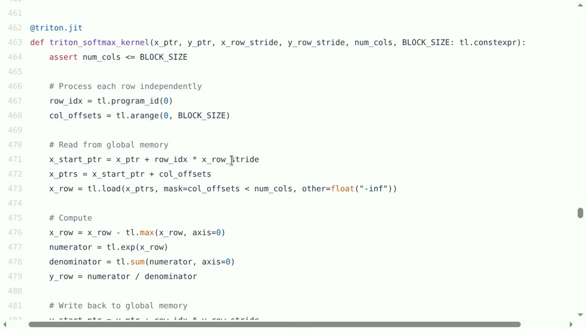
<figcaption>块级 softmax kernel：在一个块内维护最大值和归一化统计，减少全局内存访问。</figcaption>
</figure>

对一个分数块，在线 softmax 维护当前最大值 $`m`$、指数和 $`\ell`$ 以及输出累积量 $`O`$。遇到新块最大值 $`m'`$ 时，先令 $`m_{\mathrm{new}}=\max(m,m')`$，再按
```math
\begin{align}
\ell_{\mathrm{new}}&=e^{m-m_{\mathrm{new}}}\ell+
e^{m'-m_{\mathrm{new}}}\ell',\\
O_{\mathrm{new}}&=e^{m-m_{\mathrm{new}}}O+
e^{m'-m_{\mathrm{new}}}O'
\end{align}
```
重标定旧值和新值。这样不保存所有分数，也能得到与完整 softmax 相同的结果（忽略浮点舍入）。

## 为什么 tile 形状很重要

tile 过小会让加载和启动边界占比过大；tile 过大又会超出共享内存或寄存器预算。query tile 与 key tile 的方向还决定访问是连续还是跨 stride。因果 mask 使上三角无效，边界块必须正确屏蔽。反向传播则需要保存或重算足够的统计量，在显存和计算间再做一次折中。

<figure data-latex-placement="H">

<figcaption>融合矩阵乘法和后续逐元素操作：中间结果直接在片上流转，适合 memory-bound 路径。</figcaption>
</figure>

FlashAttention 不是一条固定代码，而是一组针对头维、序列长度、batch、精度和硬件的 kernel。要评估它，应比较朴素实现、分块实现和库实现的显存峰值、读写字节、数值误差、prefill 时间与 decode 时间；只在一个长序列点上测得的加速不能代表所有服务场景。

## 本章小结

FlashAttention 将 tiling、融合、在线 softmax 和布局优化合在一起。它展示了一个更一般的原则：当中间结果很大时，改变数据存储路径往往比减少几次乘法更重要。

# 把性能实验写成可复现记录

一个可复现的 kernel 实验至少需要五部分。第一是环境：GPU 型号、驱动、CUDA/Triton/XLA 版本和时钟状态；第二是输入：形状、布局、batch、随机种子和数据类型；第三是正确性：参考实现、绝对/相对误差和 NaN 检查；第四是性能：warmup、同步方式、迭代次数、均值、标准差和 P95；第五是解释：profiler 中的带宽、计算单元、occupancy、寄存器和同步等待。

```
record = {
    "shape": shape, "dtype": str(dtype), "device": device_name,
    "warmup": 20, "iters": 100, "mean_ms": mean_ms,
    "p95_ms": p95_ms, "max_abs_err": max_err,
    "memory_mb": peak_memory, "kernel": kernel_name,
}
```

同一个优化应在三组形状上测试：大矩阵用于检查计算峰值，小 batch decode 用于检查带宽和启动，长上下文 attention 用于检查 IO 和显存。若结果互相矛盾，应回到时间线解释，而不是取一个最漂亮的数字。失败实验也应保存，因为它能说明某个假设在哪个边界失效。

<div class="summarybox">

工程判断准则 能说清楚“减少了哪些字节、增加了哪些资源、在哪些形状有效、误差多大、是否改善端到端”，才是完整的性能结论。代码、配置和结果表要一起保存，下一次修改才能建立在真实基线之上。

</div>

# 访问模式的三个具体检查

第一，看相邻线程是否访问相邻地址。若一个 warp 读取连续元素，硬件可以合并事务；若 stride 很大，带宽会被浪费。第二，看同一数据是否在 tile 内复用。一个权重元素若被多个输出重复使用，应尽量放在共享内存或寄存器中。第三，看读写是否对齐。对齐到缓存线和矩阵单元要求的粒度，能减少拆分事务和尾部浪费。

这些检查也适用于 attention 的 KV cache。decode 时每个 query 需要读取历史 key/value；若头维和缓存布局不匹配，读取会跨越很多 stride。通过按 token 块存储、合并多个请求的相同布局，或让线程沿连续头维读取，可以改善合并访问。若上下文长度动态变化，还要避免频繁搬运和重新分配缓存。缓存的块大小还应与分页管理和批处理策略相容，才能同时降低碎片和访存开销。

<div class="knowledgebox">

从硬件现象到代码修改 带宽低且事务数多，先改布局；共享内存冲突，先改 bank 映射或 padding；occupancy 低，先查寄存器和 tile；kernel 数量多且每个很短，先考虑融合；通信等待长，先做计算通信重叠。每种现象都有更直接的第一步，避免同时改动太多变量。

</div>

## 本章小结

内存合并、数据复用和对齐是最可迁移的 kernel 经验。对矩阵和 KV cache 都应画出线程到地址的映射，再用 profiler 验证修改是否真的减少了事务和等待。遇到异常时，先判断问题属于地址、容量、同步还是计算，再选择对应工具；不要用增加线程数这一种办法解决所有问题。

完整记录也能帮助团队复用已经验证的配置，并在硬件或编译器升级后快速发现回归，避免性能退化悄悄进入训练主线。

也让错误可以在小规模实验中尽早暴露，再安全地进入大规模训练流程中，减少返工。

完整记录还能减少返工和重复测量。

# 把 CUDA、Triton 和 XLA 放在同一决策框架

<div class="center">

| 工具 | 最强控制点 | 典型优势 | 风险/边界 |
|:---|:---|:---|:---|
| CUDA | 线程、共享内存、特殊硬件指令 | 极致控制、成熟库、复杂同步 | 开发维护成本高，易写出隐蔽错误 |
| Triton | 块、mask、布局、融合 | 原型快、代码短、适合研究热点 | 极端布局和新特性可能受限 |
| XLA | 计算图、融合、布局、编译缓存 | 全局优化、减少样板代码 | 动态形状和不规则稀疏路径较难 |

</div>

选择工具时先看热点是否稳定。如果热点是成熟 GEMM，优先调用高质量库；如果是一个需要快速探索的 fused attention/激活，Triton 常是好起点；如果整个图有大量可融合的规则算子，XLA 可能提供更高层收益；如果要控制 bank、warp、异步拷贝或特殊 tensor 指令，再下沉到 CUDA。

<figure data-latex-placement="H">

<figcaption>统一视角：模型结构、编译器选择和硬件资源相互制约，工具选择应服务于实际瓶颈。</figcaption>
</figure>

<div class="importantbox">

一个实用的升级路径 先用 PyTorch 参考实现确认语义；再用 profiler 找热点；用 Triton 写最小可行 kernel；在多个形状和精度上验证；若性能仍受限，再考虑 CUDA 特化或图级 XLA 融合；最终把自定义实现封装为可回退的模块，并保留参考路径做持续回归。

</div>

## 本章小结

CUDA、Triton、XLA 不是互斥阵营，而是不同控制粒度。先定位瓶颈，再选择最小复杂度的工具；始终保留参考实现和回退路径。

# 综合复习：从表达式到硬件指令

本讲可以压缩成一条因果链：高层表达式产生计算图；编译器把图切成 kernel；kernel 把元素映射到 block 和 warp；线程通过布局访问不同内存层级；tile 和融合决定复用与中间写回；精度和形状决定矩阵单元能否充分利用；profiler 再把真实时间反馈给下一轮设计。

<div class="summarybox">

带走的结论

- kernel 总时间由启动、内存、计算和同步共同构成；

- 矩阵乘法的速度核心是 tile、复用、对齐、边界和共享内存；

- Triton 用块级抽象快速表达自定义 kernel，但仍需调参和基准；

- XLA 从计算图做融合和布局优化，适合规则、稳定的图；

- 小算子如 GELU 常受带宽和启动限制，融合可减少中间数据移动；

- occupancy、block waves 和 pipeline stages 解释并发与尾部效应；

- 性能结论必须绑定形状、精度、设备、正确性和端到端路径。

</div>

# 自测题与实践任务

1.  对 $`M=N=K=4096`$ 的矩阵乘法，说明为什么朴素线程映射会重复读取输入，并画出一个 $`128\times128`$ tile 的加载和复用过程。

2.  一个 kernel 的显存带宽达到峰值但 SM 利用率只有 30%，另一个 kernel 的 Tensor Core 利用率达到 90% 但端到端速度没有变快。分别给出排查方向。

3.  用 Triton 实现向量加法和 GELU，比较单独 kernel 与融合前后版本的显存流量和时间。

4.  对一个动态序列长度模型，比较 XLA 静态 padding、动态形状编译和自定义 Triton 的编译/运行折衷。

5.  设计一个矩阵 tile 扫描实验，记录 tile 大小、num warps、寄存器、occupancy、带宽和正确性误差，并说明如何选择最终配置。

<div class="summarybox">

最终复习路径 先能解释一个张量表达式会产生哪些 kernel，再能看懂线程索引、mask、tile 和内存事务；随后用 profiler 证明瓶颈，再用 Triton/XLA/CUDA 做单变量修改。只有把数学正确性、硬件资源和端到端基准连起来，才真正掌握 kernel 工程。

</div>
