<div class="titlepage">

**Stanford CS336 第 7 讲：并行计算\
标准课程笔记·修订版**

五道口纳什 & Codex

2026 年 8 月 30 日

<div class="tcolorbox">

**视频作者/频道**：Stanford Online

**发布日期**：2026 年 4 月 28 日

**视频时长**：1:21:02

**视频链接**：

**PDF制作Skill**：[`https://github.com/wdkns/wdkns-skills`](https://github.com/wdkns/wdkns-skills)

</div>

</div>

# 阅读指南：整节课只讲一件事

这节课的核心不是背诵一组 API，而是建立一个统一视角：**大模型训练是在计算和数据搬运之间不断取舍**。当参数、激活或优化器状态装不进一张 GPU，或单卡吞吐已经不够时，计算必须被切开；一旦切开，就必须付出通信代价。

<figure data-latex-placement="H">
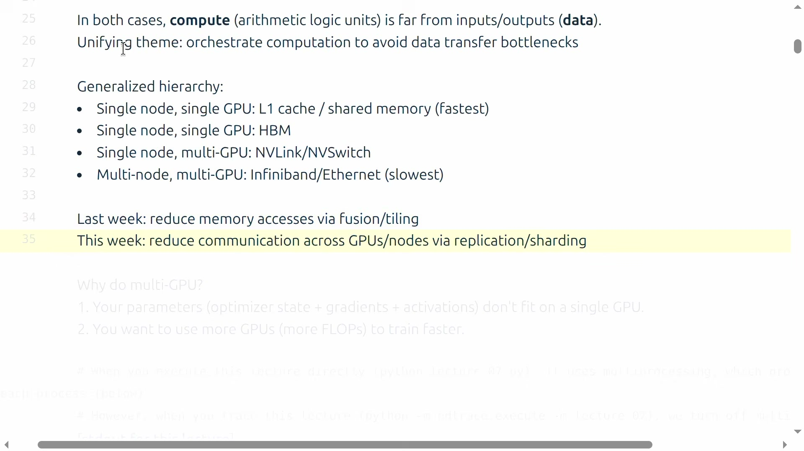
<figcaption>课程将上一讲的单 GPU 存储层次扩展为跨 GPU、跨节点的广义数据移动层次。</figcaption>
</figure>

<div class="importantbox">

本讲主线

1.  用 collective operations 描述多个 rank 如何搬数据；

2.  用 PCIe、NVLink/NVSwitch、InfiniBand/Ethernet 解释通信为什么快或慢；

3.  用 NCCL 和 `torch.distributed` 把抽象原语落到代码；

4.  通过正确的基准测试量化通信；

5.  沿 batch、width、depth 三个轴得到数据并行、张量并行和流水线并行。

</div>

<figure data-latex-placement="H">
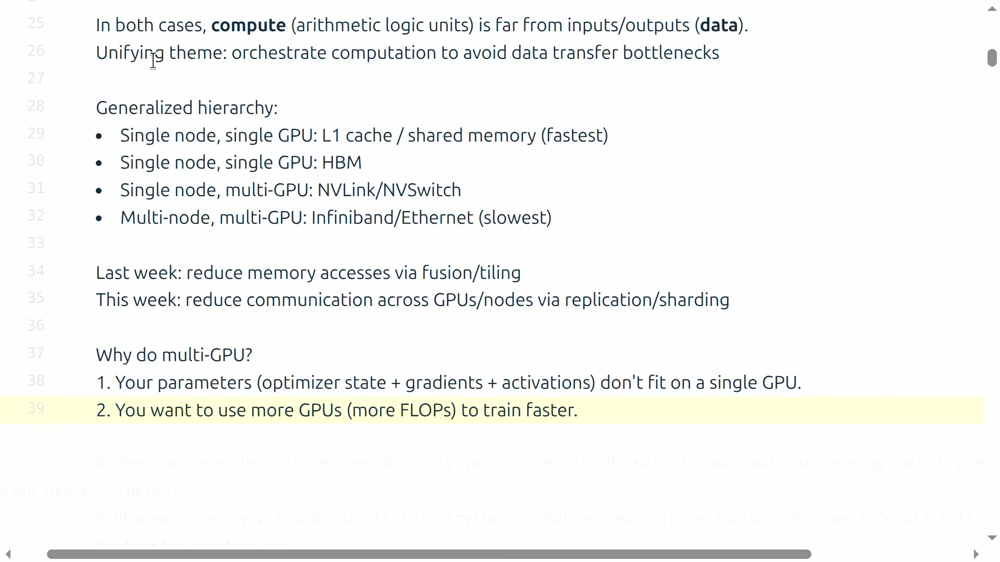
<figcaption>多 GPU 的两个直接动机：突破单卡容量上限，或缩短训练时间。</figcaption>
</figure>

## 学习目标

完成本笔记后，应当能够：（1）画出六类常见 collective 的输入/输出；（2）解释拓扑为何决定通信上限；（3）写出最小可复现的分布式程序；（4）区分错误的计时与有效带宽核算；（5）根据内存、带宽和批大小限制选择并行方案。

<figure data-latex-placement="H">
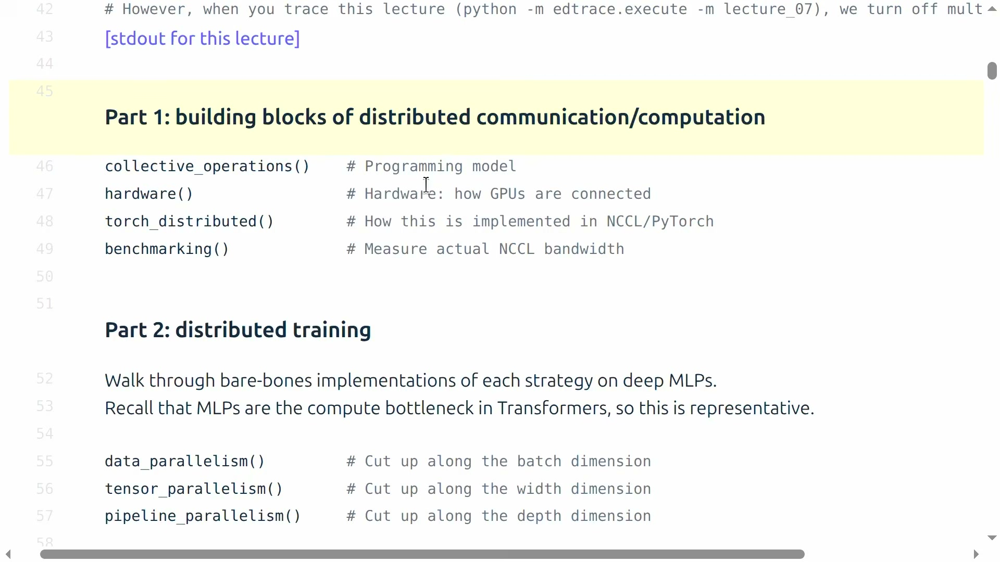
<figcaption>课程路线：先建立通信积木，再组装分布式训练策略。</figcaption>
</figure>

## 本章小结

并行训练的第一性问题是：哪些数据放在哪里，什么时候搬，搬多少，能否和计算重叠。后续所有技术都是这四个问题的具体答案。

# Collective Operations：多卡通信的积木

## Rank、world size 与进程组

**rank** 是进程组中成员的编号，**world size** 是组内成员数量。本课采用“一个 rank 对应一张 GPU”的常见设置，但这是实现约定，不是 rank 的定义。Collective 要求组内进程按相同的顺序参与；如果某个 rank 跳过了一次集体通信，其他 rank 往往会永久等待。

<figure data-latex-placement="H">
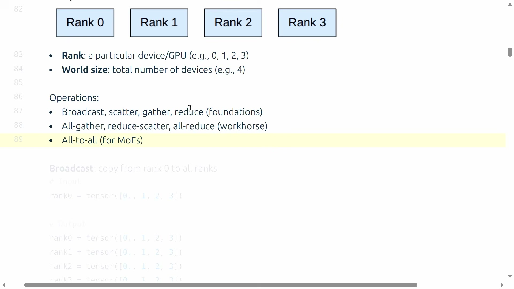
<figcaption>六类原语可分为一对多、多对一以及多对多。</figcaption>
</figure>

## Broadcast、Scatter 与 Gather

**Broadcast** 把 root rank 上的完整张量复制给所有 rank；**Scatter** 把 root 上的完整张量分片，每个 rank 只获得一片；**Gather** 则把各 rank 的分片收集到 root。

<figure data-latex-placement="H">
<figure>
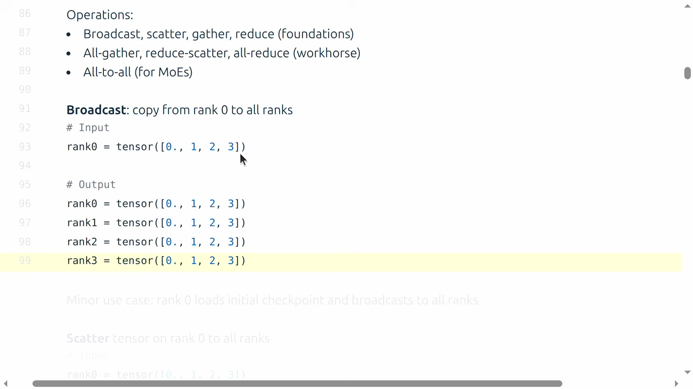
<figcaption>Broadcast：复制整个张量。</figcaption>
</figure>
<figure>
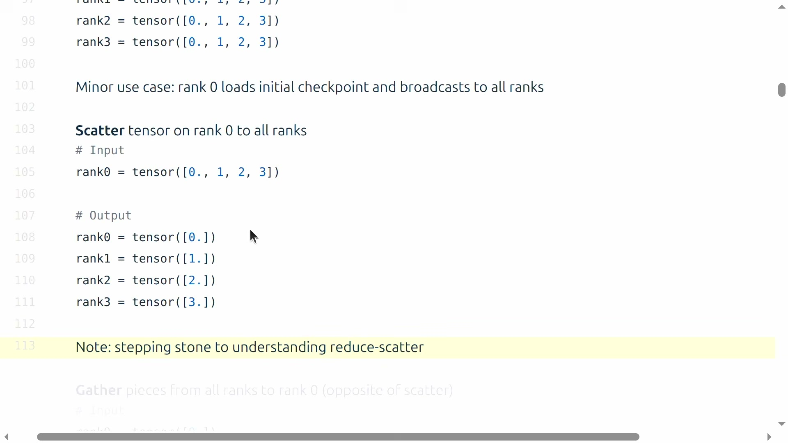
<figcaption>Scatter：切片后分发。</figcaption>
</figure>
<figcaption>Broadcast 与 Scatter 的数据布局差异。</figcaption>
</figure>

<div class="warningbox">

字幕纠错 视频自动转写在约 10:13 处出现“scatter 的逆是 scatter”，根据上下文与标准定义，这里应为**gather**。

</div>

## All-gather、Reduce-scatter 与 All-reduce

All-gather 从每个 rank 收集一个分片，使每个 rank 都获得完整结果。Reduce-scatter 先对各 rank 的对应元素执行求和等归约，再把归约结果分片。All-reduce 则使每个 rank 都得到完整归约结果。

<figure data-latex-placement="H">
<figure>
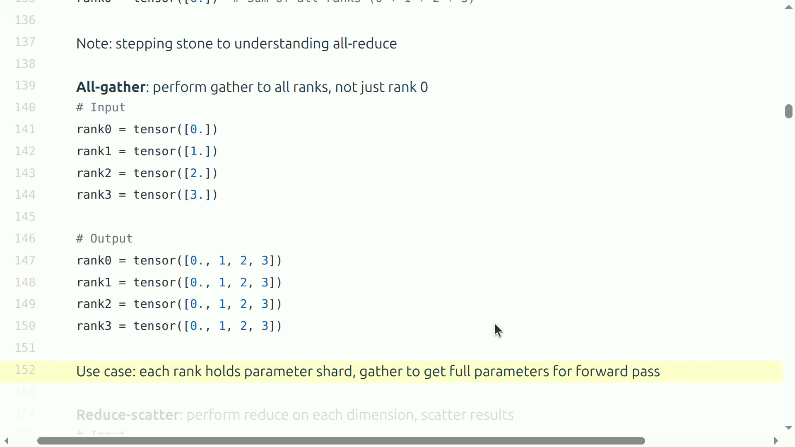
<figcaption>All-gather：全员获得完整拼接。</figcaption>
</figure>
<figure>
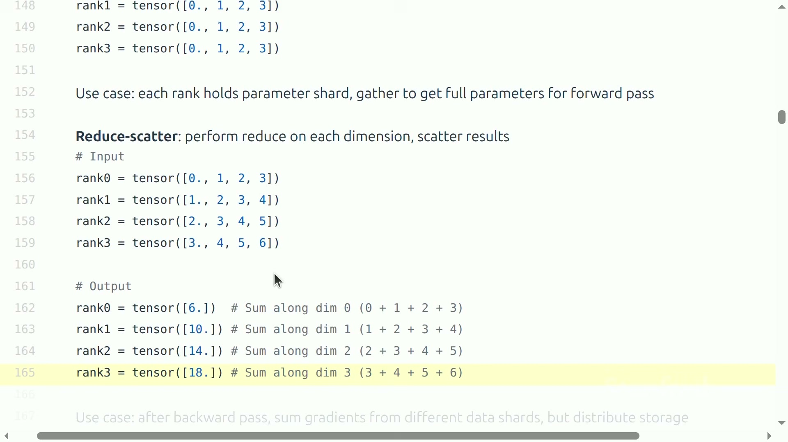
<figcaption>Reduce-scatter：归约后分片。</figcaption>
</figure>
<figcaption>两个可以前后组合的原语。</figcaption>
</figure>

对于求和归约，一个关键恒等式是
```math
\operatorname{AllReduce}(X)
=\operatorname{AllGather}\!\left(\operatorname{ReduceScatter}(X)\right).
```

$`X`$
表示各 rank 上参与归约的输入张量集合。

$`\operatorname{ReduceScatter}`$
产生已归约、但仍然分片的结果。

$`\operatorname{AllGather}`$
将这些分片收集到每个 rank。

<figure data-latex-placement="H">
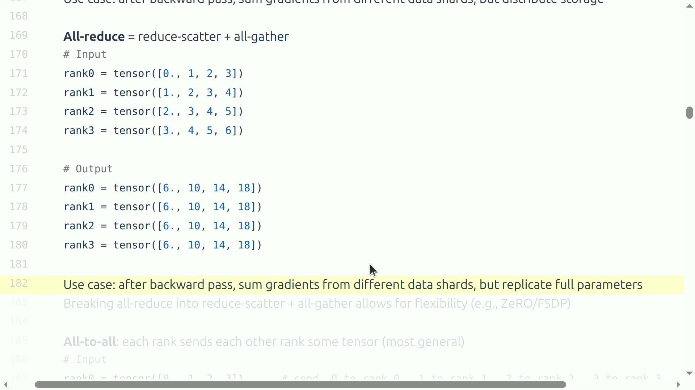
<figcaption>All-reduce 是 DDP 同步梯度的基础，也可分解为 reduce-scatter 和 all-gather。</figcaption>
</figure>

## All-to-all：为“路由”而生

All-to-all 不是把同一份数据传给所有人，而是每个发送方都为每个目标 rank 准备不同分片。它是 Mixture-of-Experts 中 token 路由到不同 expert 的自然原语，同时也很容易暴露跨节点网络的双向竞争。

<figure data-latex-placement="H">
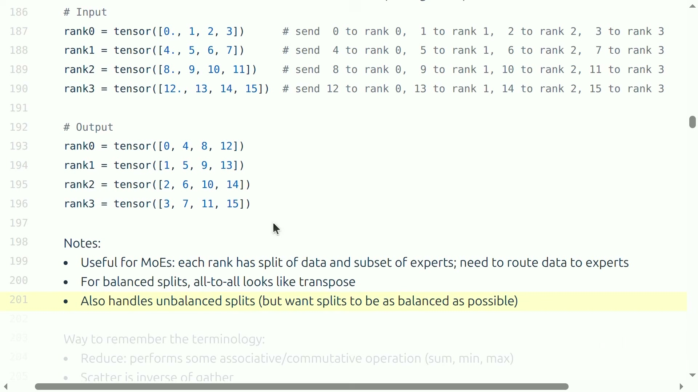
<figcaption>All-to-all：每个 rank 向每个目标发送专属分片。</figcaption>
</figure>

## 选择原语的一句话规则

<div class="knowledgebox">

从期望的数据布局倒推原语 要完整复制，broadcast；要分片分发，scatter；要收集到 root，gather；要让全员拿到完整拼接，all-gather；要归约后仍保持分片，reduce-scatter；要全员拿到完整归约，all-reduce；要做全员个性化路由，all-to-all。

</div>

## 本章小结

Collective 是数据布局变换，而不只是“发消息”。设计并行算法时，先明确通信前后每个 rank 拥有哪些数据，通常比先挑 API 更可靠。

# 互联硬件：为什么同一个 All-reduce 快慢悬殊

## 传统拓扑与现代拓扑

在简化的传统服务器中，GPU 通过 PCIe 连到 CPU，跨机数据再经网卡和 Ethernet。现代 AI 服务器通常另设高带宽的 GPU–GPU 通路，例如 NVLink 和 NVSwitch；跨节点则使用 InfiniBand 或支持 RoCE 的 Ethernet。

<figure data-latex-placement="H">
<figure>
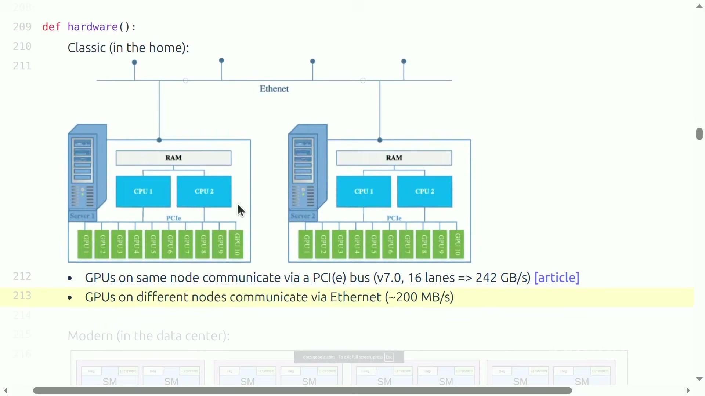
<figcaption>经典：PCIe + Ethernet。</figcaption>
</figure>
<figure>
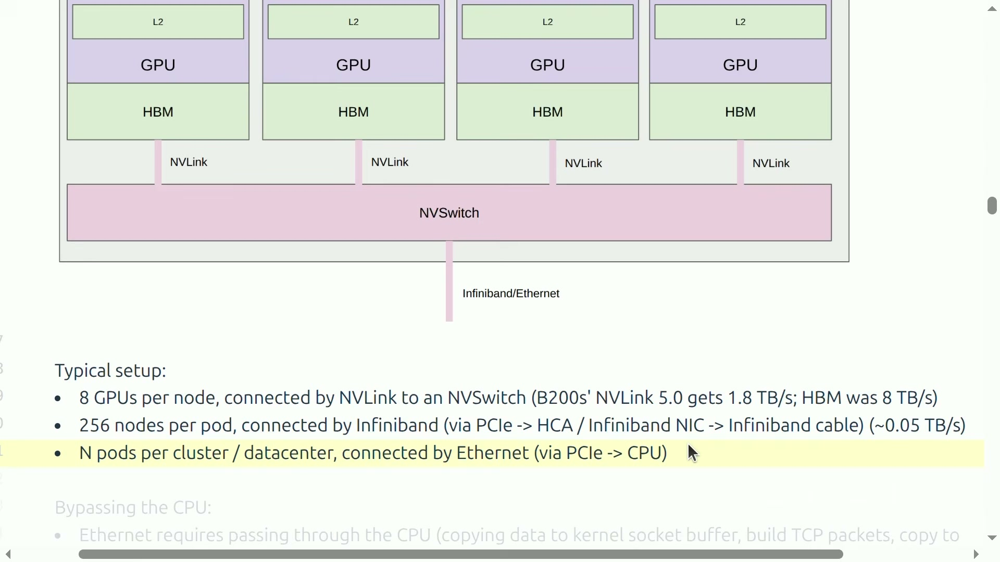
<figcaption>现代：NVLink/NVSwitch + 高速网络。</figcaption>
</figure>
<figcaption>节点内与节点间通信常常处在不同数量级。</figcaption>
</figure>

<div class="importantbox">

拓扑是算法设计的一部分 一个逻辑上漂亮的分片方案，如果在每层都迫使大量激活跨慢网络传输，仍可能比单卡更慢。因此应尽量把通信频繁、延迟敏感的并行组放在高带宽域内。

</div>

## RDMA：绕过不必要的 CPU 中转

传统 TCP/IP 路径常需要 CPU 和系统内存参与数据拷贝与协议处理。RDMA 允许网卡更直接地访问远端已注册内存；在 GPU Direct RDMA 语境中，数据路径还可减少主机内存中转。其目标是降低延迟、减少 CPU 开销并提高大消息吞吐。

<figure data-latex-placement="H">
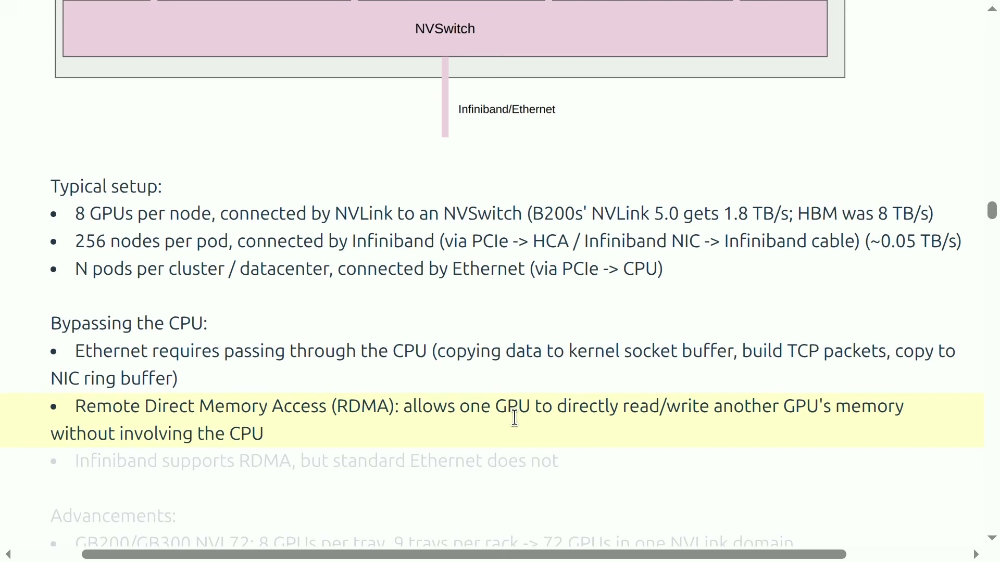
<figcaption>RDMA 让通信路径尽量避免 CPU 和主机内存的反复中转。</figcaption>
</figure>

<div class="warningbox">

不要把 Ethernet 等同于“不支持 RDMA” 课堂为了建立直觉将传统 Ethernet/TCP 路径与 InfiniBand/RDMA 对比。在工程上，RoCE 可以在 Ethernet 上提供 RDMA 语义。判断性能时应查实网卡、交换网络、协议栈和拥塞控制的实际配置。

</div>

## 本章小结

同一个 collective 的性能是“算法 × 拓扑 × 实现”的结果。单看峰值带宽不够；还要看数据经过哪些链路、是否竞争、消息大小以及是否能与计算重叠。

# 软件栈：从 NCCL 到 `torch.distributed`

## NCCL 做了什么

NCCL 提供 broadcast、all-reduce、all-gather、reduce-scatter 等 GPU collective。它会感知通信拓扑，选择 ring/tree 等算法和通道，并启动 CUDA kernel 完成数据搬运与归约。这层屏蔽了大量设备与网络细节，但并没有消除拓扑差异。

<figure data-latex-placement="H">
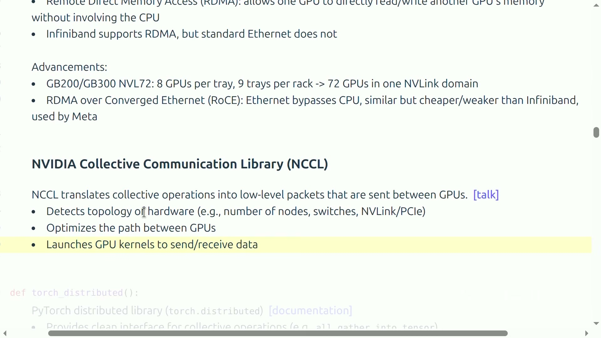
<figcaption>NCCL 将高层 collective 映射为拓扑感知的 GPU 通信操作。</figcaption>
</figure>

## PyTorch 进程模型

`torch.distributed` 为用户提供统一的进程组和 collective API，GPU 常用 NCCL 后端，CPU 或调试场景可用 Gloo。一个最小程序需要：创建进程、设定本地设备、初始化进程组、执行 collective、最后清理。

<figure data-latex-placement="H">
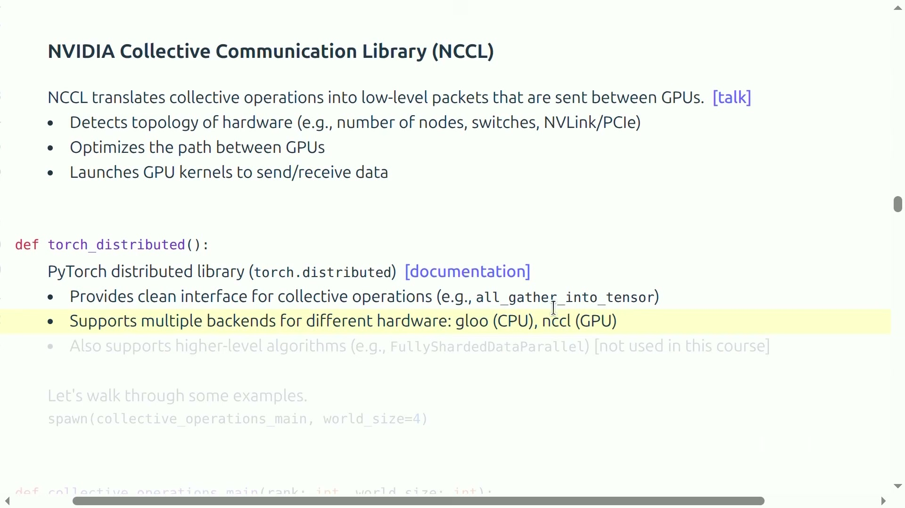
<figcaption><code>torch.distributed</code> 在 NCCL/Gloo 等后端上给出统一的分布式接口。</figcaption>
</figure>

```
def worker(rank: int, world_size: int):
    torch.cuda.set_device(rank)
    dist.init_process_group(
        backend="nccl", rank=rank, world_size=world_size
    )
    x = torch.tensor([rank + 1.0], device=f"cuda:{rank}")
    dist.all_reduce(x, op=dist.ReduceOp.SUM)
    print(rank, x.item())
    dist.destroy_process_group()

mp.spawn(worker, args=(num_gpus,), nprocs=num_gpus)
```

## Barrier 不等于 CUDA synchronize

`dist.barrier()` 的语义是：进程组中所有 rank 都到达此点后才继续。CUDA 设备同步则是等待当前进程向 GPU 提交的工作完成。前者是**跨进程**同步，后者是**主机与本地设备**的同步；做严谨计时时往往两者都需要。

<figure data-latex-placement="H">
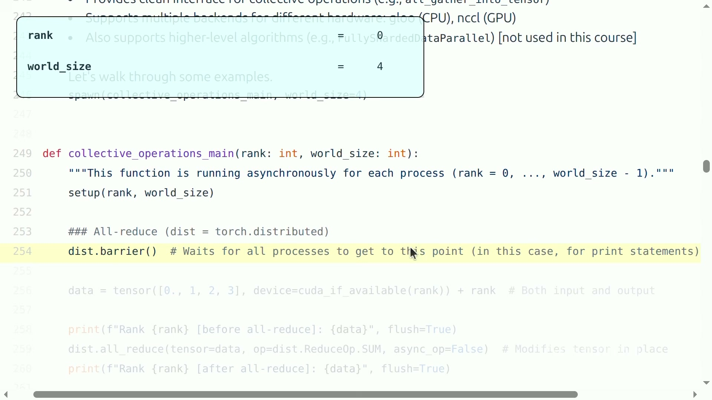
<figcaption>rank、world size 以及 <code>dist.barrier()</code> 的进程同步语义。</figcaption>
</figure>

## 异步通信与重叠

异步 collective 会返回 work handle，让 CPU 可以继续提交无依赖计算。但“异步启动”不意味着“结果已可用”；在读取目标张量前必须等待 handle 完成或用 stream/event 建立正确依赖。真正的性能收益来自把通信隐藏在独立计算之后，而不是单纯将参数改成 `async_op=True`。

## 本章小结

NCCL 是 GPU collective 引擎，`torch.distributed` 是用户端编程接口。分布式程序最常见的故障不是语法错，而是各 rank 的 collective 顺序或张量布局不一致，以及把不同层次的同步混为一谈。

# 如何正确测通信性能

## 先证明结果对，再测快不快

每个 rank 初始化不同数值，执行 all-reduce 后应该得到相同的和。这一小步能发现 rank 配置、数据类型、归约操作或后端选择错误。

<figure data-latex-placement="H">
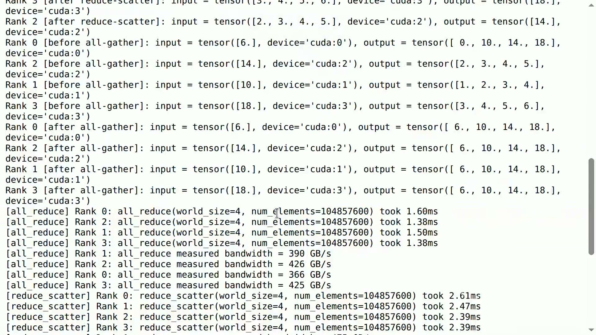
<figcaption>四个 rank 从不同输入出发，all-reduce 后获得同一结果。</figcaption>
</figure>

## 可复现的计时步骤

1.  用与真实工作负载相近的 dtype、张量尺寸和 rank 数。

2.  执行多轮 warm-up，排除上下文初始化、内存分配和算法选择开销。

3.  计时前进程 barrier，避免某 rank 提前冲线。

4.  计时区间前后做 CUDA 同步，因为 GPU 操作默认异步。

5.  重复多轮，报告中位数或分位数，不只报一次最快值。

6.  记录 GPU、驱动、CUDA/NCCL、拓扑、节点数、消息大小和环境变量。

<figure data-latex-placement="H">
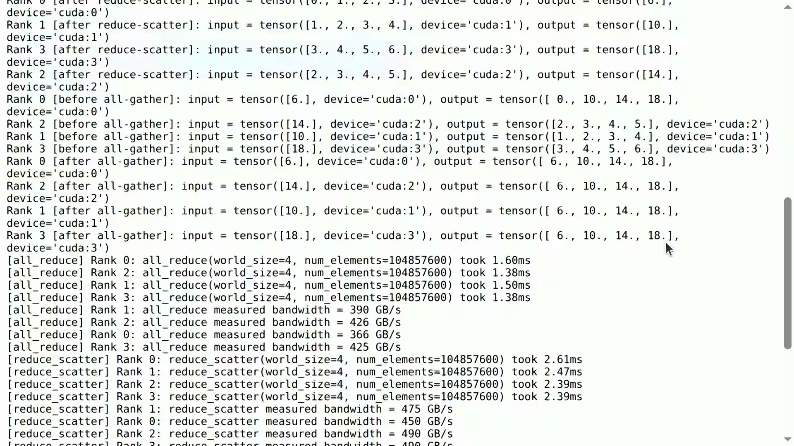
<figcaption>数值检查：all-reduce 与 reduce-scatter 后接 all-gather 给出同一结果。</figcaption>
</figure>

## 有效带宽的核算

只用“张量字节数/时间”会低估 ring all-reduce 中每个 rank 的逻辑通信量。对课程使用的 all-reduce 记账方式，设张量大小为 $`S`$，rank 数为 $`p`$，总耗时为 $`t`$，则有
```math
S=\operatorname{element\_size}\times\operatorname{numel},
\qquad
B_{\mathrm{eff}}=\frac{2S(p-1)}{pt}
=\frac{2S}{t}\frac{p-1}{p}.
```

$`S`$
单个输入张量所占字节数。

$`p`$
参与 all-reduce 的 rank 数。

$`t`$
该次操作的端到端等待时间。

$`B_{\mathrm{eff}}`$
按 ring 记账得到的有效带宽，用于同类基准之间比较。

<div class="warningbox">

有效带宽不是某条物理链路的原始带宽 上式是课程采用的逻辑通信量归一化方式。它不能直接等同于 NVLink 或某个 NIC 的单链路物理吞吐；真实路径可能经过多条链路并行传输。

</div>

<figure data-latex-placement="H">
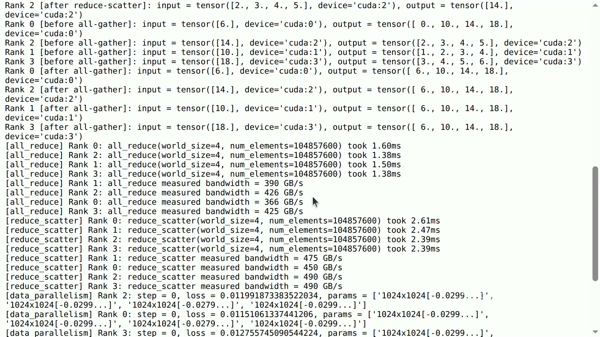
<figcaption>课堂对 all-reduce 有效带宽的字节数与时间核算。</figcaption>
</figure>

<figure data-latex-placement="H">
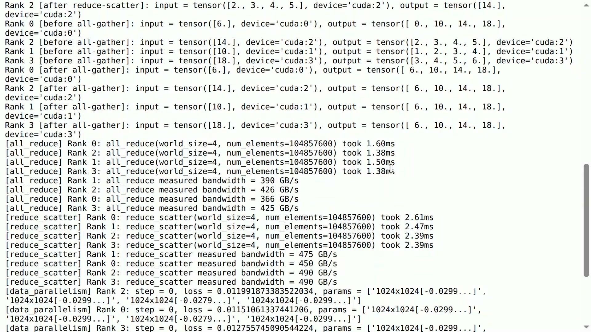
<figcaption>示例系统上各 rank 的时延与约 400 GB/s 有效带宽。</figcaption>
</figure>

## 本章小结

基准的可信度来自三件事：数值正确、时间边界正确、带宽定义清楚。少任何一项，都可能得出看似漂亮但无法复现的数字。

# 数据并行：沿 Batch 轴切分

## 三种基本切分轴

大模型训练中最直观的三种切分是：沿 batch 切为数据并行，沿层的 width 切为张量并行，沿模型 depth 切为流水线并行。现实系统通常把它们组合起来。

<figure data-latex-placement="H">
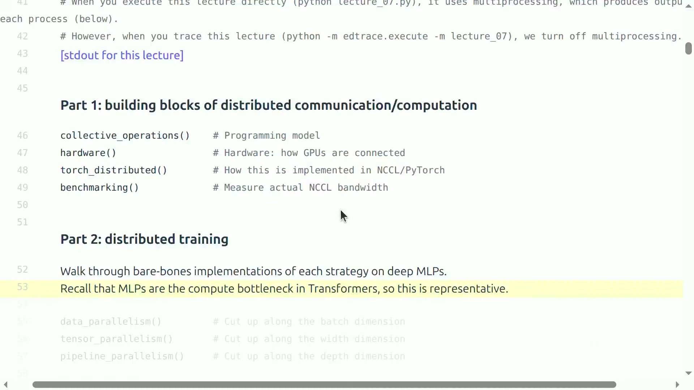
<figcaption>分布式训练的三个基本切分轴：batch、width 和 depth。</figcaption>
</figure>

## DDP 的数学不变量

数据并行在每个 rank 上保留完整模型，但每个 rank 只处理全局 batch 的一部分。若全局 batch 大小为 $`B`$，rank 数为 $`p`$，并且数据均匀分配，则局部 batch 大小为 $`B/p`$。

<figure data-latex-placement="H">
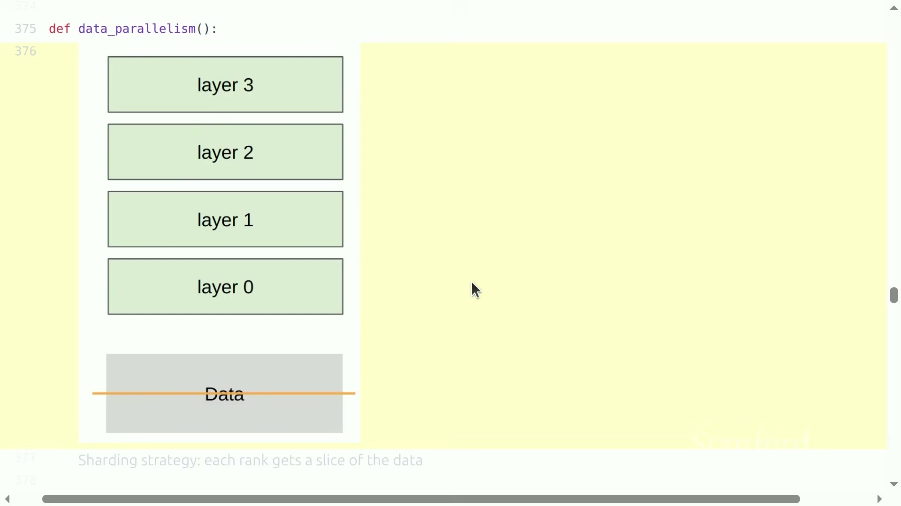
<figcaption>数据并行沿 batch 维切分，模型参数在每个 rank 上复制。</figcaption>
</figure>

设第 $`r`$ 个 rank 基于其局部 mini-batch 得到梯度 $`g_r`$，则同步后每个 rank 使用
```math
g=\frac{1}{p}\sum_{r=0}^{p-1} g_r.
```

$`g_r`$
第 $`r`$ 个 rank 上由局部 batch 计算的梯度。

$`p`$
数据并行组的 rank 数。

$`g`$
全局平均梯度，应在所有 rank 上一致。

若初始参数相同、梯度平均相同、优化器状态和更新顺序也相同，则一步更新后各 rank 的参数继续相同。因此 DDP 同步的是**梯度**，不是每步更新后再去平均参数。

<figure data-latex-placement="H">
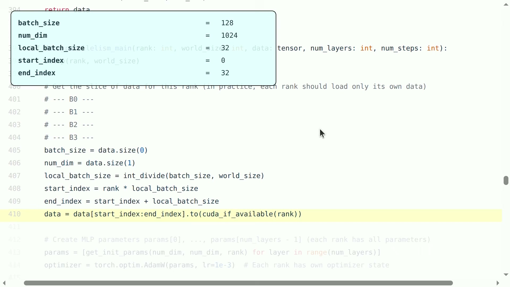
<figcaption>例：全局 batch 128、world size 4，每个 rank 处理 32 个样本。</figcaption>
</figure>

```
optimizer.zero_grad()
loss = model(local_batch).loss
loss.backward()

for param in model.parameters():
    dist.all_reduce(param.grad, op=dist.ReduceOp.SUM)
    param.grad.div_(world_size)

optimizer.step()
```

<figure data-latex-placement="H">
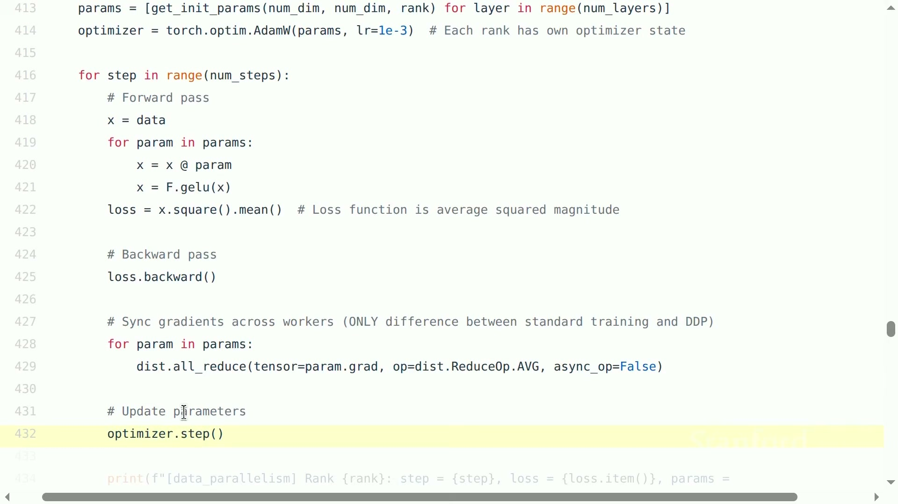
<figcaption>DDP 核心：本地反向传播后，对各参数梯度做 all-reduce 并平均。</figcaption>
</figure>

## 不变量、边界条件与内存局限

- 同步之前，各 rank 的局部 loss 和梯度可以不同；同步后的梯度必须一致。

- 使用 dropout 等随机操作时，通常希望各 rank 随机流不同，但实验必须可复现。

- 若 $`B`$ 不能被 $`p`$ 整除，不能简单 padding 后把填充样本当成真实数据；必须用 mask 或按真实样本数加权 loss/梯度。

- DDP 复制完整参数、梯度和优化器状态，因而不能解决“单卡放不下模型状态”的问题。这需要 FSDP/ZeRO 等状态分片方案。

<figure data-latex-placement="H">
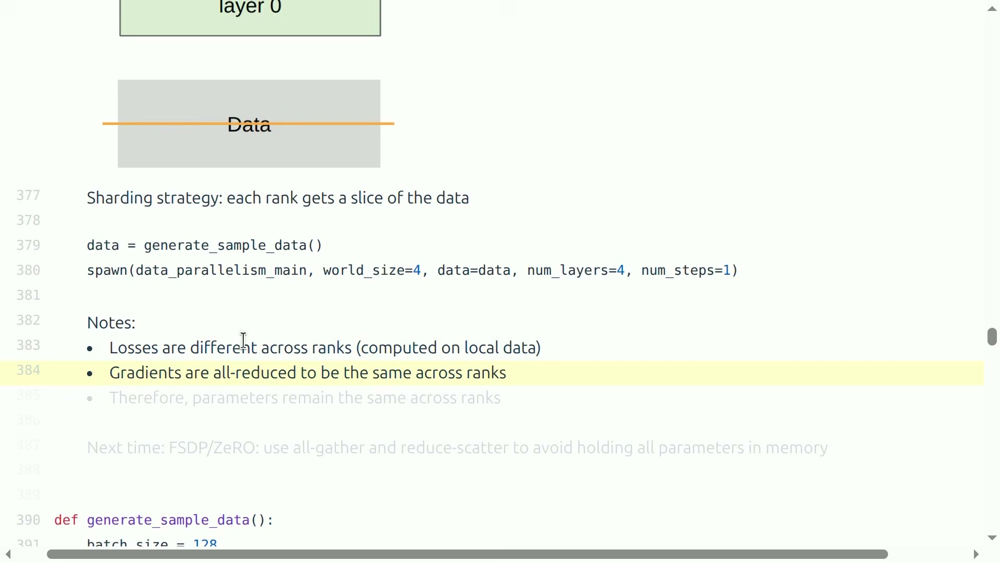
<figcaption>DDP 不变量：局部 loss/梯度可不同，归约后梯度和参数保持一致。</figcaption>
</figure>

## 本章小结

DDP 的优点是语义简单、计算独立度高，并且梯度 all-reduce 可与反向传播分 bucket 重叠。它的根本局限是每张卡都必须放下一份完整模型状态。

# 张量并行：沿 Width 轴切分

## 列并行线性层

若线性层权重 $`W`$ 大到单卡放不下，可沿输出特征维把它按列分为 $`p`$ 块：
```math
W=[W_0,W_1,\ldots,W_{p-1}],
\qquad
H_r=\phi(XW_r).
```

$`X`$
所有 rank 都可使用的输入激活。

$`W_r`$
第 $`r`$ 个 rank 保存的权重列分片。

$`H_r`$
局部输出特征分片。

$`\phi`$
局部可执行的非线性或其他逐元素操作。

<figure data-latex-placement="H">
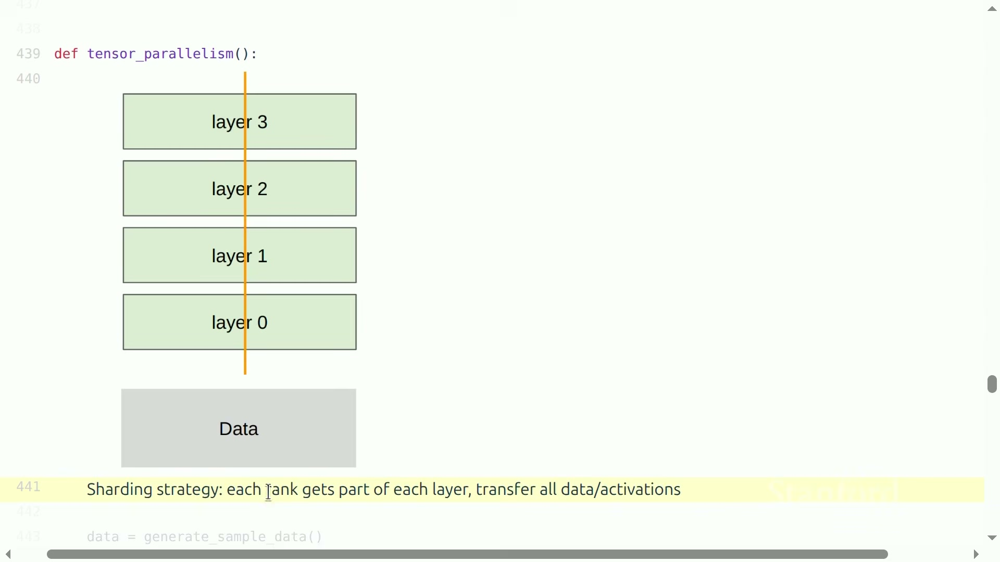
<figcaption>列张量并行：每个 rank 拥有每层权重的一部分。</figcaption>
</figure>

## 为什么前向需要 All-gather

若下一个操作需要完整特征维，则每个 rank 必须收集全部 $`H_r`$ 并拼接：
```math
H=\operatorname{Concat}
\left(\operatorname{AllGather}(H_0,\ldots,H_{p-1})\right).
```

$`H_r`$
第 $`r`$ 个 rank 的局部特征分片。

$`H`$
沿特征维拼接后的完整激活。

$`\operatorname{Concat}`$
按权重切分对应的特征轴进行拼接。

<figure data-latex-placement="H">
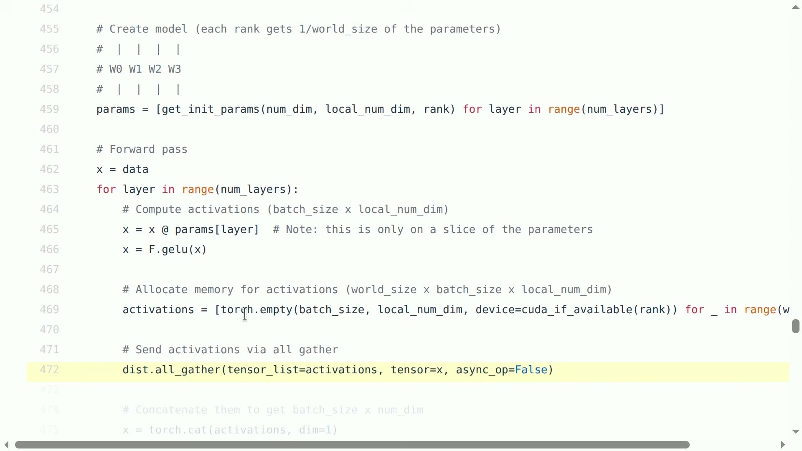
<figcaption>局部激活通过 all-gather 收集，再沿特征维拼接。</figcaption>
</figure>

反向传播时，与 all-gather 对应的梯度通信常可用 reduce-scatter 表达。实际 Transformer 张量并行会成对设计 column-parallel 和 row-parallel 线性层，避免每一层都完整收集激活。本课的代码用于说明原理，不应误解为唯一或最优的 Transformer 实现。

<div class="importantbox">

张量并行的硬件映射 张量并行在每层都可能通信，对带宽和延迟非常敏感。因此 TP 组通常尽量限定在单节点的 NVLink/NVSwitch 域内，而不是跨慢网络扩大。

</div>

## 本章小结

TP 以频繁通信换取单卡参数和计算量的降低。它解决了“单层太宽”的问题，但性能强依赖高带宽节点内互联。

# 流水线并行：沿 Depth 轴切分

## 把模型切成阶段

流水线并行把相邻层分配给不同 stage，每个 stage 只保存部分参数。激活在 stage 之间逐级传递，反向梯度则反向传递。为了让多个 stage 同时工作，一个 mini-batch 还要切成多个 microbatch。

<figure data-latex-placement="H">

<figcaption>自制示意图：4 个 stage、5 个 microbatch 的理想化前向流水线。</figcaption>
</figure>

## 气泡与 microbatch 数

流水线开始时，后续 stage 需要等待第一批激活；结束时，前面 stage 会提前空闲。这些空闲区间是 pipeline bubble。在各 stage 计算时间相同、忽略通信且只考虑理想化前向流水的简化模型下，若 stage 数为 $`p`$，microbatch 数为 $`m`$，可得下列**笔记推导**（非视频直接给出）：
```math
\eta\approx\frac{m}{m+p-1},
\qquad
f_{\mathrm{bubble}}\approx\frac{p-1}{m+p-1}.
```

$`\eta`$
理想化的 stage 利用率。

$`f_{\mathrm{bubble}}`$
填充与排空导致的气泡比例。

$`m`$
每个 mini-batch 切成的 microbatch 数。

$`p`$
流水线 stage 数。

增大 $`m`$ 可降低气泡比例，但也可能增加调度开销、激活内存压力和数值处理复杂度。真实训练还有反向传播，并会采用 GPipe、1F1B 或 interleaved 调度，上式不能取代真实 profile。

## 通信与计算重叠

若某个调度区间中通信和计算真正并行，且不争抢同一硬件资源，则理想化区间耗时可近似为
```math
T_{\mathrm{overlap}}\approx
\max\left(T_{\mathrm{compute}},T_{\mathrm{comm}}\right).
```

$`T_{\mathrm{compute}}`$
该区间的计算耗时。

$`T_{\mathrm{comm}}`$
该区间的通信耗时。

$`T_{\mathrm{overlap}}`$
在理想并行情况下的暴露耗时。

这也是一个性能上限直觉，而不是保证。如果通信 kernel 与矩阵乘法竞争 SM、内存带宽或拷贝引擎，实际耗时可以明显高于两者的最大值。

## 本章小结

PP 用较低频率的 stage 边界激活通信换取模型深度分片，对慢于 NVLink 的链路往往比 TP 更宽容。但它引入了气泡、stage 不均衡和复杂调度。

# 组合并行与资源决策

## 先找到真正的瓶颈

- **单卡能放下，但训练太慢：**首先考虑 DDP，并检查全局 batch 是否仍处于有效扩展区间。

- **参数+梯度+优化器状态放不下：**考虑 FSDP/ZeRO，通过 all-gather 和 reduce-scatter 按需重建或归约状态。

- **单层过宽：**在高带宽节点内使用 TP。

- **模型很深且节点数很多：**考虑 PP，并增加 microbatch 以控制气泡。

- **MoE 专家容量大：**用 expert parallelism，并重点监控 all-to-all 和负载均衡。

## 一个常见的硬件映射

经验上，可将节点内 NVLink/NVSwitch 域留给频繁通信的 TP；节点间使用 DP/FSDP；当模型仍然太深或单个流水段仍放不下时再加 PP。但这不是固定配方：应用实际 topology 和 profile 决定并行组大小。

<div class="knowledgebox">

临界 batch size 会限制 DP 扩展 DP 增加 rank 时往往也增加全局 batch。当超过问题的临界 batch size 后，继续加卡可能不再等比例减少达到目标 loss 所需的优化步数。因此不能只看每秒 token，还要看 time-to-train 和最终模型质量。

</div>

## 统一视角：重算、本地存储、远端存储

面对一个之后还要用的中间量，系统大致有三种选择：丢弃并在需要时重算；留在本地 GPU 内存；或放在其他 GPU/层级，用时再通信取回。Activation checkpointing、offload、FSDP、TP 和 PP 都可以在这个“计算–存储–通信”三角中理解。

<figure data-latex-placement="H">
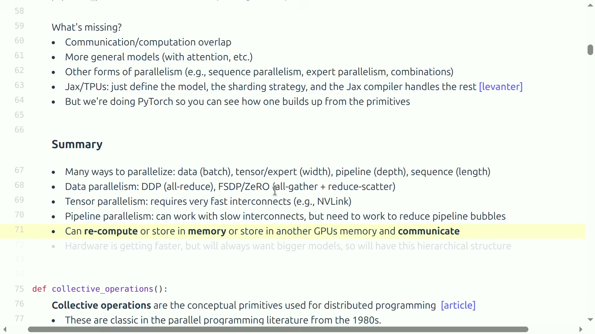
<figcaption>统一的资源权衡：重算、本地保留，或放到远端 GPU 并通信取回。</figcaption>
</figure>

## 本章小结

组合并行不是将更多缩写叠在一起，而是把不同通信频率的切分轴映射到合适的硬件层次。首先满足内存可行性，再优化吞吐，最后用端到端 time-to-train 验证。

# 总结与延伸

## 讲者收束时的信息

本讲从 collective operations 出发，逐层连接了互联硬件、NCCL/PyTorch 软件栈、通信基准以及数据/张量/流水线并行。讲者最后强调：硬件会越来越快，但模型也会越来越大，因此这种分层并行与资源权衡不会消失。

<figure data-latex-placement="H">
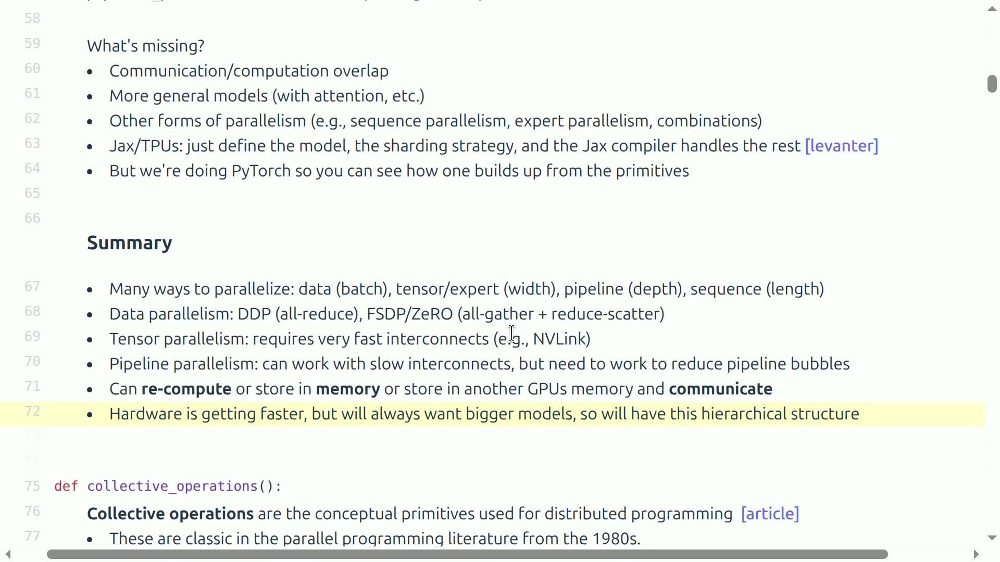
<figcaption>本讲总结：通信积木、三种切分轴、气泡与硬件层次。</figcaption>
</figure>

## 我的综合：一套可执行的设计流程

1.  **测单卡基线：**记录模型状态、激活峰值、每步时间和数值结果。

2.  **判定约束：**是容量、计算、节点内带宽，还是跨节点网络瓶颈？

3.  **选切分轴：**可行时先 DP，容量需求用 FSDP/ZeRO，宽层用 TP，深模型用 PP。

4.  **写出通信表：**对每个 collective 列出张量大小、频率、参与 rank 和硬件路径。

5.  **保持数值等价：**在相同全局 batch 下对比 loss、梯度和更新后参数，再进行性能结论。

6.  **用 profile 反馈迭代：**观察通信是否暴露、stage 是否失衡、GPU 是否因气泡空闲。

<div class="importantbox">

最终心法 分布式训练不是“加卡”，而是**设计数据布局、通信时序与硬件映射**。每一次优化都要经过：基线 $`\rightarrow`$ 修改 $`\rightarrow`$ 数值验证 $`\rightarrow`$ 性能基准 $`\rightarrow`$ 端到端确认。

</div>

## 复习问题

1.  为什么说 all-reduce 可分解为 reduce-scatter 加 all-gather？分解后对状态分片有什么意义？

2.  为什么张量并行通常放在节点内，而流水线并行更能容忍跨节点链路？

3.  一个 CUDA 操作是异步的时候，只用 CPU 计时器会得到什么错误结论？

4.  DDP 中为什么应当平均梯度而不是在每步后平均参数？

5.  增加 microbatch 数为什么可减少气泡，又会带来哪些新代价？

## 本章小结

读完这节课，最应保留的不是某个带宽数字，而是一张因果链：**模型切分 $`\rightarrow`$ 数据布局 $`\rightarrow`$ collective $`\rightarrow`$ 硬件路径 $`\rightarrow`$ 暴露通信 $`\rightarrow`$ 端到端效率**。
