<div class="titlepage">

**Stanford CS336 第 8 讲：并行训练**

从单卡瓶颈到多维并行系统

独立教材版中文图文课程笔记

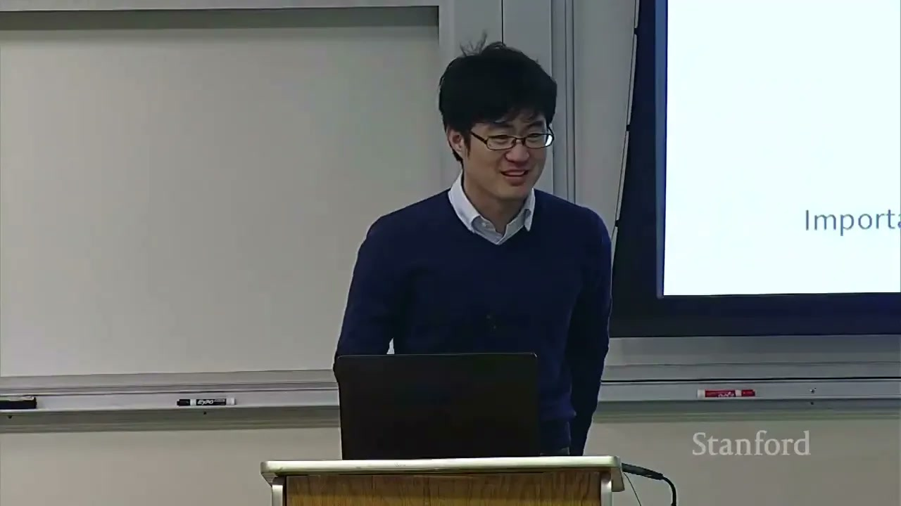

<div class="tcolorbox">

**课程**：Stanford CS336 Language Modeling from Scratch，Spring 2026

**讲次**：Lecture 8 – Parallelism

**频道**：Stanford Online

**视频**：[`youtube.com/watch?v=6-cXp-aOmdg`](https://www.youtube.com/watch?v=6-cXp-aOmdg)

</div>

</div>

# 阅读地图：并行训练到底在解决什么

## 从“把程序分到多张卡”到“设计一台虚拟计算机”

语言模型扩大后，单个加速器会同时撞上三面墙。第一面墙是**容量**：参数、梯度、优化器状态和中间激活无法共同放进显存。第二面墙是**吞吐**：一张卡完成一次训练步所需的计算太多。第三面墙是**互连**：虽然设备数量增加了，但频繁传输的张量可能让设备大部分周期都在等待。并行训练不是简单地“卡越多越快”，而是把模型状态、计算图与数据流重新映射到一个具有层级网络的集群上。

<figure data-latex-placement="H">
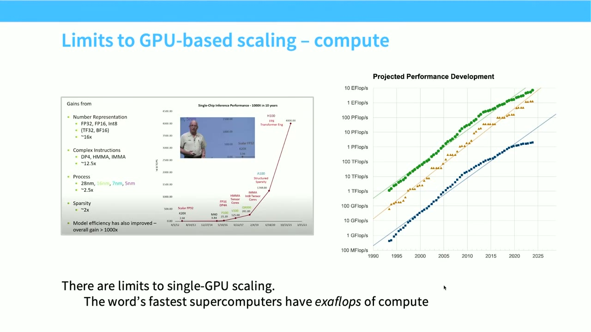
<figcaption>单设备算力增长存在现实上限；大模型继续扩展必须依赖多设备和多节点协作。</figcaption>
</figure>

本讲可以用两个目标和一个约束来概括。理想的**容量扩展**意味着设备数增加 $`N`$ 倍后，可训练模型规模也接近增加 $`N`$ 倍；理想的**计算扩展**意味着总有效吞吐接近增加 $`N`$ 倍；现实约束则是跨设备通信具有带宽、延迟与拓扑差异。所有并行方法都在改变三种量的平衡：每卡保存多少字节、每卡执行多少浮点运算、每步传输多少字节。

<div class="importantbox">

本讲的核心结论 不存在一种方法同时适合所有模型、批量和网络。数据并行擅长复制模型并切分样本；流水线并行按层切分；张量并行切分单层矩阵；序列或上下文并行切分 token；专家并行切分稀疏专家。大型训练通常把它们组合起来，并让通信最密集的维度留在最快的互连域内。

</div>

## 前置知识与统一符号

设模型参数量为 $`P`$，全局批量含 $`B`$ 个训练样本，每个样本序列长度为 $`S`$，隐藏维度为 $`H`$，Transformer 层数为 $`L`$，设备总数为 $`N`$。设每个参数的参数副本、梯度与优化器状态合计占用 $`c`$ 字节，则仅静态训练状态约为
```math
M_{\mathrm{state}}=cP.
```
其中 $`M_{\mathrm{state}}`$ 表示静态状态总字节数，$`c`$ 由数值精度与优化器决定，$`P`$ 是标量参数个数。使用 Adam 时，若低精度参数和梯度各占 2 字节、主权重及两个动量各占 4 字节，常见粗略值为每参数 16 字节；实际框架可能通过纯 BF16、主权重策略或压缩状态改变这个系数。

集群并不是平坦的。一个节点内的 GPU 往往由 NVLink 或高速交换芯片连接，节点之间则经过网卡与交换网络。节点内带宽通常更高、延迟更低。因此同一套并行度若映射到不同物理拓扑，性能可能完全不同。

<figure data-latex-placement="H">
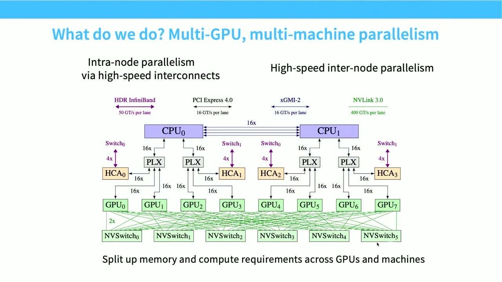
<figcaption>多 GPU 节点的互连具有明显层级：同节点通信与跨节点通信应采用不同策略。</figcaption>
</figure>

## 本章小结

并行设计的对象不是抽象的 GPU 数量，而是“模型、批量、状态、激活和层级网络”的联合系统。后文每介绍一种方法，都用容量、计算和通信三项指标评估它。

# 通信原语：分布式训练的积木

## rank、进程组与张量分片

分布式程序通常让每个工作进程拥有一个 rank。rank 只是进程在通信组中的编号，不等同于固定物理设备；部署系统负责把它映射到 GPU。若一个张量被平均切成 $`N`$ 片，第 $`i`$ 个 rank 保存第 $`i`$ 片。所谓“同步”并不一定是把所有内容复制给所有人，而是通过少数集合通信原语构造所需的数据布局。

<figure data-latex-placement="H">
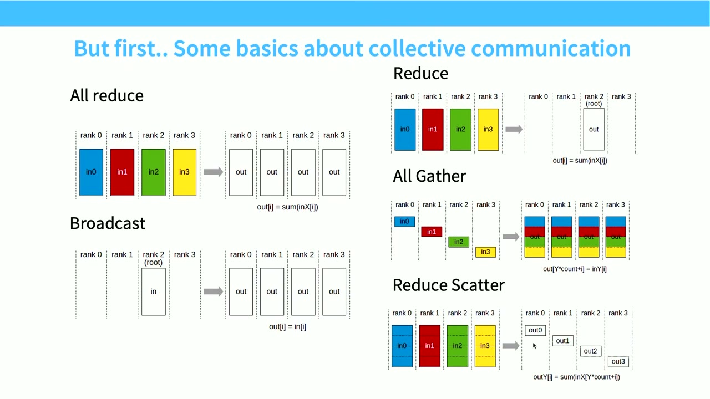
<figcaption>常见集合通信原语：all-reduce、broadcast、reduce、all-gather 与 reduce-scatter。</figcaption>
</figure>

**broadcast** 从一个根 rank 向所有成员发送同一张量。**reduce** 将各 rank 的张量逐元素求和或取最大值，并把结果交给根 rank。**all-reduce** 等价于 reduce 后再 broadcast，因此每个成员获得完整归约结果。**all-gather** 把各 rank 的不同分片拼成完整张量，并让每个成员都获得它。**reduce-scatter** 先归约再切片，每个成员只保留结果的一部分。

以四个 rank 的梯度为例，rank $`i`$ 持有 $`g_i\in\mathbb{R}^{P}`$。同步数据并行需要
```math
\bar g=\frac{1}{N}\sum_{i=0}^{N-1}g_i.
```
其中 $`g_i`$ 是第 $`i`$ 个 rank 在本地样本上算出的梯度，$`N`$ 是 rank 数，$`\bar g`$ 是全局平均梯度。all-reduce 可以让所有 rank 都得到 $`\bar g`$。若优化器状态已分片，则不必让每个 rank 得到完整结果，可用 reduce-scatter 让 rank $`i`$ 只拿到 $`\bar g`$ 的第 $`i`$ 片。

## 通信成本模型：字节数之外还要看消息颗粒度

一次通信可粗略写成
```math
T_{\mathrm{comm}}\approx \alpha m+\frac{V}{\beta}.
```
其中 $`T_{\mathrm{comm}}`$ 是通信耗时，$`\alpha`$ 是每条消息的固定启动代价，$`m`$ 是消息或通信轮数，$`V`$ 是传输字节数，$`\beta`$ 是有效带宽。大张量更容易接近带宽上限；大量小张量即使总字节不多，也可能被 $`\alpha m`$ 主导。这就是框架会把梯度装入较大 bucket、并尽早发起异步归约的原因。

环形 all-reduce 可拆成 reduce-scatter 与 all-gather。忽略固定启动代价时，每个 rank 的收发量约为
```math
V_{\mathrm{ring}}\approx 2\frac{N-1}{N}D,
```
其中 $`D`$ 是完整张量字节数，$`N`$ 是 rank 数。$`N`$ 很大时收发量接近 $`2D`$，而不是 $`ND`$；但通信轮数增加，所以小消息不一定适合环形算法。树形算法轮数更少，适合延迟敏感场景；真实通信库会根据消息大小与拓扑选择算法。

<figure data-latex-placement="H">
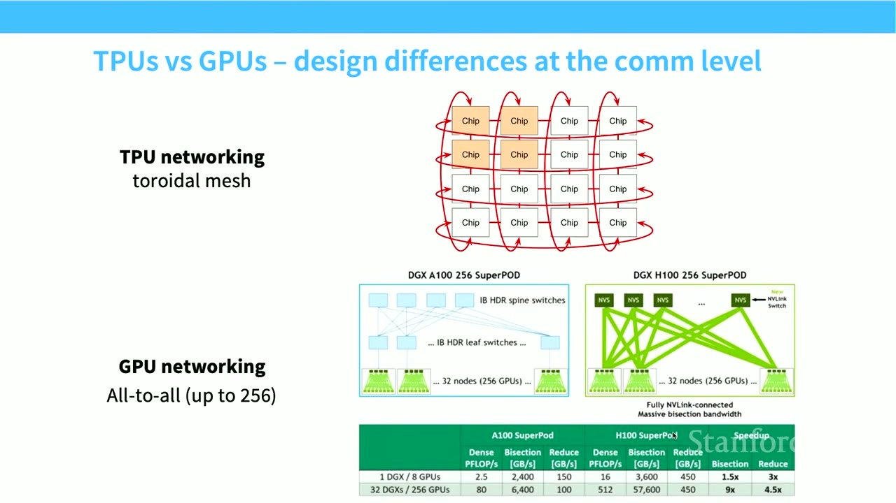
<figcaption>网格、环和交换网络对应不同通信路径；并行策略必须与流量模式匹配。</figcaption>
</figure>

<div class="warningbox">

误区：标称带宽就是训练可用带宽 标称值没有计入协议、路由竞争、跨 NUMA 路径、多个并行组同时通信以及消息过小造成的利用率下降。评估方案时应测目标消息大小下的集合通信吞吐，并区分节点内与节点间结果。

</div>

## 本章小结

集合通信决定分布式张量怎样从一种布局变为另一种布局。理解 all-reduce、all-gather 和 reduce-scatter，就能读懂数据并行、FSDP、张量并行与序列并行的大部分数据流。

# 数据并行：切分样本，复制模型

## 同步 SGD 为什么数学上等价

在最朴素的数据并行中，每个 rank 保存完整模型，并处理全局批量的一部分。令本地批量为 $`B_i`$，且各 rank 本地样本数相同，则第 $`t`$ 步更新为
```math
\theta_{t+1}=\theta_t-\eta\frac{1}{N}\sum_{i=0}^{N-1}\frac{1}{|B_i|}\sum_{x\in B_i}\nabla_\theta \ell(x;\theta_t).
```
其中 $`\theta_t`$ 是第 $`t`$ 步参数，$`\eta`$ 是学习率，$`N`$ 是数据并行 rank 数，$`B_i`$ 是 rank $`i`$ 的本地批量，$`\ell`$ 是单样本损失。若所有 rank 起点一致，并在每步对梯度求平均，这与在全局批量并行计算同一梯度等价。

<figure data-latex-placement="H">
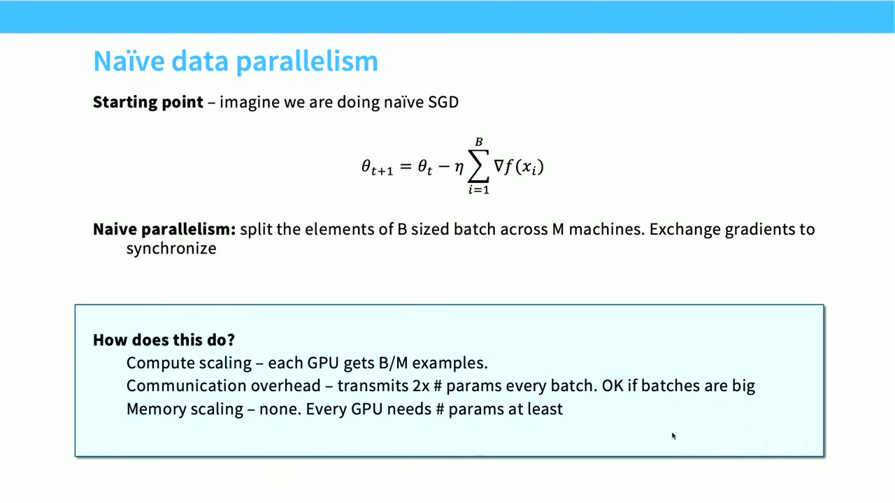
<figcaption>朴素数据并行把批量分给不同设备，再同步梯度；计算可扩展，但每卡仍保存完整训练状态。</figcaption>
</figure>

数据并行的优点是实现简单、负载均衡自然，并能通过增大全局批量提高每次同步之间的计算量。缺点是没有降低单卡静态状态：参数、梯度和优化器状态均被复制。通信量主要与参数量相关，而每卡计算量与本地批量相关。因此本地批量太小时，计算不足以摊薄梯度同步。

## 梯度累积不是额外的并行维度

若显存只能放微批量 $`b`$，可以连续处理 $`K`$ 个微批量后再更新，等效批量为 $`B=N K b`$。梯度累积可以提高通信前的计算量，也能满足优化所需全局批量，但不会让单个样本计算更快。还要注意损失缩放：若每个微批量损失都取均值，累积时应除以 $`K`$，否则有效学习率增大。

```
model = replicate_model()
for batch in loader:
    local = shard_batch(batch, rank, world_size)
    loss = model(local) / accumulation_steps
    loss.backward()
    if ready_to_update():
        all_reduce_mean(model.gradients)
        optimizer.step()
        optimizer.zero_grad()
```

## Worked example：八卡训练的批量与通信

假设八张卡，每卡微批量 2，累积 8 次，则全局批量是 $`8\times2\times8=128`$。若模型梯度为 20 GB，使用环形 all-reduce，每卡每次优化更新大约收发 $`2\times7/8\times20=35`$ GB。把累积从 1 增到 8，并不会改变一次更新的梯度通信量，却让一次通信对应的样本数增加八倍；代价是更新频率降低，且过大的全局批量可能改变优化行为。

## 本章小结

数据并行优先解决吞吐，不解决模型副本的容量问题。它适合作为最终扩展维度，但只有当模型先能放进单个数据并行副本时才成立。

# ZeRO 与 FSDP：把复制状态改成按需聚合

## 三阶段分别切什么

ZeRO 的核心观察是：数据并行 rank 在更新时并不需要永久保存所有重复状态。阶段 1 切分优化器状态；阶段 2 再切分梯度；阶段 3 连参数也切分。若每参数状态系数为 $`c=c_p+c_g+c_o`$，其中 $`c_p,c_g,c_o`$ 分别是参数、梯度、优化器状态字节数，则阶段 3 的理想单卡静态状态近似为
```math
M_{\mathrm{ZeRO3}}\approx \frac{(c_p+c_g+c_o)P}{N}.
```
其中 $`P`$ 是参数量，$`N`$ 是分片 rank 数。这个公式描述持久状态，不含算子执行时临时聚合的完整参数、激活、通信缓冲区和碎片化余量。

<figure data-latex-placement="H">
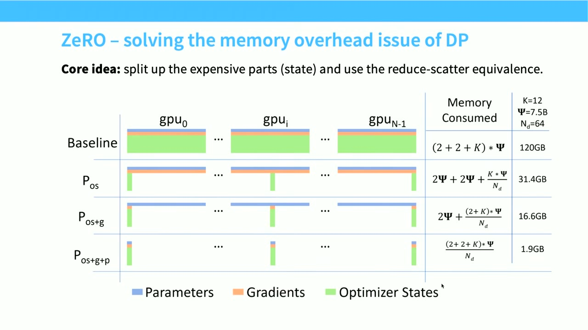
<figcaption>ZeRO 从优化器状态、梯度到参数逐级消除数据并行副本中的冗余。</figcaption>
</figure>

阶段 1 在梯度同步后让每个 rank 只更新自己负责的参数片，随后 all-gather 更新后的参数，使各 rank 重新拥有完整模型。阶段 2 用 reduce-scatter 直接产生分片梯度，省去完整梯度副本。阶段 3 在某层计算前 all-gather 该层参数，计算后释放完整副本；反向过程再次聚合，并用 reduce-scatter 归约梯度。

<figure data-latex-placement="H">
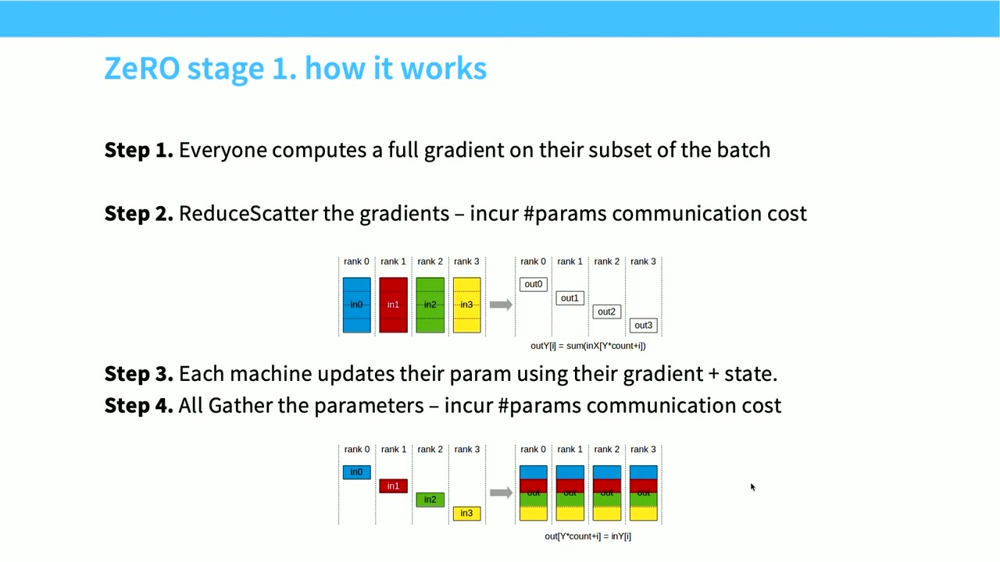
<figcaption>ZeRO 阶段 1 的基本循环：归约并分散梯度、本地更新分片、再聚合参数。</figcaption>
</figure>

<figure data-latex-placement="H">
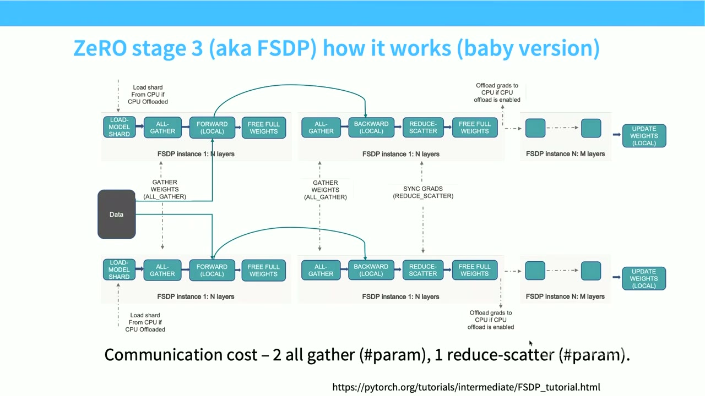
<figcaption>FSDP 的按层流程：参数只在对应计算附近聚合，使用后立即释放完整副本。</figcaption>
</figure>

## 为什么阶段 3 不是“免费省显存”

传统数据并行每步梯度 all-reduce 的主字节量约为 $`2P`$ 个参数元素。阶段 1 和 2 可用 reduce-scatter 加 all-gather 保持相近量级；阶段 3 因前向与反向都需聚合参数，再加梯度 reduce-scatter，主量级约为 $`3P`$。因此它用额外通信换取近线性的静态状态节省。真正性能取决于每层参数大小、互连带宽、预取深度，以及通信能否被计算覆盖。

<figure data-latex-placement="H">
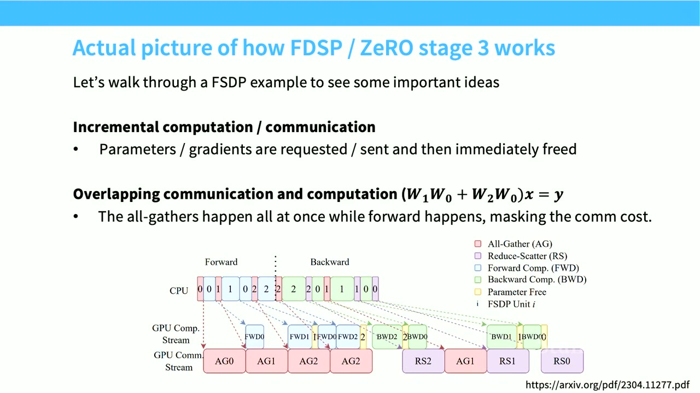
<figcaption>FSDP 将参数聚合与相邻层计算重叠，并在使用后释放完整参数，从而兼顾容量与吞吐。</figcaption>
</figure>

设一层参数字节数为 $`W`$，聚合带宽为 $`\beta`$，该层计算耗时为 $`C`$，忽略启动代价时通信耗时约 $`W/\beta`$。若预取使通信与计算重叠，则暴露开销近似
```math
T_{\mathrm{exposed}}\approx \max(0,W/\beta-C).
```
其中 $`T_{\mathrm{exposed}}`$ 是无法隐藏的等待，$`W/\beta`$ 是传输耗时，$`C`$ 是可用于覆盖的计算耗时。层太小会受启动代价影响，层太大又会造成聚合峰值显存高；FSDP wrap 粒度因此是关键参数。

## Worked example：八张 80 GB GPU 能放多大

假设每参数训练状态合计 12 字节，忽略激活和系统余量。朴素复制时每卡最多容纳约 $`80/12\approx6.67`$ 十亿参数。阶段 1 若仅保留 2 字节参数、2 字节梯度，并把 8 字节优化器状态分为八份，每参数每卡约 $`2+2+8/8=5`$ 字节，对应约 16B。阶段 2 进一步切梯度，每参数约 $`2+(2+8)/8=3.25`$ 字节，对应约 24.6B。阶段 3 全切分，每参数约 $`12/8=1.5`$ 字节，对应约 53.3B。真实可训练规模更小，因为还必须给激活、聚合缓冲区、内核工作区和容错余量留空间。

<figure data-latex-placement="H">
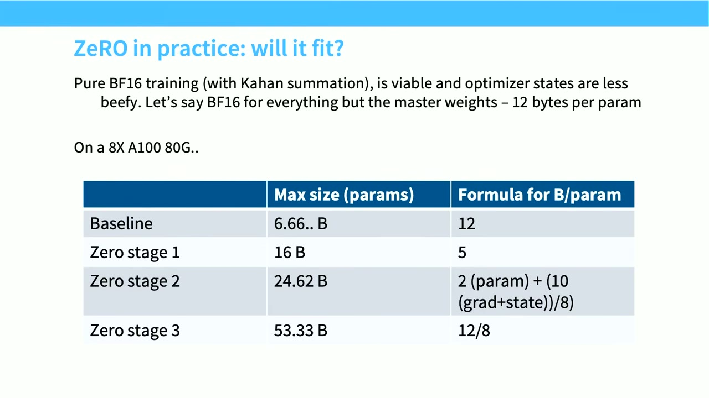
<figcaption>八卡示例说明不同 ZeRO 阶段的静态容量收益；工程预算还必须加入激活和缓冲区。</figcaption>
</figure>

<div class="warningbox">

常见边界 FSDP 不等于无限扩展。跨慢速节点频繁聚合会降低效率；参数分组不当会产生大量小集合通信；保存检查点时若贸然聚合全模型可能内存溢出；共享参数、冻结参数和混合精度也会影响分片语义。容量估算必须用峰值实测校准。

</div>

## 本章小结

ZeRO/FSDP 仍属于数据并行语义：每个 rank 处理不同样本，但训练状态被分片保存、按需重建。它是降低静态副本最直接的方法，代价是更多且更细粒度的集合通信。

# 流水线并行：沿网络深度切层

## 从朴素层切分到微批流水

若把 $`L`$ 层分成 $`p`$ 个阶段，每个阶段只保存约 $`L/p`$ 层，就能降低静态状态和部分激活。朴素执行让一个批量依次穿过所有阶段；当阶段 0 计算时，其余阶段空闲，利用率仅约 $`1/p`$。解决方法是把批量分成 $`m`$ 个微批，让不同阶段同时处理不同微批。

<figure data-latex-placement="H">
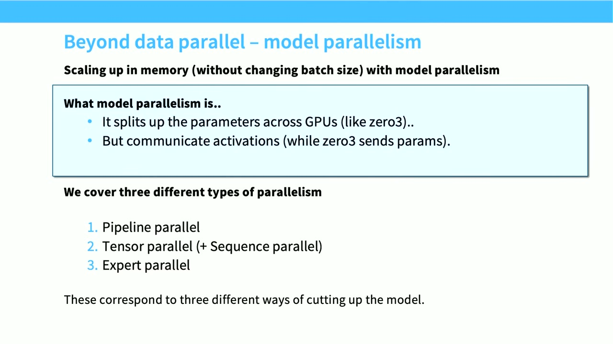
<figcaption>模型并行可按层、单层张量或稀疏专家切分；它们改变的是计算图本身，而不只是样本分配。</figcaption>
</figure>

<figure data-latex-placement="H">
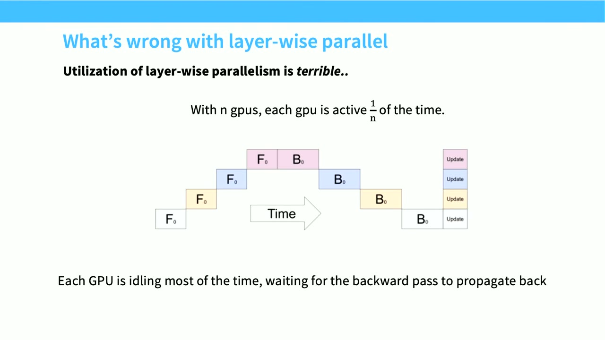
<figcaption>朴素层切分会产生大量空闲槽；微批流水的目标是让多个阶段持续有工作。</figcaption>
</figure>

在简化的均衡流水中，若每阶段前后向耗时相近，填充和排空导致的气泡比例可粗略写成
```math
f_{\mathrm{bubble}}\approx \frac{p-1}{m+p-1}.
```
其中 $`p`$ 是阶段数，$`m`$ 是微批数，$`f_{\mathrm{bubble}}`$ 是空闲比例。增大 $`m`$ 可以降低气泡，但会增大激活保留数量或调度复杂度，也可能迫使全局批量变大。

常见 1F1B 调度在稳态交替执行一次前向与一次反向，比“全部前向后全部反向”降低峰值激活。阶段负载必须尽量均衡：若最慢阶段耗时为 $`C_{\max}`$，稳态吞吐受它限制，其他阶段即使很快也只能等待。

<figure data-latex-placement="H">
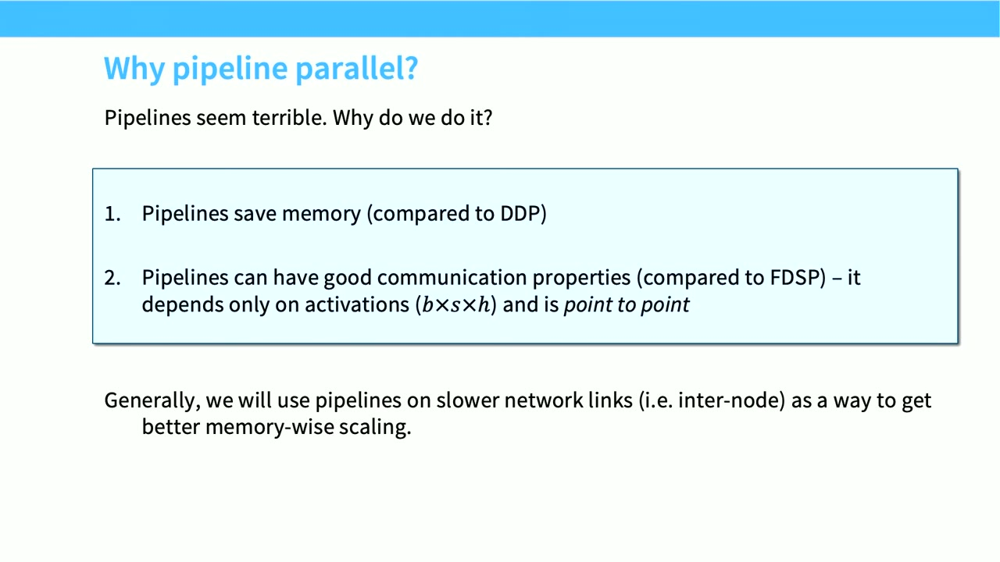
<figcaption>流水线的优势是按层节省内存，并仅在相邻阶段传输激活，适合跨较慢链路。</figcaption>
</figure>

## 通信量为何可能优于参数聚合

阶段边界每个微批主要发送激活，字节量约与 $`bSH`$ 成正比，其中 $`b`$ 是微批量、$`S`$ 是序列长度、$`H`$ 是隐藏维度。FSDP 则反复聚合层参数，字节量与参数规模相关。对于参数极大、边界激活相对较小的模型，流水线的点对点通信更适合跨节点。但若序列很长或边界选择不佳，激活也可能非常大。

## 零气泡调度的直觉

反向传播可拆成对输入激活求梯度与对权重求梯度两部分。前者决定上游阶段何时能继续反向，处于关键路径；后者只需在优化更新前完成，调度位置更灵活。零气泡方法利用这个自由度，把权重梯度计算填入原本空闲的槽位。

<figure data-latex-placement="H">
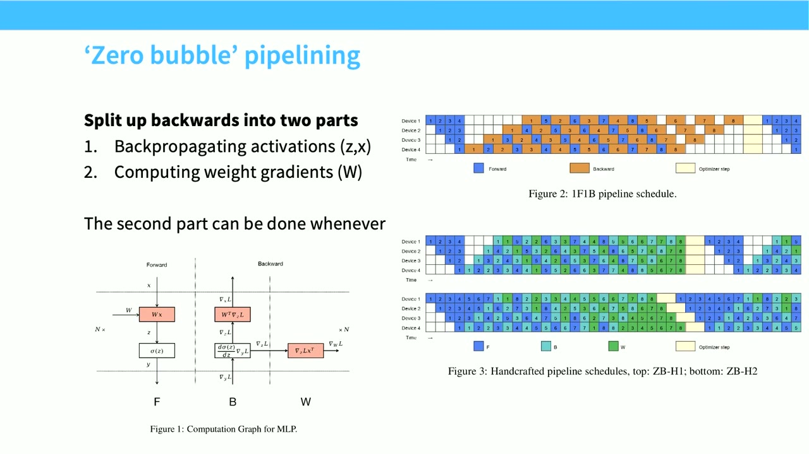
<figcaption>将反向中的激活梯度与权重梯度拆开，可把非关键计算填入气泡并提高设备利用率。</figcaption>
</figure>

<div class="knowledgebox">

调度不是纯公式问题 均衡公式假设阶段耗时相近、通信可预测、没有共享嵌入等特殊层。真实模型的首尾层、词表投影、MoE 层和重计算策略都可能破坏均衡。划分阶段时应以实测算子耗时和峰值内存为权重，而不是只按层数平均。

</div>

## 本章小结

流水线并行通过深度切分获得容量，并以微批填充设备。它通信局部、适合跨节点，却引入气泡、激活管理与复杂调度；阶段均衡和微批数是最重要的旋钮。

# 张量并行：把一层矩阵乘法拆开

## 列切分与行切分为什么成对出现

考虑两层 MLP：$`Y=\phi(XA)`$，$`Z=YB`$。将 $`A`$ 按列切成 $`A=[A_1,A_2]`$，每个 rank 计算 $`Y_i=\phi(XA_i)`$，无需先通信，因为每个分片独立产生一部分隐藏通道。再将 $`B`$ 按行切成 $`B=[B_1;B_2]`$，每个 rank 计算 $`Z_i=Y_iB_i`$，最后 all-reduce 得到
```math
Z=\sum_{i=1}^{t}Y_iB_i.
```
其中 $`t`$ 是张量并行度，$`A_i`$ 是第一层权重的列分片，$`Y_i`$ 是中间激活通道分片，$`B_i`$ 是第二层权重的行分片，$`Z_i`$ 是局部部分和。列切分避免第一次矩阵乘后的聚合，行切分则在块末统一归约，减少通信点。

<figure data-latex-placement="H">
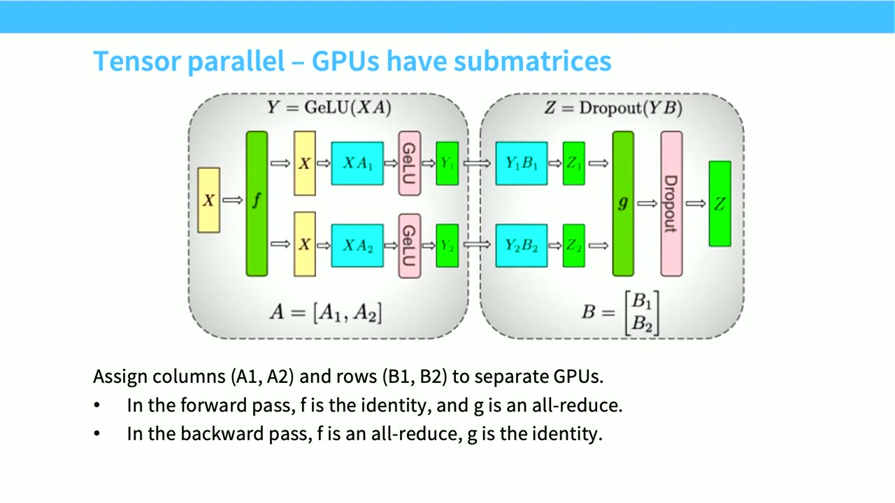
<figcaption>MLP 的列并行与行并行配对：中间通道保持分片，只在块边界归约。</figcaption>
</figure>

Transformer 注意力可把查询、键、值的头或通道分给不同 rank，输出投影再按行切分。归一化、路由器和某些逐元素操作通常复制执行。一个块内部因此交替出现“复制布局”和“分片布局”，all-reduce、all-gather 或 reduce-scatter 负责布局转换。

<figure data-latex-placement="H">
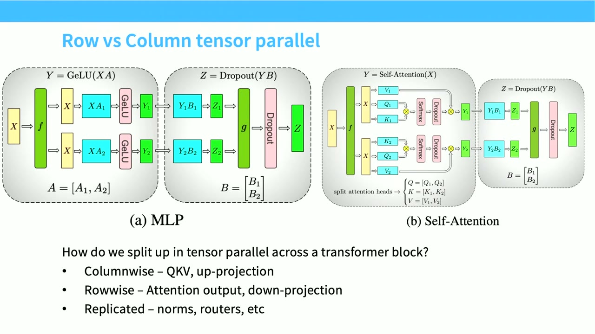
<figcaption>Transformer 中 QKV 与上投影常按列切分，注意力输出与下投影常按行切分。</figcaption>
</figure>

## 为什么张量并行通常限制在高速互连域

张量并行几乎每层都通信，频率远高于流水线的阶段边界通信。若输入激活形状为 $`B\times S\times H`$，一次相关集合通信常与 $`BSH`$ 个元素同阶。设备数增大后，每卡矩阵变小，计算效率可能下降，而集合通信仍需穿过整个组。于是张量并行度不是越大越好，常被限制在单节点的 8 张左右高速互连设备中。

从算术强度看，将大矩阵切得过细会降低 GEMM 尺寸，Tensor Core 利用率下降；同时延迟项占比上升。张量并行的收益是每层参数和部分激活下降、没有流水线气泡、也不要求很大的微批量。它适合单层本身就放不下，或希望在节点内用高带宽互连降低每卡计算的场景。

## Worked example：两卡 MLP

设 $`X\in\mathbb{R}^{32\times4096}`$，$`A\in\mathbb{R}^{4096\times16384}`$，$`B\in\mathbb{R}^{16384\times4096}`$。两卡列切 $`A`$ 后，每卡保存 $`4096\times8192`$，得到 $`Y_i\in\mathbb{R}^{32\times8192}`$；行切 $`B`$ 后，每卡计算 $`32\times4096`$ 的部分和，再 all-reduce。参数约减半，但输入 $`X`$ 在两卡复制，输出归约不能省略。若错误地把 $`B`$ 也按列切，矩阵维度不匹配，或必须先聚合完整 $`Y`$，从而增加一次大通信。

## 本章小结

张量并行把单层内部的线性代数分片，常以列切与行切成对减少通信点。它没有流水气泡，但通信高频，适合节点内高速互连，过大的并行度会使矩阵过小并降低效率。

# 激活内存、序列并行与上下文并行

## 静态状态省下后，激活会成为下一瓶颈

训练显存不是一块固定常数。前向过程中保存的激活逐层累积，反向过程中逐步释放；临时张量、通信缓冲区与自动微分细节又叠加出峰值。仅按“每参数多少字节”估算会严重低估长序列训练。

<figure data-latex-placement="H">
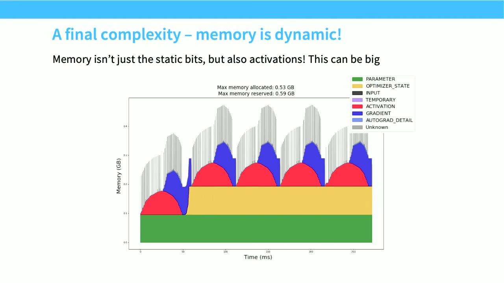
<figcaption>训练显存由静态参数、优化器状态、梯度以及动态变化的激活和临时张量共同构成。</figcaption>
</figure>

一层激活常含多个 $`BSH`$ 级张量，以及注意力概率的 $`BS^2`$ 级项。FlashAttention 通过分块避免显式保存完整注意力矩阵，激活重计算则在反向时重新执行部分前向，以计算换内存。即便如此，LayerNorm、Dropout 与残差等逐 token 张量若仍在每个张量并行 rank 上复制，内存不会随张量并行度完全下降。

## 序列并行：把逐 token 操作沿序列轴切开

序列并行把归一化、Dropout 和残差等逐 token 操作沿 $`S`$ 维分片，使每个 rank 只保存 $`S/t`$ 个位置。进入需要张量并行的注意力或 MLP 前，通过 all-gather 或等价布局变换恢复所需激活；离开后用 reduce-scatter 回到序列分片。前向中的聚合与分散在反向中互换。

<figure data-latex-placement="H">
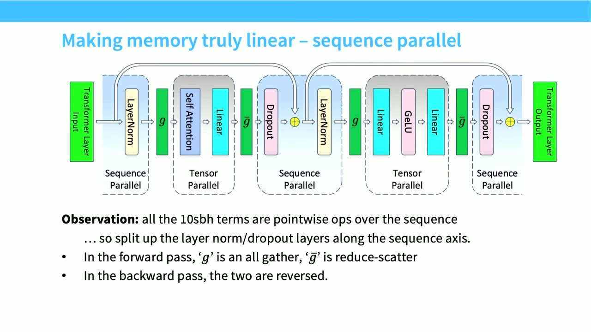
<figcaption>序列并行让逐 token 操作沿序列轴分片，并在张量并行算子边界转换布局。</figcaption>
</figure>

若基线每层激活可粗略写成 $`BSH(34+5AS/H)`$，其中 $`A`$ 是注意力头数，张量并行与序列并行结合后，多个 $`BSH`$ 项可被 $`t`$ 平分。配合选择性重计算，理想主项可接近 $`BSH\cdot34/t`$。系数依实现而异，重要结论是：只有参数分片不够，激活也必须沿适当轴分片或重计算。

<figure data-latex-placement="H">
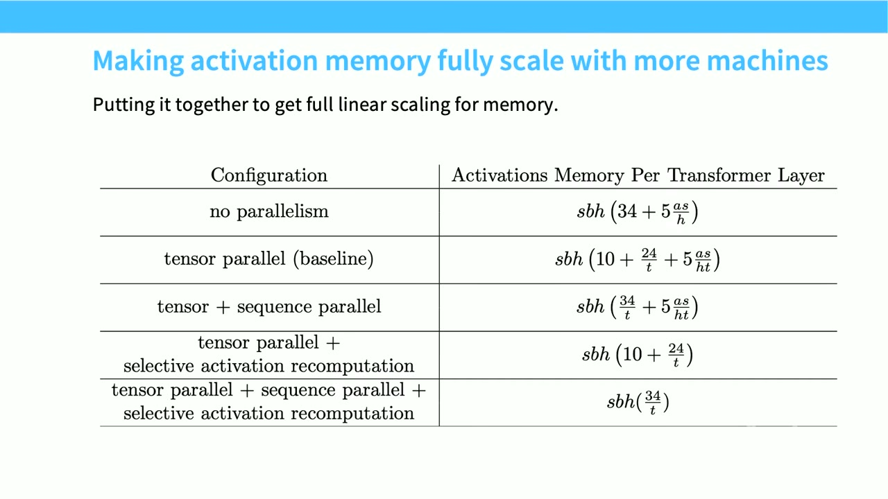
<figcaption>张量、序列并行与选择性重计算组合后，主要激活项才能更接近线性缩放。</figcaption>
</figure>

## 上下文并行：长序列注意力怎样跨卡

序列并行主要处理逐 token 激活；上下文并行进一步把长上下文的注意力计算分到多卡。每个 rank 保存一段 query，并让 key/value 分块在环上流动。每收到一块 KV，就计算局部注意力贡献，并用在线 softmax 合并，避免聚合完整序列。

<figure data-latex-placement="H">
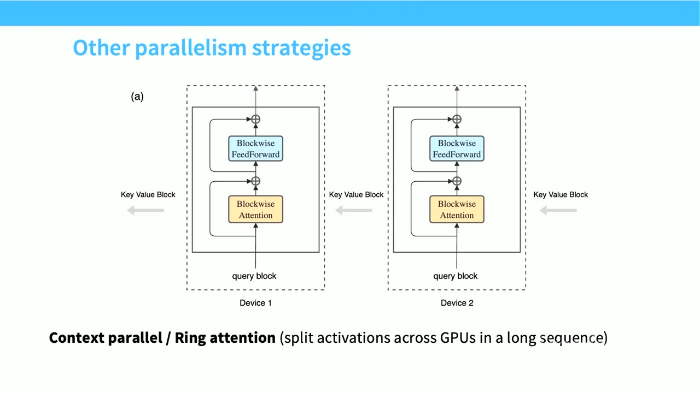
<figcaption>环形注意力让各设备保存不同 query 块，并轮转 KV 块以完成全局注意力。</figcaption>
</figure>

在线 softmax 合并必须维持数值稳定。若当前块最大 logit 为 $`m_a`$、指数和为 $`l_a`$，新块为 $`m_b,l_b`$，合并最大值 $`m=\max(m_a,m_b)`$，合并和为
```math
l=e^{m_a-m}l_a+e^{m_b-m}l_b.
```
其中 $`m`$ 是合并后的最大 logit，$`l`$ 是按新最大值重标定后的指数和。这允许逐块处理注意力而得到与整体 softmax 等价的结果。实现还需同步加权输出，并正确处理因果掩码。

## 本章小结

激活是长序列训练的核心容量项。序列并行分片逐 token 操作，上下文并行分片注意力上下文；它们与 FlashAttention、重计算共同让内存随设备数更接近线性下降。

# 专家并行：让 token 去找参数

## MoE 的稀疏计算改变了通信模式

混合专家层拥有 $`E`$ 个专家，但每个 token 只选择 $`k`$ 个，$`k\ll E`$。路由器为 token 计算专家分数，选择 top-$`k`$，随后把 token 发送到保存目标专家的 rank。专家计算完成后再把结果送回原 rank。因此专家并行主要使用 all-to-all，而不是 all-reduce。

若每个专家是相同 MLP，专家并行度为 $`e`$，每卡约保存 $`E/e`$ 个专家参数。与把每个专家矩阵继续做细粒度张量切分相比，让一张卡执行完整专家矩阵可获得更大的 GEMM，更容易提高计算效率。

<figure data-latex-placement="H">
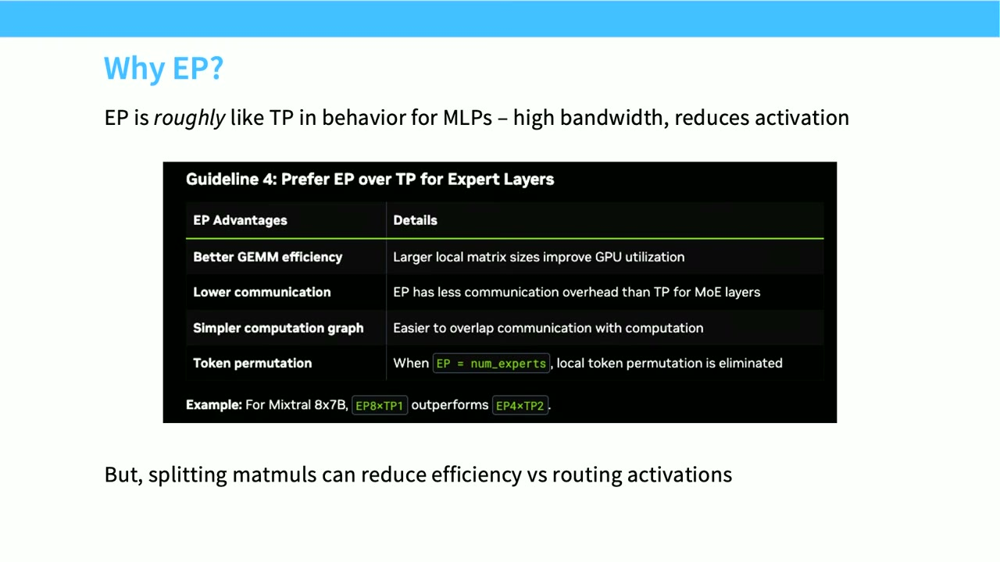
<figcaption>专家并行通过路由激活而非切碎每个专家矩阵，通常能保持更大的本地 GEMM。</figcaption>
</figure>

## 容量因子、负载均衡与丢 token

即使平均每个专家接收 $`BSk/E`$ 个 token，路由分布也可能不均。工程实现常为每个专家设置容量
```math
C_{\mathrm{expert}}=\left\lceil \gamma\frac{BSk}{E}\right\rceil,
```
其中 $`B`$ 是批量，$`S`$ 是序列长度，$`k`$ 是每 token 选择的专家数，$`E`$ 是专家总数，$`\gamma>1`$ 是容量因子。$`\gamma`$ 太小会溢出或丢 token，太大则浪费缓冲区并增加内存。负载均衡损失鼓励路由概率和实际分配更均匀，但过强会干扰专家分工。

## 通信与计算重叠为什么困难

MoE 一层通常经历打包、dispatch、专家 GEMM、combine 与解包。all-to-all 的目的地随 token 路由变化，消息大小不规则，跨节点拥塞更难预测。高效系统把 token 分块，让一块在专家计算时，下一块并行传输；还可能用低精度传输、拓扑感知路由和专用通信内核。

<figure data-latex-placement="H">
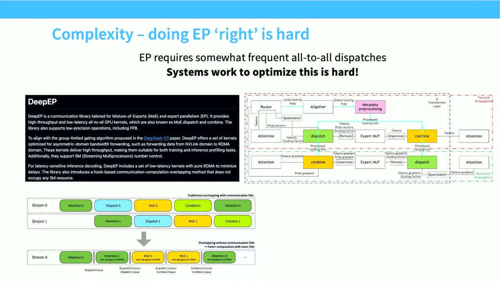
<figcaption>专家并行的系统难点是高频不规则 all-to-all；分块与通信计算重叠可减少暴露等待。</figcaption>
</figure>

注意力层通常不含专家，而 MLP 层含专家。若强迫两者使用完全相同的并行网格，注意力希望较高张量并行度，专家 MLP 却可能希望较高专家并行度，两者冲突。现代框架允许注意力与 MoE 使用不同的并行分组，再在层边界转换布局。

<div class="warningbox">

误区：专家越多，单卡算力就越省 总参数可以随专家数增加而增长，而每 token 激活参数量近似保持；但路由、负载不均、all-to-all 和小批专家 GEMM 都可能降低实际吞吐。MoE 的“稀疏”是计算图性质，不代表系统成本自动稀疏。

</div>

## 本章小结

专家并行以 all-to-all 路由 token，使每卡保存和计算部分专家。它能扩展参数容量并保持大矩阵效率，但负载均衡、不规则通信和注意力/专家网格解耦使系统实现更复杂。

# 多维并行：把逻辑网格映射到物理集群

## 并行度乘积与 rank 坐标

大规模训练常令
```math
N=d\times p\times t\times e\times c,
```
其中 $`N`$ 是总设备数，$`d`$ 是数据并行度，$`p`$ 是流水线并行度，$`t`$ 是张量并行度，$`e`$ 是专家并行度，$`c`$ 是上下文并行度。每个 rank 可视为五维坐标 $`(i_d,i_p,i_t,i_e,i_c)`$。不同集合通信只在某一坐标变化、其余坐标固定的子组内进行。

<figure data-latex-placement="H">
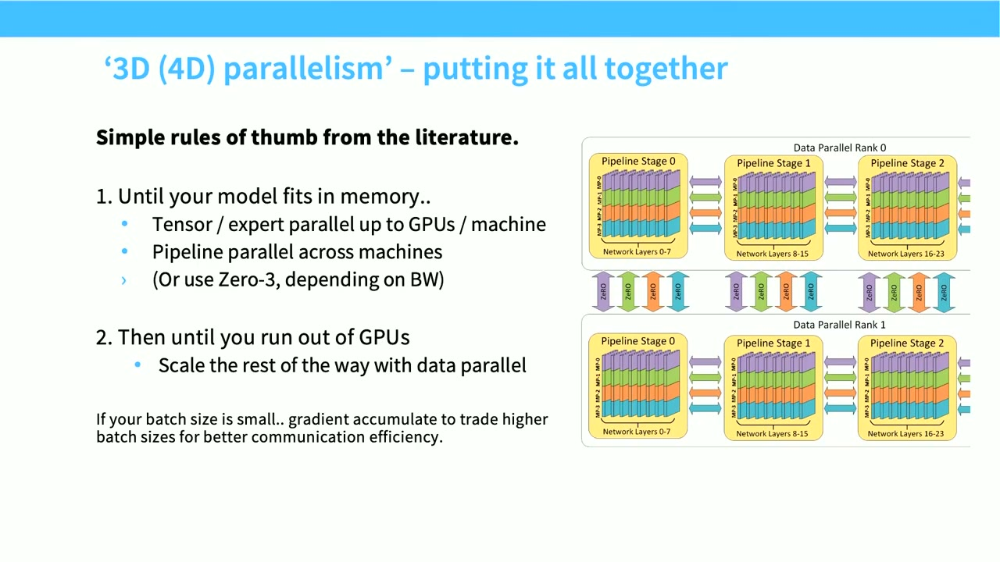
<figcaption>多维并行把数据副本、流水阶段和层内分片组合成逻辑设备网格。</figcaption>
</figure>

映射原则是把通信最频繁、最依赖低延迟的组放在最快域内。张量并行几乎每层通信，通常放在单节点；专家 all-to-all 若流量大，也优先限制在高速域或少数相邻节点；流水线只在阶段边界点对点传激活，可跨节点；数据并行梯度同步颗粒较大、较容易重叠，常覆盖更广节点。

## 一套可操作的选择顺序

第一步，先测单卡或单节点的参数、激活和内核效率基线。第二步，若模型静态状态放不下，优先考虑 ZeRO/FSDP；若单层或激活仍放不下，引入张量、序列或上下文并行。第三步，把张量并行扩到单节点合理上限；若仍需容量，沿层数增加流水线阶段。第四步，MoE 模型按专家数和网络安排专家并行。第五步，模型副本能放下后，用数据并行填满剩余设备。最后扫描微批量、累积步数、bucket 大小和重计算范围。

<figure data-latex-placement="H">
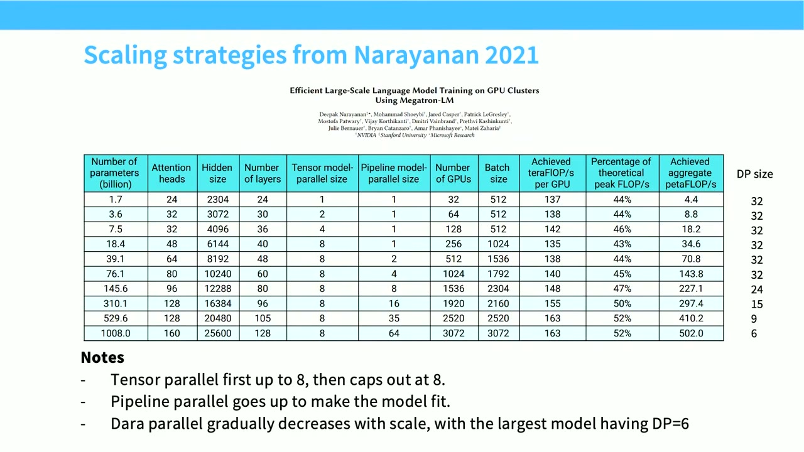
<figcaption>经验规律：先用节点内模型并行解决容量，再用跨节点流水与数据并行扩展总规模。</figcaption>
</figure>

## Worked example：256 张 GPU 的一种分解

假设每节点 8 张高速互连 GPU，共 32 节点。一个稠密模型选择 $`t=8`$、$`p=4`$、$`d=8`$，则 $`8\times4\times8=256`$。每个张量并行组恰好位于单节点；四个流水阶段跨四个节点；八个数据副本覆盖八组四节点。若改成 MoE，可取 $`t=2,p=8,e=8,d=2`$，乘积仍为 256。此时需要明确专家组是否跨节点、attention 与 expert 是否复用同一网格，以及 all-to-all 是否会和流水传输争夺网卡。

这只是起点而不是答案。若阶段不均衡，$`p=8`$ 可能比 $`p=4`$ 更差；若本地批量太小，$`d=8`$ 会让每卡矩阵过小；若专家路由偏斜，$`e=8`$ 可能出现长尾。并行配置必须由端到端 profiler 验证。

## 并行效率与 MFU

强扩展效率可写成
```math
E_N=\frac{T_1}{N T_N},
```
其中 $`T_1`$ 是单设备完成固定工作量的耗时，$`T_N`$ 是 $`N`$ 设备耗时，$`E_N=1`$ 表示理想线性加速。大模型常无法获得同规模单卡基线，因此也使用模型 FLOPs 利用率
```math
\mathrm{MFU}=\frac{\text{每秒完成的模型有效浮点运算}}{N\times\text{单卡理论峰值}}.
```
分子应按统一训练 FLOPs 口径计算，分母要匹配实际数值精度的理论峰值。MFU 低可能来自通信、气泡、矩阵过小、数据加载、重计算或内核未融合，不能单凭一个数定位原因。

## 本章小结

多维并行是一张逻辑网格。优质配置不仅满足设备数乘积，还让高频通信留在快链路、低频大消息走远链路，并使每个局部矩阵和微批仍足够大。

# 工业配置怎样读：不要只抄一串并行度

## 公开配置提供的是约束证据

公开模型常报告 TP、PP、DP、EP、CP 或 ZeRO 阶段。这些数字只有结合模型结构、设备代际、节点拓扑、全局批量和软件实现才有意义。早期稠密模型常先把 TP 扩到单节点，再随参数量增加 PP，并逐渐降低 DP；现代 MoE 模型则常用较大 EP，把 TP 保持较低，以免把专家 GEMM 切得过碎。

<figure data-latex-placement="H">
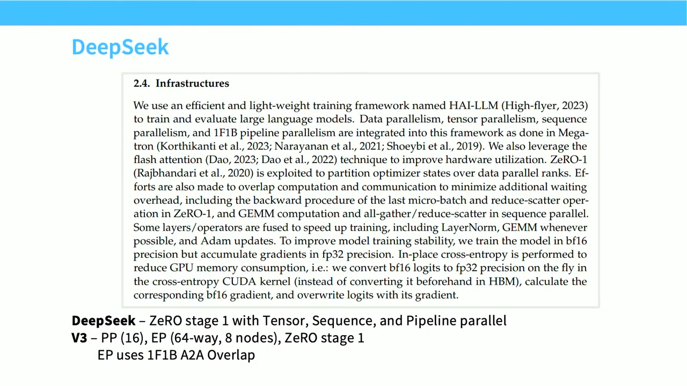
<figcaption>公开训练系统把 ZeRO、张量、序列、流水和专家并行组合，并主动重叠多类通信。</figcaption>
</figure>

从公开案例中可提炼三条稳定经验。第一，**单节点是重要边界**：许多 7B 级模型可以用 FSDP 在节点内完成，而更大模型需要跨节点模型并行。第二，**稠密与 MoE 的最优切法不同**：MoE 关注专家路由和大本地 GEMM，稠密模型更多平衡 TP、PP 与 FSDP。第三，**容错是规模的一部分**：设备、内存、交换网络和软件故障在数千卡训练中不可忽略，必须使用分布式检查点、健康监测和可恢复数据加载状态。

## 如何迁移而不是照抄

迁移公开配置时，先回答五个问题：目标 GPU 的显存和矩阵峰值是否相同；节点内与跨节点带宽是否相近；模型隐藏维度、头数和专家数是否能被并行度整除；目标全局批量是否允许足够微批；框架是否实现同样的重叠、融合与布局转换。任何一个答案不同，都可能要求重新搜索。

一份合格的配置记录应包括：模型结构、精度、激活重计算范围、所有并行度、每卡微批、累积步数、全局批量、序列长度、节点拓扑、通信库版本、峰值显存、吞吐、MFU 和故障恢复策略。只有并行度而没有这些上下文，难以复现。

## 本章小结

工业案例用于学习约束与设计模式，不是可直接复制的魔法参数。硬件、模型和软件三者共同决定并行配置。

# 实现蓝图：从正确性到性能

## 先验证数学等价，再优化通信

并行实现的第一关不是吞吐，而是数值正确。用小模型、固定随机种子和同一全局批量，对比单卡参考与分布式版本的前向损失、梯度、一步更新后参数。浮点归约顺序不同会产生微小误差，应使用相对误差和长期损失曲线判断，而不是要求位级相同。

```
mesh = build_mesh(dp=DP, pp=PP, tp=TP, ep=EP, cp=CP)
model = shard_layers(model, mesh.tp, mesh.pp)
model = shard_experts(model, mesh.ep)
model = wrap_fully_sharded(model, mesh.dp)

for batch in loader:
    local_tokens = shard_data(batch, mesh.dp)
    with activation_checkpointing():
        loss = pipeline_forward_backward(local_tokens, mesh.pp)
    verify_finite(loss, gradients(model))
    optimizer.step()
    checkpoint_distributed(model, optimizer, loader.state)
```

第二关是峰值内存。分别记录静态状态、激活、通信 bucket、临时工作区和分配器保留内存；用不同序列长度和微批量测试最坏情况。第三关才是性能：把训练步拆成 GEMM、逐元素算子、集合通信、点对点通信、流水气泡、数据加载和检查点写入，找真正暴露在关键路径上的部分。

## 通信重叠的正确姿势

异步通信只有在三项条件满足时才有收益：通信使用独立 stream 或执行资源；后续计算不依赖其结果；网络与 GPU 执行不会因资源争用而相互拖慢。过度预取会增加完整参数或激活驻留，导致显存峰值上升。应从单层预取开始，观察通信是否被覆盖，再逐步扩大窗口。

## 故障恢复与分布式检查点

大规模训练不能在保存时把所有分片聚合到 rank 0。分布式检查点让各 rank 写自己的参数和优化器分片，并附带全局元数据。恢复到不同设备数时，需要根据张量全局形状重新分片。还应保存学习率调度器、随机数状态、数据迭代位置和损失缩放器，否则“恢复”后的轨迹并不连续。

<div class="warningbox">

四类高频错误 一是全局批量计算错误，导致学习率与训练配方失配；二是 reduce 的求和与求平均混淆，使梯度多乘或少乘并行度；三是分片维度不可整除或共享参数被重复更新；四是只有吞吐测试，没有与单卡参考做损失和梯度验证。性能优化不能跨过正确性基线。

</div>

## 本章小结

可靠实现遵循“参考基线、数值验证、内存验证、剖析关键路径、再调重叠”的顺序。检查点和容错不是附加功能，而是大规模训练能否完成的一部分。

# 综合例题：为一个长上下文 MoE 模型设计方案

## 题目与约束

假设模型有 64 层，隐藏维度 8192，包含 64 个专家，每 token 选择 2 个专家；序列长度 32768；集群有 128 张 GPU，每节点 8 张，节点内高速互连，节点间带宽明显较低。目标是先让模型稳定放下，再提高吞吐。

第一步考虑节点内布局。专家数 64 可选 $`e=8`$，让每节点八卡各负责一组专家；注意力不需要 EP，可在注意力层使用 $`t=4`$ 或 $`t=8`$，并通过独立网格避免把专家矩阵切得太碎。长序列激活巨大，引入 $`c=2`$ 或 $`c=4`$ 的上下文并行，并配合序列并行与选择性重计算。

第二步考虑跨节点容量。若单节点内分片后仍放不下，可用 $`p=4`$ 把层分成四个流水阶段，每阶段跨一个或若干节点组。点对点激活通信跨节点，频率低于逐层张量通信。第三步用数据并行填满剩余设备。一个候选分解为 $`p=4,e=8,c=2,d=2`$，乘积 $`4\times8\times2\times2=128`$；注意力层中的 $`e`$ 维可重新解释为张量或注意力数据组，不能机械沿用专家网格。

## 容量与性能检查

容量检查包括每卡专家参数、注意力参数、优化器分片、长序列激活、流水在途微批和通信缓冲。性能检查包括专家 all-to-all 是否局限在节点内、上下文环是否跨越过多慢链路、流水阶段是否因 MoE 层分布不均而失衡，以及微批是否足够大。若专家 all-to-all 成为瓶颈，可降低跨节点 EP、增加本地专家数或采用拓扑感知路由；若流水气泡高，可增大微批数或调整层分配；若激活溢出，可提高重计算或上下文并行度。

## 验收标准

先在缩小模型上验证路由与梯度等价；再在单节点验证 TP/EP/CP 组合；随后扩至两个流水阶段检查点对点通信；最后扩大 DP。每一级记录损失差异、峰值显存、每步吞吐、通信占比和故障恢复。只有当新增设备提高总吞吐且没有破坏数值行为，扩展才算成功。

## 本章小结

复杂模型的并行设计是约束求解：先按算子选择最自然的切分轴，再按物理网络安排组，最后用数据并行填充规模。任何漂亮的并行度乘积都必须通过容量、正确性和 profiler 三重检验。

# 总结与延伸

本讲从通信积木出发，建立了一套可独立使用的并行训练框架。数据并行切样本，简单且适合扩吞吐，但复制模型状态；ZeRO/FSDP 通过 reduce-scatter、all-gather 与按需释放消除状态冗余；流水线并行沿深度切层，以微批换利用率；张量并行切单层矩阵，在高速互连域内高频通信；序列和上下文并行处理长序列激活；专家并行用 all-to-all 把 token 路由到稀疏参数。

<figure data-latex-placement="H">
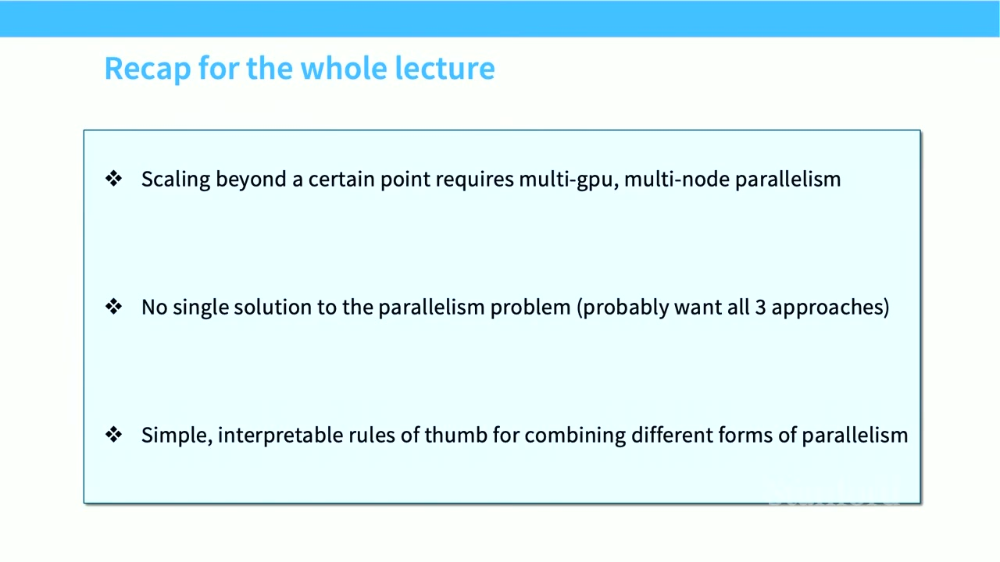
<figcaption>全讲总览：扩展依赖多种并行方式协作，而非寻找唯一方案。</figcaption>
</figure>

把这些方法组合时，应遵循四条原则。第一，**先解决放不下，再解决跑不快**；容量不足时吞吐讨论没有意义。第二，**按通信频率匹配拓扑**；逐层集合通信留在快链路，点对点与大 bucket 可走更远。第三，**保持局部算子够大**；切分过细会让 GEMM 失去效率。第四，**以端到端证据决策**；理论字节量只能筛选候选，最终必须看峰值显存、有效吞吐、MFU、通信暴露和训练曲线。

进一步学习可沿三个方向展开。系统方向可研究 NCCL 集合通信算法、拓扑感知放置、通信与计算重叠及分布式检查点；算法方向可研究大批量优化、MoE 负载均衡、长上下文注意力与数值稳定；自动化方向可把模型图、硬件拓扑和测量结果交给代价模型，搜索并行网格、微批与重计算策略。真正成熟的并行系统不是固定配置，而是能针对新模型和新硬件重新测量、验证与选择。

<div class="importantbox">

最终自检清单 模型是否能在最坏输入下留出安全显存余量？全局批量、梯度缩放和单卡参考是否一致？并行组是否映射到合适链路？最慢流水阶段和最拥塞通信组是谁？检查点能否在故障后恢复模型、优化器与数据位置？新增设备是否真正提高端到端吞吐？若这些问题都有量化答案，并行配置才具备可复现性。

</div>
