<div class="titlepage">

**Stanford CS336 第 13 讲：数据来源与数据集**

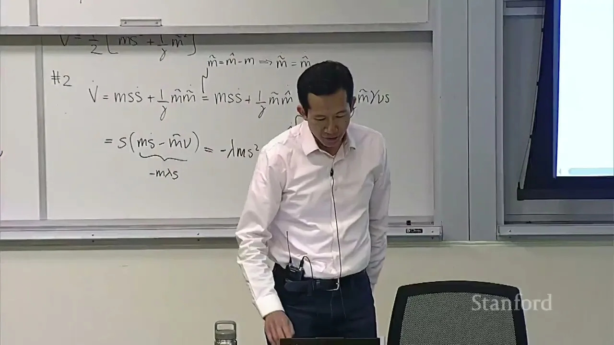

<div class="tcolorbox">

**视频作者/频道**：Stanford Online

**发布日期**：2026 年 5 月 19 日

**视频时长**：1:22:01

**视频链接**：[`https://youtu.be/-qm0ln33G24`](https://youtu.be/-qm0ln33G24)

**课程主题**：预训练数据的来源、采集约束、版权与典型公开数据集。

</div>

</div>

# 为什么数据需要被当作系统来设计

## 动机：模型不会从“互联网”自动得到数据

一句常见但不准确的说法是“大模型在整个互联网上训练”。实际系统面对的是一组可访问服务器、特定时间的快照、爬虫协议、授权范围与处理流水线。数据质量并非天然属性，而是**来源选择、抓取行为、过滤器、去重器和配比**共同作用的结果。

<figure data-latex-placement="H">
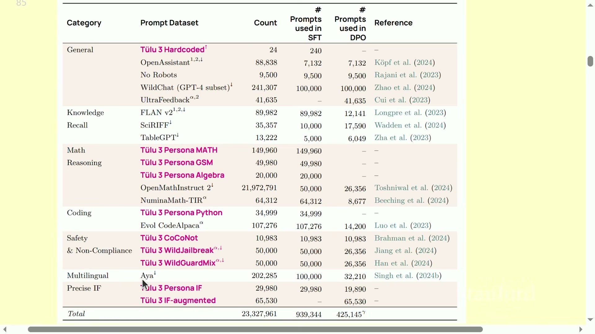
<figcaption>公开模型使用的提示与训练数据覆盖通用、知识、数学、代码、安全和多语种等类别；数据设计决定能力结构。</figcaption>
</figure>

<div class="importantbox">

本讲的核心问题 原始数据从哪里来？什么内容技术上可取得、法律上可使用、伦理上可接受？取得后怎样把嘈杂网页转成可复现的数据集？

</div>

<figure data-latex-placement="H">
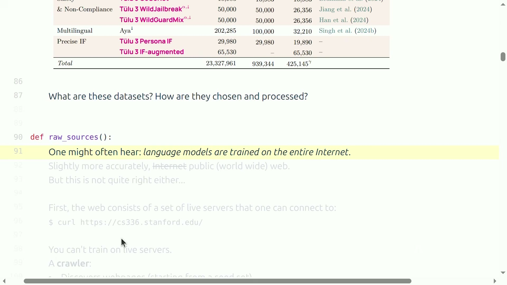
<figcaption>“在整个互联网训练”只是近似说法：模型只能训练于被发现、可下载并被处理的有限快照。</figcaption>
</figure>

## 数据供应链的六层

1.  **来源层**：网页、代码仓库、论文、书籍、问答、百科与授权库；

2.  **发现层**：URL frontier、站点地图、链接图与数据转储；

3.  **获取层**：HTTP、Git、对象存储、公开 dump 或商业许可；

4.  **合规层**：robots、服务条款、版权、隐私、地域限制；

5.  **变换层**：正文抽取、语言识别、去重、质量与安全过滤；

6.  **混合层**：按 token、域、语言和质量采样形成最终训练流。

## 本章小结

数据不是静态文件，而是一条可审计的供应链。任何“数据集名称”都应展开成来源、版本、处理代码与混合权重。

# 爬取现实：技术、访问与同意

## 抓到不等于能用

现代站点常是动态应用，URL 不稳定、需要 JavaScript、登录或付费；站点还会通过 robots.txt、验证码、限速和封锁 IP 约束自动化访问。爬虫既可能漏掉高价值内容，也可能因高并发伤害服务。

<figure data-latex-placement="H">
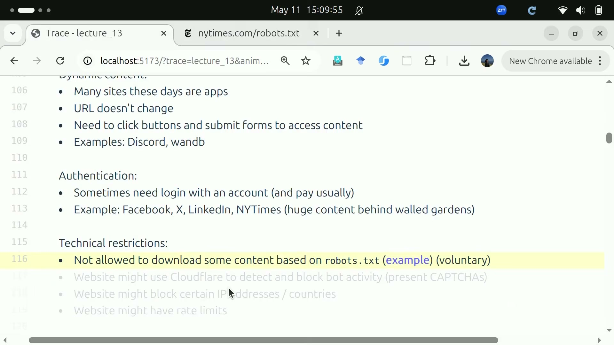
<figcaption>爬取受到动态页面、认证、robots.txt、验证码和地域/IP 策略等多重技术约束。</figcaption>
</figure>

<div class="knowledgebox">

一个最小的礼貌爬虫策略 每个域名维护独立速率限制；尊重 robots 与 Retry-After；缓存已抓内容；固定 user-agent 与联系邮箱；记录时间、URL、状态码、内容哈希和许可元数据。

</div>

<figure data-latex-placement="H">
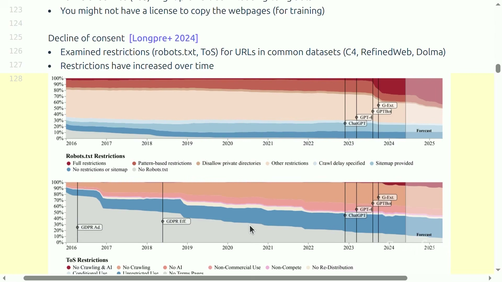
<figcaption>研究显示常见语料覆盖的网页对自动抓取与模型训练的限制随时间上升。</figcaption>
</figure>

## 同意是动态变量

网站所有者可能在某个时间点修改 robots 或服务条款。训练数据快照必须保留采集时间与当时规则；否则事后无法回答“当时是否允许抓取”。这也意味着同一 URL 的两个版本可能具有不同合规状态。

<figure data-latex-placement="H">
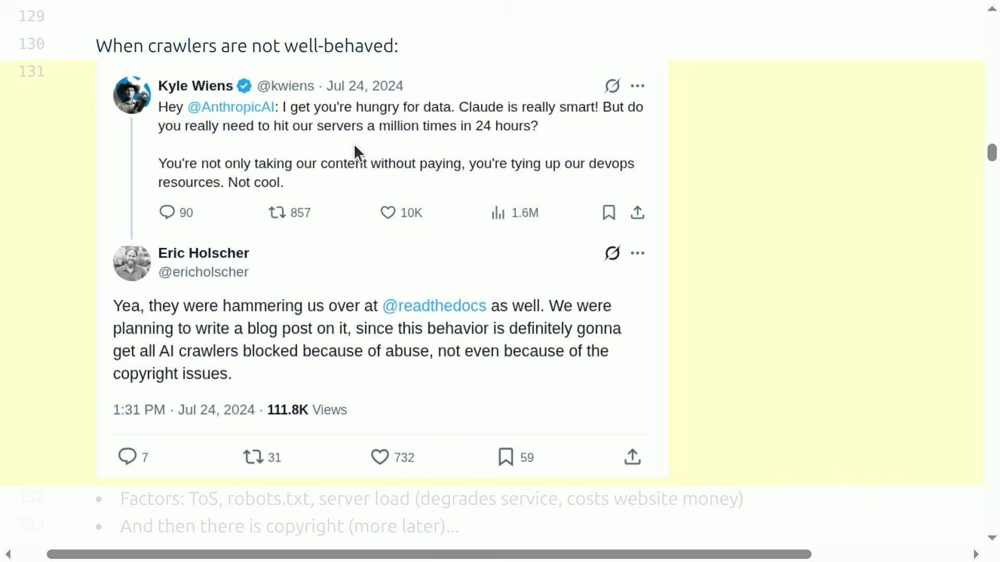
<figcaption>站点维护者对高频 AI 爬虫的公开抱怨：抓取成本会外部化给内容提供者。</figcaption>
</figure>

<div class="warningbox">

访问权限与内容权利是两条轴 robots.txt 是自动访问约定，不授予版权许可；能通过浏览器读取也不代表可以批量复制用于训练。反过来，具有开放许可的内容也应通过官方 dump 等低负担渠道获取。

</div>

## 本章小结

礼貌爬取是工程约束也是数据质量约束：被封锁会改变样本分布，而不可追溯的抓取会使数据集失去可复现性。

# 版权：保护表达，而不是抽象事实

## 核心概念

版权保护固定于具体媒介中的原创表达，而非思想、算法或事实本身。门槛低、默认产生且持续时间长，因此“公开可见”内容通常仍受版权保护。

<figure data-latex-placement="H">
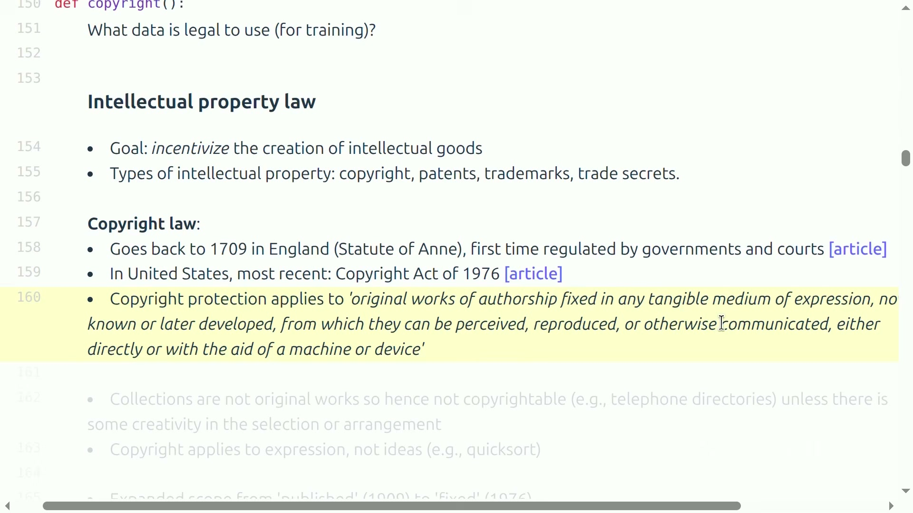
<figcaption>课程给出的版权定义：保护固定在有形媒介上的原创作者表达。</figcaption>
</figure>

<div class="knowledgebox">

四个需要分开的概念 **版权**控制复制和衍生使用；**许可**是权利人给出的使用条件；**公共领域**表示版权限制已不存在；**服务条款**是平台与访问者之间的合同约束。四者不能互相替代。

</div>

## 合理使用是多因素权衡

美国法语境常讨论四项：用途与性质、作品性质、使用数量与实质性、对潜在市场的影响。它不是“教育用途即可”的单条件规则，也不能从技术变换性直接推出合法结论。

<figure data-latex-placement="H">
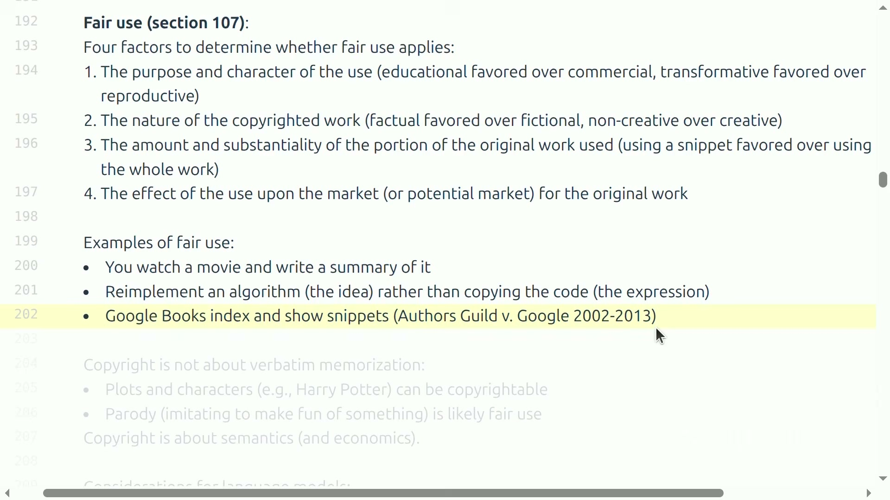
<figcaption>合理使用的四因素：目的、作品性质、使用比例与市场影响。</figcaption>
</figure>

<div class="warningbox">

本笔记不是法律意见 课程讨论帮助建立工程审计框架，不替代特定司法辖区的专业法律判断。项目应保留来源、许可证、退出机制与删除流程。

</div>

## 训练、输出与市场影响

复制发生在训练之前的数据取得阶段；模型输出还可能复现受保护表达或人物情节。风险分析至少包含采集、训练、模型行为和下游部署四个阶段。

<figure data-latex-placement="H">
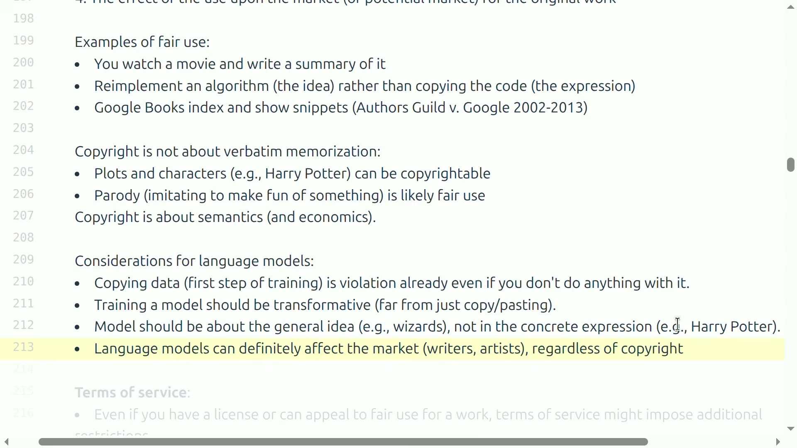
<figcaption>即使对版权存在合理使用主张，服务条款仍可能施加额外访问限制。</figcaption>
</figure>

## 本章小结

合规不是给整个数据集贴一个布尔标签，而是为每个来源保存权利依据，并持续审查模型是否记忆和复现具体表达。

# Common Crawl：大规模网页语料的底座

## 从网页图到公开快照

Common Crawl 定期抓取数十亿网页并公开 WARC/WAT/WET 等格式。WARC 保留原始响应，WAT 偏元数据，WET 提供提取后的纯文本。研究者常从 WET 起步，但正文抽取误差与缺失会被继承。

<figure data-latex-placement="H">
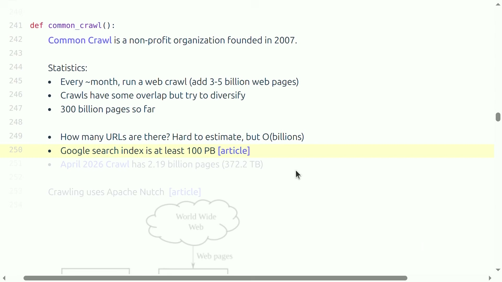
<figcaption>Common Crawl 的规模与月度快照：它是大量预训练数据集的原始底座，而不是即用语料。</figcaption>
</figure>

## 流式处理机制

设原始文档流为 $`D=\{d_i\}`$，处理器链为
```math
\tilde D=M\!\left(Q\!\left(U\!\left(L\!\left(E(D)\right)\right)\right)\right).
```

$`E`$
正文抽取，移除导航、脚本和模板；

$`L`$
语言识别，给出语种概率；

$`U`$
近重复去重；

$`Q`$
质量与安全过滤；

$`M`$
按来源、域和语言混合采样。

```
for shard in crawl_manifest:
    for record in stream_warc(shard):
        text = extract_main_text(record.html)
        if lang_id(text) != "en":
            continue
        if duplicate_index.seen(normalize(text)):
            continue
        score = quality_model(text)
        if score >= threshold:
            writer.write(text, source=record.url,
                         timestamp=record.timestamp,
                         quality=score)
    checkpoint(shard)
```

<div class="importantbox">

工程含义 “Common Crawl 数据”必须同时给出 dump 日期、输入文件列表、正文抽取版本、过滤规则和输出哈希；只写一个名称无法复现。

</div>

## 本章小结

Common Crawl 解决的是可规模化获取网页快照，不解决自然语言质量、版权、隐私、去重或公平性。

# 专门来源：Wikipedia 与 GitHub

## Wikipedia：质量高但分布窄

Wikipedia 有结构化条目、编辑与回滚机制，并提供官方 dump，因此无需对在线站点做高负担爬取。它代表百科式、中性、可核查写作，却缺少大量日常对话、个人观点与长尾表达。

<figure data-latex-placement="H">
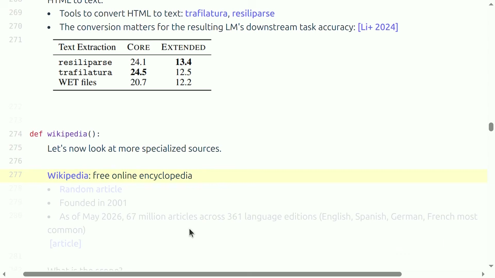
<figcaption>Wikipedia 的规模、语种与治理特征；高质量并不意味着覆盖全部互联网写作。</figcaption>
</figure>

## GitHub：代码与协作元数据

代码仓库包含目录、提交历史、Issue 和 Pull Request。仓库内容应通过 Git 或官方接口取得；事件流则可由 GitHub Archive 等转储获得。许可证必须按仓库甚至文件追踪。

<figure data-latex-placement="H">
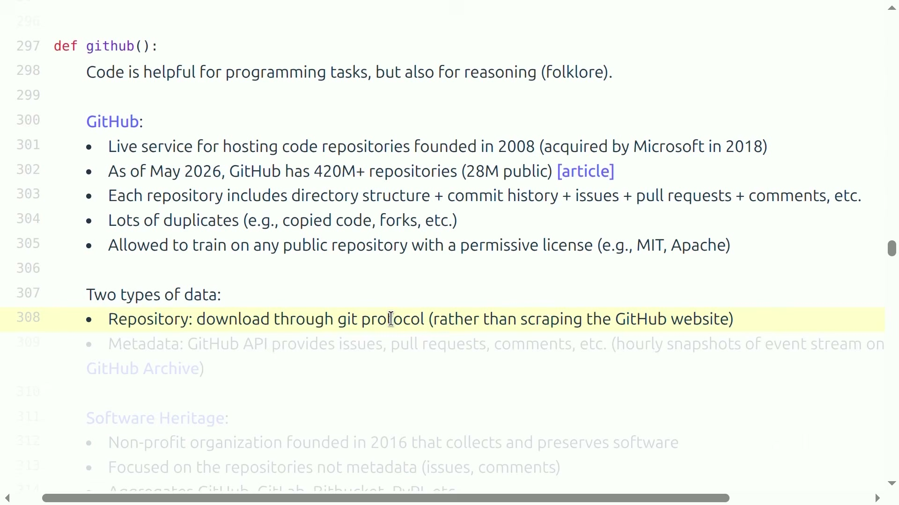
<figcaption>GitHub 的两类数据：仓库代码与协作元数据；两者的采集接口和语义不同。</figcaption>
</figure>

<div class="warningbox">

代码许可证不可用平台许可替代 “GitHub 允许公开访问”不等于所有代码都能按任意方式再分发。训练集应保存许可证探测结果、commit SHA、文件路径和删除清单。

</div>

## 本章小结

专门来源提供明确结构和更强先验，但也带来领域偏置。高质量组合通常来自多来源互补，而非单一“最干净”语料。

# 从 WebText 到 C4：早期网页数据工程

## WebText 的链接选择偏置

WebText 用 Reddit 高 karma 外链作为质量代理：人类社区先做了一层链接选择。这比随机网页干净，却把 Reddit 用户群的兴趣、语言和时间偏置带入模型。

<figure data-latex-placement="H">
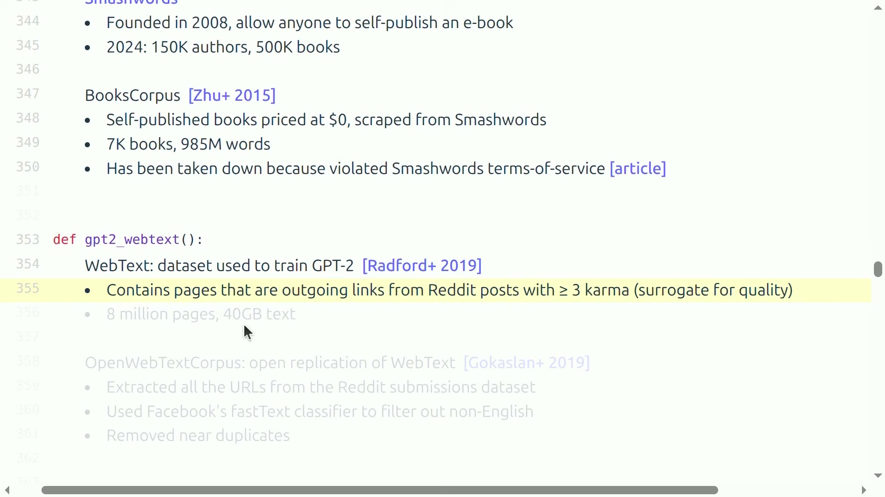
<figcaption>C4 的目标：从 Common Crawl 自动构建大规模高质量文本，并覆盖低资源语言。</figcaption>
</figure>

## C4 的处理机制

C4 包含语言识别、规则清洗、重复段落移除与质量过滤。经典思路是把“像 Wikipedia”作为质量信号，但这可能排斥口语、方言和新体裁。

设文档 $`d`$ 的规则特征为 $`h_k(d)\in\{0,1\}`$，一个可解释过滤器为
```math
\operatorname{keep}(d)=\mathbf 1\!\left[
\sum_{k=1}^{K}w_k h_k(d)\le \tau
\right].
```

$`h_k`$
第 $`k`$ 个噪声规则是否触发，如脏词、重复、短行；

$`w_k`$
规则风险权重；

$`\tau`$
允许的最大风险分数；

$`\mathbf 1`$
条件成立时取 1，否则取 0。

<div class="warningbox">

代理目标的分布代价 “像 Wikipedia”优化的是一种文体相似性，而非普适质量。过滤器应报告各语言、域与群体的通过率，避免把少数表达系统性删除。

</div>

## 本章小结

早期数据集证明：采集更多 URL 与精心处理同样重要；处理规则本身就是模型行为的隐性规范。

# 书籍与长文本来源

## 公共领域与 Project Gutenberg

书籍提供长程叙事、稳定语法和跨段落依赖。Project Gutenberg 以公共领域作品为主，适合构建可解释的长文本来源，但年代、语种和题材分布并不代表现代使用场景。

<figure data-latex-placement="H">
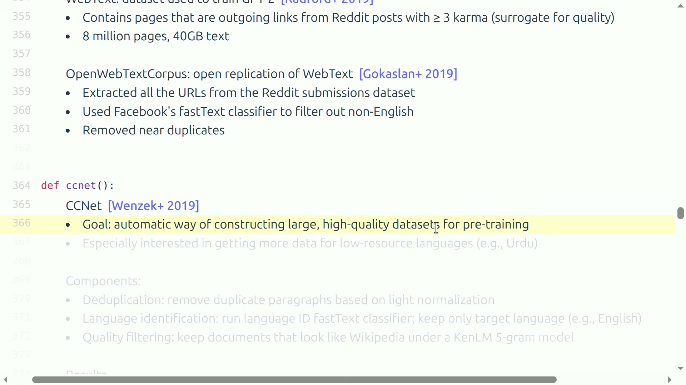
<figcaption>Project Gutenberg：以版权已清理或进入公共领域的图书为主。</figcaption>
</figure>

## 长文本的工程处理

应去除页眉页脚、OCR 噪声与授权声明；按作品而非随机段落划分训练/验证集，防止同一本书泄漏。若文档 $`b`$ 被切成窗口 $`c_{b,j}`$，划分函数必须满足
```math
s(c_{b,j})=s(c_{b,k})\quad \forall j,k,
```
其中 $`s`$ 是 train/valid/test 分配，确保同一作品全部窗口属于同一划分。

<div class="knowledgebox">

为什么长文本仍值得单独配比 网页平均文档短且模板化；书籍能提供跨章节指代、叙事一致性和罕见词汇。混合时应按 token 和文档两个尺度审计，防止少量超长作品过度影响训练。

</div>

## 本章小结

“书籍”不是质量保证；来源权利、版本、OCR 与作品级去重决定其训练价值。

# Dolma：透明的多来源混合

## 来源配方

Dolma 把网页、代码、Reddit、论文、书籍和百科组合为公开数据集。课程画面列出每个来源的字节、文档、词和 token 规模，体现了可审计配方的重要性。

<figure data-latex-placement="H">
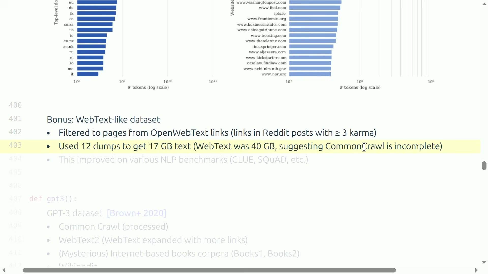
<figcaption>Dolma 的多来源构成：网页占主体，同时纳入代码、社交、论文、图书和百科。</figcaption>
</figure>

若来源 $`i`$ 有 $`N_i`$ 个 token，训练混合权重为 $`\alpha_i`$，则一次采样来源概率为
```math
p(i)=\frac{\alpha_i N_i^{\beta}}{\sum_j \alpha_jN_j^{\beta}}.
```

$`N_i`$
来源可用 token 数；

$`\alpha_i`$
人工设定的领域优先级；

$`\beta`$
规模平滑指数；$`\beta=1`$ 近似按规模，$`\beta<1`$ 上采样小来源；

$`p(i)`$
训练时选择来源 $`i`$ 的概率。

```
def sample_record(rng, sources, weights):
    source_id = rng.choice(len(sources), p=weights)
    record = sources[source_id].next()
    return {
        "text": record.text,
        "source": source_id,
        "doc_id": record.doc_id,
        "license": record.license,
    }
```

<div class="importantbox">

混合权重是模型超参数 同一批原始文件，只要代码/数学/多语种比例改变，就会得到能力结构不同的模型。权重、温度和重复次数必须进入训练配置与模型卡。

</div>

## 本章小结

透明数据集的价值不只在规模，也在于能追踪每个来源如何进入最终 token 流。

# DCLM：把数据过滤变成受控实验

## 流水线分解

DCLM 将清洗分为启发式规则、去重和模型过滤，并报告每一步保留比例。这样可以把“数据更好”转化为可复现消融。

<figure data-latex-placement="H">
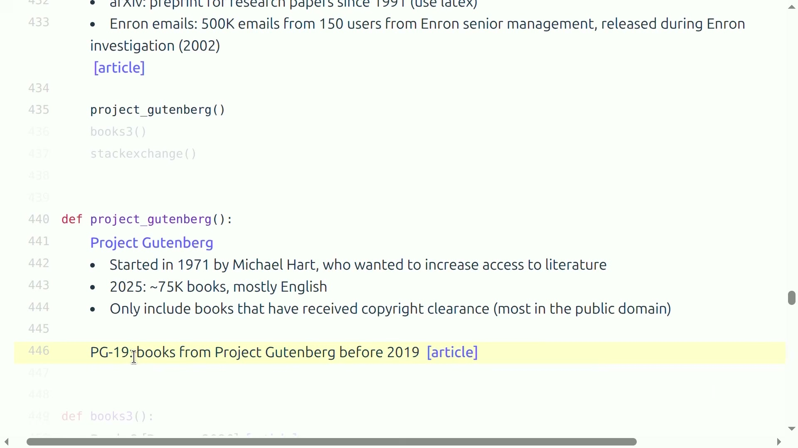
<figcaption>DCLM-Baseline 的构建漏斗：启发式清洗、去重与模型过滤逐级压缩原始池。</figcaption>
</figure>

## 质量分类器

给定文档表示 $`\phi(d)`$，二分类质量模型为
```math
q_\theta(d)=\sigma(\theta^\top\phi(d)),\qquad
\operatorname{keep}(d)=\mathbf 1[q_\theta(d)\ge \tau].
```

$`\phi(d)`$
文档的词法、结构或语言模型表示；

$`\theta`$
从正负样本学习的参数；

$`\sigma`$
logistic 函数，把分数映射到 $`[0,1]`$；

$`\tau`$
精度与召回的过滤阈值。

分类器的正样本定义决定“质量”的含义；只用百科正样本会偏向百科文体。正确做法是以固定模型规模、token 预算和 benchmark 对不同过滤器做端到端对照。

<figure data-latex-placement="H">
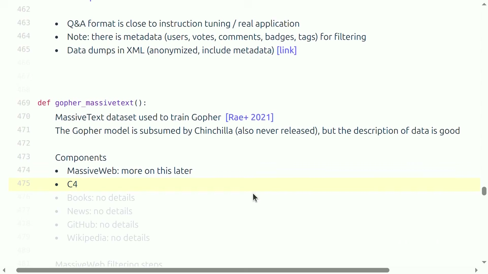
<figcaption>Nemotron-CC 组合 DCLM 质量过滤与更激进的数据保留策略，强调 token 数量与质量的权衡。</figcaption>
</figure>

<div class="warningbox">

离线分类准确率不是最终目标 过滤器 A 的 AUROC 更高，不保证用 A 过滤后的语言模型更强。可信比较必须固定训练计算、数据规模与评估协议。

</div>

## 本章小结

DCLM 的方法论贡献是把数据选择变成受控变量：过滤代码、保留率和下游效果可以被同时审计。

# 许可优先的代码与文本数据

## The Stack

The Stack 以具有宽松许可证的源代码为目标，仍需处理许可证识别、生成文件、密钥、个人信息、重复 fork 和后续删除请求。

<figure data-latex-placement="H">
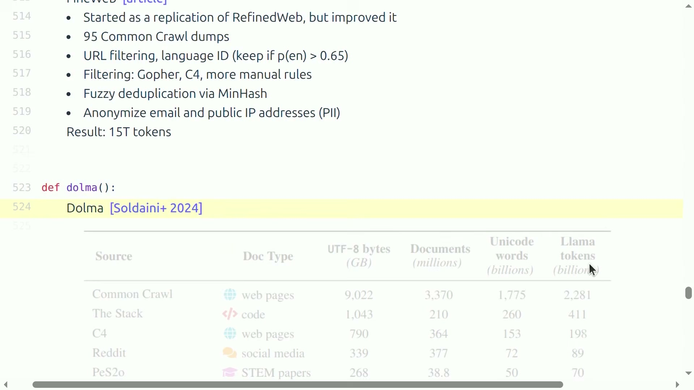
<figcaption>The Stack：以许可明确的源代码为核心，但仓库级许可仍需落实到文件和版本。</figcaption>
</figure>

## Common Pile

许可优先数据集尝试组合代码、政府文件、百科、公共领域图书与开放资源，以减少不明确权利来源。课程图展示不同类别规模差异，也说明“完全许可清晰”会改变数据分布。

<figure data-latex-placement="H">
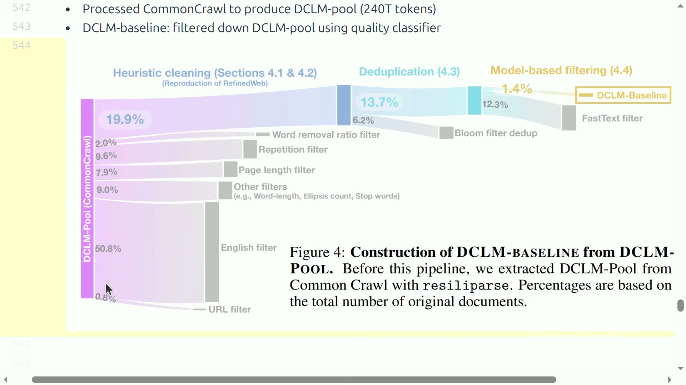
<figcaption>Common Pile 的来源规模：许可优先并不意味着各领域均衡覆盖。</figcaption>
</figure>

<figure data-latex-placement="H">
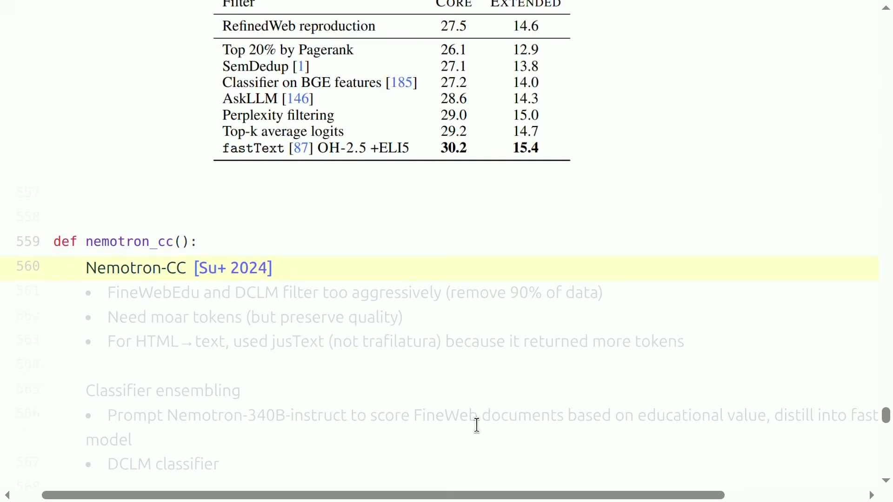
<figcaption>集合许可证与单个文档权利并不总能自动传递；还需处理 license laundering 与合成数据来源。</figcaption>
</figure>

<div class="warningbox">

许可洗白与合成数据 集合标称开放，不代表其中每个文档都合法再许可；合成数据也继承生成模型训练来源与输出条款的不确定性。应保留逐条 provenance，而不是只保留集合名称。

</div>

## 本章小结

许可优先是可执行方向，但它把问题从“是否抓到”转为“是否能证明来源、权利链与删除能力”。

# 模型过滤、去重与数据价值

## 模型作为过滤器

后期数据集越来越多地使用语言模型或指令模型打分教育价值、可读性、事实密度和安全性。其优点是能表达复杂规则，缺点是成本、偏差与不可解释性。

<figure data-latex-placement="H">
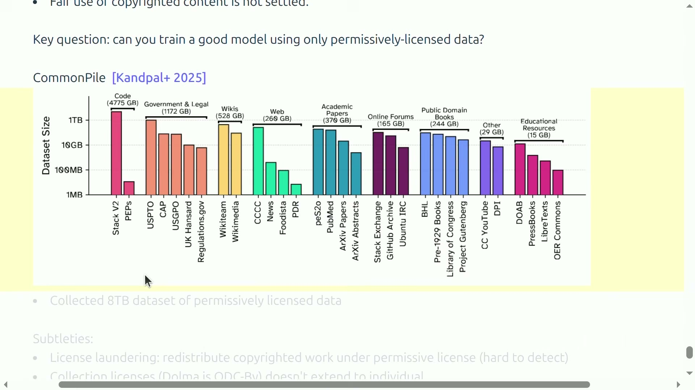
<figcaption>模型过滤可融合多个质量标准，但过滤模型本身成为数据供应链中的关键依赖。</figcaption>
</figure>

## 近重复去重

将文档分成 $`n`$-gram 集合 $`S(d)`$，Jaccard 相似度为
```math
J(d_i,d_j)=\frac{|S(d_i)\cap S(d_j)|}{|S(d_i)\cup S(d_j)|}.
```

$`S(d)`$
文档 $`d`$ 的标准化 $`n`$-gram 集合；

$`|\cdot|`$
集合基数；

$`J`$
从 0 到 1 的重叠率，越大越相似。

实际规模下用 MinHash/LSH 近似候选对，再在文档或段落级合并。去重能减少记忆与训练浪费，却可能误删模板相同但事实不同的记录。

```
def audit_filter(doc):
    reasons = []
    if doc.lang_prob < 0.8: reasons.append("language")
    if doc.pii_hits: reasons.append("pii")
    if doc.dup_cluster_size > 1: reasons.append("duplicate")
    if doc.quality < 0.55: reasons.append("quality")
    return {"keep": not reasons, "reasons": reasons,
            "source_id": doc.source_id}
```

## 本章小结

过滤器不是“清洗工具”而是数据分布变换器；必须报告分域保留率、误删样本与下游影响。

# 一套可复现的数据工程协议

## 从原始来源到训练流

1.  冻结来源清单、采集日期、访问规则与许可证据；

2.  保存原始对象不可变哈希，变换产物另存；

3.  对正文抽取、语言识别、PII、安全、质量分别版本化；

4.  在文档、段落和跨来源三个尺度去重；

5.  在固定小模型与 token 预算下做过滤/配比消融；

6.  发布数据卡、删除机制与训练时精确 manifest。

<div class="importantbox">

数据集最小审计单元 每条记录至少需要：稳定 doc id、来源 URI、抓取时间、内容哈希、许可证/权利依据、处理版本、过滤分数、去重簇与最终采样权重。

</div>

## 数据价值的受控比较

固定模型架构、优化器、训练 FLOPs 与 token 数，只有数据处理或混合变化，最终差异才可归因于数据。可写为
```math
\Delta_m=\operatorname{Score}_m(D_B)-\operatorname{Score}_m(D_A),
```
其中 $`m`$ 是具体评估任务，$`D_A,D_B`$ 是两个数据配方。必须报告多个任务上的 $`\Delta_m`$，不能以单个平均分代替能力结构。

## 本章小结

可靠数据实验遵循“来源冻结—变换版本化—训练对照—多任务评估”的闭环；否则数据改动和训练噪声无法区分。

# 总结与延伸

## 整讲内容压缩

<figure data-latex-placement="H">
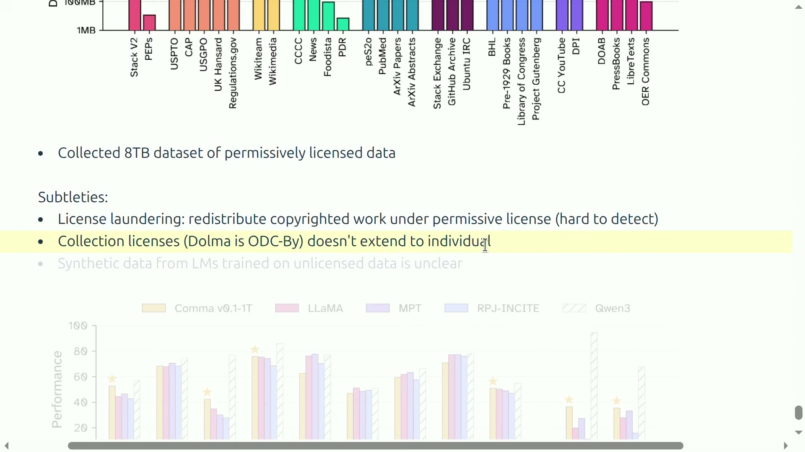
<figcaption>课程总结：数据不会从天而降；原始来源必须经过变换，且数据是区分语言模型能力的关键成分。</figcaption>
</figure>

<div class="importantbox">

五条最终结论

1.  网络是动态服务集合，不是一个可完整下载的文件；

2.  可访问、可复制、可训练与可再分发是不同问题；

3.  Common Crawl 是原料，C4、Dolma、DCLM 等才是处理后的配方；

4.  过滤、去重和混合权重与模型架构一样会改变能力；

5.  最有价值的资产是可追溯供应链，而不只是最终 token 包。

</div>

## 进一步推论

第一，数据治理会逐渐成为持续系统：退出请求、许可证变化和隐私删除需要传递到模型版本。第二，质量模型会形成反馈环，主流模型偏好的文体被不断上采样，因此应保留多样性约束。第三，公开 benchmark 与数据溯源必须联动，才能测量污染而不是只测记忆。

## 建议延伸练习

1.  任选一个公开语料，画出来源、许可、变换、去重和混合的完整 provenance 图；

2.  用 10 万篇网页比较规则过滤与模型过滤的分域保留率；

3.  实现 MinHash 去重，并人工审查 50 个误合并与 50 个漏检样本；

4.  固定 1B token 预算，比较按规模采样与温度采样的能力差异；

5.  为数据删除请求设计从 doc id 到训练 checkpoint 的影响追踪协议。
