<div class="titlepage">

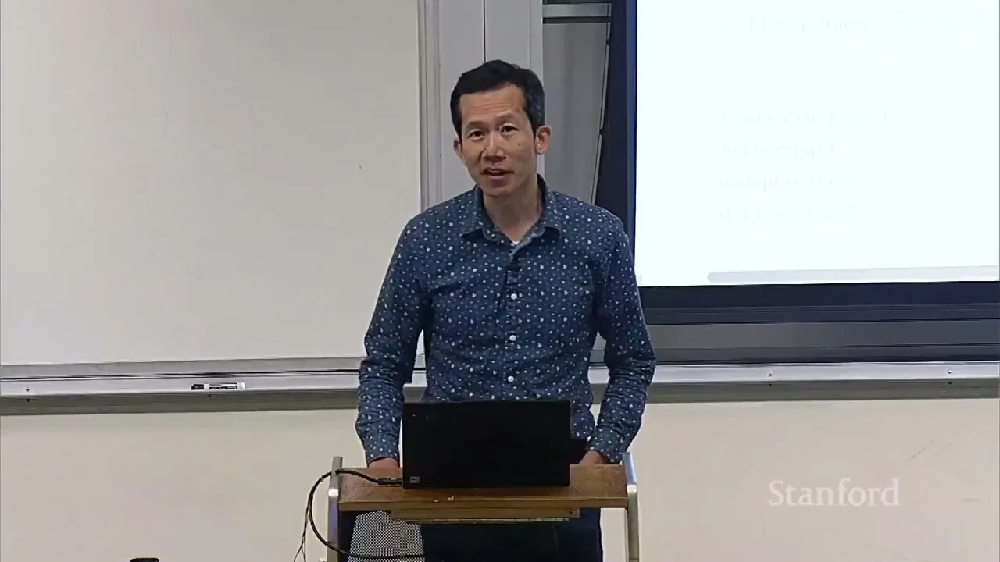

<div class="tcolorbox">

**频道**：Stanford Online**发布日期**：2026 年 5 月 19 日

**时长**：1:24:46**链接**：[`https://youtu.be/5sxHosTLPF8`](https://youtu.be/5sxHosTLPF8)

</div>

</div>

# 从原始来源到训练 token

上一讲回答“数据从哪里来”，本讲回答“拿到之后怎样变成可训练分布”。流水线包含转换、过滤、去重、混合，以及利用强模型构造中期/后训练数据。

<figure data-latex-placement="H">
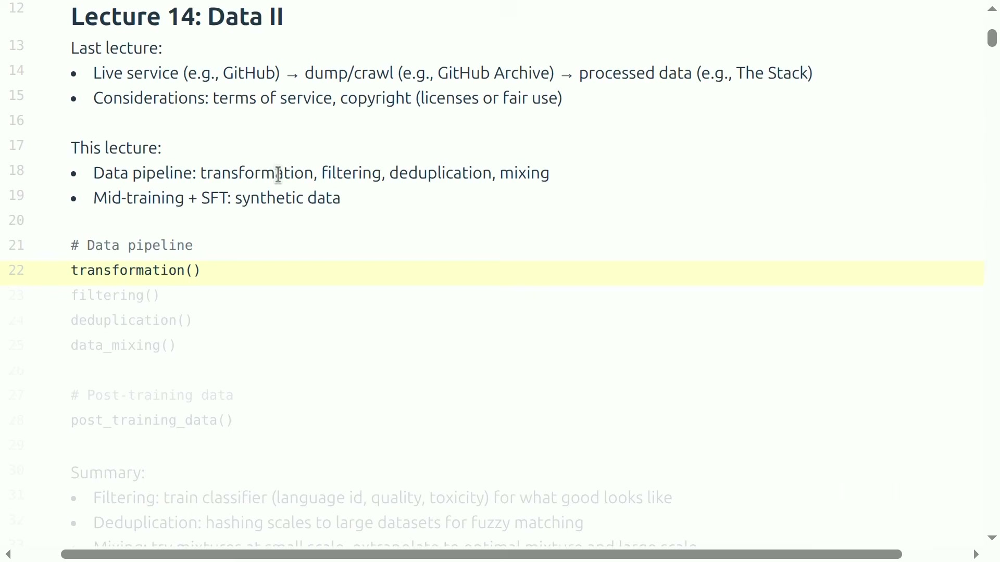
<figcaption>本讲路线：转换、过滤、去重、混合，以及 SFT/合成数据。</figcaption>
</figure>

<div class="importantbox">

核心观点数据工程不是把文本拼接起来；每个变换都在重写模型将看到的经验分布。处理代码、阈值和随机种子与模型超参数同等重要。

</div>

## 本章小结

最终语料应是可追溯的 token 流，而不是来源不明的文本目录。

# 转换：把复杂文档还原成阅读顺序

HTML、PDF 与代码都不是纯文本。PDF 尤其同时包含字形位置、字体、图像与多栏布局；错误阅读顺序会制造看似流畅却语义错位的样本。

<figure data-latex-placement="H">
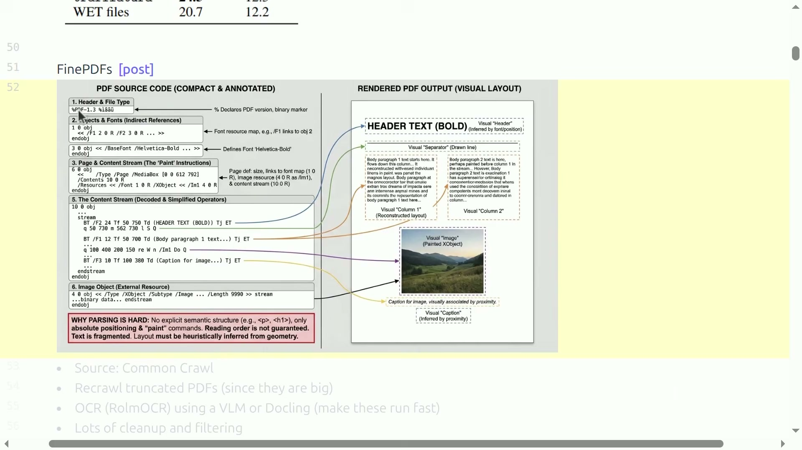
<figcaption>PDF 源码对象与视觉布局的映射；转换器必须恢复标题、段落、表格与阅读顺序。</figcaption>
</figure>

<div class="knowledgebox">

转换审计保存原文件哈希、解析器版本、版面框、OCR 置信度与失败原因；抽样比较原页面和提取文本，而非只统计成功率。

</div>

## 本章小结

转换质量决定后续过滤器看到什么，解析错误无法靠增加数据量自动修复。

# 过滤：数量与质量的非单调关系

规则、语言识别器与质量模型会减少 token，却可能提升固定计算下的学习效率。过滤过强则丢失多样性；高质量小集合反复多 epoch 还会过拟合。

<figure data-latex-placement="H">
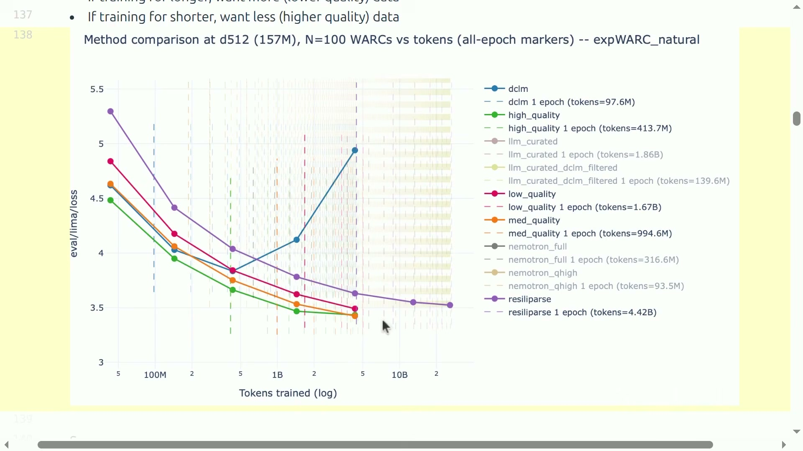
<figcaption>不同过滤配方的损失随训练 token 变化：质量收益与数据耗尽风险同时存在。</figcaption>
</figure>

若文档质量分数为 $`q(d)`$，保留规则为 $`I[q(d)\ge\tau]`$。其中 $`q`$ 是分类器或规则聚合，$`\tau`$ 是阈值，$`I`$ 为指示函数。阈值必须通过固定模型、固定训练 token 的消融选择。

<div class="warningbox">

代理偏差“像百科”“教育价值高”等标签只是代理目标；应按语言、域和文体报告通过率，防止过滤器把少数表达当作噪声。

</div>

## 本章小结

最优过滤器取决于训练预算，不存在脱离模型规模与 epoch 数的普适阈值。

# 重复：从完全相同到模板近似

完全重复包括镜像站与 fork；近重复包括轻微改写、格式变化、模板页与同一文章的不同版本。

<figure data-latex-placement="H">
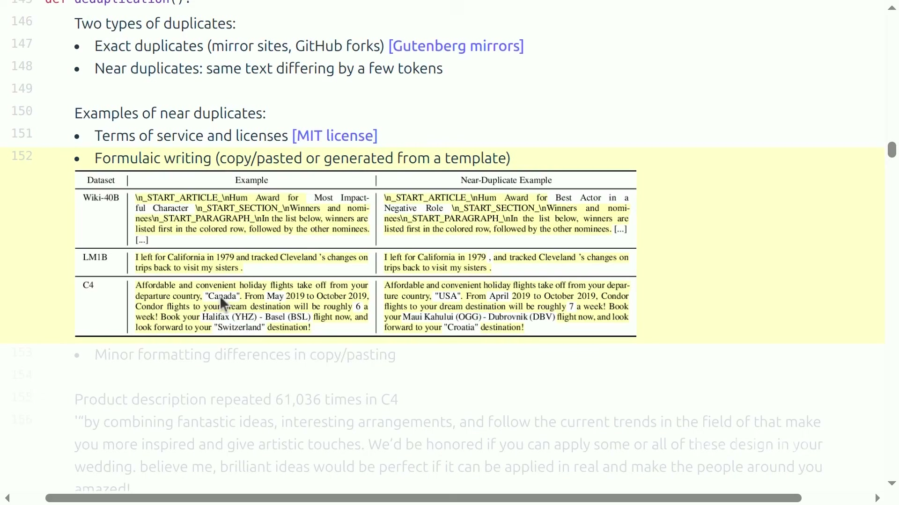
<figcaption>近重复示例：文本主体相同，仅表面格式或少量 token 不同。</figcaption>
</figure>

<figure data-latex-placement="H">
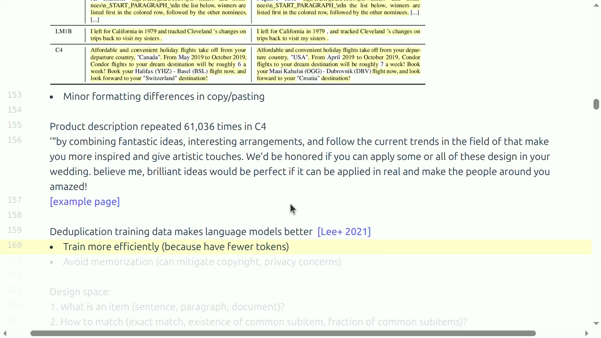
<figcaption>去重减少无效 token 与记忆风险，但需选择条目粒度和匹配规则。</figcaption>
</figure>

<div class="importantbox">

去重目标提高有效信息密度、降低训练浪费、减少测试污染与逐字记忆；同时避免误删模板相似但事实不同的记录。

</div>

## 本章小结

去重不是布尔操作，而是条目定义、相似度、阈值和代表样本选择的联合设计。

# 精确去重与哈希分组

标准化文本后计算内容哈希，将同哈希项目排序分组，每组保留一个代表。它语义清晰、精度高、易并行，但不能发现近重复。

<figure data-latex-placement="H">
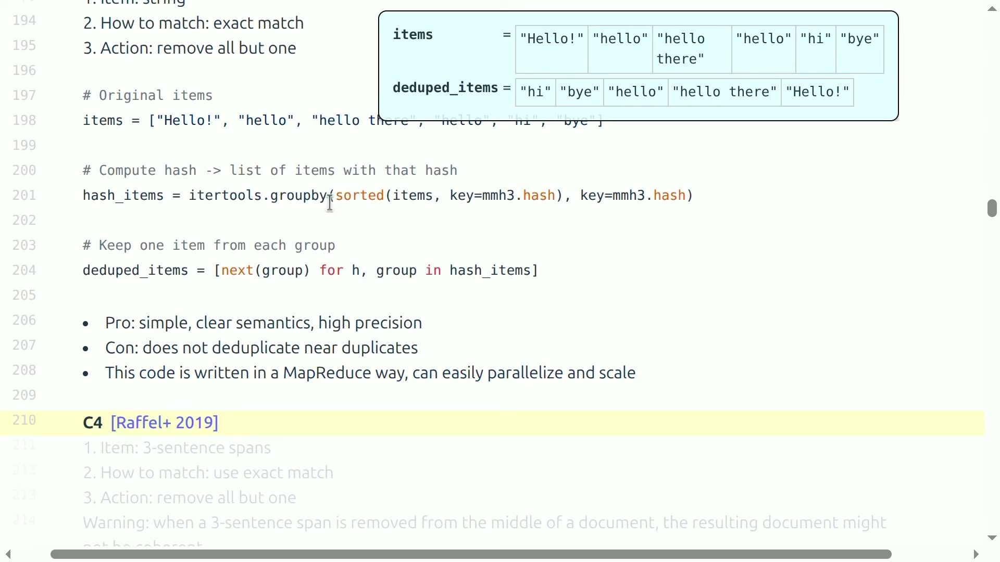
<figcaption>精确哈希去重：相同内容分组后每组保留一个项目。</figcaption>
</figure>

```
def exact_dedup(records):
    seen = set()
    for r in records:
        key = sha256(normalize(r.text))
        if key in seen:
            continue
        seen.add(key)
        yield r
```

<div class="warningbox">

规范化边界大小写、空白、Unicode 与标点规范化越激进，召回越高但误合并风险越大；规范化函数必须版本化。

</div>

## 本章小结

精确去重适合作为第一层，近重复仍需集合相似度与局部敏感哈希。

# MinHash：近似 Jaccard 相似度

把文档表示为 shingles 集合 $`S(d)`$，Jaccard 相似度为
```math
J(A,B)=\frac{|A\cap B|}{|A\cup B|}.
```
$`A,B`$ 是两篇文档的 shingle 集合，分子为共有片段数，分母为并集片段数。

<figure data-latex-placement="H">
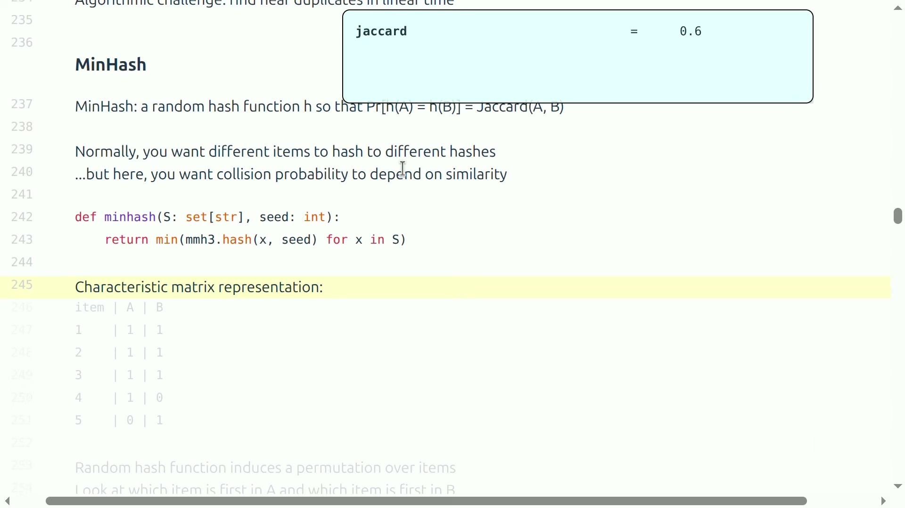
<figcaption>MinHash 的关键性质：随机最小哈希相等的概率等于 Jaccard 相似度。</figcaption>
</figure>

对 $`m`$ 个独立哈希，估计量
```math
\hat J=\frac1m\sum_{k=1}^m I[h_k(A)=h_k(B)]
```
中，$`m`$ 是签名长度，$`h_k`$ 是第 $`k`$ 个 MinHash，$`I`$ 是指示函数。$`m`$ 越大，方差越小但存储和比较更贵。

## 本章小结

MinHash 把大集合变成短签名，使相似度估计可扩展到海量文档。

# LSH：只生成可能相似的候选对

全量两两比较是 $`O(N^2)`$。LSH 将签名分成 $`b`$ 个 band、每 band $`r`$ 行；至少一个 band 完全相同就成为候选。

<figure data-latex-placement="H">
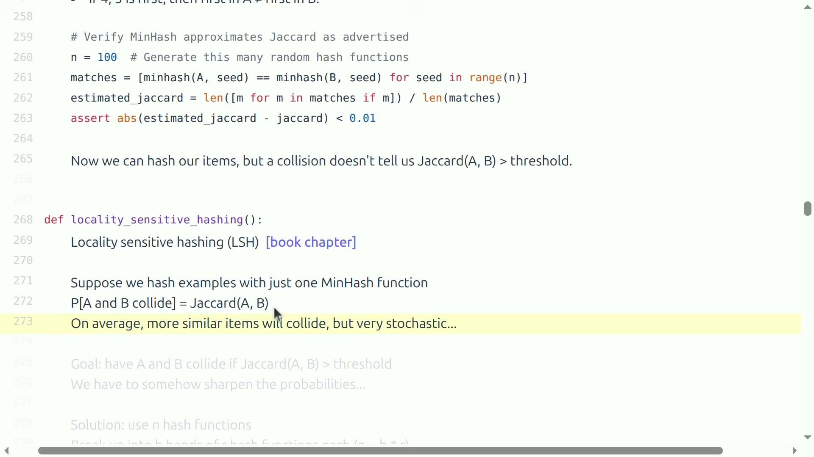
<figcaption>LSH 用多个哈希带把“相似即更可能碰撞”转成候选生成机制。</figcaption>
</figure>

碰撞概率为
```math
P_{\rm cand}(s)=1-(1-s^r)^b,
```
其中 $`s`$ 是真实 Jaccard，相似度 $`s^r`$ 是单个 band 相同概率，$`b`$ 次独立尝试至少成功一次得到最终概率。

<figure data-latex-placement="H">
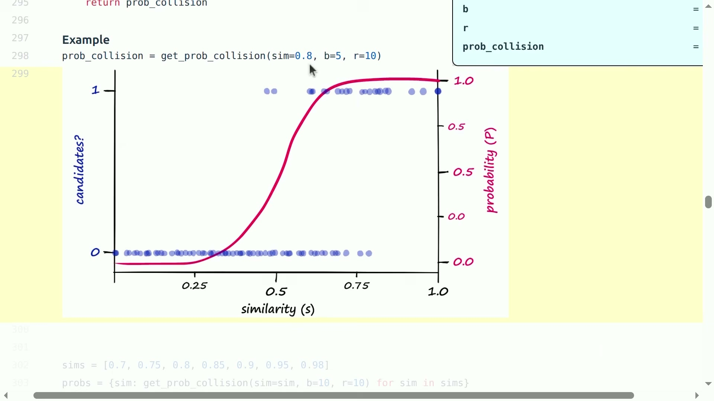
<figcaption>LSH 的 S 形碰撞曲线：参数决定相似度阈值附近的相变。</figcaption>
</figure>

<figure data-latex-placement="H">
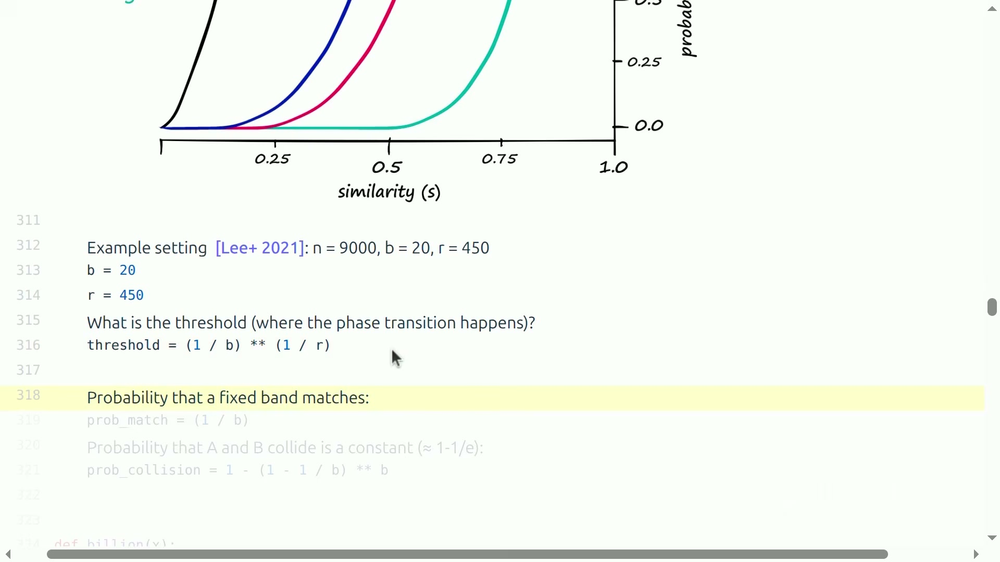
<figcaption>近似阈值约为 <math display="inline" xmlns="http://www.w3.org/1998/Math/MathML"><semantics><mrow><mo stretchy="false" form="prefix">(</mo><mn>1</mn><mi>/</mi><mi>b</mi><msup><mo stretchy="false" form="postfix">)</mo><mrow><mn>1</mn><mi>/</mi><mi>r</mi></mrow></msup></mrow><annotation encoding="application/x-tex">(1/b)^{1/r}</annotation></semantics></math>；增加 band 提升召回，增加行数提升精度。</figcaption>
</figure>

## 本章小结

LSH 是候选生成器，最终候选仍应计算精确相似度并记录去重簇。

# 数据混合：训练分布是一组权重

设来源 $`i`$ 有 $`N_i`$ token，混合权重为 $`p_i`$，满足 $`p_i\ge0,\sum_i p_i=1`$。按规模采样令 $`p_i=N_i/\sum_jN_j`$；均匀采样给小来源更高相对权重。

<figure data-latex-placement="H">
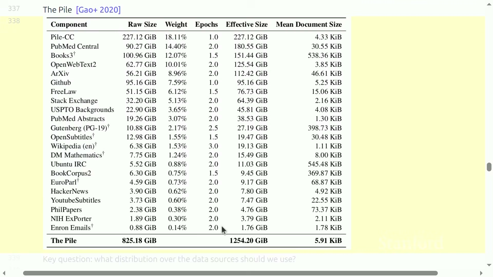
<figcaption>不同数据来源规模差异巨大；混合权重决定模型把多少更新分配给每个域。</figcaption>
</figure>

```
while tokens_seen < budget:
    i = rng.choice(num_sources, p=mixture)
    batch = sources[i].next_batch()
    train_step(batch)
    audit.add(source=i, tokens=batch.num_tokens)
```

## 本章小结

混合权重是模型超参数，必须随 checkpoint 发布并按实际消费 token 审计。

# epoching：小而优的数据也会被耗尽

来源 $`i`$ 的期望 epoch 数为
```math
E_i=\frac{p_iT}{N_i},
```
其中 $`T`$ 是总训练 token，$`p_iT`$ 是该来源被消费的 token，$`N_i`$ 是其独立 token 规模。

<figure data-latex-placement="H">

<figcaption>相同混合概率可让小来源重复 50 epoch，而大来源只见到 0.05 epoch。</figcaption>
</figure>

<div class="warningbox">

高质量不等于可无限重复过多 epoch 会让模型记忆样本并让代理实验误判某来源价值。可设置每来源 epoch 上限或使用随训练阶段变化的配比。

</div>

## 本章小结

混合优化必须同时考虑质量、规模和重复次数。

# 回归式混合：用代理模型搜索配方

先训练多个小模型覆盖不同混合点，再用回归模型预测下游损失，最后在预测曲面上优化大模型配方。

<figure data-latex-placement="H">
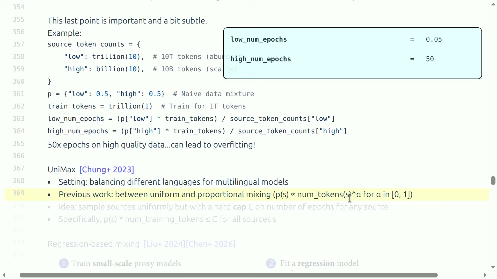
<figcaption>回归式混合的四步：代理训练、拟合、模拟搜索、用最佳配方训练大模型。</figcaption>
</figure>

<figure data-latex-placement="H">
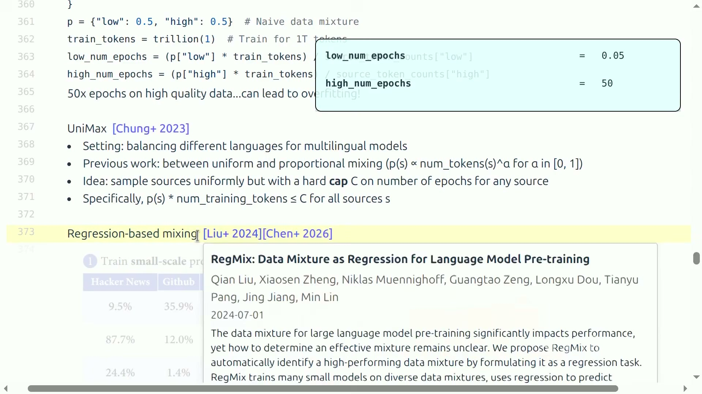
<figcaption>混合比例到目标损失的响应曲面；最优点依赖目标任务定义。</figcaption>
</figure>

若代理观测为 $`(p^{(k)},y^{(k)})`$，拟合 $`\hat y=f_\phi(p)`$ 并求 $`p^*=\arg\min_{p\in\Delta}\hat y`$。$`\Delta`$ 是概率单纯形，$`\phi`$ 为回归参数。代理到大模型的迁移误差必须用少量大规模验证点校准。

## 本章小结

数据混合可像 scaling law 一样建模，但代理规模、目标任务和 epoching 会造成系统偏差。

# 合成数据：从环境和教师收集响应

配方是：定义环境与任务，从强教师模型收集高质量轨迹，再做验证、过滤和去重。

<figure data-latex-placement="H">
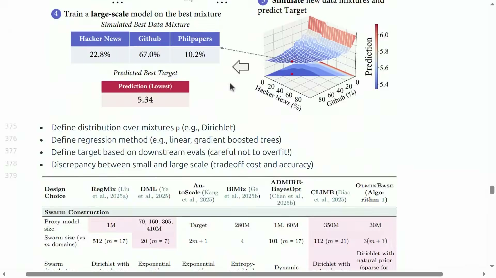
<figcaption>后训练数据配方：定义环境、任务/提示，再从教师模型采集响应。</figcaption>
</figure>

<div class="knowledgebox">

教师数据的最小记录教师模型与版本、system prompt、采样温度、工具环境、输入任务、原始响应、验证器结果和过滤理由。

</div>

## 本章小结

合成数据把模型变成数据生成器，但质量由任务分布和验证器而非流畅度决定。

# 代码智能体任务构造

SWE-smith 从真实仓库创建环境，让模型生成可验证任务；SWE-rebench 从 GitHub PR 出发，经仓库安装、LLM 标注与测试验证形成实例。

<figure data-latex-placement="H">

<figcaption>SWE-smith：仓库、环境、任务生成策略与验证共同形成新任务实例。</figcaption>
</figure>

<figure data-latex-placement="H">
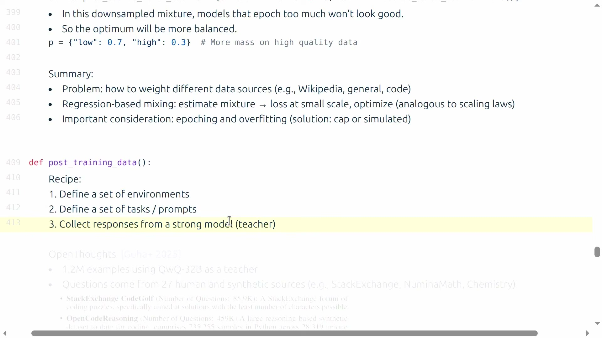
<figcaption>SWE-rebench：从 PR 元数据到可安装环境、LLM 标注与最终数据集。</figcaption>
</figure>

<div class="importantbox">

可执行验证优先代码题的价值来自能安装、能运行、能由测试判定；只生成自然语言描述会混入不可解或答案泄漏任务。

</div>

## 本章小结

环境构建是 agent 数据集的核心，任务文本只是其可见表面。

# 教师数据的偏差与蒸馏边界

教师模型会把自身风格、错误与安全边界传给学生；重复采样还会降低多样性。应混合多教师、保留原始来源、使用规则或执行器验证，并对教师—学生重叠做消融。

<figure data-latex-placement="H">
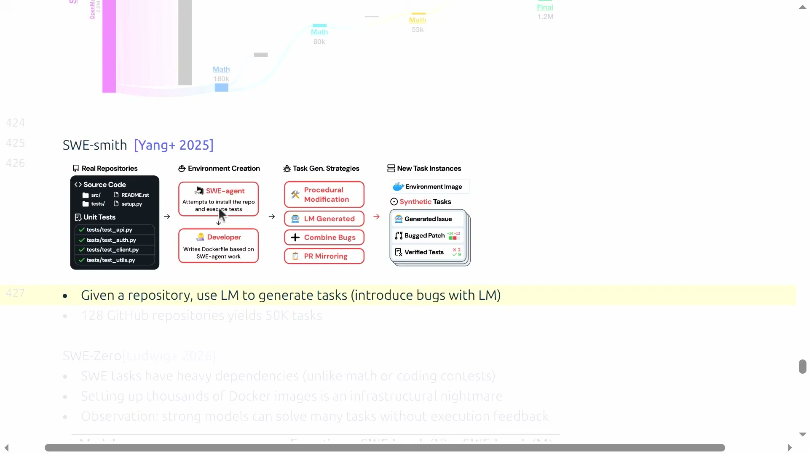
<figcaption>教师响应进入训练前仍需环境验证、质量控制和分布审计。</figcaption>
</figure>

<div class="warningbox">

循环污染用同一家族模型生成、筛选并评估数据，可能形成闭环自证。至少保留独立评测器与真实数据锚点。

</div>

## 本章小结

蒸馏压缩教师行为，不自动创造教师之外的事实或可靠性。

# 端到端数据协议

<figure data-latex-placement="H">
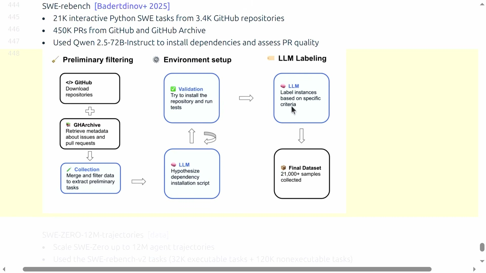
<figcaption>现代数据管线把采集、过滤、去重、混合与合成任务组织成可验证阶段。</figcaption>
</figure>

1.  冻结原始对象与来源许可；

2.  版本化转换和过滤；

3.  精确去重后做 MinHash/LSH；

4.  记录去重簇和代表选择；

5.  用代理模型搜索混合；

6.  限制各来源 epoch；

7.  对合成任务做可执行验证；

8.  用固定训练预算完成端到端消融。

```
artifact = run_stage(
    input_manifest="raw-v3.jsonl",
    code_commit="abc123",
    config="dedup_lsh.yaml",
    seed=2026,
)
assert artifact.counts.windows == artifact.audit.counts
```

## 本章小结

每一步既输出数据，也输出计数、原因、哈希与版本元数据。

# 总结与延伸

<figure data-latex-placement="H">
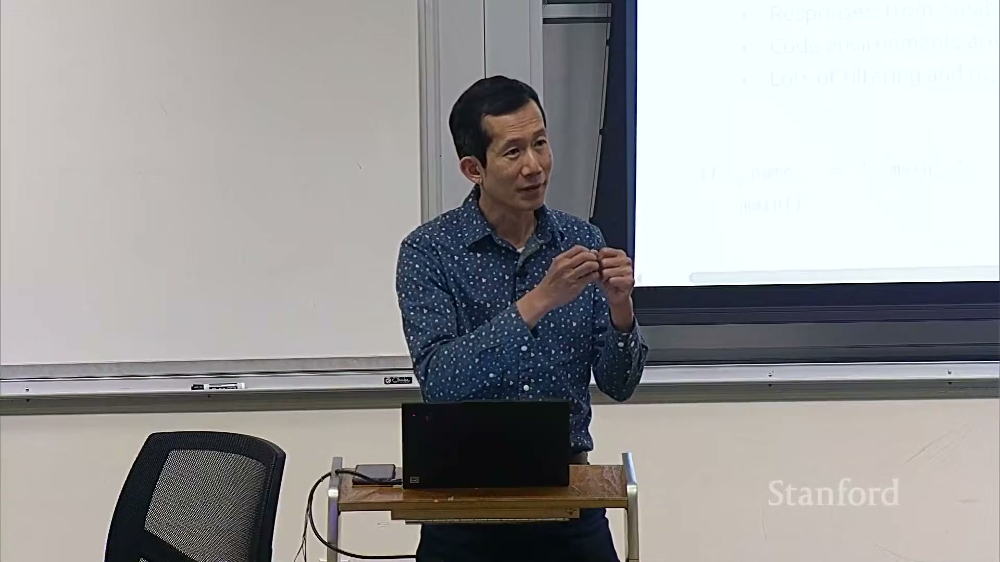
<figcaption>本讲结尾回到核心：转换、过滤、去重、混合与合成数据共同决定训练经验。</figcaption>
</figure>

<div class="importantbox">

最终结论高价值数据不是“更干净文本”的同义词，而是有限训练预算下，能以可追溯方式提高目标能力且不放大记忆、偏见和合规风险的数据。

</div>

## 进一步推论

数据价值随模型规模和训练阶段变化；去重阈值与混合权重应进入 scaling 实验；合成数据最终会把瓶颈从“生成多少”移到“如何验证”。

## 建议练习

1.  实现 MinHash+LSH 并画出不同 $`b,r`$ 的碰撞曲线；

2.  比较文档级和段落级去重的误删；

3.  固定 token 预算搜索三来源混合；

4.  对小来源加入 epoch cap；

5.  为代码任务构建可重放容器和测试判定器。
