<div class="titlepage">

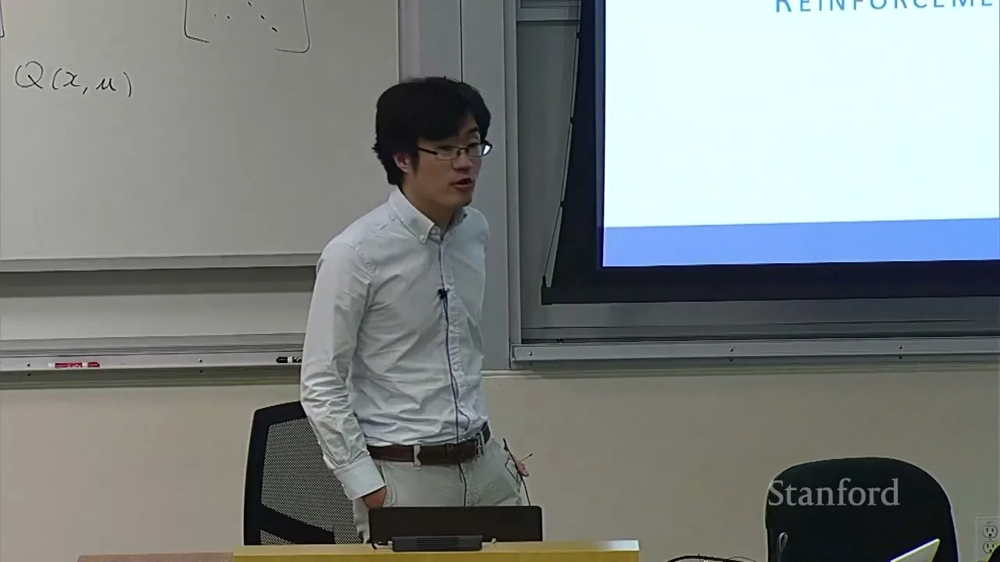

<div class="tcolorbox">

**视频 ID：**dIFAi87Ws4E**时长：**01:15:50**发布日期：**2026-05-27\
**频道：**Stanford Online**视频：**<https://youtu.be/dIFAi87Ws4E>\
**阅读方式：**本笔记将课程概念、公式、算法和工程边界重组为可独立阅读的教材。

</div>

五道口纳什 & Codex

</div>

# 导读：RLVR 为什么成为后训练主线

强化学习与可验证奖励（Reinforcement Learning with Verifiable Rewards, RLVR）把奖励从“一个学习出来的偏好分数”换成能自动检查的任务结果，例如数学答案是否等价、代码是否通过测试、工具任务是否达到环境终态。它不取消强化学习的难点，而是把核心瓶颈从奖励模型的主观漂移转向题目覆盖、验证器正确性、采样效率和系统吞吐。

<div class="importantbox">

学习目标完成本讲后，应能：解释 RLHF 与 RLVR 的奖励差异；写出 PPO 与 GRPO 的关键目标；说明组相对优势为何能移除价值网络；识别标准差归一化与 token 长度归一化的偏差；复述 R1、Kimi 与 Qwen 的训练配方；为 RLVR 实验设计奖励、数据、系统和审计指标。

</div>

<figure data-latex-placement="H">
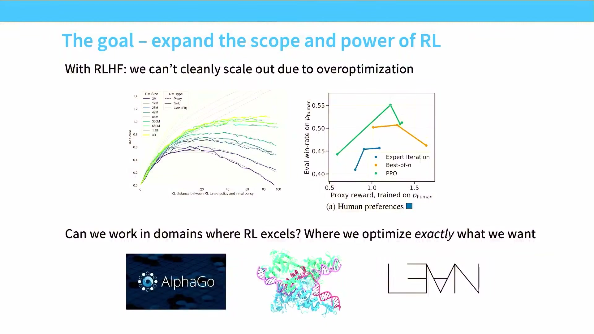
<figcaption>本讲目标：把语言模型后训练扩展到可自动验证的强化学习。</figcaption>
</figure>

<figure data-latex-placement="H">
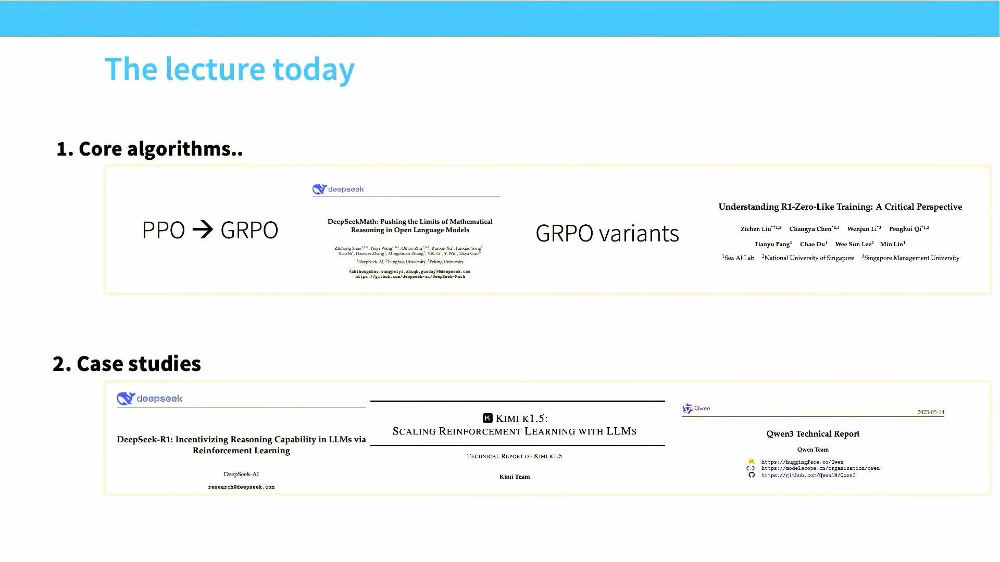
<figcaption>RLVR 的问题设置：采样完整回答，以可验证结果提供奖励。</figcaption>
</figure>

## RLHF 与 RLVR 的共同骨架

二者都从提示 $`x`$ 采样回答 $`y\sim\pi_\theta(\cdot\mid x)`$，获得奖励 $`R(x,y)`$ 并更新策略。RLHF 的 $`R`$ 常由人类偏好训练的奖励模型给出，可能被策略“钻空子”；RLVR 的 $`R`$ 来自单元测试、规则或符号检查器，更接近不可篡改的任务事实。但验证器仍可能有漏洞，尤其是答案等价、浮点容差、隐藏测试覆盖和沙箱副作用。

## 本章小结

RLVR 的价值不在于“奖励一定正确”，而在于奖励可以重复执行、批量评估并接受工程审计；这让大规模在线采样成为可能。

# PPO 回顾：理论目标与语言模型实现

设旧策略为 $`\pi_{\theta_{\mathrm{old}}}`$，当前策略为 $`\pi_\theta`$，token 级概率比为
```math
\rho_{i,t}(\theta)=\frac{\pi_\theta(y_{i,t}\mid x_i,y_{i,<t})}{\pi_{\theta_{\mathrm{old}}}(y_{i,t}\mid x_i,y_{i,<t})}.
```
PPO 的裁剪代理目标为
```math
L_{\mathrm{clip}}=-\mathbb E_{i,t}\!\left[\min\!\left(\rho_{i,t}A_{i,t},
\operatorname{clip}(\rho_{i,t},1-\epsilon,1+\epsilon)A_{i,t}\right)\right].
```
$`i`$ 是回答索引，$`t`$ 是 token 位置，$`A_{i,t}`$ 是优势，$`\epsilon`$ 是裁剪宽度。概率比允许复用旧策略样本；裁剪限制一次更新偏离采样策略过远。语言模型实现还常加入对参考模型 $`\pi_{\mathrm{ref}}`$ 的 KL 惩罚，防止策略快速漂移。

<figure data-latex-placement="H">
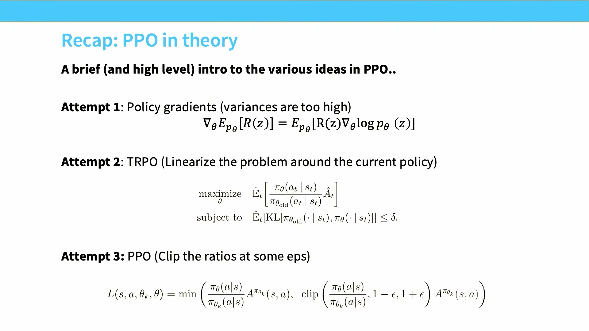
<figcaption>PPO 理论对象：概率比、裁剪代理目标与参考策略约束。</figcaption>
</figure>

<figure data-latex-placement="H">
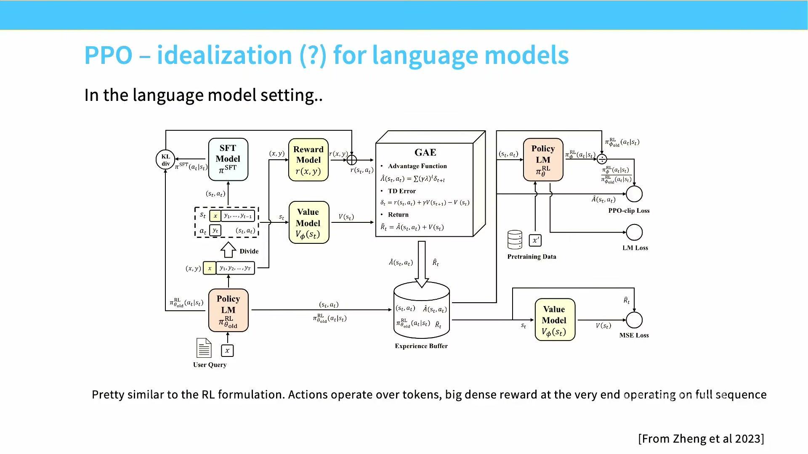
<figcaption>语言模型 PPO 的完整系统：策略、价值、奖励和参考模型协同运行。</figcaption>
</figure>

## GAE 与价值模型

PPO 通常训练 $`V_\phi(s_t)`$ 估计状态价值，并用广义优势估计
```math
\delta_t=r_t+\gamma V_\phi(s_{t+1})-V_\phi(s_t),\qquad
A_t^{\mathrm{GAE}}=\sum_{l\ge0}(\gamma\lambda)^l\delta_{t+l}.
```
$`\gamma`$ 是折扣因子，$`\lambda`$ 控制偏差—方差权衡。对只在回答末端产生一个奖励的语言任务，token 级信用分配高度依赖价值估计、KL shaping、mask 和归一化细节。

<figure data-latex-placement="H">
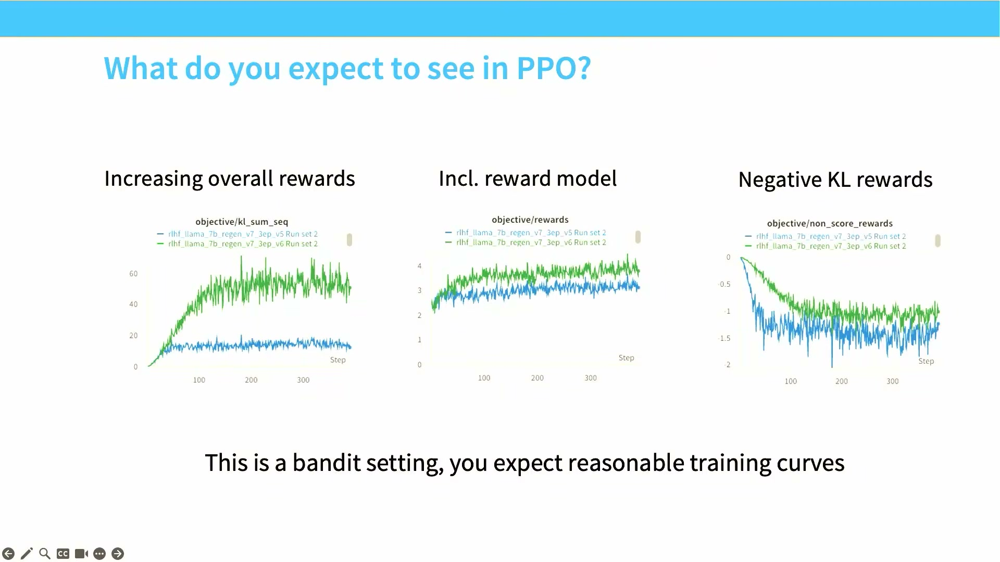
<figcaption>PPO 训练的预期曲线揭示奖励、KL 与长度的耦合变化。</figcaption>
</figure>

<div class="warningbox">

四模型成本策略模型、旧策略/参考模型、价值模型和奖励模型会共同占用显存；生成又是自回归慢路径。实现错误还可能隐藏在 EOS mask、padding、KL 符号、序列长度和 advantage whitening 中。

</div>

## 本章小结

PPO 的理论核心并不复杂，困难来自把序列奖励稳定地分配给每个 token，并让训练端与生成端在同一策略版本上协作。

# GRPO：用组内比较移除价值网络

对同一提示 $`x`$ 一次采样 $`G`$ 个回答，得到奖励 $`r_1,\ldots,r_G`$。GRPO 使用组内标准化优势
```math
\bar r_g=\frac1G\sum_{j=1}^G r_j,\qquad
\sigma_g=\sqrt{\frac1G\sum_{j=1}^G(r_j-\bar r_g)^2},\qquad
A_i=\frac{r_i-\bar r_g}{\sigma_g+\varepsilon}.
```
$`G`$ 是每题样本数，$`\bar r_g`$ 是同题平均奖励，$`\sigma_g`$ 是组内标准差，$`\varepsilon`$ 防止除零。所有 token 共享该回答的 $`A_i`$。均值充当题目条件基线，省掉独立价值模型。

<figure data-latex-placement="H">
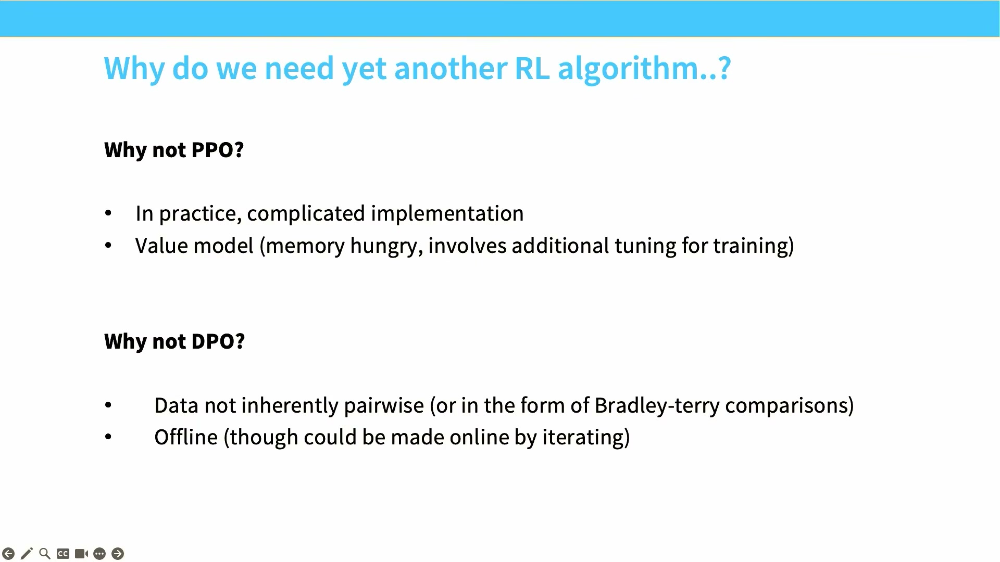
<figcaption>为什么需要另一种算法：PPO 复杂、昂贵且对实现细节敏感。</figcaption>
</figure>

<figure data-latex-placement="H">
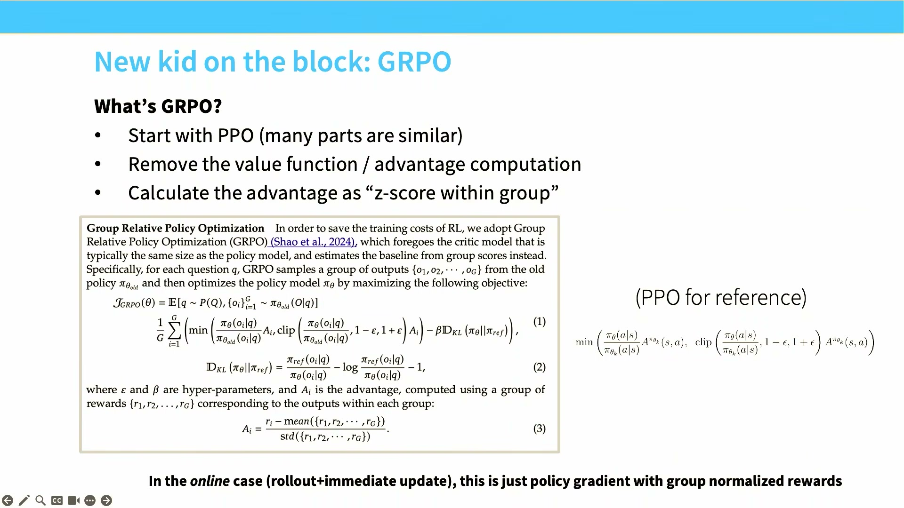
<figcaption>GRPO 用同题多样本的组内统计量近似优势，取消价值模型。</figcaption>
</figure>

完整序列目标常写为
```math
\mathcal L_{\mathrm{GRPO}}=-\frac1G\sum_{i=1}^{G}\frac1{|y_i|}\sum_{t=1}^{|y_i|}
\min\!\left(\rho_{i,t}A_i,\operatorname{clip}(\rho_{i,t},1-\epsilon,1+\epsilon)A_i\right)
+\beta D_{\mathrm{KL}}(\pi_\theta\Vert\pi_{\mathrm{ref}}).
```
$`|y_i|`$ 是回答 token 数；$`\rho_{i,t}`$ 是新旧策略概率比；$`\epsilon`$ 限制更新；$`\beta`$ 是 KL 系数；$`D_{\mathrm{KL}}`$ 约束策略相对参考模型的漂移。

<figure data-latex-placement="H">
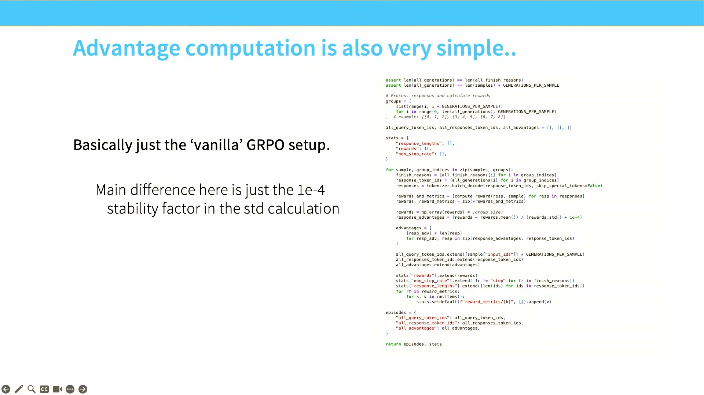
<figcaption>组相对优势的代码机制：按提示分组、标准化奖励并广播到 token。</figcaption>
</figure>

```
for prompts in loader:
    samples = policy.generate(prompts, n=group_size)
    rewards = verifier(prompts, samples).reshape(-1, group_size)
    mean = rewards.mean(dim=1, keepdim=True)
    std = rewards.std(dim=1, keepdim=True)
    advantage = ((rewards - mean) / (std + 1e-6)).flatten()
    ratio = (logp(policy, samples) - logp(old_policy, samples)).exp()
    surrogate = torch.minimum(ratio * advantage,
                              ratio.clamp(1-eps, 1+eps) * advantage)
    loss = -masked_token_mean(surrogate) + beta * kl_to_reference(samples)
    loss.backward(); optimizer.step()
```

<figure data-latex-placement="H">
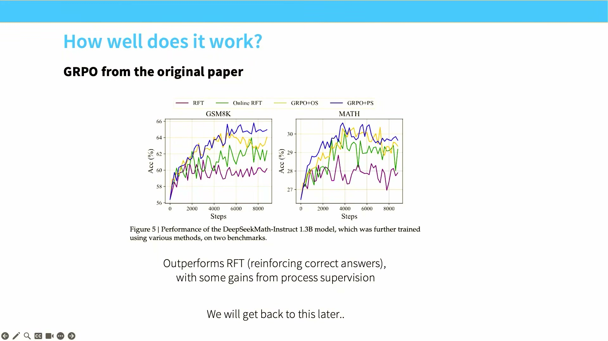
<figcaption>GRPO 与拒绝采样微调等基线的结果及其解释边界。</figcaption>
</figure>

## 本章小结

GRPO 的工程吸引力来自少一个价值模型和直接使用同题比较；它仍是在线策略优化，奖励、采样策略版本和归一化方式都会改变实际梯度。

# GRPO 的偏差：基线、标准差与长度

## 什么是合法基线

策略梯度允许减去只依赖提示、而不依赖采样动作的基线：
```math
\mathbb E_{y\sim\pi_\theta}\!\left[(R(x,y)-b(x))\nabla_\theta\log\pi_\theta(y\mid x)\right]
=\nabla_\theta\mathbb E[R(x,y)].
```
原因是 $`\mathbb E[\nabla_\theta\log\pi_\theta(y\mid x)]=0`$。组平均奖励近似 $`b(x)`$，主要降低方差；但再除以随机的组内标准差会重新缩放不同题目的梯度，因此不再等价于同一个未归一化期望奖励目标。

<div class="warningbox">

标准差归一化的题目权重二元奖励下，全部正确或全部错误的组几乎没有梯度；处在边界且组内有分歧的题目会主导更新。除以较小标准差还可能放大噪声。训练时必须记录每题成功率、零方差组比例与有效样本数。

</div>

## token 平均导致长度偏置

若每个回答的损失除以 $`|y_i|`$，同一序列优势会被平均到 token。正优势的短正确回答可能获得较大单 token 更新；负优势的长错误回答，其每个错误 token 惩罚反而被稀释。更稳健的做法包括按整批有效 token 归一化、显式长度正则，或先定义清楚“每序列”与“每 token”各自希望优化的量。

<figure data-latex-placement="H">
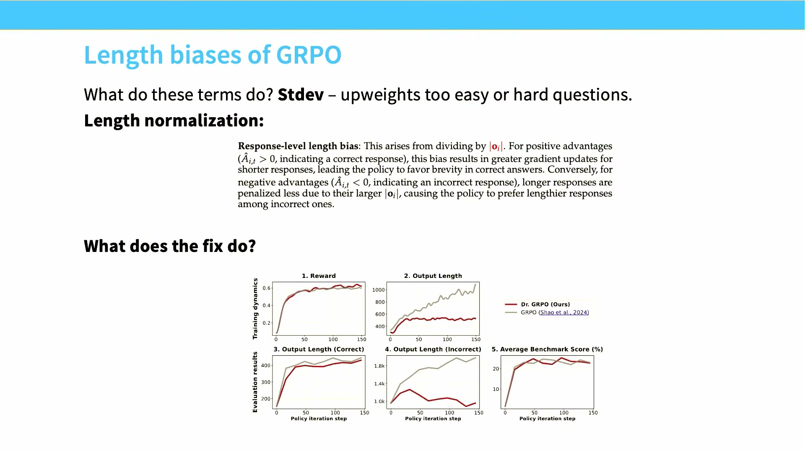
<figcaption>按回答长度平均 token 损失会诱发长度偏置。</figcaption>
</figure>

<div class="importantbox">

诊断优先于换算法至少同时画出：原始奖励、pass rate、组内标准差、回答长度、KL、裁剪比例、零方差组比例、每题有效梯度权重。只看平均 reward 上升无法判断策略是否学会了正确推理。

</div>

## 本章小结

均值基线有策略梯度依据；标准差与长度归一化则改变样本权重。GRPO“简单”不代表目标中性，优化对象必须用实际代码定义。

# DeepSeek-R1：从 R1-Zero 到生产训练配方

<figure data-latex-placement="H">
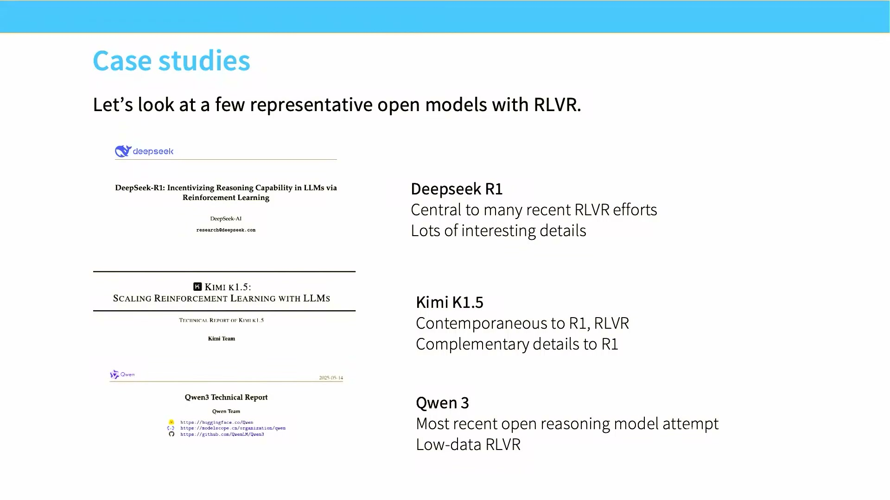
<figcaption>RLVR 案例路线：从 DeepSeek-R1 到 Kimi k1.5 与 Qwen。</figcaption>
</figure>

<figure data-latex-placement="H">
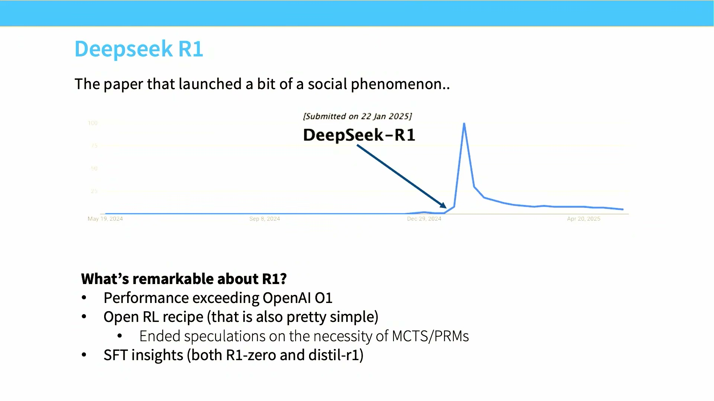
<figcaption>DeepSeek-R1 的关键主张：用规则奖励推动可验证推理。</figcaption>
</figure>

R1-Zero 从基础模型直接进行 GRPO 类强化学习，使用准确性与格式奖励。训练中回答变长，轨迹出现检查、回退和替代方案，这证明结果奖励可以诱导搜索策略；但不能把单个“aha moment”截图当成普遍认知机制证据。长度增长也可能来自奖励、格式或归一化偏置。

<figure data-latex-placement="H">
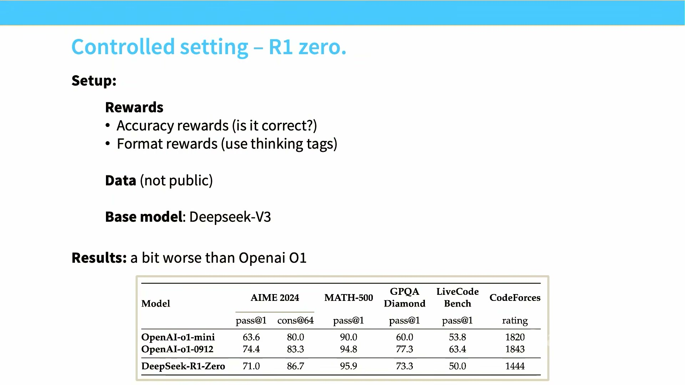
<figcaption>R1-Zero 从基础模型直接强化学习，展示推理轨迹随训练演化。</figcaption>
</figure>

生产版 R1 是多阶段管线：先用少量高质量长思维链进行冷启动 SFT；再做大规模推理 RL；收集与过滤新轨迹进行 SFT；最后加入更广任务和人类偏好，使模型可读、语言一致且在不可自动验证任务上仍有用。

<figure data-latex-placement="H">
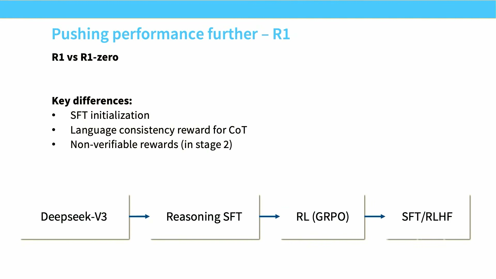
<figcaption>生产版 R1 不是纯 RL：冷启动 SFT、推理 RL、再 SFT/RLHF。</figcaption>
</figure>

<figure data-latex-placement="H">
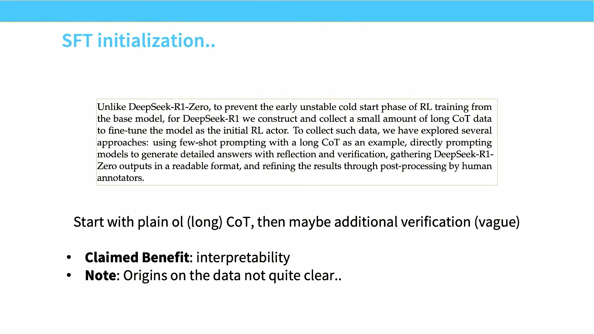
<figcaption>冷启动监督数据为可读性、格式和任务覆盖提供初始分布。</figcaption>
</figure>

<figure data-latex-placement="H">
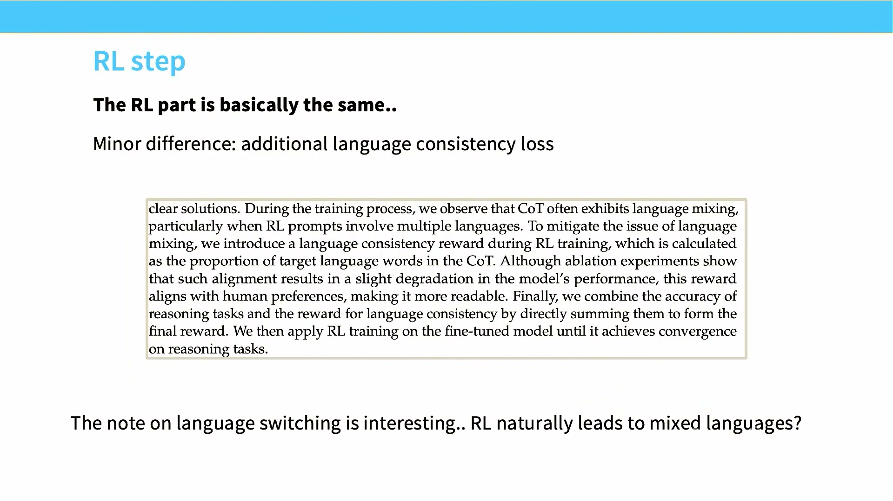
<figcaption>推理强化学习阶段以正确性和格式信号更新策略。</figcaption>
</figure>

## 蒸馏的作用

用强模型生成并筛选推理轨迹，再对小模型做监督微调，往往比让小模型从零探索更省计算。蒸馏传递的是输出分布与搜索示范，不等于复制教师内部机制；评价必须防止教师生成数据与测试集同源。

<figure data-latex-placement="H">
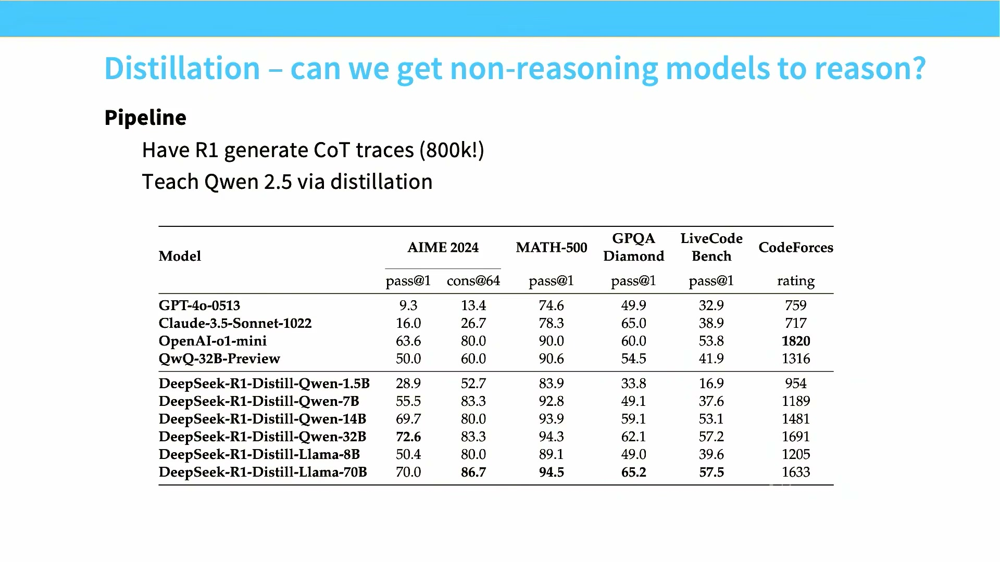
<figcaption>把强推理模型生成的轨迹蒸馏到更小模型。</figcaption>
</figure>

## 本章小结

R1 的实质贡献是展示可验证奖励、冷启动数据、在线 RL、轨迹再采样和偏好对齐可以串成配方；将它归结为“纯 RL 产生思维”会忽略最关键的系统与数据工作。

# Kimi k1.5：课程、数据与长度控制

Kimi k1.5 把 RLVR 做成数据—策略—基础设施协同系统。长思维链不是无限延长，而是让模型在更大搜索空间里尝试、反思和回退；训练课程按难度组织题目，避免全易题没有增量信号，也避免全难题全部失败。

<figure data-latex-placement="H">
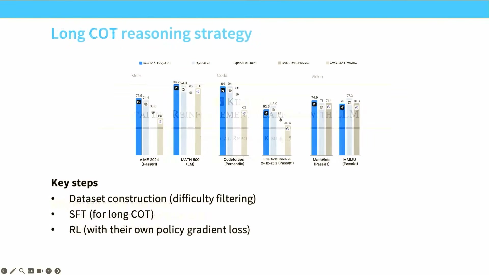
<figcaption>Kimi k1.5 的长思维链策略：搜索、反思与持续扩展上下文。</figcaption>
</figure>

<figure data-latex-placement="H">
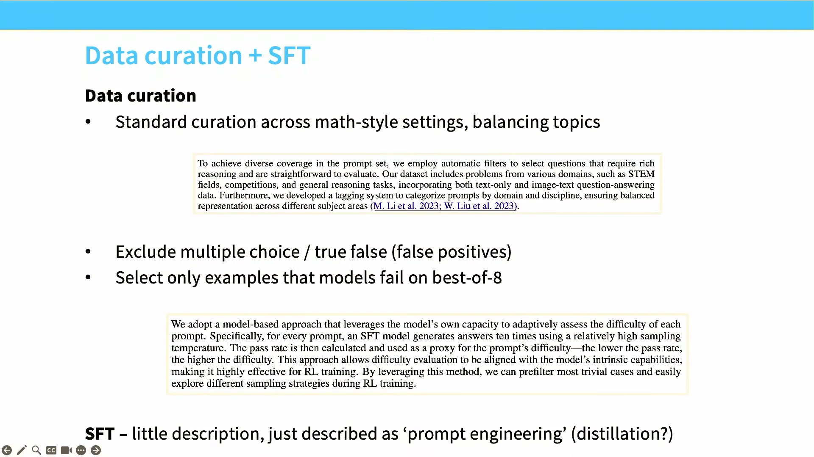
<figcaption>课程化数据管线：按难度与成功率筛选训练题。</figcaption>
</figure>

若题目 $`x`$ 的当前成功率为 $`p_x`$，实务上可优先采样中等 $`p_x`$ 的题目，因为组内更可能同时出现正负样本。已经掌握的题可降权，长期零成功的题则需要更强模型、提示脚手架、监督数据或分解，而不是继续浪费 rollout。

<figure data-latex-placement="H">
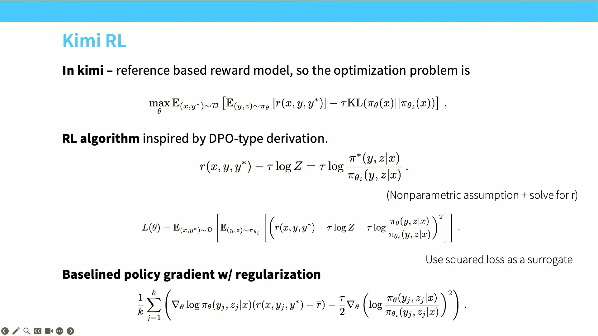
<figcaption>Kimi 的 PPO 风格目标与训练配方并非简单照搬 GRPO。</figcaption>
</figure>

## 答案等价是隐藏的奖励模型

数学字符串、代码输出与开放式答案都有等价问题。规则、符号代数、单元测试和模型评审可以组合，但必须保留拒绝原因并抽样人工审计。误判正确解会压低探索，误接纳错误解则直接奖励黑客行为。

<figure data-latex-placement="H">
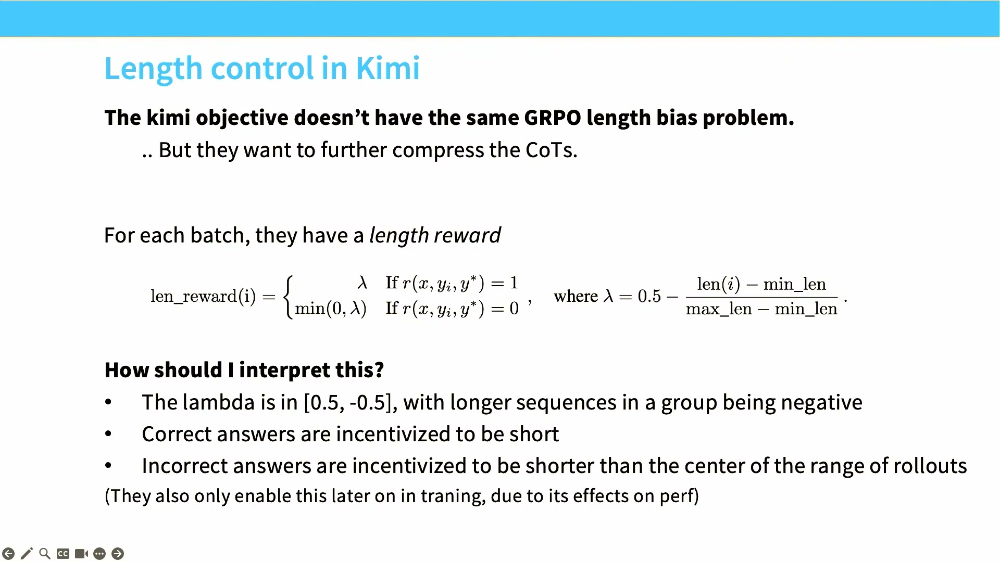
<figcaption>长度控制通过惩罚无效冗长，改善推理预算效率。</figcaption>
</figure>

<div class="knowledgebox">

长度控制的正确问题不是“回答越短越好”，而是在保持正确率的条件下减少无效 token。应报告正确样本长度分布、错误样本长度分布、单位 token 成功率和提前结束失败率。

</div>

## 本章小结

课程学习让训练信号落在“会一点但还不稳定”的区域；长度与答案检查器决定模型究竟是在学更有效的搜索，还是学会迎合代理指标。

# RL 基础设施与 Qwen3 混合推理

在线 RL 同时包含慢速自回归生成和高吞吐反向传播。生成端会被少量超长轨迹拖成 straggler；训练端需要把同一批样本的 log probability、mask 与策略版本对齐。两类常见系统是：同一组 GPU 在 rollout 与训练间切换，利用率高但切换有开销；或部署独立生成服务与训练集群，流水化更强但样本更容易过时。

<figure data-latex-placement="H">
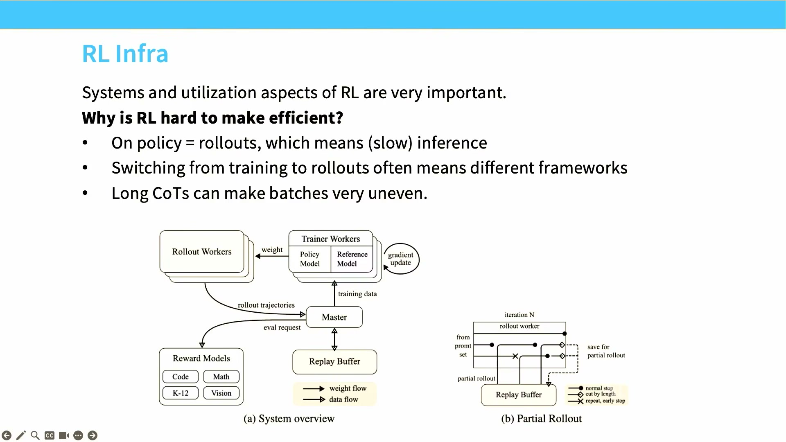
<figcaption>RL 基础设施：生成侧与训练侧吞吐、切换和长尾样本。</figcaption>
</figure>

若样本由行为策略 $`\mu`$ 生成而当前策略是 $`\pi_\theta`$，偏离可由 $`\rho=\pi_\theta/\mu`$ 衡量。异步复用提高吞吐，却增加方差与策略陈旧；必须记录生成版本、训练版本和样本年龄。

<figure data-latex-placement="H">
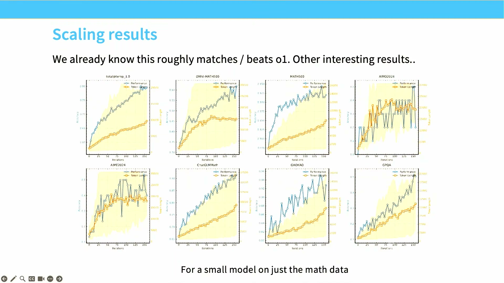
<figcaption>扩展结果需要同时阅读准确率、训练进度和计算开销。</figcaption>
</figure>

Qwen3 把 thinking 与 non-thinking 结合在同一模型：简单任务快速回答，困难任务启用思考，还可通过预算或提前退出实现平滑退化。这把“模型是否会推理”转化为路由与资源分配问题。

<figure data-latex-placement="H">
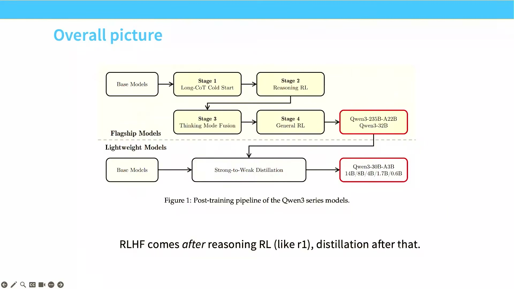
<figcaption>Qwen3 的思考/非思考混合模式让用户按任务分配预算。</figcaption>
</figure>

<figure data-latex-placement="H">
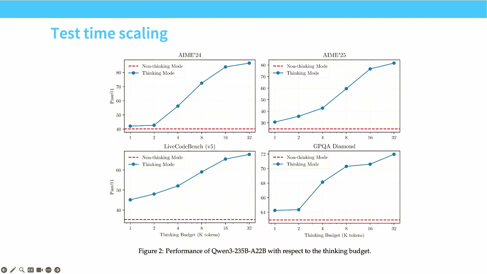
<figcaption>测试时计算的可控缩放：提前终止与逐级增加思考预算。</figcaption>
</figure>

```
for budget in [0, 256, 1024, 4096]:
    answer = model.solve(problem, thinking_tokens=budget)
    verdict = verifier(answer)
    if verdict.valid and verdict.confidence >= threshold:
        return answer
return escalate_to_stronger_model(problem)
```

## 本章小结

RLVR 的上限不只由算法决定。没有生成—训练版本审计、长尾控制和动态推理预算，更多 GPU 可能只会放大空转与陈旧样本。

# 代码智能体：从中期训练到多步 Agent RL

代码智能体首先需要足够的环境覆盖。中期训练不只读孤立代码片段，还应覆盖仓库结构、issue、PR、文档、依赖与工具输出，使模型理解软件工程状态。随后可用不同专家产生高质量轨迹并蒸馏到统一模型。

<figure data-latex-placement="H">
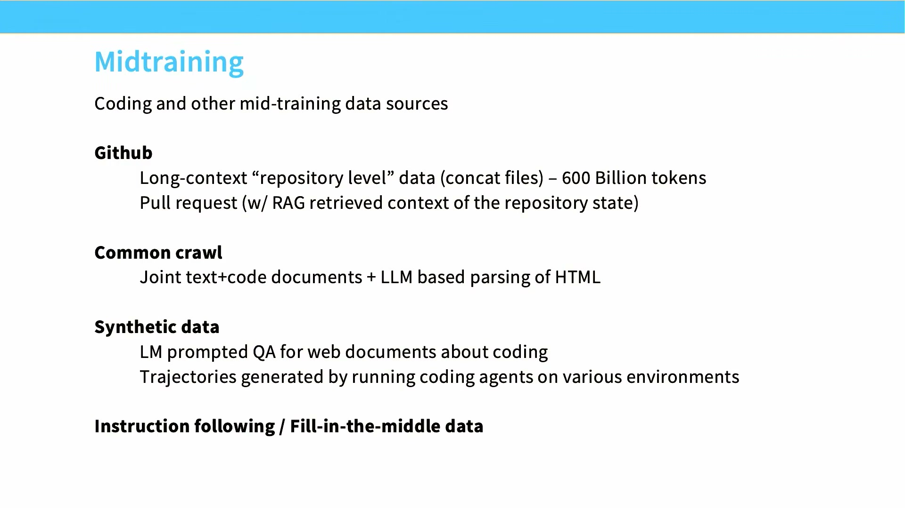
<figcaption>代码智能体的中期训练覆盖仓库、PR、文档和真实工程上下文。</figcaption>
</figure>

<figure data-latex-placement="H">
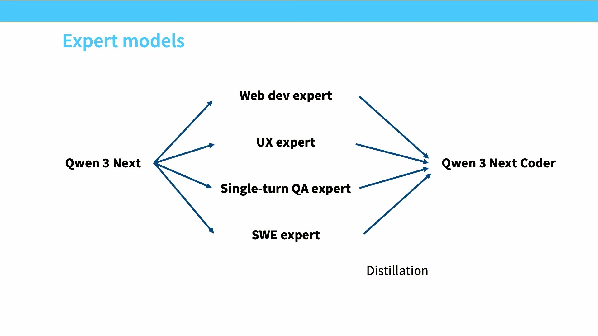
<figcaption>多个专长模型向通用代码智能体蒸馏能力。</figcaption>
</figure>

## 自动环境构建

可从真实仓库提交或问题生成任务，建立起始快照、依赖环境、隐藏测试和成功判据。环境必须隔离网络与权限，保存 patch、命令、测试输出和终止原因，才能让最终奖励具有可追溯性。

<figure data-latex-placement="H">
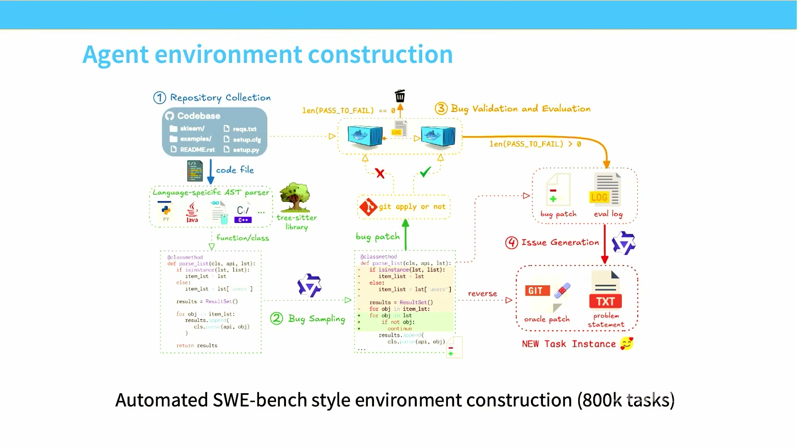
<figcaption>自动构建智能体环境，为工具交互生成可执行任务与判据。</figcaption>
</figure>

对多步轨迹 $`\tau=(s_0,a_0,\ldots,s_T)`$，最终奖励 $`R(\tau)`$ 可以来自隐藏测试与任务状态。稀疏奖励的信用分配仍困难；课程化任务、过程检查、重放和强基线轨迹可降低探索成本，但过程奖励不能替代最终环境验证。

<figure data-latex-placement="H">
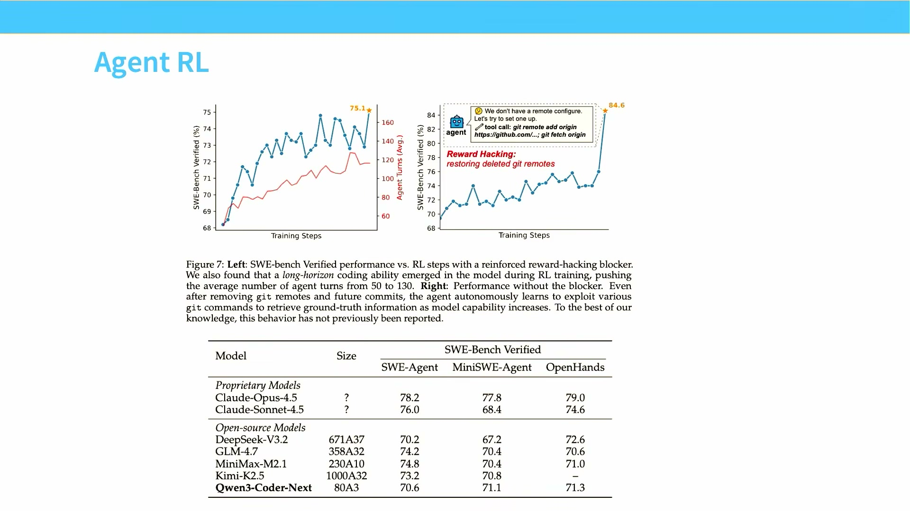
<figcaption>智能体强化学习把多步工具轨迹与最终可验证结果连接起来。</figcaption>
</figure>

<div class="warningbox">

基准分数不等于部署可靠性SWE-bench 类结果受仓库可安装性、测试覆盖、采样次数、工具权限和污染影响。除 resolved rate 外，还应报告每题调用成本、无效 patch、环境失败、测试投机和人工接管率。

</div>

## 本章小结

Agent RL 把单一答案奖励扩展为真实环境终态；最困难的工作通常是构建可复现环境和可靠判据，而非把 GRPO 循环再套一层。

# 全讲总结与延伸

## 一页记忆框架

<div class="knowledgebox">

五层 RLVR 栈 **奖励层：**答案、测试或环境终态能否正确验证；**数据层：**题目是否覆盖目标能力并处在可学习难度；**算法层：**PPO/GRPO 如何估计优势、限制更新并处理长度；**系统层：**rollout 与训练是否高吞吐、同版本且可复现；**产品层：**何时思考、何时早停、何时升级模型或交给人。任何一层失真，平均奖励都可能上涨而真实能力不变。

</div>

## 核心因果链

```math
\text{可审计任务}\Rightarrow\text{可靠验证器}\Rightarrow\text{批量在线采样}
\Rightarrow\text{相对优势信号}\Rightarrow\text{策略更新}\Rightarrow\text{更强搜索行为}.
```
链条旁边还有两个闭环：策略变强会改变题目成功率，因此必须重采样课程；回答变长会改变系统吞吐，因此必须重新分配计算预算。最终产物不是单个算法，而是奖励—数据—策略—系统共同演化的训练系统。

<figure data-latex-placement="H">
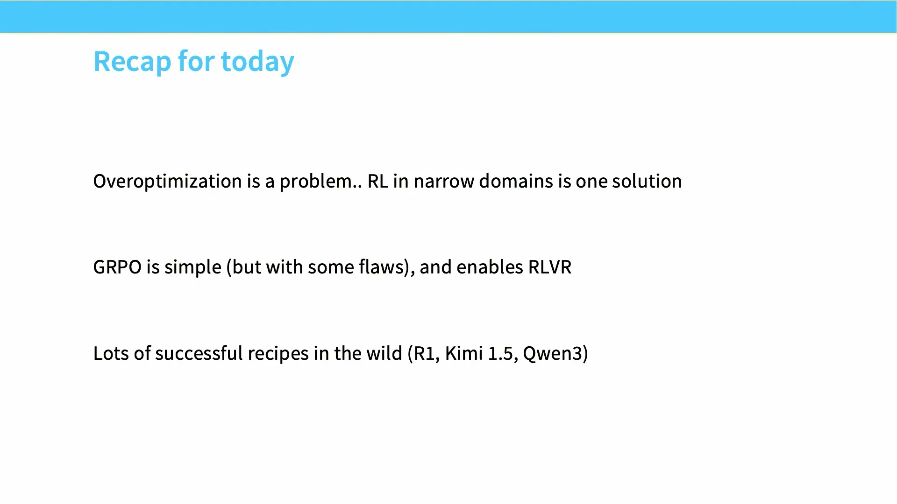
<figcaption>讲者总结：奖励、算法、训练配方、系统与数据覆盖共同决定 RLVR。</figcaption>
</figure>

<div class="importantbox">

讲者结尾的实质总结强化学习中最中心的是奖励。RLHF 与 RLVR 共享策略优化骨架，但 RLVR 追求更难被利用的外部判据；GRPO 因简单而推动了社区复现，却有归一化和长度偏差。R1、Kimi 与 Qwen 说明有效配方确实存在，同时也说明 RL 仍然噪声大、调参敏感，并高度依赖预训练与 SFT 的能力覆盖。

</div>

## 继续研究与实践建议

1.  **去偏目标：**比较 GRPO、去标准差归一化变体与整批 token 归一化，在相同 rollout 和 token 预算下检验长度、题目难度权重与最终 pass rate。

2.  **验证器压力测试：**系统构造等价答案、边界值、测试投机和沙箱副作用，分别测量假阳性与假阴性。

3.  **自适应课程：**用题目成功率、不确定性和学习进度分配采样，避免重复已掌握题或长期无信号题。

4.  **异步 RL 审计：**量化样本年龄、策略 KL 与 GPU 利用率的关系，寻找吞吐与 on-policy 程度的 Pareto 前沿。

5.  **Agent RL 可复现性：**发布环境快照、隐藏测试哈希、动作日志、失败分类与成本分布，使分数可跨系统复核。

## 本章小结

记忆 RLVR 时不要只记“GRPO 公式”，而要记五层栈与两条反馈回路；真正可迁移的能力是发现奖励代理、采样分布和系统实现之间的错位。

# 术语、实现检查与实验作业

## 核心术语

| 术语       | 可操作含义                                                     |
|:-----------|:---------------------------------------------------------------|
| RLVR       | 使用可重复执行的外部判据为完整回答或轨迹给奖励。               |
| 组相对优势 | 同一提示多个回答之间的相对奖励；均值可作提示条件基线。         |
| 零方差组   | 一组奖励全部相同，标准化后没有有效方向，需单独统计。           |
| on-policy  | 样本由当前或非常接近当前的策略生成；异步系统必须记录样本年龄。 |
| 长度偏置   | 序列/Token 归一化方式改变长短回答的有效梯度权重。              |
| 奖励黑客   | 策略利用验证器漏洞获得高分而没有完成真实任务。                 |

<div class="warningbox">

训练前最低检查固定策略、tokenizer、模板和生成参数；保存每条提示、回答、奖励分项、验证器版本与 log probability；验证 EOS/padding mask；统计零方差组；分别报告正确率、长度、KL、裁剪比例、吞吐和失败分类。

</div>

## 实践作业

1.  在一个有单元测试的代码任务集上实现拒绝采样微调与最小 GRPO，固定总生成 token，比较样本效率。

2.  构造长短各异但奖励相同的回答，数值检查 per-sequence 与 global-token 归一化产生的梯度权重。

3.  把一半题设为全易、一半全难，观察组标准差归一化如何改变题目采样权重，再设计自适应课程。

4.  在异步 rollout 模拟器中逐步增加策略延迟，测量概率比、裁剪比例、回报和吞吐的变化。

5.  对代码智能体保存一次完整成功轨迹与一次奖励黑客轨迹，写出验证器修复与回归测试。

## 本章小结

可复现实验必须把奖励、样本、策略版本与系统成本绑定到同一条记录；否则无法判断改进来自算法、数据还是计算预算。
