<div class="titlepage">

**CS336 Lecture 17：对齐与多模态**

Alignment – Multimodality


<div class="tcolorbox">

**频道：**Stanford Online**发布日期：**2026-06-04

**时长：**01:17:39**视频：**[`https://youtu.be/26FtD08ZpOU`](https://youtu.be/26FtD08ZpOU)

**阅读方式：**本笔记将课程概念、公式、算法和工程边界重组为可独立阅读的教材。

</div>

</div>

# 学习地图：Transformer 如何看见世界

语言模型把离散 token 序列映射为新 token 序列，但现实信息还包括图像、音频和视频。多模态系统需要回答两个不对称的问题：**如何把非文本输入编码为 Transformer 能消费的表示？如何生成非文本输出？**本讲主要讨论前者，并在末尾用 Chameleon 说明统一离散生成。

<figure data-latex-placement="H">
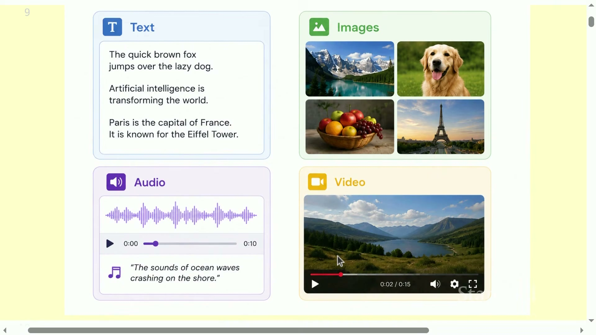
<figcaption>现实数据的四类常见模态：文本、图像、音频与视频。</figcaption>
</figure>

<figure data-latex-placement="H">
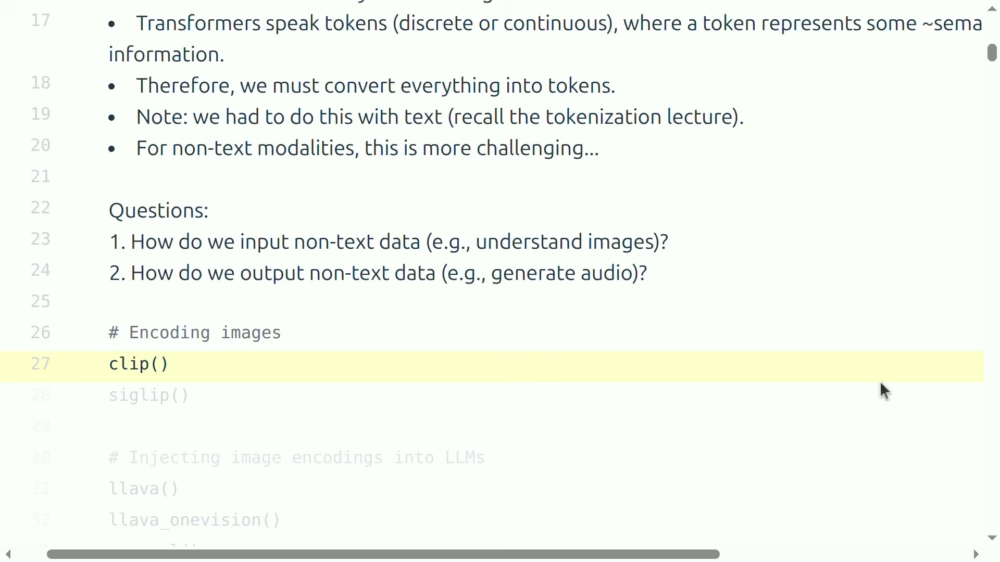
<figcaption>多模态建模的两个基础问题：输入编码与非文本生成。</figcaption>
</figure>

<div class="knowledgebox">

全讲主线 CLIP/SigLIP 学会视觉语义空间；LLaVA/Qwen-VL 把视觉 token 注入语言模型；Chameleon 将图像也离散化后统一自回归生成。三类方法的差别在于表示是连续还是离散、目标是理解还是生成。

</div>

## 本章小结

多模态并非简单增加一种文件格式，而是重新设计 token 化、位置、损失权重与数据配比。

# CLIP：从网页图文对中学习共享语义

## 对比学习目标

批次中有 $`B`$ 对图像与文本。图像编码器 $`f_I`$、文本编码器 $`f_T`$ 输出归一化向量
```math
\begin{equation}
u_i=\frac{f_I(I_i)}{\|f_I(I_i)\|_2},\qquad v_j=\frac{f_T(T_j)}{\|f_T(T_j)\|_2},
\end{equation}
```
相似度为 $`s_{ij}=u_i^\top v_j/\tau`$。$`I_i,T_j`$ 分别是第 $`i`$ 张图与第 $`j`$ 段文本，$`\tau`$ 是温度。对称交叉熵为
```math
\begin{equation}
\mathcal L_{\rm CLIP}=\tfrac12\left[-\frac1B\sum_i\log\frac{e^{s_{ii}}}{\sum_j e^{s_{ij}}}-\frac1B\sum_j\log\frac{e^{s_{jj}}}{\sum_i e^{s_{ij}}}\right].
\end{equation}
```
对角线是匹配对，其余同批样本自然充当负例。

<figure data-latex-placement="H">
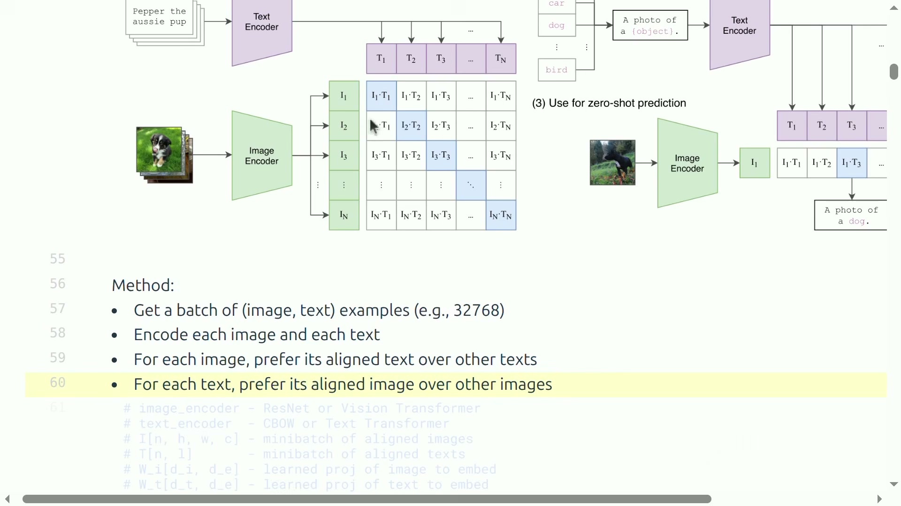
<figcaption>CLIP 的批内相似度矩阵以及由类别文本实现零样本预测。</figcaption>
</figure>

<div class="importantbox">

为什么网页噪声仍可用单个图文对可能错误，但大规模数据让稳定共现模式累积为语义信号。清洗仍关键：OpenCLIP/LAION 流水线甚至用已有 CLIP 做过滤，形成“模型帮助构造下一代数据”的自举。

</div>

## 本章小结

CLIP 将分类标签换成自然语言，使开放词汇语义学习成为可能；代价是大批次、全局语义偏好与网页偏差。

# 数据处理与 Vision Transformer

CLIP 将任意长宽图像先缩放短边，再中心裁剪成固定方形。这符合当时 ImageNet 分类场景，却会损失边缘文字和细节；后续 AnyRes 正是为修复该限制。

<figure data-latex-placement="H">
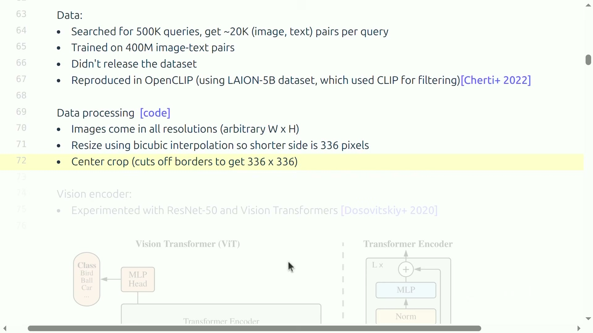
<figcaption>CLIP 数据规模、开放复现与固定尺寸缩放/中心裁剪策略。</figcaption>
</figure>

若图像大小为 $`H\times W`$，patch 边长为 $`P`$，则 token 数
```math
\begin{equation}
N_{\rm patch}=\frac{H}{P}\frac{W}{P}.
\end{equation}
```
每个 patch 展平并线性投影，加入位置编码与 class token 后进入 Transformer。$`H,W`$ 是高宽，$`P`$ 是 patch 大小，$`N_{\rm patch}`$ 是视觉 token 数；分辨率翻倍会使 token 数约增四倍，注意力开销进一步呈平方增长。

<figure data-latex-placement="H">
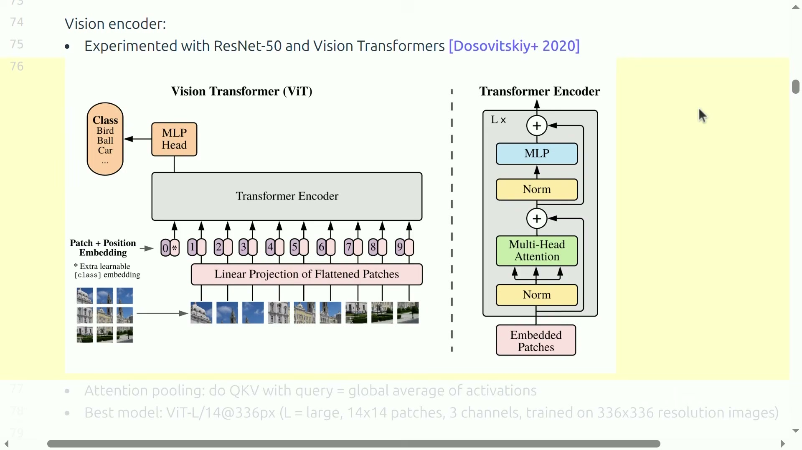
<figcaption>ViT：图像切块、线性投影、位置嵌入与 Transformer 编码器。</figcaption>
</figure>

<div class="warningbox">

中心裁剪的隐含假设它假设关键物体在中心且任务只需粗粒度分类。OCR、图表、文档与 GUI 场景通常要求保留边缘和局部高分辨率信息。

</div>

## 本章小结

ViT 让图像拥有 token 序列形式，但固定分辨率只是工程便利，不是多模态建模的最终答案。

# CLIP 的能力边界与零样本分类

零样本分类把类别名写成提示模板，例如 “a photo of a dog”，编码后与图像向量比较。这将预训练中的匹配问题直接复用于分类，无需为每个新标签训练线性头。

<figure data-latex-placement="H">
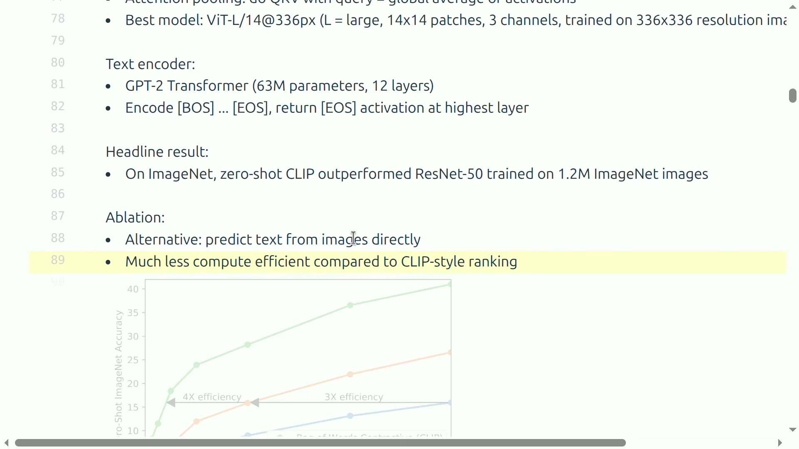
<figcaption>对比式目标比直接从图像生成文本更具数据与计算效率。</figcaption>
</figure>

课程强调：CLIP 的表示最擅长由文本描述定义的**全局语义**，不一定保留像素级位置、计数或细粒度文字。生成文本的目标更强却更难优化；任务目标越复杂，不保证表示越高效。

<div class="knowledgebox">

表征用途决定目标分类/检索重视语义对齐；OCR、检测与定位需要空间细节；图像生成还需要纹理和局部分布。一个统一向量很难同时服务所有层次。

</div>

## 本章小结

CLIP 奠定现代 VLM 的视觉语义底座，但“能匹配描述”不等于“能读出每个像素细节”。

# SigLIP：从批内 softmax 到成对 sigmoid

SigLIP 将每个图文对视作二分类。令 $`z_{ij}\in\{+1,-1\}`$ 表示是否匹配，则
```math
\begin{equation}
\mathcal L_{\rm SigLIP}=-\frac1{B^2}\sum_{i,j}\log\sigma\big(z_{ij}(u_i^\top v_j/\tau+b)\big),
\end{equation}
```
其中 $`b`$ 是偏置，$`\sigma`$ 是 sigmoid。与 CLIP 的整行/整列 softmax 不同，每一对的损失可独立计算。

<figure data-latex-placement="H">
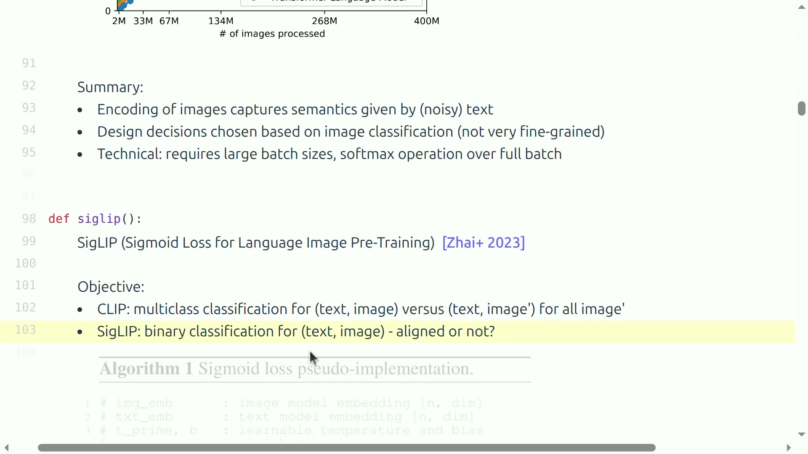
<figcaption>SigLIP 将“匹配/不匹配”改写为独立二元分类。</figcaption>
</figure>

<figure data-latex-placement="H">
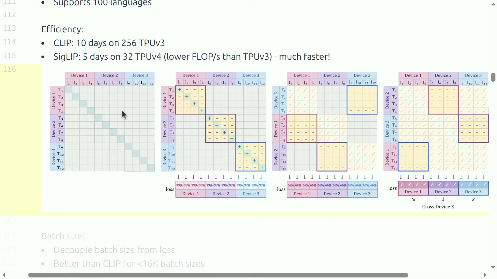
<figcaption>多设备训练：文本块在设备间轮转即可累计跨设备图文对损失。</figcaption>
</figure>

<div class="importantbox">

系统收益损失与全局批次解耦，分布式实现不必一次保留完整相似度矩阵；文本分块轮转即可覆盖跨设备组合。更大批次仍存在临界点，课程给出的经验约为 32K。

</div>

## 本章小结

SigLIP 的关键不是换一个激活函数，而是改变归一化耦合结构，从而改善分布式训练与批次扩展。

# LLaVA：视觉编码器、投影器与语言模型

基础架构由冻结的 CLIP ViT、线性投影 $`W`$ 与 Vicuna 语言模型组成。若视觉特征 $`X_v\in\mathbb R^{N_v\times d_v}`$，语言模型维度为 $`d_l`$，则
```math
\begin{equation}
H_v=X_vW,\qquad W\in\mathbb R^{d_v\times d_l}.
\end{equation}
```
$`N_v`$ 是视觉 token 数，$`H_v`$ 与文本嵌入位于同一维度，可直接拼接进入自回归模型。

<figure data-latex-placement="H">
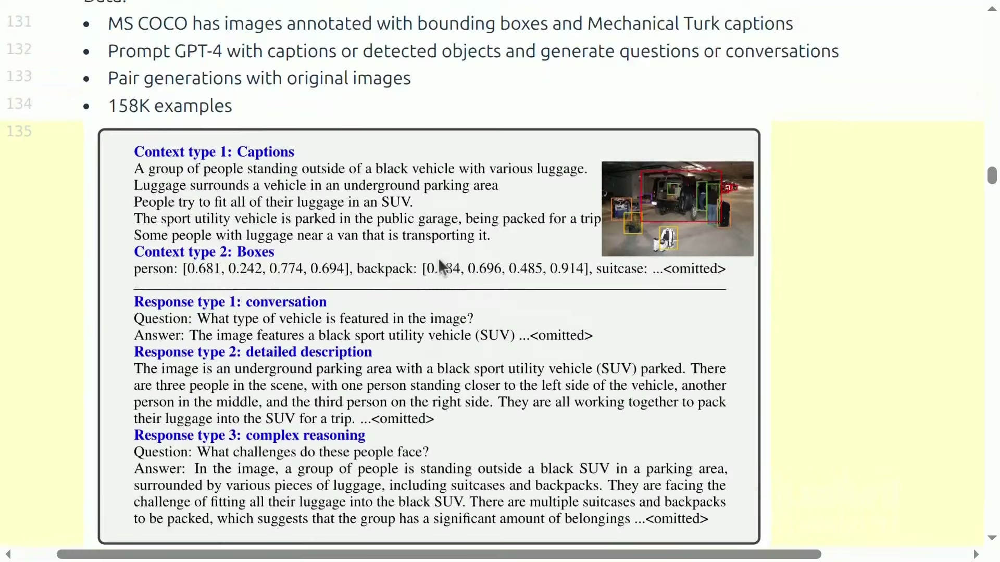
<figcaption>用 MS COCO 与 GPT-4 合成描述、对话和复杂推理数据。</figcaption>
</figure>

<figure data-latex-placement="H">
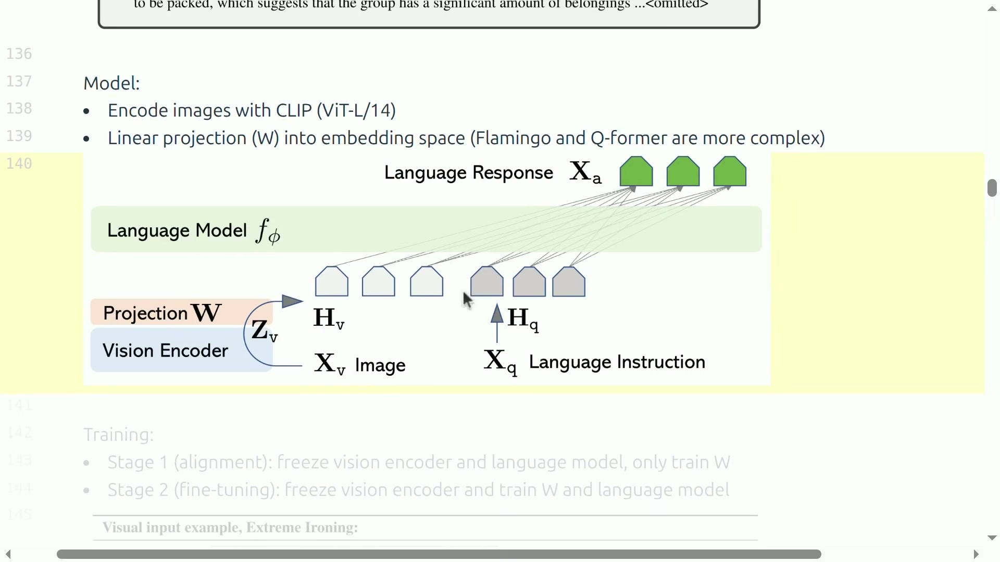
<figcaption>LLaVA 的最小连接：视觉编码器经线性投影进入语言模型。</figcaption>
</figure>

训练分两阶段：对齐阶段冻结两端只学 $`W`$；指令微调阶段训练 $`W`$ 与语言模型。前者像“翻译视觉特征”，后者才让模型学会多轮问答与推理。

<figure data-latex-placement="H">
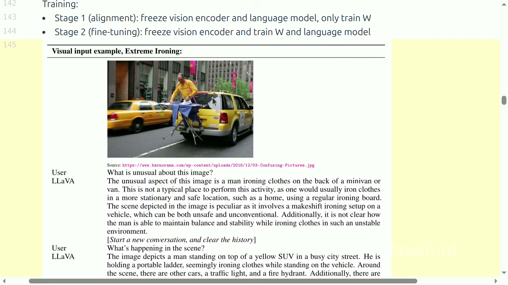
<figcaption>视觉推理样例：模型识别在汽车后部熨衣这一反常场景。</figcaption>
</figure>

## 本章小结

LLaVA 证明很薄的投影器也能激活语言模型中的知识；大量能力仍来自预训练 LLM，而非视觉编码器本身。

# LLaVA-OneVision：多图、视频与 AnyRes

OneVision 使用 SigLIP、两层 MLP 投影器和 Qwen2，统一单图、多图与视频输入。核心难题是视觉 token 预算：单图可精看，多图每张降采样，视频每帧更粗。

<figure data-latex-placement="H">
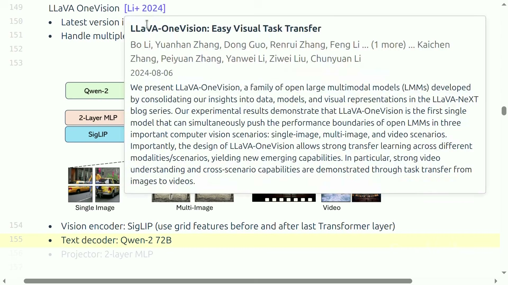
<figcaption>OneVision 组件与单图、多图、视频三类输入。</figcaption>
</figure>

<figure data-latex-placement="H">
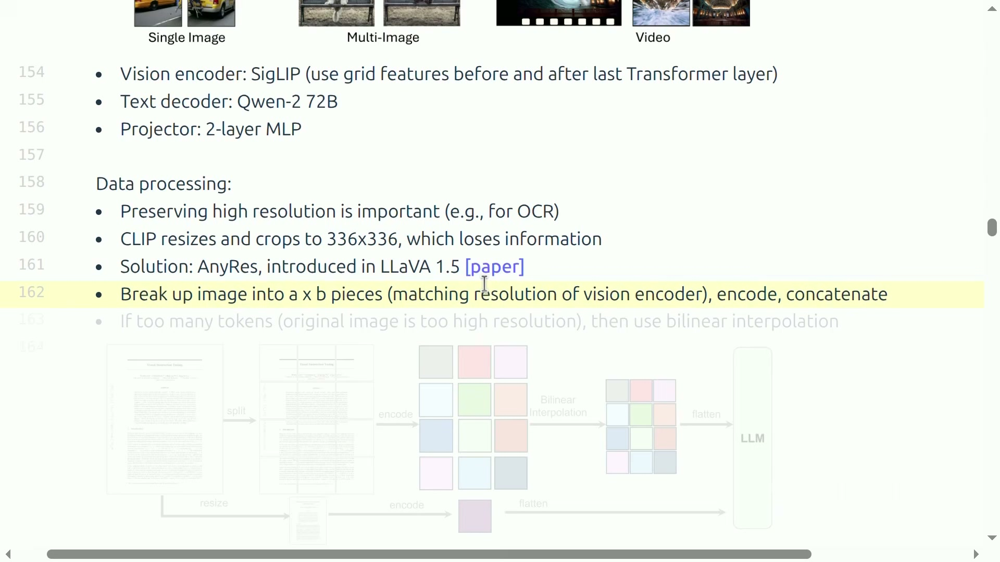
<figcaption>AnyRes：全局缩略图提供上下文，局部切块保留 OCR 与细节。</figcaption>
</figure>

设局部块视觉编码为 $`E(C_k)`$，全局缩略图为 $`E(G)`$，可写成
```math
\begin{equation}
H_v=[E(G);E(C_1);\ldots;E(C_K)]W.
\end{equation}
```
$`K`$ 是裁剪块数；若 token 超预算，再插值压缩。全局路径防止只见局部，局部路径避免高分辨率细节消失。

## 本章小结

AnyRes 将分辨率问题转为分层采样与 token 预算问题，是文档、图表和 GUI 理解的关键。

# 统一 token 预算与数据课程

<figure data-latex-placement="H">
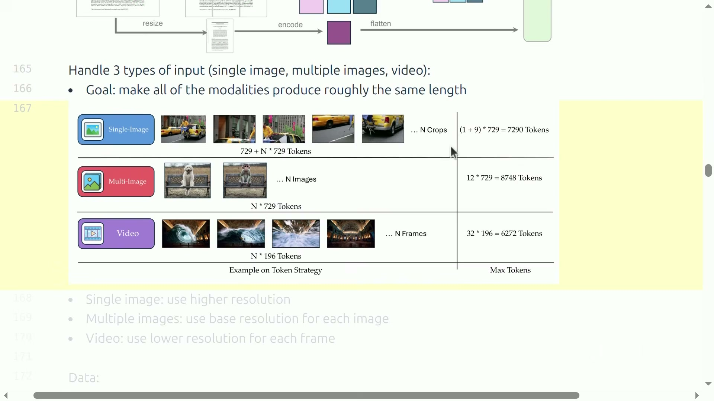
<figcaption>同一上下文预算下，单图、多图、视频使用不同的采样密度。</figcaption>
</figure>

视频的信息密度通常低于文本，连续帧又高度冗余；若逐帧高分辨率编码，训练会被长视频 token 主导。因此系统必须联合设计帧率、每帧分辨率与最大 token 数。

<figure data-latex-placement="H">
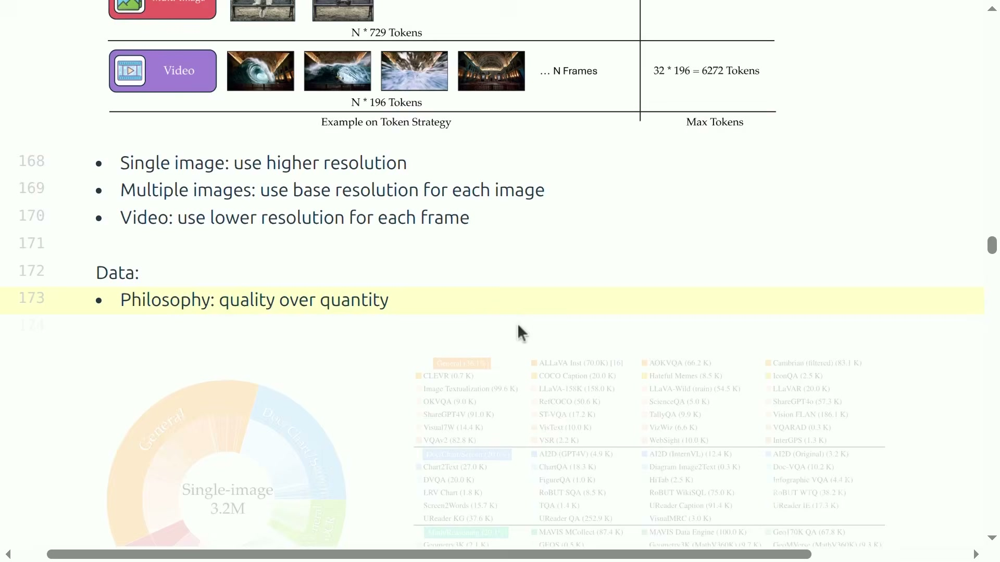
<figcaption>OneVision 的任务混合：通用、文档/图表、OCR、推理等数据共同训练。</figcaption>
</figure>

<figure data-latex-placement="H">
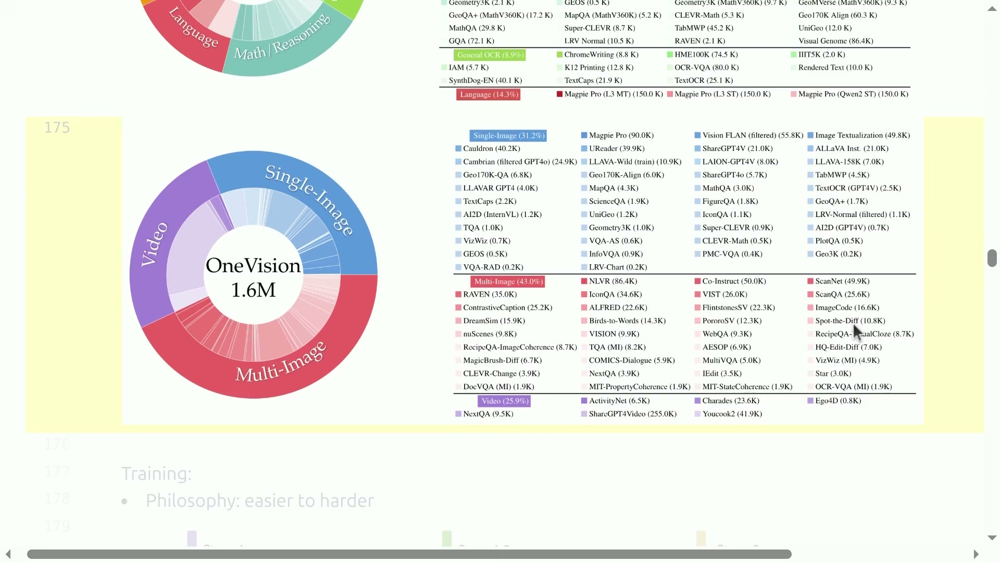
<figcaption>从语言—图像对齐到高质量知识学习，再到视觉指令微调。</figcaption>
</figure>

<div class="knowledgebox">

从易到难的课程学习先让投影器建立基本对齐，再引入高质量视觉知识，最后扩展到多图与视频指令。阶段化减少“视觉特征尚未可读时就要求复杂推理”的优化冲突。

</div>

## 本章小结

多模态系统的性能高度依赖数据混合和 token 计量；模型结构只是完整配方的一部分。

# 模态迁移：从单图能力到多图和代理

单图 OCR、图表理解可迁移到多图比较；图像中的圆圈提示可迁移到视频跨帧目标；GUI 截图数据又能支持代理按步骤执行操作。这种迁移并非零成本，仍需足够覆盖的任务混合。

<figure data-latex-placement="H">
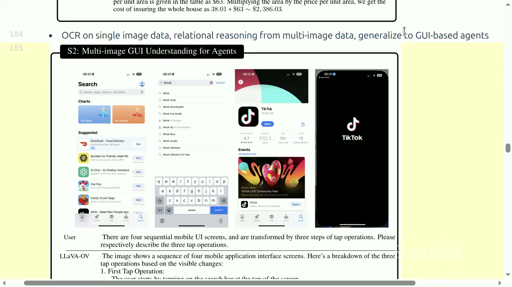
<figcaption>多图 GUI 理解：模型根据连续手机界面恢复操作序列。</figcaption>
</figure>

<div class="importantbox">

监督任务多样性带来的组合能力每个任务看似专门，但共享的视觉定位、文字识别与语言推理部件可以重组。评测时应区分真正组合泛化与训练集模板复现。

</div>

## 本章小结

模态迁移来自共享表示与任务覆盖；“一个模型支持多种输入”并不自动等于跨模态泛化。

# Qwen-VL 到 Qwen2-VL：动态分辨率与位置

早期 Qwen-VL 使用 OpenCLIP 视觉编码器、跨注意力适配器与语言模型，并按预训练、多任务预训练、监督微调三阶段训练。

<figure data-latex-placement="H">
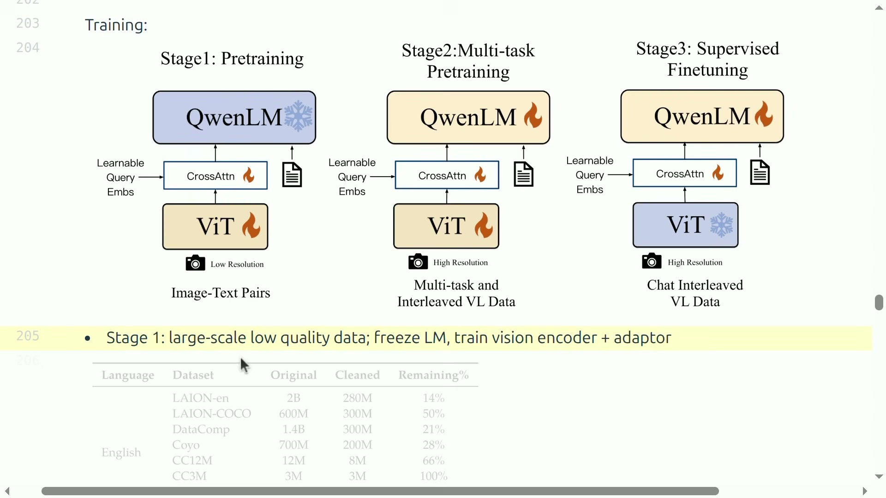
<figcaption>Qwen-VL 三阶段：先视觉/适配器，再多任务，最后冻结 ViT 做监督微调。</figcaption>
</figure>

Qwen2-VL 引入原生动态分辨率：每个 $`224\times224`$ 块经过 ViT，再把 $`2\times2`$ 邻域合并为一个 token，以控制上下文长度。

<figure data-latex-placement="H">
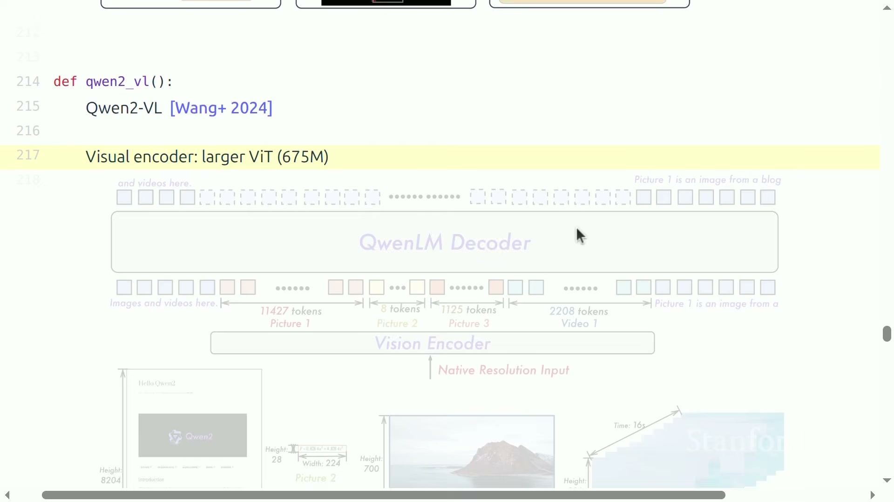
<figcaption>Qwen2-VL 将不同分辨率图像与视频映射到可变长度视觉 token。</figcaption>
</figure>

## 本章小结

动态分辨率不再强制所有图像消耗相同 token，使视觉计算与实际内容尺寸更匹配。

# M-RoPE：时间、高度与宽度的位置编码

标准 RoPE 对一维序列位置 $`p`$ 施加二维旋转。多模态 RoPE 将位置拆成时间 $`t`$、高度 $`h`$、宽度 $`w`$，并把各轴频率交错分配，避免某一轴只获得低频或高频维度。

<figure data-latex-placement="H">
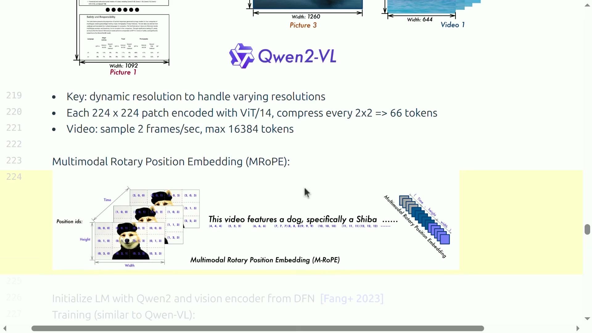
<figcaption>M-RoPE 为视频时间与二维空间建立联合位置编码。</figcaption>
</figure>

对第 $`r`$ 个频率分量，抽象写为
```math
\begin{equation}
\operatorname{RoPE}_r(q;t,h,w)=R(\omega_r a_r)q_r,\quad a_r\in\{t,h,w\}.
\end{equation}
```
$`R`$ 是二维旋转矩阵，$`\omega_r`$ 是第 $`r`$ 个频率，$`a_r`$ 指交错分配到的轴。显式时间戳 token 又为真实秒数提供语义，弥补仅靠帧索引的不确定性。

## 本章小结

多模态位置编码既要描述序列顺序，也要保留二维空间和真实时间尺度。

# Qwen3-VL：长上下文、损失平衡与 DeepStack

Qwen3-VL 扩展到长上下文、Dense/MoE 语言模型与 SigLIP2 视觉编码器。长视频会贡献远多于短文本的 token，若直接按 token 平均，视频样本将支配梯度。

<figure data-latex-placement="H">
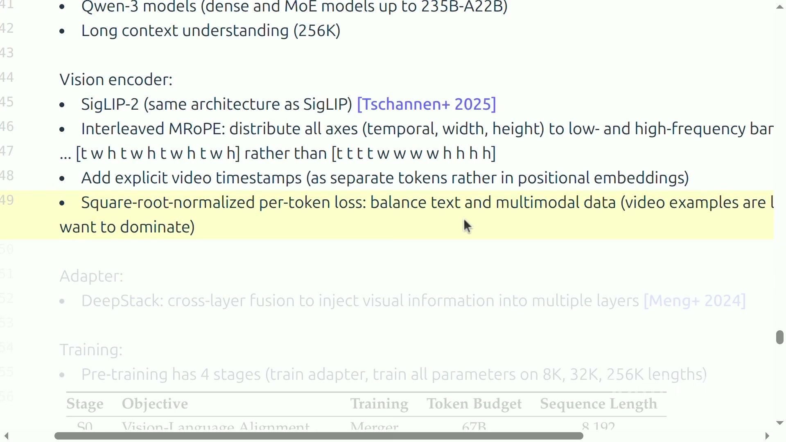
<figcaption>Qwen3-VL 的平方根归一化逐 token 损失用于平衡长短样本与不同模态。</figcaption>
</figure>

一种结构化表达为
```math
\begin{equation}
\mathcal L=\frac1{\sum_i\sqrt{n_i}}\sum_i\frac1{\sqrt{n_i}}\sum_{t=1}^{n_i}\ell_{it},
\end{equation}
```
$`n_i`$ 是第 $`i`$ 个样本 token 数，$`\ell_{it}`$ 是 token 损失。与按 token 总数归一化相比，样本权重随长度次线性增长。

<figure data-latex-placement="H">
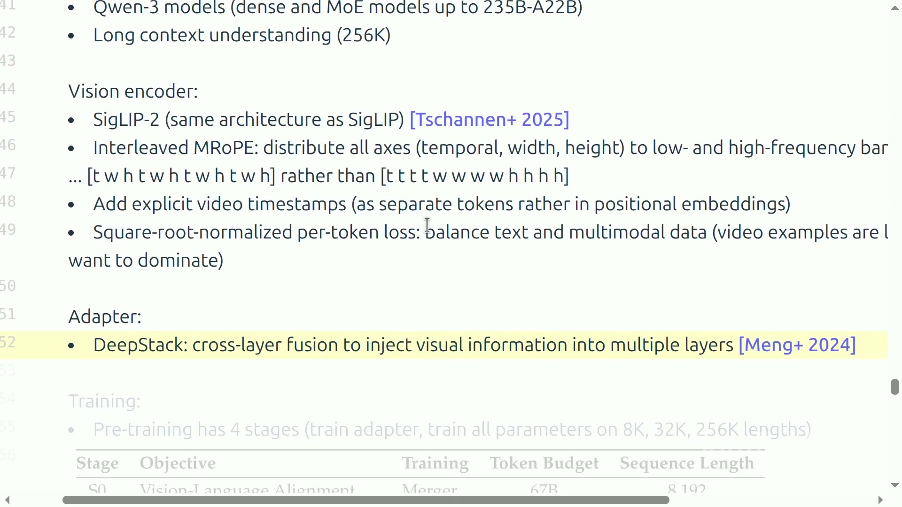
<figcaption>DeepStack 将视觉编码器中间层特征注入语言模型多个层级。</figcaption>
</figure>

<figure data-latex-placement="H">
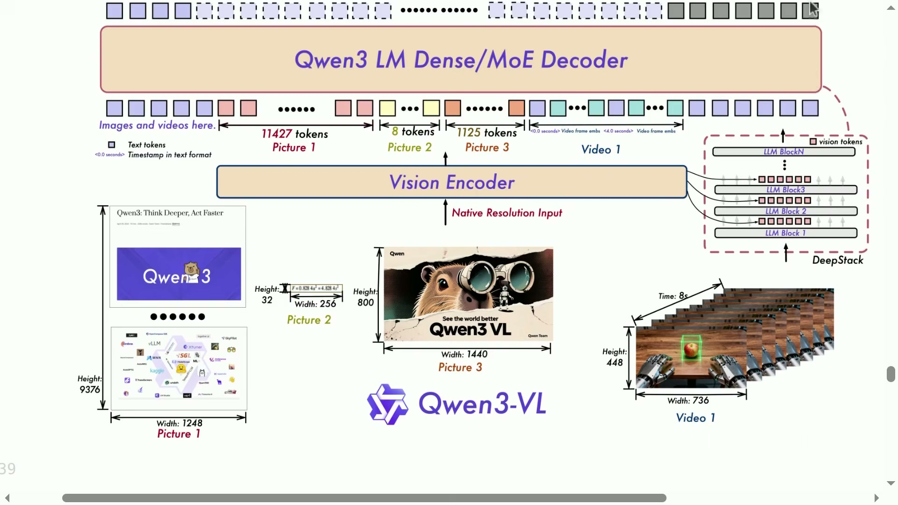
<figcaption>Qwen3-VL 总体结构：可变分辨率视觉输入、长序列与多层视觉注入。</figcaption>
</figure>

## 本章小结

Qwen3-VL 的增益来自一组小而关键的工程决策：模态损失平衡、多轴位置、显式时间和跨层视觉融合。

# 实现机制：视觉 token 流水线

```
def encode_anyres(image, vision_encoder, projector,
                  crop_size=336, max_tokens=4096):
    global_view = resize_keep_aspect(image, crop_size)
    crops = tile_image(image, crop_size=crop_size)
    features = [vision_encoder(global_view)]
    features += [vision_encoder(crop) for crop in crops]
    tokens = projector(concat(features, dim=0))
    if len(tokens) > max_tokens:
        tokens = spatial_interpolate(tokens, max_tokens)
    return tokens

def multimodal_sequence(text_ids, vision_tokens):
    # Special boundaries keep modality spans identifiable.
    return [IMG_START] + vision_tokens + [IMG_END] + embed(text_ids)
```

<div class="warningbox">

实现中最容易忽略的四点保持裁剪块二维顺序；在拼接前后记录位置元数据；对每种模态设置独立 token 上限；数据加载与视频解码必须流水化，否则 GPU 会等待 I/O。

</div>

## 本章小结

模型公式很简洁，但真正系统需要在分辨率、上下文长度、I/O 与批处理之间保持可复现约束。

# Chameleon：把图像变成可生成的离散 token

连续视觉编码器适合“看图后输出文本”，却不能直接由语言模型生成像素。Chameleon 选择统一离散词表：图像先经 VQ-VAE 压缩为索引序列，再与文本 token 交错自回归建模。

<figure data-latex-placement="H">
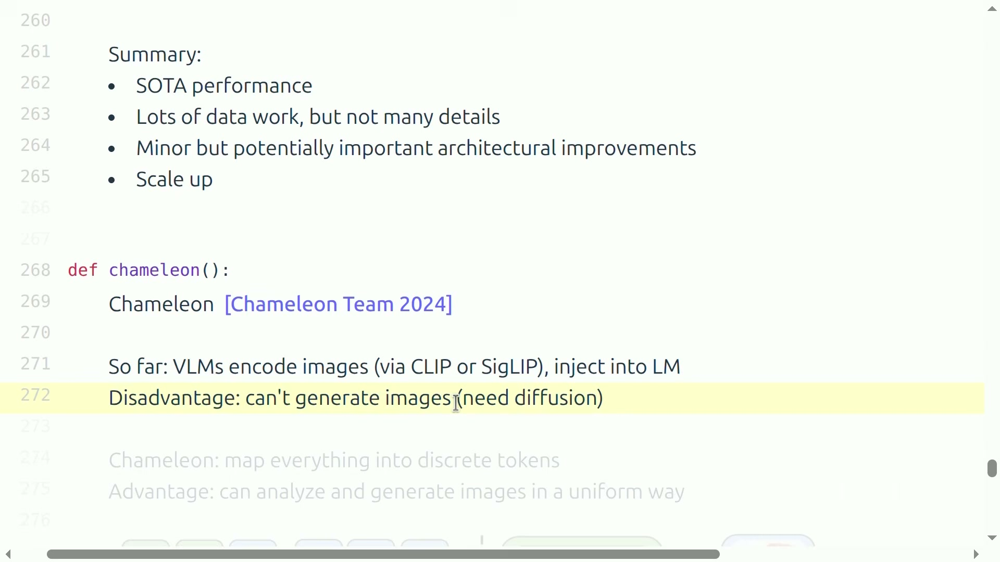
<figcaption>Chameleon 的选择：把所有模态都映射成离散 token。</figcaption>
</figure>

<figure data-latex-placement="H">
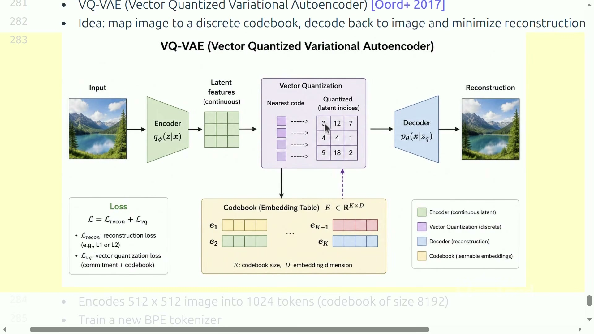
<figcaption>VQ-VAE：连续潜表示量化到码本索引，再由解码器重建图像。</figcaption>
</figure>

若编码器输出 $`z_e(x)`$、码本为 $`\{e_k\}_{k=1}^K`$，离散索引为
```math
\begin{equation}
k^*=\arg\min_k\|z_e(x)-e_k\|_2^2,\qquad z_q(x)=e_{k^*}.
\end{equation}
```
$`K`$ 是码本大小，$`k^*`$ 是最近码字。课程示例将 $`512\times512`$ 图像编码为 1024 token，词表约 8192。

## 本章小结

离散化让统一自回归生成成为可能，但量化会丢失细节，OCR 等精细任务尤其敏感。

# 统一生成的训练稳定性与取舍

图像 token 熵高、文本 token 熵低，共同训练会造成范数增长和不稳定。课程提到 QK normalization 与 z-loss 等稳定化方法；数据配比同样重要。

<figure data-latex-placement="H">
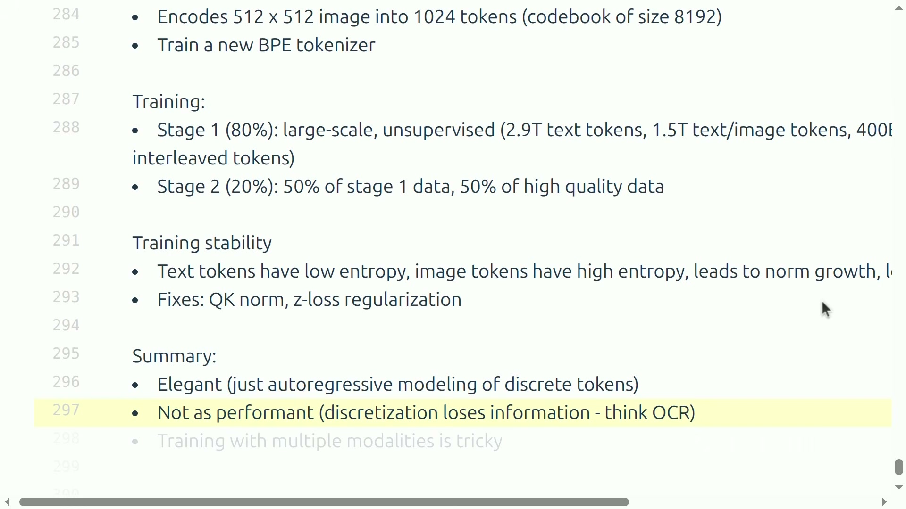
<figcaption>Chameleon 的训练规模、稳定性修复与离散化性能代价。</figcaption>
</figure>

<div class="warningbox">

理解与生成可能需要不同表示理解任务常需要语义连续特征；生成任务需要保留细粒度局部分布。现代系统常用连续视觉编码器负责理解、扩散模型负责生成，而非强迫单一离散表示包办全部任务。

</div>

## 本章小结

统一 token 空间优雅但并非免费：高熵模态带来优化压力，量化带来信息损失，扩散模型则提供另一条生成路径。

# 总结与延伸

<figure data-latex-placement="H">
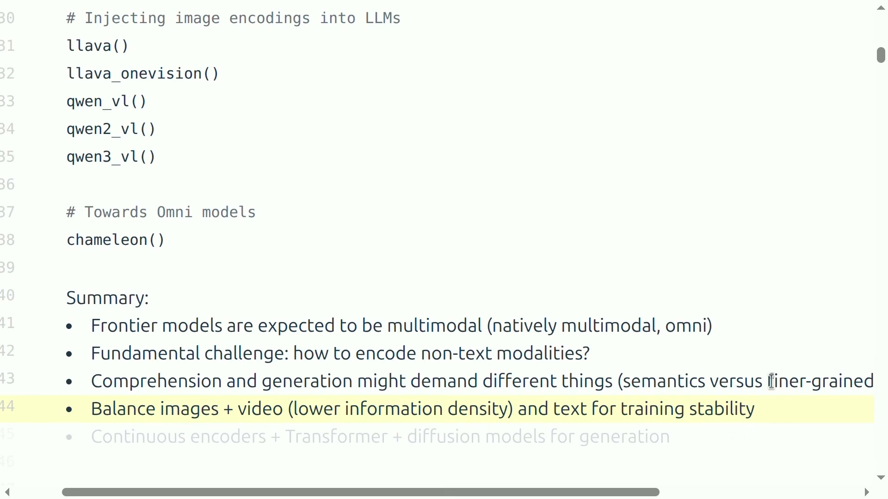
<figcaption>全讲总结：多模态输入编码、理解/生成差异、模态平衡与连续/离散路线。</figcaption>
</figure>

<div class="summarybox">

一页记忆框架 **CLIP：**批内对比学习共享语义，适合零样本分类与检索。

**SigLIP：**成对 sigmoid 解耦批次归一化，分布式更自然。

**LLaVA：**视觉编码器＋投影器＋LLM，先对齐再指令微调。

**OneVision/Qwen-VL：**AnyRes、动态 token、M-RoPE、跨层融合与数据课程。

**Chameleon：**VQ-VAE 离散图像 token，实现统一自回归生成但牺牲细节。

</div>

## 延伸问题

如何按信息密度自适应分配视频帧？视觉编码器与 LLM 应共同训练到何种程度？位置编码怎样支持小时级视频？连续理解表示与扩散生成如何共享世界知识？这些问题把模型结构、数据与系统效率连接起来。

## 最终结论

多模态模型并非“给 LLM 接一只眼睛”这么简单。真正的设计空间是：把每种信号压缩成什么 token、保留多少细节、如何定位、怎样加权，并用怎样的生成机制还原输出。
