<div class="titlepage">

**CS336 客座讲座：Dan Fu**

推理系统、Megakernel 与循环 Transformer


<div class="tcolorbox">

**频道：**Stanford Online**发布日期：**2026-06-05

**时长：**01:11:40**视频：**[`https://youtu.be/9EEm4iMAF5s`](https://youtu.be/9EEm4iMAF5s)

**阅读方式：**本笔记将课程概念、公式、算法和工程边界重组为可独立阅读的教材。

</div>

</div>

# 学习地图：推理系统为何重新定义模型研究

讲座的中心命题是：当模型训练完成，真正面对用户的是**推理引擎**。它不仅执行矩阵乘法，还负责请求排队、缓存复用、并行部署、流式返回、异常监控与硬件调度。模型参数在数年内从亿级增长到数千亿级，单靠更快的芯片无法吸收这种增长。

<figure data-latex-placement="H">
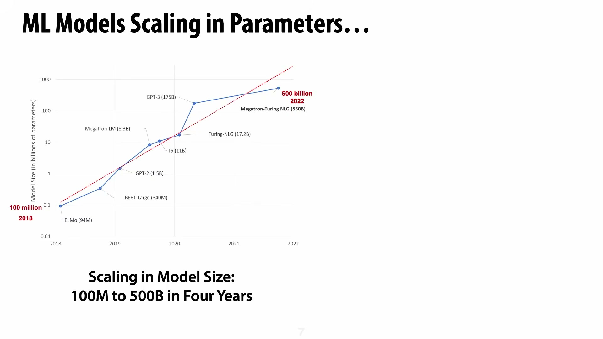
<figcaption>模型参数规模快速增长，部署复杂度随之上升。</figcaption>
</figure>

<figure data-latex-placement="H">

<figcaption>马车到汽车的类比：新技术不仅替换部件，还会重写完整生产体系。</figcaption>
</figure>

讲者用第二次工业革命作类比：汽车不是“更快的马”，推理系统也不只是“更快的训练循环”。当工作负载改变，调度、缓存、互连和编程抽象都会成为算法的一部分。

<div class="knowledgebox">

全讲三条主线 **系统主线：**请求如何经历 tokenize、prefill、decode 与 streaming。

**内核主线：**如何用融合 Megakernel 减少启动空洞与尾部效应。

**模型主线：**如何用稳定循环 Transformer 让测试时计算成为新的扩展轴。

</div>

## 本章小结

推理不是训练之后的附属环节，而是连接模型结构、GPU 内核和真实用户目标的研究入口。

# 推理引擎的组成与优化目标

<figure data-latex-placement="H">
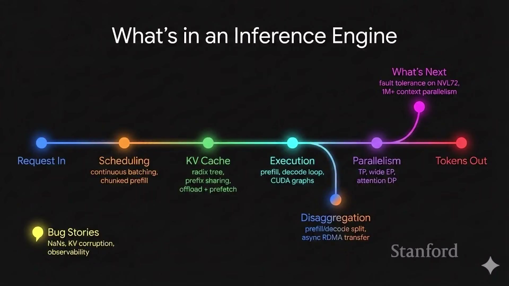
<figcaption>推理引擎的主路径：请求、调度、KV 缓存、执行、并行与输出。</figcaption>
</figure>

一次请求通常经过：接收与鉴权、tokenize、进入调度队列、prefill、逐 token decode、detokenize 与流式发送。旁路还包括缓存淘汰、跨机并行、可观测性与容错。

<figure data-latex-placement="H">
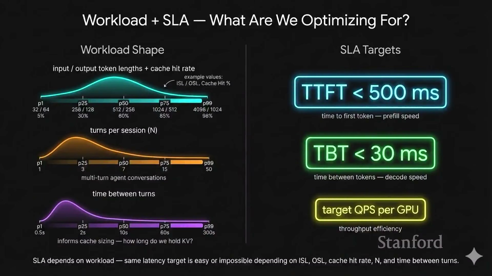
<figcaption>工作负载形状与服务级目标：TTFT、TBT 和每 GPU 吞吐。</figcaption>
</figure>

<div class="importantbox">

三个不能混为一谈的指标 **TTFT**（time to first token）决定用户多久看见首字；**TBT**（time between tokens）决定流式输出是否顺滑；**吞吐/QPS**决定单位硬件能服务多少请求。提高批量常改善吞吐，却可能恶化 TTFT 与尾延迟。

</div>

设请求完成数为 $`N_c`$、观测时间为 $`\Delta t`$，则
```math
\begin{equation}
\mathrm{QPS}=\frac{N_c}{\Delta t},\qquad T_{\rm TTFT}=T_{\rm queue}+T_{\rm tok}+T_{\rm prefill}+T_{\rm first} .
\end{equation}
```
$`T_{\rm queue}`$ 是排队时间，$`T_{\rm tok}`$ 是分词开销，$`T_{\rm prefill}`$ 是处理提示词的时间，$`T_{\rm first}`$ 是首次解码与传输。优化总平均值不代表满足高分位 SLA。

## 本章小结

推理优化首先是目标定义问题；必须明确是在优化首字延迟、逐字延迟、吞吐、成本还是尾部稳定性。

# 一个 token 的一生：prefill 与 decode

<figure data-latex-placement="H">
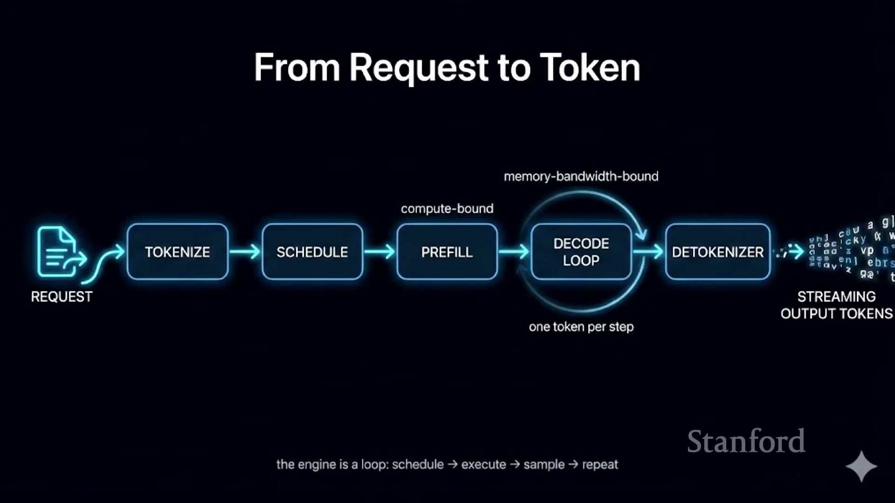
<figcaption>从请求到流式 token：调度、prefill、decode 循环与 detokenize。</figcaption>
</figure>

对于长度 $`L`$、隐藏维度 $`d`$ 的提示词，Transformer prefill 的主要计算可粗略写成
```math
\begin{equation}
C_{\rm prefill}=\mathcal O(Ld^2+L^2d),
\end{equation}
```
第一项来自线性层，第二项来自注意力。prefill 一次处理许多 token，通常更**计算受限**；decode 每步只产生一个 token，却要重新读取大量模型权重，通常更**显存带宽受限**。

<div class="warningbox">

常见误区“decode 每步 FLOPs 少”不等于便宜。模型权重仍需从 HBM 读入，算术强度低时 GPU 计算单元会闲置；端到端性能必须看 roofline 和内存流量。

</div>

KV 缓存避免对历史 token 反复计算注意力的 key/value。若层数为 $`n_\ell`$、KV 头数为 $`n_{kv}`$、头维为 $`d_h`$、每元素 $`b`$ 字节，则单会话缓存近似为
```math
\begin{equation}
M_{KV}=2Ln_\ell n_{kv}d_hb.
\end{equation}
```
系数 2 对应 key 和 value；长上下文、并发会话与层数共同决定显存压力。

## 本章小结

prefill 与 decode 的计算形态不同，因此调度、硬件和并行策略也不应强行相同。

# 连续批处理：让动态请求共享 GPU

<figure data-latex-placement="H">
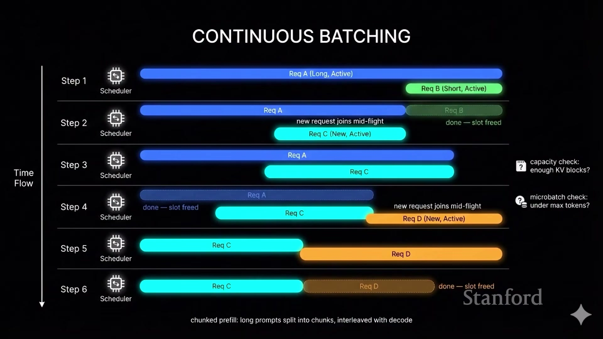
<figcaption>连续批处理：已完成请求立即释放槽位，新请求可中途加入；长 prefill 可切块并与 decode 交错。</figcaption>
</figure>

静态批处理要等整个批次结束，最慢请求决定完成时间。连续批处理在每个解码步重新组成 microbatch：完成者离开、新请求进入，GPU 不必等待固定批次边界。长提示还可做 chunked prefill，防止一次 prefill 阻塞所有 decode。

```
def scheduler_step(waiting, running, kv_pool, token_budget):
    running = [r for r in running if not r.finished]
    kv_pool.release_finished(running)
    while waiting and kv_pool.can_admit(waiting[0]):
        running.append(waiting.pop(0))
    batch = choose_token_chunks(running, budget=token_budget)
    logits = model_step(batch, kv_pool)
    sample_and_stream(batch, logits)
    return running
```

调度器必须同时约束 token 预算、KV 块容量和延迟优先级；仅按请求数限制批次会严重误判长短请求成本。

## 本章小结

连续批处理把服务从“批次作业”转为“每步重排的在线系统”，是高吞吐推理的基本机制。

# Radix Tree：共享提示前缀与 KV 缓存

<figure data-latex-placement="H">
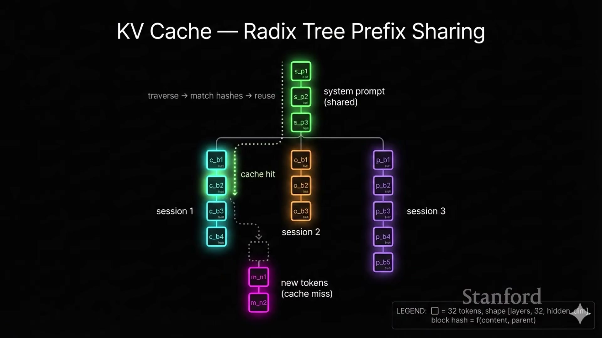
<figcaption>Radix Tree 前缀共享：系统提示和历史对话命中后，仅计算新增 token。</figcaption>
</figure>

许多请求共享系统提示、文档前缀或历史轮次。将 token 块的内容与父节点哈希组织为 radix tree，可在新请求到来时遍历最长匹配前缀并直接复用 KV。 若请求长度为 $`L`$、命中前缀为 $`L_{hit}`$，需要重新 prefill 的 token 数为
```math
\begin{equation}
L_{miss}=L-L_{hit},\qquad r_{hit}=\frac{L_{hit}}{L}.
\end{equation}
```
$`r_{hit}`$ 是命中率。收益不仅是少算 FLOPs，也会减少 TTFT；但缓存块要记录模型版本、位置编码配置和父链，避免错误复用。

<div class="warningbox">

缓存正确性比命中率更重要模型权重、adapter、采样前处理或位置约定一旦变化，旧 KV 可能不再有效。缓存键必须覆盖所有影响隐藏状态的条件。

</div>

## 本章小结

KV 缓存从单请求优化扩展为跨请求数据结构后，推理引擎开始像数据库与操作系统一样管理状态。

# 模型并行与 prefill/decode 解耦

<figure data-latex-placement="H">
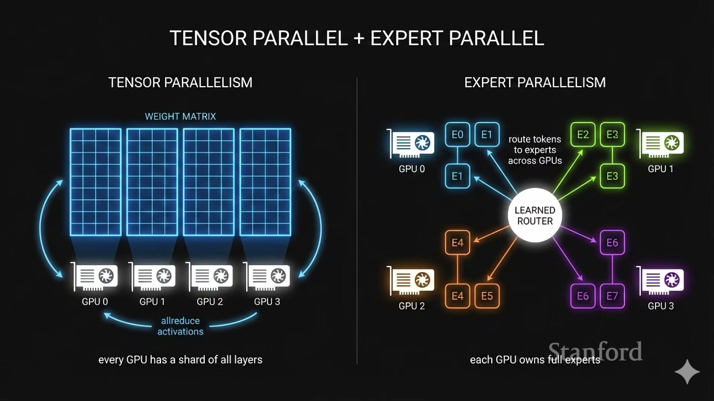
<figcaption>Tensor Parallel 与 Expert Parallel：分别切分张量和 MoE 专家。</figcaption>
</figure>

Tensor Parallel 把单层矩阵分散到多个 GPU，代价是层内频繁通信；Expert Parallel 把 MoE 专家分散部署，仅路由被激活的专家，但需要 all-to-all token 交换。并行不是越多越好：通信开销、故障域和可服务会话数都会变化。

<figure data-latex-placement="H">
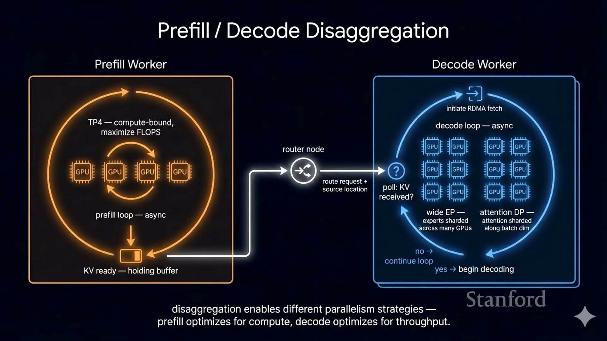
<figcaption>Prefill/Decode Disaggregation：把计算密集与带宽密集阶段放到不同 worker。</figcaption>
</figure>

解耦后，prefill worker 可以追求高算力利用率，decode worker 可以针对带宽、低延迟和长驻权重优化。两组 worker 之间需传输 KV，路由器还要防止某一侧排队失衡。

<div class="knowledgebox">

解耦的必要条件只有当阶段专用化收益大于 KV 传输、排队和额外容错成本时，分离才划算。短提示、低并发或慢互连上，单体部署可能更简单有效。

</div>

## 本章小结

并行与解耦的本质是把不同瓶颈映射到不同资源，同时支付通信和调度代价。

# 生产可观测性：稀有错误才是常态

<figure data-latex-placement="H">
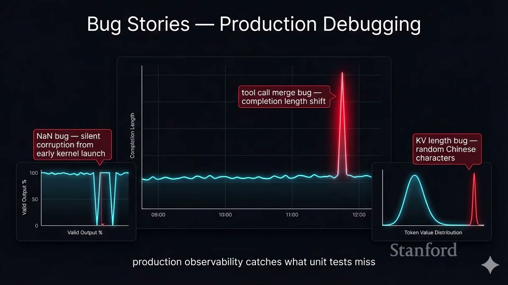
<figcaption>生产调试故事：NaN、工具调用合并错误和 KV 长度越界会表现为不同分布异常。</figcaption>
</figure>

讲座列出三类只有大规模流量才容易暴露的问题：早启动或数值错误导致 NaN 和重复 token；工具调用结束条件错误导致完成长度突然飙升；KV 下标越界读到未初始化内存，使模型无端切换语言。

<div class="importantbox">

监控应覆盖分布而非单点 至少记录有效输出率、NaN/Inf、完成长度分位数、每 token 延迟、缓存命中率、停止原因、token 语言分布和各内核版本。极低概率错误在万亿 token 规模会频繁发生。

</div>

```
def observe(step):
    assert isfinite(step.logits).all()
    metrics.histogram("completion_length", step.generated)
    metrics.histogram("tbt_ms", step.inter_token_ms)
    metrics.counter("stop_reason", step.stop_reason)
    if language_shift(step.tokens) or repetition_loop(step.tokens):
        quarantine(step.request_id, kernel_build=step.kernel_build)
```

## 本章小结

单元测试证明常见路径正确，生产可观测性则负责发现罕见输入、并发时序和硬件状态共同触发的问题。

# KV 缓存层级：HBM、CPU 与 NVMe

<figure data-latex-placement="H">
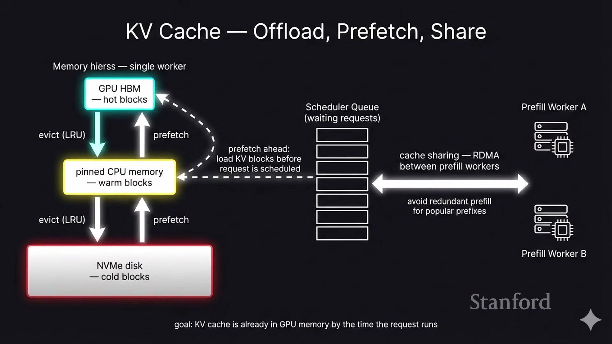
<figcaption>KV 缓存层级：GPU HBM、pinned CPU memory、NVMe 与跨 worker 共享。</figcaption>
</figure>

当 HBM 放不下所有活跃会话，可把冷 KV 逐级迁移到 CPU 内存和 NVMe，并在预计使用前预取。层级管理类似虚拟内存：淘汰策略决定放什么，预取决定何时搬回，RDMA 决定如何跨机共享。 若层级 $`i`$ 的命中概率为 $`p_i`$、访问延迟为 $`\tau_i`$，期望取回时间粗略为
```math
\begin{equation}
\mathbb E[T_{fetch}]=\sum_i p_i\tau_i+P(\mathrm{miss})\tau_{recompute}.
\end{equation}
```
$`\tau_{recompute}`$ 是重新 prefill 的代价。仅追求容量而忽视尾延迟，会让 SSD 命中反而阻塞交互请求。

<div class="warningbox">

不能照搬普通 LRUKV 块的价值还取决于前缀共享人数、重计算成本、下一轮到达概率与 SLA。更合理的优先级是“未来收益/占用字节”的估计。

</div>

## 本章小结

KV 层级把推理变成数据移动问题；昂贵 GPU 的有效利用率可能被便宜 CPU、SSD 或互连决定。

# 百万 token 上下文与 Context Parallelism

<figure data-latex-placement="H">
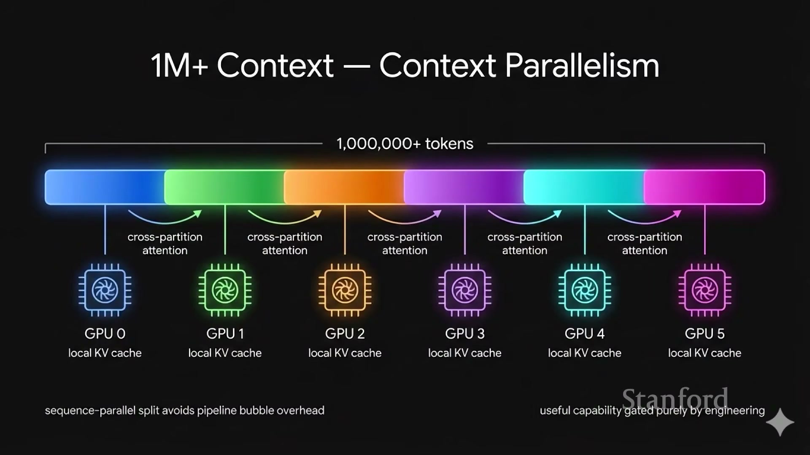
<figcaption>百万 token 上下文按序列维度跨 GPU 切分，每卡保存局部 KV。</figcaption>
</figure>

Context Parallelism 沿序列维度拆分上下文。每个 GPU 存储局部 KV，并通过 ring、all-gather 或分块注意力交换必要信息。它缓解单卡内存瓶颈，但引入通信和负载均衡问题。 若 $`P`$ 张卡均匀切分长度 $`L`$，理想局部 KV 为 $`M_{KV}/P`$；实际还需通信缓冲、复制和不均匀块，不能把 $`1/P`$ 当作端到端加速比。

<div class="knowledgebox">

长上下文的三重挑战内存随 $`L`$ 线性增长；标准注意力计算随 $`L^2`$ 增长；分布式通信又随切分策略变化。必须联合选择稀疏注意力、缓存量化与并行拓扑。

</div>

## 本章小结

百万 token 能否服务，取决于模型算法和系统拓扑共同设计，而不只是把上下文窗口参数调大。

# Cache-aware Prefill–Decode 路由

<figure data-latex-placement="H">
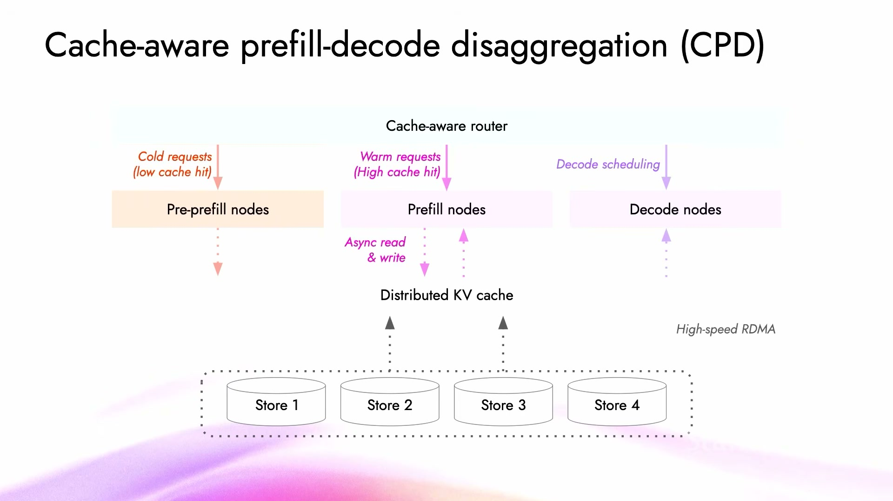
<figcaption>CPD 路由：冷请求送往专用 prefill 节点，暖请求利用分布式 KV 缓存。</figcaption>
</figure>

新会话通常缓存命中低、prefill 很重；多轮会话通常命中高、只需处理少量新增 token。若把两者混到同一节点，长冷请求会干扰短暖请求。CPD 路由器按缓存状态把两类流量分开。 可用简单代价函数表达路由：
```math
\begin{equation}
j^*=\arg\min_j\left(Q_j+\alpha L_{miss,j}+\beta T_{KV,j}\right),
\end{equation}
```
$`Q_j`$ 是节点 $`j`$ 的排队估计，$`L_{miss,j}`$ 是在该节点需重算的 token 数，$`T_{KV,j}`$ 是 KV 迁移时间，$`\alpha,\beta`$ 是由硬件与 SLA 标定的权重。

<figure data-latex-placement="H">
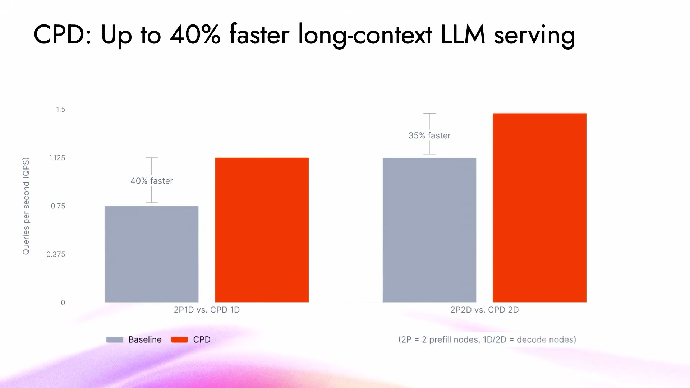
<figcaption>实验结果：简单缓存感知路由在长上下文服务中最高带来约 40% 提升。</figcaption>
</figure>

## 本章小结

高价值优化不一定是复杂内核；掌握请求状态并做两行正确路由，也可能带来系统级增益。

# Decode 的空洞：启动开销、尾部效应与 straggler

<figure data-latex-placement="H">
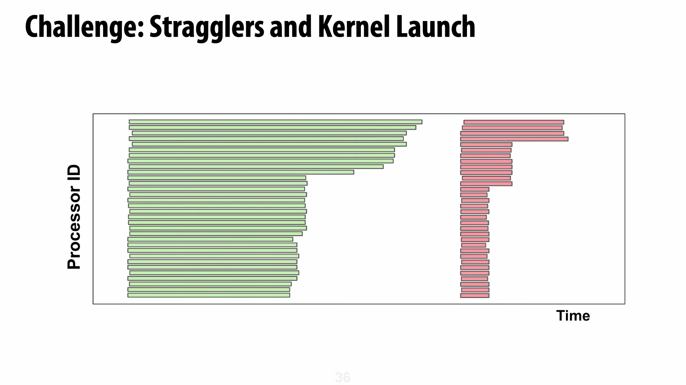
<figcaption>传统多内核执行中的空白：内核启动、收尾和不同序列长度造成 GPU 空闲。</figcaption>
</figure>

GPU 上的每条横线代表一个处理器/SM。单操作一个 kernel 的编程方式易于组合，却在操作之间产生启动间隙；同一批次中长短序列差异又产生 tail effect。局部 kernel 再快，跨 kernel 的空洞仍会累积。 设操作 $`m`$ 的有效工作为 $`W_m`$、启动和同步空洞为 $`G_m`$，则层级利用率可写成
```math
\begin{equation}
U=\frac{\sum_m W_m}{\sum_m(W_m+G_m)}.
\end{equation}
```
优化单个 $`W_m`$ 而不减少 $`G_m`$，利用率上限仍受空洞约束。

<div class="warningbox">

平均 kernel 时间会掩盖系统空洞需要查看 GPU 时间线、SM 活跃度、内存吞吐与 P99 token 延迟；只看单 kernel microbenchmark 容易得出错误结论。

</div>

## 本章小结

decode 的核心损失来自细粒度操作之间无法连续排满 GPU，而不仅是某个矩阵乘法不够快。

# Fused Megakernel：把 GPU 当作分布式系统

<figure data-latex-placement="H">
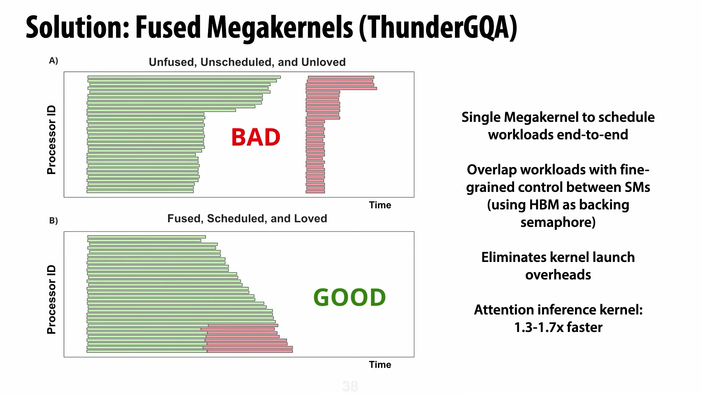
<figcaption>Megakernel 将多操作交给一个持久 kernel 调度，减少启动间隙并平滑尾部。</figcaption>
</figure>

Megakernel 把多个运算融合进一个长驻 kernel，由内部调度器把不同任务分配给 SM。与 FlashAttention 的局部融合类似，但覆盖范围更大，甚至可覆盖整个层。

<figure data-latex-placement="H">
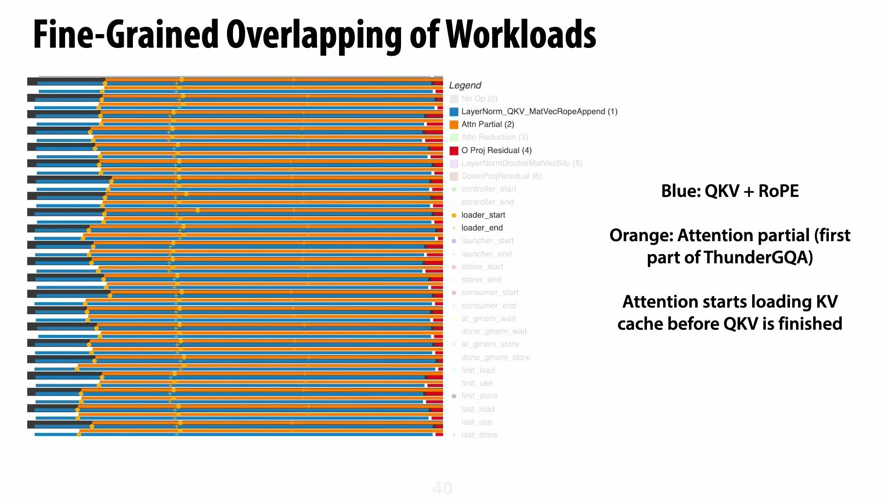
<figcaption>细粒度重叠：在 QKV+RoPE 尚未完全结束时预取下一阶段 KV。</figcaption>
</figure>

融合的关键不是简单把代码拼接，而是显式表达依赖：只要局部数据就绪，下游任务即可开始；同时把权重加载、归约和注意力交错执行。

<div class="importantbox">

正确性边界跨算子重排必须保持数据依赖、数值精度和同步语义。性能验证要先与未融合参考逐 token 比对，再测吞吐与尾延迟。

</div>

## 本章小结

Megakernel 用更复杂的内部调度换取更少的全局边界，把“调用 kernel”转为“在 GPU 内持续派发任务”。

# ThunderKittens：为性能 kernel 选择合适抽象

<figure data-latex-placement="H">
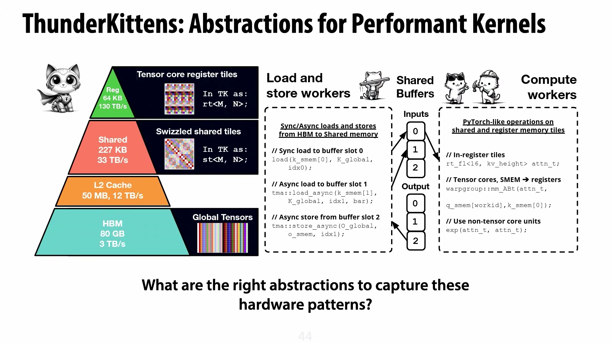
<figcaption>ThunderKittens 将 tensor core、load/store、共享内存与 compute worker 抽象为协作单元。</figcaption>
</figure>

高性能 kernel 既要控制共享内存与 warp，又不应退化为不可维护的汇编。讲座用 ThunderKittens 说明：抽象应与硬件层级对齐，让程序员描述 tile、生产者/消费者和流水线，而不是隐藏所有调度细节。

<figure data-latex-placement="H">
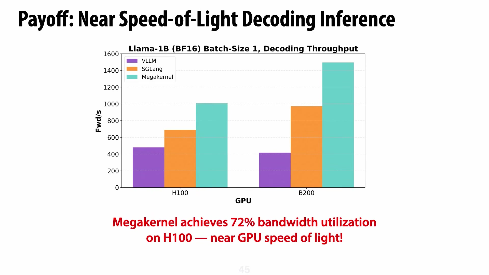
<figcaption>Megakernel 在 H100 上达到约 72% 带宽利用率，接近 decode 的硬件上限。</figcaption>
</figure>

若 decode 已受 HBM 带宽限制，理论时间近似为
```math
\begin{equation}
T_{min}\approx \frac{B_{read}}{BW_{HBM}},
\end{equation}
```
$`B_{read}`$ 是生成一个 token 必须读取的字节数，$`BW_{HBM}`$ 是有效 HBM 带宽。接近该下界时，再增加 FLOPs 优化的收益有限。

## 本章小结

合适的编程抽象让研究者同时控制硬件和保持可组合性；性能目标应与 roofline 下界对齐。

# Parcae：把循环次数变成测试时计算

<figure data-latex-placement="H">
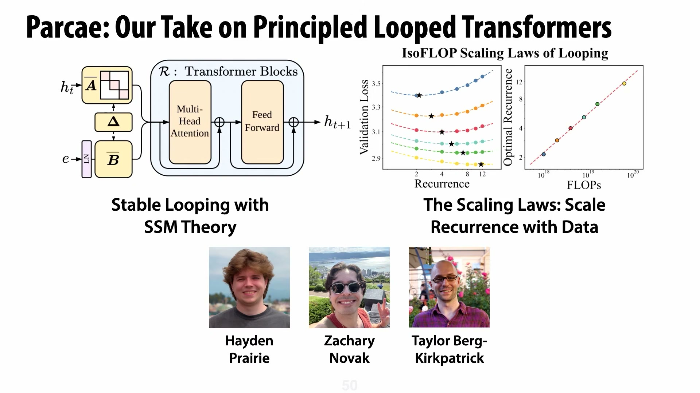
<figcaption>Parcae 的循环 Transformer：共享层参数，增加 recurrence 以扩展 FLOPs。</figcaption>
</figure>

传统缩放主要增加参数 $`N`$ 和训练数据 $`D`$。循环 Transformer 复用同一组块，使参数固定时仍可通过重复计算提高推理能力。对输入表示 $`e`$，抽象递推为
```math
\begin{equation}
h_{t+1}=\mathcal R_\theta(h_t,e),\qquad t=0,\ldots,T-1,
\end{equation}
```
$`h_t`$ 是第 $`t`$ 次循环状态，$`\mathcal R_\theta`$ 是共享参数块，$`T`$ 是 recurrence 次数。它把 FLOPs 与参数存储解耦。

<div class="knowledgebox">

为什么与推理系统相关如果 decode 内核和缓存管理足够高效，就能把更多测试时计算用于同一 token；系统效率由此直接扩大可探索的模型算法空间。

</div>

## 本章小结

Parcae 不靠复制更多层参数，而靠共享参数的多次递推获得更深计算路径。

# 循环深度的代价：超参数不稳定

<figure data-latex-placement="H">
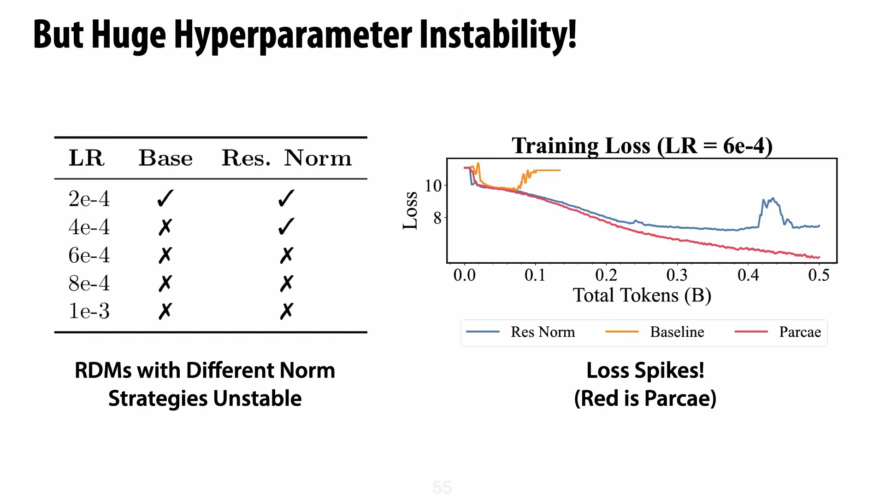
<figcaption>循环模型的训练不稳定：学习率、残差和归一化设置会触发 loss spike。</figcaption>
</figure>

循环共享让同一变换被反复应用，小偏差会被多次放大。普通 Transformer 在某个深度可用的初始化与学习率，未必适合更大 recurrence；残差状态范数可能快速增长或衰减。

<div class="warningbox">

“更多循环”不是免费推理增强若训练时没有覆盖对应循环数，或递推动力学不稳定，测试时增加 $`T`$ 可能降低质量。必须同时验证 loss、状态范数、梯度和跨循环数泛化。

</div>

实践上应记录每个循环的 $`\|h_t\|_2`$、梯度范数与谱估计，而不只是最终训练 loss；否则 spike 之前的动力学异常会被隐藏。

## 本章小结

参数共享把深度问题变成动力系统问题，稳定性必须成为架构的一等约束。

# 残差视角：循环 Transformer 的线性化

<figure data-latex-placement="H">
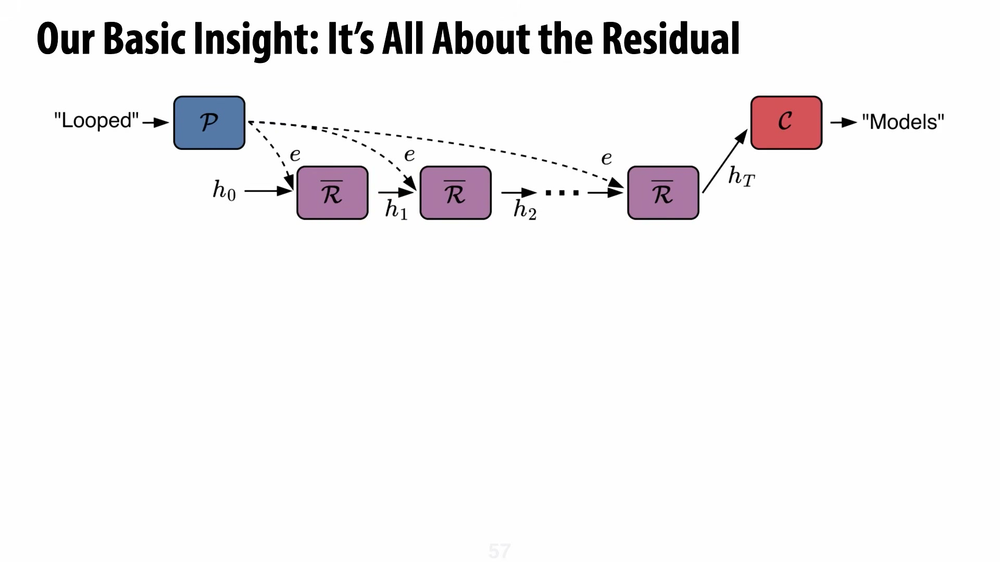
<figcaption>基本洞察：循环块持续更新同一残差状态，稳定性取决于反复施加的映射。</figcaption>
</figure>

在某个工作点附近把非线性递推线性化，可写为
```math
\begin{equation}
h_{t+1}=Ah_t+Be,
\end{equation}
```
$`A`$ 是对循环状态的 Jacobian/有效转移矩阵，$`B`$ 描述输入注入，$`e`$ 是固定输入表示。闭式解为
```math
\begin{equation}
h_T=A^Th_0+\sum_{k=0}^{T-1}A^kBe.
\end{equation}
```
第一项传播初始状态，求和项累计输入。若 $`A^T`$ 爆炸，状态与梯度会失控；若过快趋零，长期计算贡献消失。

<div class="importantbox">

线性化的用途与限制它不是说真实 Transformer 是线性的，而是用局部 Jacobian 解释重复应用时的放大/衰减方向，为稳定参数化提供可检验指标。

</div>

## 本章小结

残差递推的闭式形式揭示了循环数为何会放大微小的不稳定特征值。

# 谱半径：稳定递推的核心判据

<figure data-latex-placement="H">
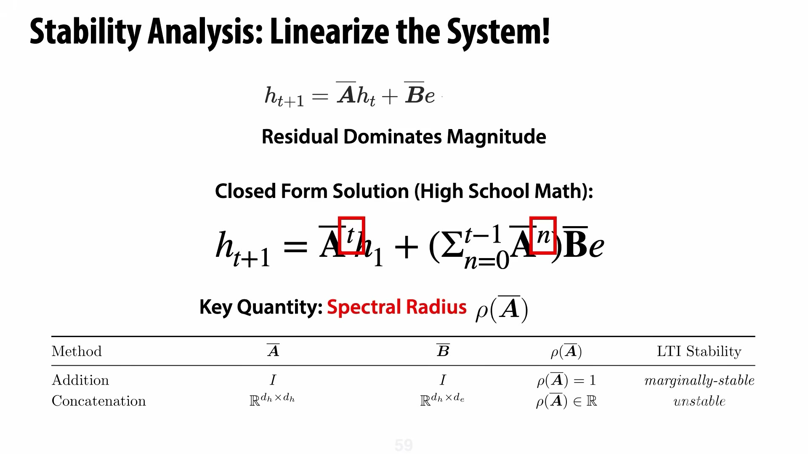
<figcaption>线性化稳定性分析：高循环数下，关键量是转移矩阵 <math display="inline" xmlns="http://www.w3.org/1998/Math/MathML"><semantics><mi>A</mi><annotation encoding="application/x-tex">A</annotation></semantics></math> 的谱半径。</figcaption>
</figure>

谱半径定义为
```math
\begin{equation}
\rho(A)=\max_i|\lambda_i(A)|,
\end{equation}
```
$`\lambda_i(A)`$ 是 $`A`$ 的第 $`i`$ 个特征值。若 $`\rho(A)>1`$，某些方向随 $`T`$ 指数放大；若 $`\rho(A)<1`$，齐次项趋于零；接近 1 时可在较长循环内保留信息。 对稳定且 $`I-A`$ 可逆的情形，$`T\to\infty`$ 时
```math
\begin{equation}
h_\infty=(I-A)^{-1}Be.
\end{equation}
```
这说明递推可能收敛到输入决定的不动点。真实网络还受非线性、归一化和输入变化影响，因此谱半径是诊断工具而非充分保证。

## 本章小结

谱半径把模糊的“循环会不会爆”转成局部动力学指标，并指导残差与归一化设计。

# 约束 $`A,B`$：把稳定性写进参数化

<figure data-latex-placement="H">
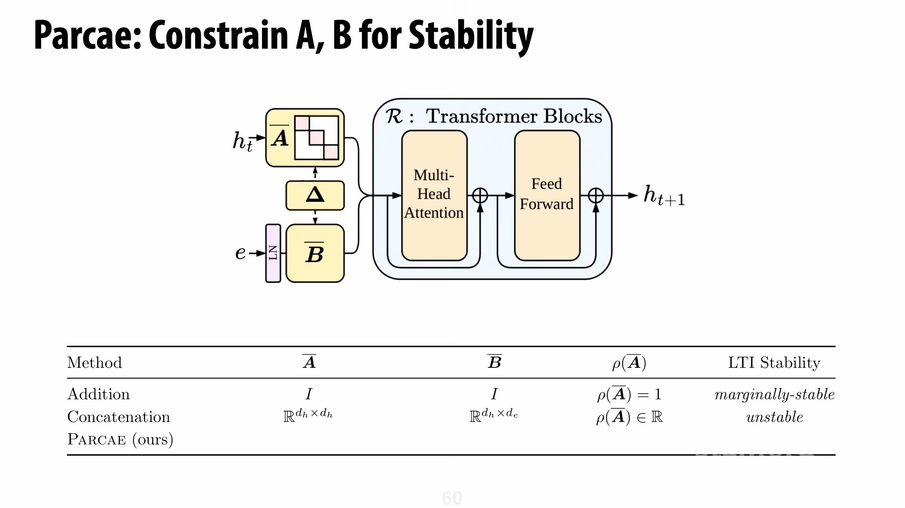
<figcaption>Parcae 通过约束状态转移与输入注入，使高循环数下递推保持稳定。</figcaption>
</figure>

课程给出的思路是：不要只靠训练“学会稳定”，而要通过残差形式、归一化或缩放直接控制有效 $`A`$ 与 $`B`$。一种抽象参数化为
```math
\begin{equation}
A=(1-\gamma)I+\gamma\widetilde A,\qquad \|\widetilde A\|_2\le 1,
\end{equation}
```
$`\gamma\in[0,1]`$ 控制更新强度，$`\widetilde A`$ 通过归一化限制算子范数。这是机制解释，不等同于课程实现的全部细节。

```
def recurrent_block(h, e, block, input_proj, gamma):
    delta = block(normalize(h), e)
    delta = delta / max(operator_norm_estimate(delta), 1.0)
    return (1.0 - gamma) * h + gamma * delta + input_proj(e)

for _ in range(num_recurrences):
    h = recurrent_block(h, e, shared_block, B, gamma)
```

## 本章小结

稳定设计将训练后才发现的故障，前移为架构层面的可控约束。

# 稳定性与质量结果

<figure data-latex-placement="H">
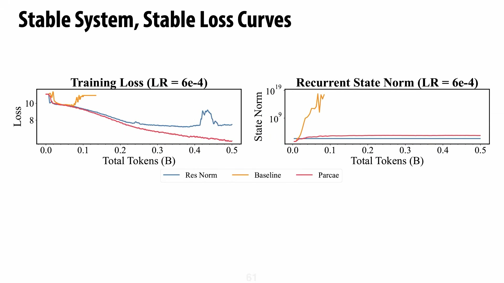
<figcaption>稳定系统带来平滑 loss 与受控的 recurrent state norm。</figcaption>
</figure>

对照图强调两个证据必须同时成立：训练 loss 不出现尖峰，循环状态范数也不发散。只观察最终 loss 可能错过模型在中途靠裁剪或归一化“救回”的异常动力学。

<figure data-latex-placement="H">
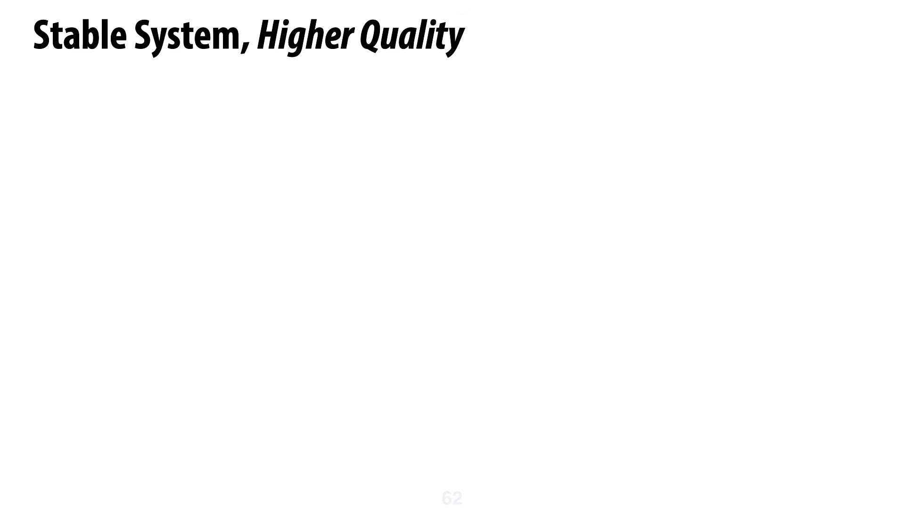
<figcaption>稳定 Parcae 在相近规模对比中取得更高质量。</figcaption>
</figure>

<div class="importantbox">

科学验证顺序 先验证相同输入和相同循环数下实现正确；再检查状态/梯度稳定；然后比较参数量、训练 FLOPs、推理 FLOPs和 token 数对齐的质量；最后才讨论系统吞吐。不同计算预算下的精度不能直接横比。

</div>

## 本章小结

稳定性不是单独的工程指标，它让更多 recurrence 真正转化为质量，而不是数值噪声。

# 传统缩放律与新的 recurrence 轴

<figure data-latex-placement="H">
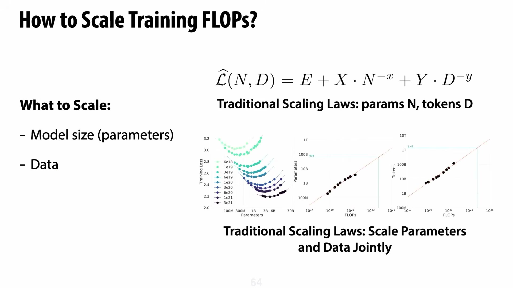
<figcaption>传统缩放律主要研究参数量和数据量如何共同决定 loss。</figcaption>
</figure>

经典经验形式可写为
```math
\begin{equation}
\widehat{\mathcal L}(N,D)=E+XN^{-x}+YD^{-y},
\end{equation}
```
$`E`$ 是不可约误差，$`N`$ 是参数量，$`D`$ 是训练 token 数，$`X,Y`$ 是幅度，$`x,y`$ 是幂律指数。它回答固定训练算力下模型和数据应如何配比。 循环模型增加 $`R`$（recurrence）后，可用扩展形式思考
```math
\begin{equation}
\widehat{\mathcal L}(N,D,R)=E+XN^{-x}+YD^{-y}+ZR^{-z}+\varepsilon_{int},
\end{equation}
```
$`ZR^{-z}`$ 表示循环计算的经验贡献，$`\varepsilon_{int}`$ 表示 $`N,D,R`$ 之间不能简单相加的交互项。该式是学习框架，具体指数需实验拟合。

## 本章小结

当参数不再是唯一扩展轴，计算最优配方也必须同时包含数据和循环深度。

# Recurrence 的幂律与推理时代的配方

<figure data-latex-placement="H">
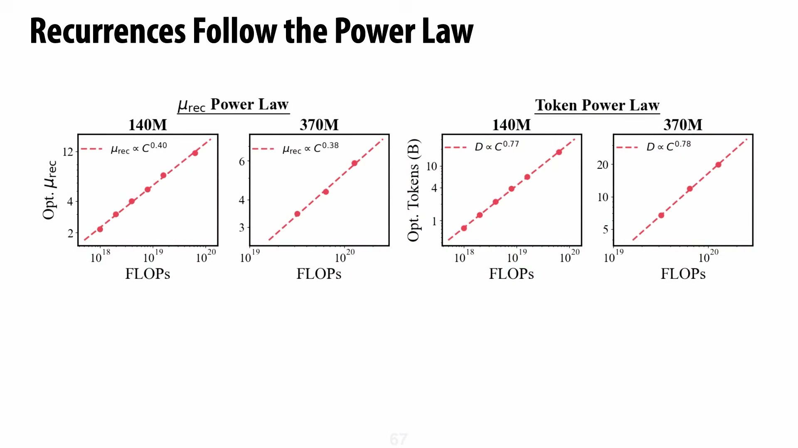
<figcaption>实验显示最优 recurrence 随 FLOPs 与 token 预算呈幂律变化。</figcaption>
</figure>

讲座的关键观察是：更多数据通常支持更多 recurrence；循环数本身也随计算预算呈可预测趋势。这意味着固定参数、增加测试时计算并非随意堆叠，而可能存在可拟合的 compute-optimal 配方。

<div class="knowledgebox">

参数效率与延迟的交换 共享层减少权重存储和 HBM 读取压力，但增加串行循环和单 token 延迟。是否划算取决于质量增益、Megakernel 效率、并发批量和服务 SLA，不能只看参数量。

</div>

<div class="warningbox">

外推边界幂律是在特定模型族、数据、训练区间与稳定参数化上拟合的经验规律。跨数量级外推必须报告置信区间，并用更大规模实验重新校准。

</div>

## 本章小结

recurrence 将“思考更久”变成可度量的缩放变量，但系统延迟与算法质量必须联合最优化。

# 端到端实现蓝图：把研究假设落到服务栈

```
def route(req, prefill_nodes, decode_nodes, cache_index):
    prefix = cache_index.longest_prefix(req.tokens)
    miss = len(req.tokens) - prefix.length
    p = min(prefill_nodes,
            key=lambda n: n.queue_ms + ALPHA * miss
                          + BETA * cache_transfer_ms(prefix, n))
    kv = p.prefill(req.tokens[prefix.length:], prefix.kv)
    d = min(decode_nodes, key=lambda n: n.tbt_p99_ms)
    transfer_async(kv, src=p, dst=d)
    return d.decode_stream(req, kv)
```

<div class="knowledgebox">

验证清单 **正确性：**逐 token logits/采样结果与参考实现对齐。

**稳定性：**NaN、状态范数、缓存键与淘汰一致性。

**性能：**TTFT、TBT、P50/P99、QPS、HBM 带宽和互连流量。

**成本：**GPU 小时、CPU/SSD 占用、缓存重算率和故障恢复时间。

</div>

完整系统的优化顺序应是：建立未优化基线，做单一可解释修改，验证数值与输出一致，再在相同流量和 SLA 下基准测试；否则吞吐增益可能来自改变批量或牺牲尾延迟。

## 本章小结

推理研究必须同时保留算法等价性、系统可观测性和可复现实验边界。

# 总结与延伸

<div class="summarybox">

一页记忆框架 **请求路径：**tokenize $`\rightarrow`$ schedule $`\rightarrow`$ prefill $`\rightarrow`$ decode $`\rightarrow`$ stream。

**核心状态：**KV 缓存决定容量、命中率、TTFT 与跨机数据移动。

**服务策略：**连续批处理、Radix 前缀共享、P/D 解耦和缓存感知路由。

**内核策略：**Megakernel 减少启动空洞和 tail effect，以带宽下界衡量 decode。

**模型策略：**Parcae 用稳定 recurrence 扩展测试时计算，以谱半径理解动力学。

**研究方法：**正确性优先，稳定性其次，最后才是同约束性能比较。

</div>

## 可继续追问的问题

如何为不同 SLA 自动选择 batch、缓存层级和 recurrence？KV 缓存能否在隐私约束下跨用户共享？Megakernel 如何跨 GPU 架构保持可移植？循环 Transformer 的局部谱判据能否扩展为全局稳定证书？这些问题共同指向一种新的全栈研究方式：系统瓶颈生成模型问题，模型结构反过来改变系统设计。

## 最终结论

讲座真正串起的是一条因果链：真实流量暴露推理瓶颈，推理瓶颈推动缓存和 GPU 内核创新，而更高效的内核又让循环模型等新算法成为可能。
